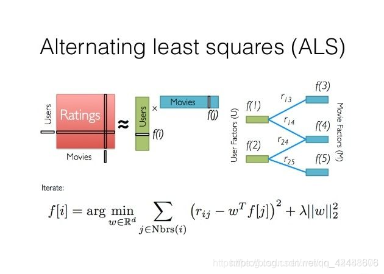
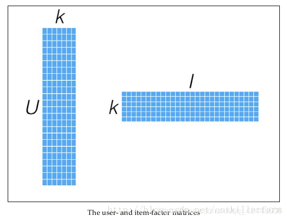
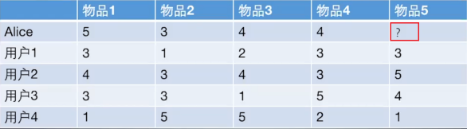

刚开始入推荐系统这个坑，发现要懂的东西有很多，ALS 主要用于**基于协同过滤的推荐系统**当中。


# 协同过滤算法

## 基本思想

协同过滤（Collaborative Filtering）推荐算法是最经典、最常用的推荐算法。基本思想是：

- 根据用户之前的喜好以及其他兴趣相近的用户的选择来给用户推荐物品。
  - 基于对用户历史行为数据的挖掘发现用户的喜好偏向， 并预测用户可能喜好的产品进行推荐。
  - 一般是仅仅基于用户的行为数据（评价、购买、下载等）, 而不依赖于项的任何附加信息（物品自身特征）或者用户的任何附加信息（年龄， 性别等）。
- 目前应用比较广泛的协同过滤算法是基于邻域的方法，主要有：
  - 基于用户的协同过滤算法（UserCF）：给用户推荐和他兴趣相似的其他用户喜欢的产品。
  - 基于物品的协同过滤算法（ItemCF）：给用户推荐和他之前喜欢的物品相似的物品。

不管是 UserCF 还是 ItemCF 算法， 重点是计算用户之间（或物品之间）的相似度。


## 相似性度量方法

1. **杰卡德（Jaccard）相似系数**
   
   `Jaccard` 系数是衡量两个集合的相似度一种指标，计算公式如下：
   $$
   sim_{uv}=\frac{|N(u) \cap N(v)|}{|N(u)| \cup|N(v)|}
   $$

   + 其中 $N(u)$，$N(v)$ 分别表示用户 $u$ 和用户 $v$ 交互物品的集合。
   
   + 对于用户 $u$ 和 $v$ ，该公式反映了两个交互物品交集的数量占这两个用户交互物品并集的数量的比例。
   
   由于杰卡德相似系数一般无法反映具体用户的评分喜好信息，所以常用来评估用户是否会对某物品进行打分， 而不是预估用户会对某物品打多少分。
   
2. **余弦相似度**
   余弦相似度衡量了两个向量的夹角，夹角越小越相似。余弦相似度的计算如下，其与杰卡德（Jaccard）相似系数只是在分母上存在差异：
   $$
   sim_{uv}=\frac{|N(u) \cap N(v)|}{\sqrt{|N(u)|\cdot|N(v)|}}
   $$
   从向量的角度进行描述，令矩阵 $A$ 为用户-物品交互矩阵，矩阵的行表示用户，列表示物品。
   
   + 设用户和物品数量分别为 $m,n$，交互矩阵$A$就是一个 $m$ 行 $n$ 列的矩阵。
   
   + 矩阵中的元素均为 $0/1$。若用户 $i$ 对物品 $j$ 存在交互，那么 $A_{i,j}=1$，否则为 $0$ 。

   + 那么，用户之间的相似度可以表示为：
     $$
     sim_{uv} = cos(u,v) =\frac{u\cdot v}{|u|\cdot |v|}
     $$
   
     + 向量 $u,v$ 在形式都是 one-hot 类型，$u\cdot v$ 表示向量点积。
   
   上述用户-物品交互矩阵在现实中是十分稀疏的，为了节省内存，交互矩阵会采用字典进行存储。在 `sklearn` 中，余弦相似度的实现：

   ```python
   from sklearn.metrics.pairwise import cosine_similarity
   
   i = [1, 0, 0, 0]
   j = [1, 0, 1, 0]
   cosine_similarity([i, j])
   ```
   
3. **皮尔逊相关系数**

   在用户之间的余弦相似度计算时，将用户向量的内积展开为各元素乘积和：
   $$
   sim_{uv} = \frac{\sum_i r_{ui}*r_{vi}}{\sqrt{\sum_i r_{ui}^2}\sqrt{\sum_i r_{vi}^2}}
   $$
   + 其中，$r_{ui},r_{vi}$ 分别表示用户 $u$ 和用户 $v$ 对物品 $i$ 是否有交互(或具体评分值)。
   
   皮尔逊相关系数与余弦相似度的计算公式非常的类似，如下：
   $$
   sim(u,v)=\frac{\sum_{i\in I}(r_{ui}-\bar r_u)(r_{vi}-\bar r_v)}{\sqrt{\sum_{i\in I }(r_{ui}-\bar r_u)^2}\sqrt{\sum_{i\in I }(r_{vi}-\bar r_v)^2}}
   $$
   + 其中，$r_{ui},r_{vi}$ 分别表示用户 $u$ 和用户 $v$ 对物品 $i$ 是否有交互(或具体评分值)；
   + $\bar r_u, \bar r_v$ 分别表示用户 $u$ 和用户 $v$ 交互的所有物品交互数量或者评分的平均值；
   
   相较于余弦相似度，皮尔逊相关系数通过使用用户的平均分对各独立评分进行修正，减小了用户评分偏置的影响。在`scipy`中，皮尔逊相关系数的实现：
   
   ```python
   from scipy.stats import pearsonr
   
   i = [1, 0, 0, 0]
   j = [1, 0.5, 0.5, 0]
   pearsonr(i, j)
   ```

**适用场景**

+ $Jaccard$ 相似度表示两个集合的交集元素个数在并集中所占的比例 ，所以适用于隐式反馈数据（0-1）。
+ 余弦相似度在度量文本相似度、用户相似度、物品相似度的时候都较为常用。
+ 皮尔逊相关度，实际上也是一种余弦相似度。不过先对向量做了中心化，范围在 $-1$ 到 $1$。
  + 相关度量的是两个变量的变化趋势是否一致，两个随机变量是不是同增同减。
  + 不适合用作计算布尔值向量（0-1）之间相关度。


# 基于用户的协同过滤

## 基本思想

基于用户的协同过滤（UserCF）：

+ 例如，我们要对用户 $A$ 进行物品推荐，可以先找到和他有相似兴趣的其他用户。
+ 然后，将共同兴趣用户喜欢的，但用户 $A$ 未交互过的物品推荐给 $A$。  


## 计算过程

以下图为例，给用户推荐物品的过程可以形象化为一个猜测用户对物品进行打分的任务，表格里面是5个用户对于5件物品的一个打分情况，就可以理解为用户对物品的喜欢程度。


UserCF算法的两个步骤：

+ 首先，根据前面的这些打分情况(或者说已有的用户向量）计算一下 Alice 和用户1， 2， 3， 4的相似程度， 找出与 Alice 最相似的 n 个用户。

+ 根据这 n 个用户对物品 5 的评分情况和与 Alice 的相似程度会猜测出 Alice 对物品5的评分。如果评分比较高的话， 就把物品5推荐给用户 Alice， 否则不推荐。

**具体过程：**

1. 计算用户之间的相似度

   + 根据 1.2 节的几种方法， 我们可以计算出各用户之间的相似程度。对于用户 Alice，选取出与其最相近的 $N$ 个用户。

2. 计算用户对新物品的评分预测

   + 常用的方式之一：利用目标用户与相似用户之间的相似度以及相似用户对物品的评分，来预测目标用户对候选物品的评分估计：
     $$
     R_{\mathrm{u}, \mathrm{p}}=\frac{\sum_{\mathrm{s} \in S}\left(w_{\mathrm{u}, \mathrm{s}} \cdot R_{\mathrm{s}, \mathrm{p}}\right)}{\sum_{\mathrm{s} \in S} w_{\mathrm{u}, \mathrm{s}}}
     $$

     + 其中，权重 $w_{u,s}$ 是用户 $u$ 和用户 $s$ 的相似度， $R_{s,p}$ 是用户 $s$ 对物品 $p$ 的评分。

   + 另一种方式：考虑到用户评分的偏置，即有的用户喜欢打高分， 有的用户喜欢打低分的情况。公式如下：
     $$
     R_{\mathrm{u}, \mathrm{p}}=\bar{R}_{u} + \frac{\sum_{\mathrm{s} \in S}\left(w_{\mathrm{u}, \mathrm{s}} \cdot \left(R_{s, p}-\bar{R}_{s}\right)\right)}{\sum_{\mathrm{s} \in S} w_{\mathrm{u}, \mathrm{s}}}
     $$

     + 其中，$\bar{R}_{s}$ 表示用户 $s$ 对物品的历史平均评分。

3. 对用户进行物品推荐

   + 在获得用户 $u$ 对不同物品的评价预测后， 最终的推荐列表根据预测评分进行排序得到。 

**手动计算：**

根据上面的问题， 下面手动计算 Alice 对物品 5 的得分：


1. 计算 Alice 与其他用户的相似度（基于皮尔逊相关系数）

   + 手动计算 Alice 与用户 1 之间的相似度：

   >用户向量 $\text {Alice}:(5,3,4,4)  , \text{user1}:(3,1,2,3) , \text {user2}:(  4,3,4,3) , \text {user3}:(3,3,1,5) , \text {user4}:(1,5,5,2) $
   >
   >+ 计算Alice与user1的余弦相似性:
   >$$
   >\operatorname{sim}(\text { Alice, user1 })=\cos (\text { Alice, user } 1)=\frac{15+3+8+12}{\operatorname{sqrt}(25+9+16+16) * \operatorname{sqrt}(9+1+4+9)}=0.975
   >$$
   >
   >+ 计算Alice与user1皮尔逊相关系数:
   >  + $Alice\_ave  =4 \quad  user1\_ave  =2.25 $
   >  + 向量减去均值: $\text {Alice}:(1,-1, 0,0) \quad \text { user1 }:(0.75,-1.25,-0.25,0.75)$
   >
   >+ 计算这俩新向量的余弦相似度和上面计算过程一致, 结果是 0.852 。
   >

   + 基于 sklearn 计算所有用户之间的皮尔逊相关系数。可以看出，与 Alice 相似度最高的用户为用户1和用户2。

         

2. **根据相似度用户计算 Alice对物品5的最终得分**
    用户1对物品5的评分是3， 用户2对物品5的打分是5， 那么根据上面的计算公式， 可以计算出 Alice 对物品5的最终得分是
    $$
    P_{Alice, 物品5}=\bar{R}_{Alice}+\frac{\sum_{k=1}^{2}\left(w_{Alice,user k}\left(R_{userk, 物品5}-\bar{R}_{userk}\right)\right)}{\sum_{k=1}^{2} w_{Alice, userk}}=4+\frac{0.85*(3-2.4)+0.7*(5-3.8)}{0.85+0.7}=4.87
    $$
    
    + 同样方式，可以计算用户 Alice 对其他物品的评分预测。

3. **根据用户评分对用户进行推荐**
   
    + 根据 Alice 的打分对物品排个序从大到小：$$物品1>物品5>物品3=物品4>物品2$$。
    + 如果要向 Alice 推荐2款产品的话， 我们就可以推荐物品 1 和物品 5 给 Alice。

  至此， 基于用户的协同过滤算法原理介绍完毕。

## UserCF编程实现

1. 建立实验使用的数据表：

   ```python
   import numpy as np
   import pandas as pd
   
   
   def loadData():
       users = {'Alice': {'A': 5, 'B': 3, 'C': 4, 'D': 4},
                'user1': {'A': 3, 'B': 1, 'C': 2, 'D': 3, 'E': 3},
                'user2': {'A': 4, 'B': 3, 'C': 4, 'D': 3, 'E': 5},
                'user3': {'A': 3, 'B': 3, 'C': 1, 'D': 5, 'E': 4},
                'user4': {'A': 1, 'B': 5, 'C': 5, 'D': 2, 'E': 1}
                }
       return users
   ```

   + 这里使用字典来建立用户-物品的交互表。
     + 字典`users`的键表示不同用户的名字，值为一个评分字典，评分字典的键值对表示某物品被当前用户的评分。
     + 由于现实场景中，用户对物品的评分比较稀疏。如果直接使用矩阵进行存储，会存在大量空缺值，故此处使用了字典。

2. 计算用户相似性矩阵

   + 由于训练数据中共包含 5 个用户，所以这里的用户相似度矩阵的维度也为 $5 \times 5$。

   ```python
   user_data = loadData()
   similarity_matrix = pd.DataFrame(
       np.identity(len(user_data)),
       index=user_data.keys(),
       columns=user_data.keys(),
   )
   
   # 遍历每条用户-物品评分数据
   for u1, items1 in user_data.items():
       for u2, items2 in user_data.items():
           if u1 == u2:
               continue
           vec1, vec2 = [], []
           for item, rating1 in items1.items():
               rating2 = items2.get(item, -1)
               if rating2 == -1:
                   continue
               vec1.append(rating1)
               vec2.append(rating2)
           # 计算不同用户之间的皮尔逊相关系数
           similarity_matrix[u1][u2] = np.corrcoef(vec1, vec2)[0][1]
   
   print(similarity_matrix)
   ```

   ```
             1         2         3         4         5
   1  1.000000  0.852803  0.707107  0.000000 -0.792118
   2  0.852803  1.000000  0.467707  0.489956 -0.900149
   3  0.707107  0.467707  1.000000 -0.161165 -0.466569
   4  0.000000  0.489956 -0.161165  1.000000 -0.641503
   5 -0.792118 -0.900149 -0.466569 -0.641503  1.000000
   ```

3. 计算与 Alice 最相似的 `num` 个用户

   ```python
   target_user = ' Alice '
   num = 2
   # 由于最相似的用户为自己，去除本身
   sim_users = similarity_matrix[target_user].sort_values(ascending=False)[1:num+1].index.tolist()
   print(f'与用户{target_user}最相似的{num}个用户为：{sim_users}')
   ```

   ```
   与用户 Alice 最相似的2个用户为：['user1', 'user2']
   ```

4. 预测用户 Alice 对物品 `E` 的评分

   ```python
   weighted_scores = 0.
   corr_values_sum = 0.
   
   target_item = 'E'
   # 基于皮尔逊相关系数预测用户评分
   for user in sim_users:
       corr_value = similarity_matrix[target_user][user]
       user_mean_rating = np.mean(list(user_data[user].values()))
   
       weighted_scores += corr_value * (user_data[user][target_item] - user_mean_rating)
       corr_values_sum += corr_value
   
   target_user_mean_rating = np.mean(list(user_data[target_user].values()))
   target_item_pred = target_user_mean_rating + weighted_scores / corr_values_sum
   print(f'用户{target_user}对物品{target_item}的预测评分为：{target_item_pred}')
   ```

   ```
   用户 Alice 对物品E的预测评分为：4.871979899370592
   ```

## UserCF优缺点

User-based算法存在两个重大问题：


1. 数据稀疏性
  + 一个大型的电子商务推荐系统一般有非常多的物品，用户可能买的其中不到1%的物品，不同用户之间买的物品重叠性较低，导致算法无法找到一个用户的邻居，即偏好相似的用户。
  + 这导致UserCF不适用于那些正反馈获取较困难的应用场景(如酒店预订， 大件物品购买等低频应用)。

1. 算法扩展性
  + 基于用户的协同过滤需要维护用户相似度矩阵以便快速的找出 $TopN$ 相似用户， 该矩阵的存储开销非常大，存储空间随着用户数量的增加而增加。
  + 故不适合用户数据量大的情况使用。

由于UserCF技术上的两点缺陷， 导致很多电商平台并没有采用这种算法， 而是采用了ItemCF算法实现最初的推荐系统。


# 算法评估

由于UserCF和ItemCF结果评估部分是共性知识点， 所以在这里统一标识。

## 召回率

对用户 $u$ 推荐 $N$ 个物品记为 $R(u)$, 令用户 $u$ 在测试集上喜欢的物品集合为$T(u)$， 那么召回率定义为：
$$
\operatorname{Recall}=\frac{\sum_{u}|R(u) \cap T(u)|}{\sum_{u}|T(u)|}
$$
+ 含义：在模型召回预测的物品中，预测准确的物品占用户实际喜欢的物品的比例。


## 隐语义模型与矩阵分解

协同过滤算法的特点：

- 协同过滤算法的特点就是完全没有利用到物品本身或者是用户自身的属性， 仅仅利用了用户与物品的交互信息就可以实现推荐，是一个可解释性很强， 非常直观的模型。
- 但是也存在一些问题，**处理稀疏矩阵的能力比较弱**。

为了使得协同过滤更好处理稀疏矩阵问题， 增强泛化能力。从协同过滤中衍生出矩阵分解模型(Matrix Factorization, MF)或者叫隐语义模型：

- 在协同过滤共现矩阵的基础上， 使用更稠密的隐向量表示用户和物品。
- 通过挖掘用户和物品的隐含兴趣和隐含特征， 在一定程度上**弥补协同过滤模型处理稀疏矩阵能力不足的问题**。


## ALS算法概括

1、ALS算法用来补全用户评分矩阵。由于用户评分矩阵比较稀疏，将用户评分矩阵进行分解，变成V和U的乘积。通过求得V和U两个小的矩阵来补全用户评分矩阵。
2、ALS算法使用**交替最小二乘法**来进行求解
3、ALS分为显示反馈和隐式反馈两种。显示反馈是指用户有明确的评分。对于商品推荐来说，大部分是通过用户的行为，获取隐式反馈的评分。隐式反馈评分矩阵需要进行处理，如果有用户评分则置为1，没有则赋值为0。但是对这个处理后的评分矩阵，再有一个置信度来评价这个评分。置信度等于1+a*用户真实评分
4、ALS的代价函数是估计值和现有的评分值误差的平方和，引入了L2正则




## ALS算法工作原理

ALS算法是2008年以来，用的比较多的协同过滤算法。它已经集成到Spark的Mllib库中，使用起来比较方便。
从协同过滤的分类来说，ALS算法属于**User-Item CF**，也叫做混合CF。它同时考虑了User和Item两个方面。
用户和商品的关系，可以抽象为如下的三元组：**<User,Item,Rating>**。其中，Rating是用户对商品的评分，表征用户对该商品的喜好程度。
假设我们有一批用户数据，其中包含m个User和n个Item，则我们定义Rating矩阵，其中的元素表示第u个User对第i个Item的评分。
在实际使用中，由于n和m的数量都十分巨大，因此R矩阵的规模很容易就会突破1亿项。这时候，传统的矩阵分解方法对于这么大的数据量已经是很难处理了。
另一方面，一个用户也不可能给所有商品评分，因此，R矩阵注定是个稀疏矩阵。矩阵中所缺失的评分，又叫做missing item。

为了更好的实现推荐系统，我们需要对这个稀疏的矩阵建模。一般可以**采用矩阵分解（或矩阵补全）的方式**。

具体就是**找出两个低维度的矩阵，使得它们的乘积是原始的矩阵**。因此这也是一种降维技术。假设我们的用户和物品数目分别是U和I，那对应的“用户-物品”矩阵的维度为U×I，如下图所示：


要找到和“用户-物品”矩阵近似的k维（低阶）矩阵，最终要求出如下两个矩阵：一个用于表示用户的U×k维矩阵，以及一个表征物品的k×I维矩阵。这两个矩阵也称作因子矩阵。它们的乘积便是原始评级矩阵的一个近似。值得注意的是，**原始评级矩阵通常很稀疏，但因子矩阵却是稠密的（满秩的）**，如下图所示：


## 代码实现

本小节，使用如下图表来预测Alice对物品5的评分：



基于矩阵分解算法的流程如下：

1. 首先， 它会先初始化用户矩阵 *P* 和物品矩阵 *Q* ， *P* 的维度是`[users_num, K]`，*Q* 的维度是`[items_num, K]`，

   - 其中，`F`表示隐向量的维度。 也就是把通过隐向量的方式把用户的兴趣和`F`的特点关联了起来。

   - 初始化这两个矩阵的方式很多， 但根据经验， 随机数需要和`1/sqrt(F)`成正比。

2. 根据预测评分和真实评分的偏差，利用梯度下降法进行参数更新。

   - 遍历用户及其交互过的物品，对已交互过的物品进行评分预测。

   - 由于预测评分与真实评分存在偏差， 再根据第3节的梯度更新公式更新参数。


3. 训练完成后，利用用户向量与目标物品向量的内积进行评分预测。

**完整代码如下：**

```python
import random
import math


class BiasSVD():
    def __init__(self, rating_data, F=5, alpha=0.1, lmbda=0.1, max_iter=100):
        self.F = F          # 这个表示隐向量的维度
        self.P = dict()     # 用户矩阵P  大小是[users_num, F]
        self.Q = dict()     # 物品矩阵Q  大小是[item_nums, F]
        self.bu = dict()    # 用户偏置系数
        self.bi = dict()    # 物品偏置系数
        self.mu = 0         # 全局偏置系数
        self.alpha = alpha  # 学习率
        self.lmbda = lmbda  # 正则项系数
        self.max_iter = max_iter        # 最大迭代次数
        self.rating_data = rating_data  # 评分矩阵

        for user, items in self.rating_data.items():
            # 初始化矩阵P和Q, 随机数需要和1/sqrt(F)成正比
            self.P[user] = [random.random() / math.sqrt(self.F) for x in range(0, F)]
            self.bu[user] = 0
            for item, rating in items.items():
                if item not in self.Q:
                    self.Q[item] = [random.random() / math.sqrt(self.F) for x in range(0, F)]
                    self.bi[item] = 0

    # 采用随机梯度下降的方式训练模型参数
    def train(self):
        cnt, mu_sum = 0, 0
        for user, items in self.rating_data.items():
            for item, rui in items.items():
                mu_sum, cnt = mu_sum + rui, cnt + 1
        self.mu = mu_sum / cnt

        for step in range(self.max_iter):
            # 遍历所有的用户及历史交互物品
            for user, items in self.rating_data.items():
                # 遍历历史交互物品
                for item, rui in items.items():
                    rhat_ui = self.predict(user, item)  # 评分预测
                    e_ui = rui - rhat_ui                  # 评分预测偏差

                    # 参数更新
                    self.bu[user] += self.alpha * (e_ui - self.lmbda * self.bu[user])
                    self.bi[item] += self.alpha * (e_ui - self.lmbda * self.bi[item])
                    for k in range(0, self.F):
                        self.P[user][k] += self.alpha * (e_ui * self.Q[item][k] - self.lmbda * self.P[user][k])
                        self.Q[item][k] += self.alpha * (e_ui * self.P[user][k] - self.lmbda * self.Q[item][k])
            # 逐步降低学习率
            self.alpha *= 0.1


    # 评分预测
    def predict(self, user, item):
        return sum(self.P[user][f] * self.Q[item][f] for f in range(0, self.F)) + self.bu[user] + self.bi[
            item] + self.mu


# 通过字典初始化训练样本，分别表示不同用户（1-5）对不同物品（A-E)的真实评分
def loadData():
    rating_data={1: {'A': 5, 'B': 3, 'C': 4, 'D': 4},
           2: {'A': 3, 'B': 1, 'C': 2, 'D': 3, 'E': 3},
           3: {'A': 4, 'B': 3, 'C': 4, 'D': 3, 'E': 5},
           4: {'A': 3, 'B': 3, 'C': 1, 'D': 5, 'E': 4},
           5: {'A': 1, 'B': 5, 'C': 5, 'D': 2, 'E': 1}
          }
    return rating_data

# 加载数据
rating_data = loadData()
# 建立模型
basicsvd = BiasSVD(rating_data, F=10)
# 参数训练
basicsvd.train()
# 预测用户1对物品E的评分
for item in ['E']:
    print(item, basicsvd.predict(1, item))

# 预测结果：E 3.685084274454321

```

