**推荐系统**是预测用户对多种产品的偏好的模型，互联网时代，它在各种领域大放异彩，从视频音乐多媒体推荐、到电商购物推荐、社交关系推荐，无处不在地提升用户体验。

最常见的推荐系统方法包括：基于产品特征（基于内容）、用户相似性（协同过滤等近邻算法）、个人信息（基于知识）。当然，随着神经网络的日益普及，很多公司的业务中使用到的推荐算法已经是上述所有方法结合的混合推荐系统。


在本篇内容中，从传统推荐系统算法到前沿的新式推荐系统，讲解原理并**手把手教大家如何用代码实现**。

本篇内容使用到的 🏆[**MovieLens 电影推荐数据集**](https://grouplens.org/datasets/movielens/latest/)

数据集包含观众对电影的评分结果，有不同规模的数据集大小，我们本篇内容中的代码通用，大家可以根据自己的计算资源情况选择合适的数据集。

- 小数据集为 600 名观众对 9000部电影的 10w 个打分，也包括电影标签特征。
- 大数据集为 280000 名观众对 110w 部电影的 2700w 评分。

  <div align=center>
  
  </div>

本文涉及的内容板块如下：

- 基本设置&数据预处理
- 冷启动问题&处理
- 基于内容的方法（tensorflow 和 numpy实现）
- 传统协同过滤和神经协同过滤模型（tensorflow/keras 实现）
- 混合模型模型（上下文感知，tensorflow/keras 实现）

##  基本设置&数据预处理

###  工具库导入

首先，我们导入所需工具库：

```python
# 数据读取与处理
import pandas as pd
import numpy as np
import re
from datetime import datetime
# 绘图
import matplotlib.pyplot as plt
import seaborn as sns
# 评估与预处理
from sklearn import metrics, preprocessing
# 深度学习
from tensorflow.keras import models, layers, utils  #(2.6.0)
```

###  读取数据

接下来我们读取数据。

```python
dtf_products = pd.read_csv("movie.csv")
```

  <div align=center>
  
  </div>

movie电影文件中，每一行代表一部电影，右侧的两列包含其特征（标题与题材）。让我们读取用户数据：

```python
dtf_users = pd.read_csv("ratings.csv").head(10000)
```

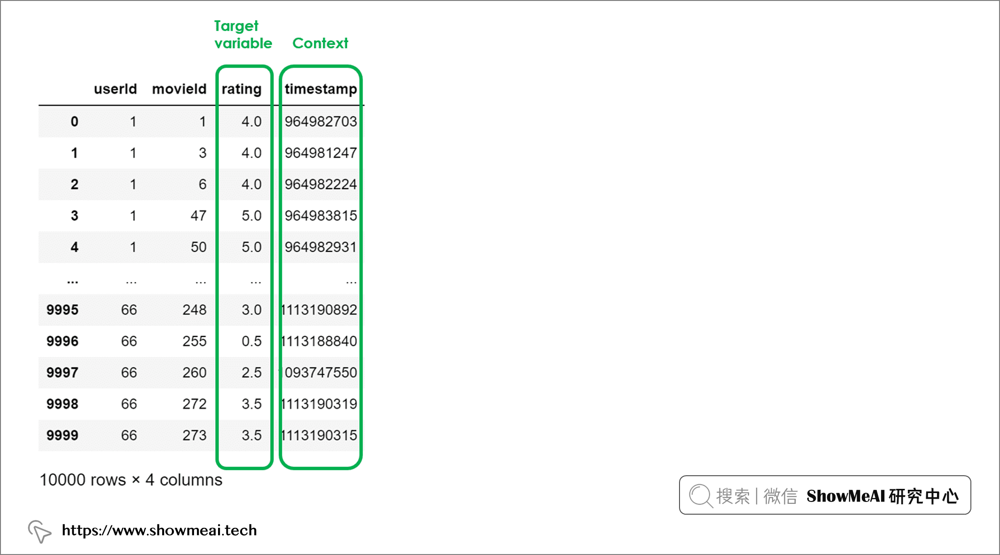


这个ratings表的每一行都是观众电影对，并显示观众对电影的评分（即**目标变量**）。当然啦，并不是每个观众都看过所有的电影，所以我们可以给他们推荐没有看过的电影。这里的一种思路就是预估观众对于没有看过的电影的评分，再基于评分高低进行推荐。

###  数据分析&特征工程

在实际挖掘与建模之前，我们先做一些**数据清理**和**特征工程**的工作，让数据更干净和适合建模使用。


> 数据分析部分涉及的工具库，大家可以参考[ShowMeAI](https://www.showmeai.tech/)制作的工具库速查表和教程进行学习和快速使用。
> 📘[**数据科学工具库速查表 | Pandas 速查表**](https://www.showmeai.tech/article-detail/101)
> 📘[**图解数据分析：从入门到精通系列教程**](https://www.showmeai.tech/tutorials/33)

```python
# 电影数据处理# 题材字段缺失处理
dtf_products = dtf_products[~dtf_products["genres"].isna()]dtf_products["product"] = range(0,len(dtf_products))
# 电影名称处理
dtf_products["name"] = dtf_products["title"].apply(lambda x: re.sub("[([].*?[)]]", "", x).strip())
# 日期
dtf_products["date"] = dtf_products["title"].apply(lambda x: int(x.split("(")[-1].replace(")","").strip()) if "(" in x else np.nan)dtf_products["date"] = dtf_products["date"].fillna(9999)
# 判断老电影
dtf_products["old"] = dtf_products["date"].apply(lambda x: 1 if x < 2000 else 0)
# 观众/用户数据处理
dtf_users["user"] = dtf_users["userId"].apply(lambda x: x-1)dtf_users["timestamp"] = dtf_users["timestamp"].apply(lambda x: datetime.fromtimestamp(x))
# 白天时段
dtf_users["daytime"] = dtf_users["timestamp"].apply(lambda x: 1 if 6<int(x.strftime("%H"))<20 else 0)
# 周末
dtf_users["weekend"] = dtf_users["timestamp"].apply(lambda x: 1 if x.weekday() in [5,6] else 0)
# 电影与用户表合并
dtf_users = dtf_users.merge(dtf_products[["movieId","product"]], how="left")dtf_users = dtf_users.rename(columns={"rating":"y"})
# 清洗数据
dtf_products = dtf_products[["product","name","old","genres"]].set_index("product")dtf_users = dtf_users[["user","product","daytime","weekend","y"]]
```

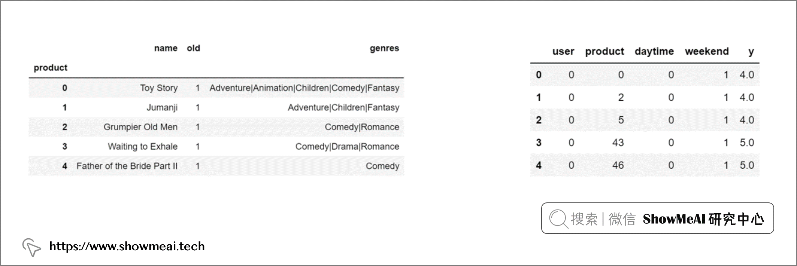


上述过程中有一些很贴合场景的特征工程和数据生成工作，比如我们从时间戳中生成了2个新的字段： 『是否白天』 和 『是否周末』 。

```python
dtf_context = dtf_users[["user","product","daytime","weekend"]]
```

下一步我们构建 Moives-Features 矩阵：

```python
# 电影题材候选统计
tags = [i.split("|") for i in dtf_products["genres"].unique()]
columns = list(set([i for lst in tags for i in lst]))
columns.remove('(no genres listed)')
# 题材可能有多个，切分出来作为标签
for col in columns:
    dtf_products[col] = dtf_products["genres"].apply(lambda x: 1 if col in x else 0)
```

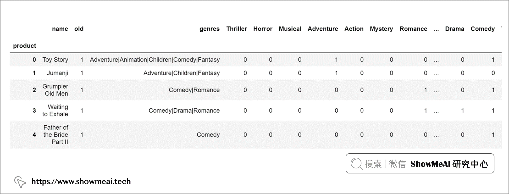


我们得到的这个『电影-题材』矩阵是稀疏的（很好理解，一般一部电影只归属于有限的几个题材）。我们做一点可视化以更好地了解情况，代码如下：

```python
# 构建热力图并可视化
fig, ax = plt.subplots(figsize=(20,5))
sns.heatmap(dtf_products==0, vmin=0, vmax=1, cbar=False, ax=ax).set_title("Products x Features")
plt.show()
```

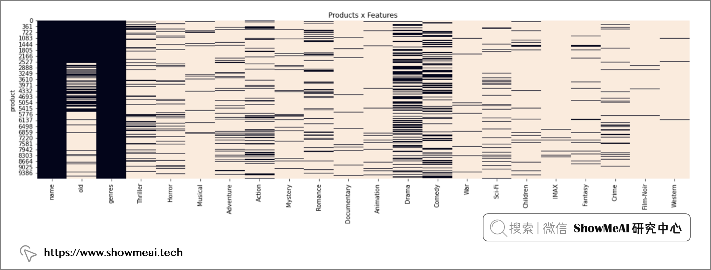


下面是我们的 『观众/用户-电影』 评分矩阵，我们发现它更为稀疏（每位用户实际只看过几部电影，但总电影量很大）

```python
tmp = dtf_users.copy()
dtf_users = tmp.pivot_table(index="user", columns="product", values="y")
missing_cols = list(set(dtf_products.index) - set(dtf_users.columns))
for col in missing_cols:
    dtf_users[col] = np.nan
dtf_users = dtf_users[sorted(dtf_users.columns)]
```

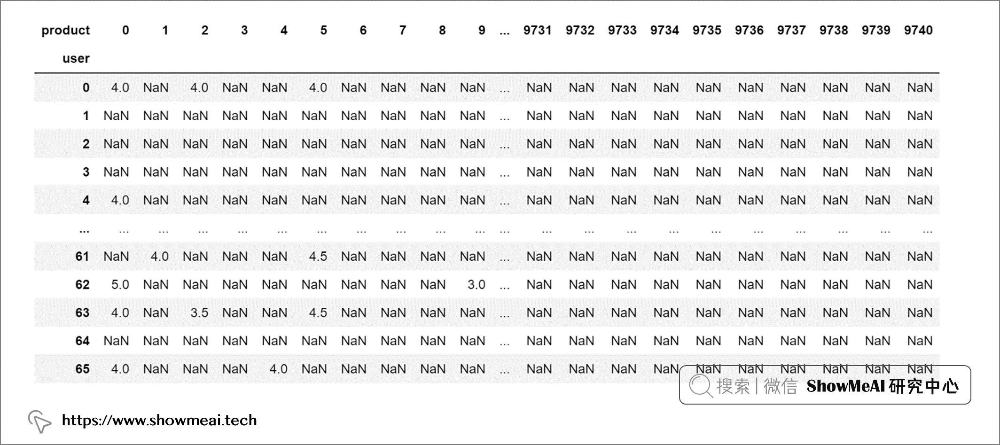


同样的热力图结果如下：

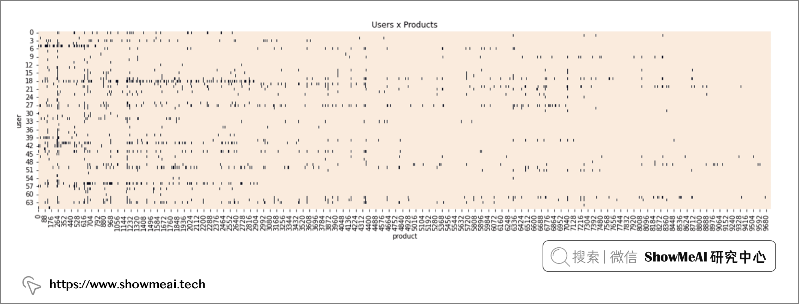


在特征工程部分，我们需要做一些典型的数据预处理过程，比如我们会在后续用到神经网络模型，而这种计算型模型，我们对数据做幅度缩放是非常必要的。

> 关于机器学习特征工程，大家可以参考 [ShowMeAI](https://www.showmeai.tech/) 整理的特征工程最全解读教程。
> 📘[**机器学习实战 | 机器学习特征工程最全解读**](https://www.showmeai.tech/article-detail/208)

```python
# 数据幅度缩放
dtf_users = pd.DataFrame(preprocessing.MinMaxScaler(feature_range=(0.5,1)).fit_transform(dtf_users.values), 
columns=dtf_users.columns, index=dtf_users.index)
```

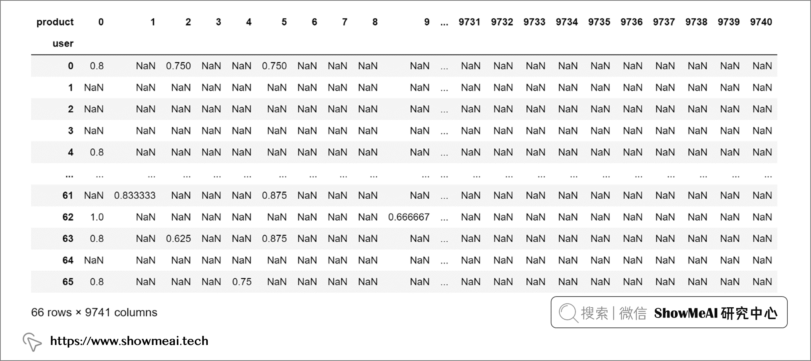

###  数据切分

简单处理完数据之后，就像任何典型的机器学习任务一样，我们需要对数据进行划分，在这里划分为**训练集**和**测试集**。如果结合上述『**用户-电影**』矩阵，我们会做类似下图的垂直切分，这样训练集和测试集都会尽量覆盖所有用户：

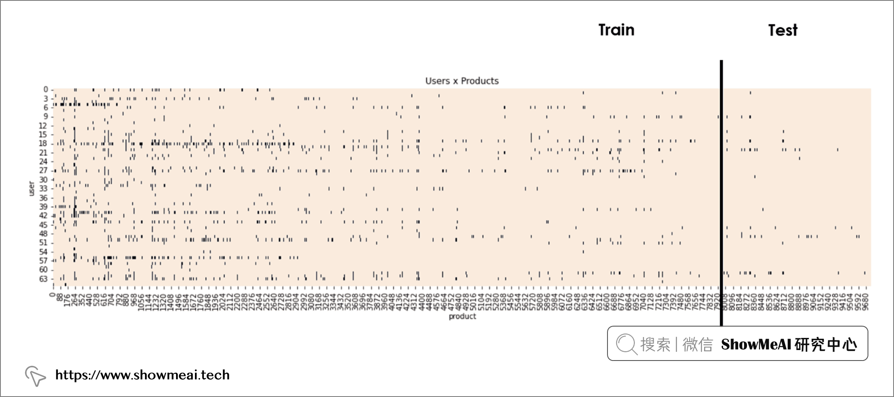


```python
# 数据切分
split = int(0.8*dtf_users.shape[1])
dtf_train = dtf_users.loc[:, :split-1]
dtf_test = dtf_users.loc[:, split:]
```

##  冷启动问题&处理

###  冷启动问题

想象一下，类似于『抖音』这样的应用，对于新用户提供推荐，其实是不太准确的（只能基于一些策略，如热度排行等进行推荐），我们对用户的信息积累太少，用户画像的工作无法进行。这就是任何一个推荐系统产品都会遇到的**冷启动问题**（即因为没有足够的历史数据，系统无法在用户和产品之间建立任何关联）。

###  冷启动处理方法

针对冷启动问题，有一些典型的处理方式，例如**基于知识的方法**：在初次进入APP时询问用户的偏好，构建基本信息与知识，再基于知识进行推荐（比如不同『年龄段』和『性别』喜爱的媒体产品等）。

另外一种处理方法是**基于内容的方法**。即基于产品的属性（比如我们当前的场景下，电影的题材、演员、主题等）进行匹配推荐。

##  基于内容的推荐方法

###  核心思想

我们来介绍一下**基于内容的方法**。

这个方法是基于产品属性进行关联和推荐的，例如，如果『用户A喜欢产品1』，并且『产品2与产品1从属性上看相似』，那么『用户A可能也会喜欢产品2』。简单地说，这个想法是『**用户实际上对产品的功能/属性而不是产品本身进行评分**』。

换句话说，如果我喜欢与音乐和艺术相关的产品，那是因为我喜欢那些功能/属性（音乐和艺术）。我们可以基于这个信息做推荐。

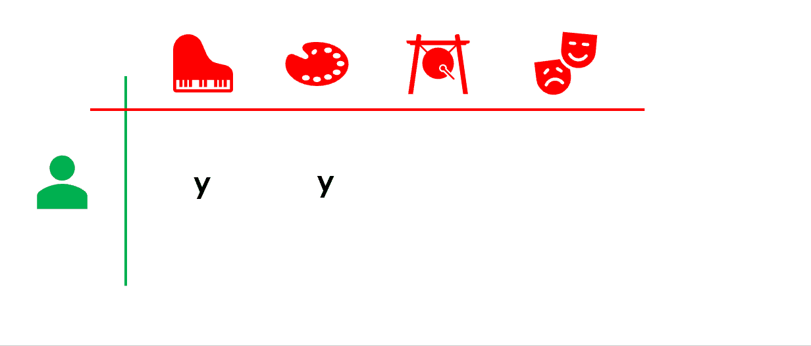

###  代码实现

我们随机从数据中挑选一个『观众/用户』作为我们的新用户的示例，该订阅者现在已经使用了足够多的产品，让我们创建训练和测试向量。

```python
# 选一个user
i = 1
train = dtf_train.iloc[i].to_frame(name="y")
test = dtf_test.iloc[i].to_frame(name="y")
# 把所有测试集的电影评分清空后拼接
tmp = test.copy()
tmp["y"] = np.nan
train = train.append(tmp)
```

下面我们估测『观众/用户』对每个特征的权重，回到我们前面整理完的 *User-Products* 矩阵和 *Products-Features* 矩阵。

```python
# 数据维度
usr = train[["y"]].fillna(0).values.T
prd = dtf_products.drop(["name","genres"],axis=1).values
print("Users", usr.shape, " x  Products", prd.shape)
```


我们把这 2 个矩阵相乘，我们获得了一个『**用户-特征**』矩阵，它包含这个用户对每个特征的估计权重。我们进而把这些权重应重新应用于『**产品-特征**』矩阵就可以获得测试集结果。

```python
# usr_ft(users,fatures) = usr(users,products) x prd(products,features)
usr_ft = np.dot(usr, prd)
# 归一化
weights = usr_ft / usr_ft.sum()
# 预估打分 rating(users,products) = weights(users,fatures) x prd.T(features,products)
pred = np.dot(weights, prd.T)
test = test.merge(pd.DataFrame(pred[0], columns=["yhat"]), how="left", left_index=True, right_index=True).reset_index()
test = test[~test["y"].isna()]
test
```

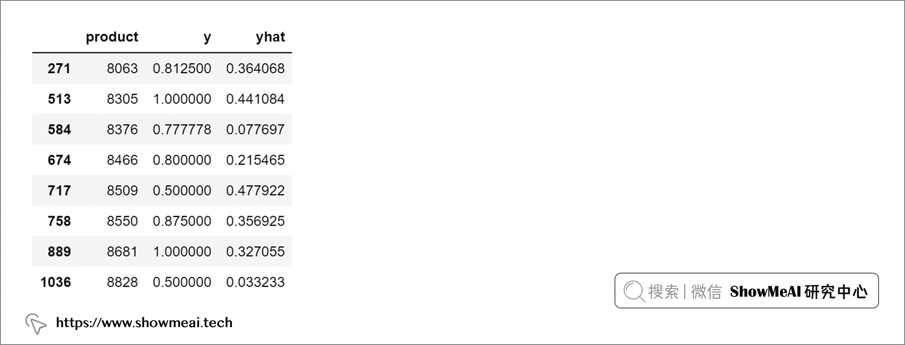


上面是一个非常非常简单的思路，我们用 numpy 对它进行了实现。其实这个过程也可以在原始数据张量上进行：

```python
# 基于tensorflow更高效的实现
import tensorflow as tf
# usr_ft(users,fatures) = usr(users,products) x prd(products,features)
usr_ft = tf.matmul(usr, prd)
# normalize
weights = usr_ft / tf.reduce_sum(usr_ft, axis=1, keepdims=True)
# rating(users,products) = weights(users,fatures) x prd.T(features,products)
pred = tf.matmul(weights, prd.T)
```


仅仅完成预估步骤还不够，我们需要对预测推荐进行有效**评估**，怎么做呢，在当前这个推荐场景下，我们可以使用**准确性**和**平均倒数排名**（MRR，一种针对排序效果的统计度量）。

```python
# 评估指标
def mean_reciprocal_rank(y_test, predicted):
    score = []
    for product in y_test:
        mrr = 1 / (list(predicted).index(product) + 1) if product 
        in predicted else 0
        score.append(mrr)
    return np.mean(score)
```

有时候，在全部排序结果列表上评估，效果一般且计算量太大，我们可以选择标准答案的 top k 进行评估（下面代码中 k 取值为 5）。

```python
print("--- user", i, "---")
top = 5
y_test = test.sort_values("y", ascending=False)["product"].values[:top]
print("y_test:", y_test)
predicted = test.sort_values("yhat", ascending=False)["product"].values[:top]
print("predicted:", predicted)
true_positive = len(list(set(y_test) & set(predicted)))
print("true positive:", true_positive, "("+str(round(true_positive/top*100,1))+"%)")
print("accuracy:", str(round(metrics.accuracy_score(y_test,predicted)*100,1))+"%")
print("mrr:", mean_reciprocal_rank(y_test, predicted))
```

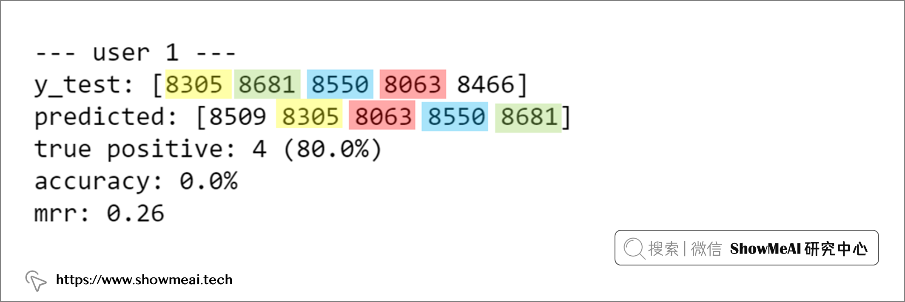


上图显示在 user1 上，我们预估结果和 top5 真实结果，有 4 个结果是重叠的。（不过因为我们预估结果的序并不完全和标准答案一样，所以指标上看 accuracy 和 mrr 会低一点）

```python
# 查看预估结果细节
test.merge(
       dtf_products[["name","old","genres"]], left_on="product", 
       right_index=True
).sort_values("yhat", ascending=False)
```

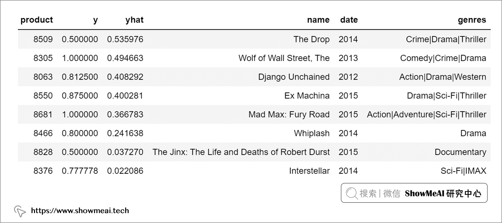

##  协同过滤推荐算法

###  核心思想

**协同过滤**是一类典型的『近邻』推荐算法，基于用户和用户的相似性，或者产品和产品的相似性来构建推荐。比如 user-based collaborative filtering（基于用户的协同过滤）中，我们认为『用户A喜欢产品1』，而基于**用户行为**计算判定『用户B和用户A相似』，那么『用户B可能也会喜欢产品1』。

注意到协同过滤算法中，很重要的步骤是我们需要基于用户历史的行为来构建相似度度量（user-user 或 item-item 相似度）。

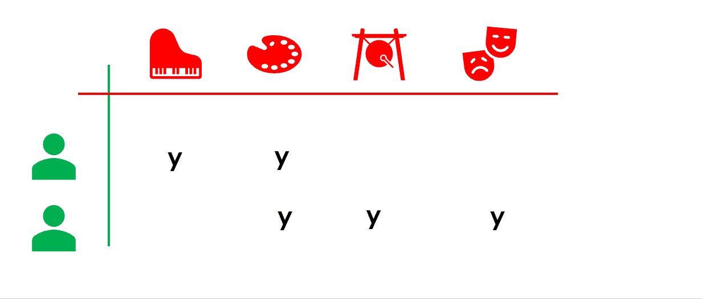


协同过滤和上面提到的基于内容的推荐算法不同，我们不需要产品属性来建模，而是基于大量用户的历史行为来计算和构建相似度量（例如在本例中，我们可以基于不同的观众历史上在一批电影上的评分相似度来构建）。

###  基础协同过滤算法

协同过滤是**『基于用户行为』**的推荐算法，我们会『通过群体的行为来找到某种相似性』（用户之间的相似性或者物品之间的相似性），通过相似性来为用户做决策和推荐。协同过滤细分一下，有以下基于邻域的、基于隐语义模型2大类方法。

#### 基于近邻的协同过滤

基于近邻的协同过滤包含 user-based cf（基于用户的协同过滤）和 item-based cf（基于物品的协同过滤）两种方式，核心思想如下图所示：

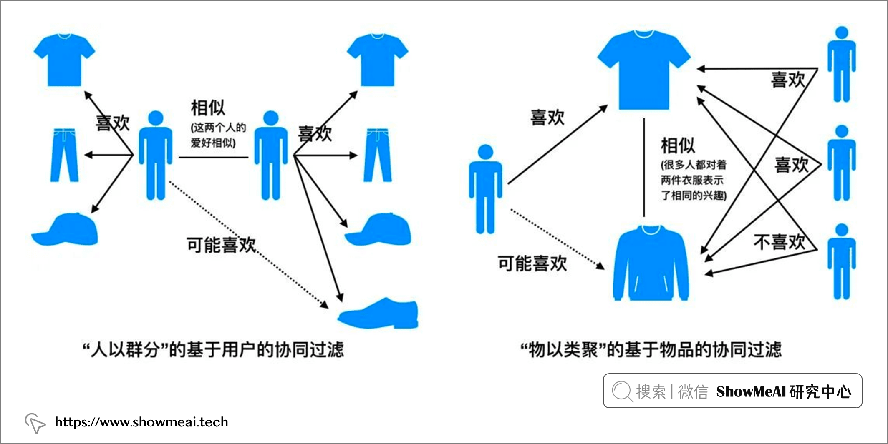


核心步骤为以下3步：

① 根据历史数据收集用户偏好（比如本例中的打分，比如）。
② 找到相似的用户（基于用户）或物品（基于物品）。
③ 基于相似性计算和推荐。

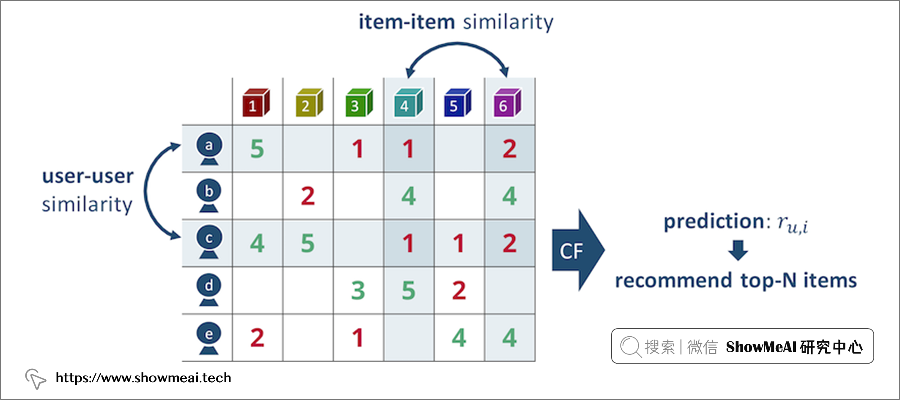


其中的 similarity 相似度计算部分，可以基于一些度量准则来完成，比如最常用到的相似度度量是余弦相似度：


在本例中A和B可以是两个用户的共同电影对应的打分向量，或者两部电影的共同打分用户的打分向量，也就是打分矩阵中的两行或者两列。

当然，我们也可以基于聚类等其他方法来发现相似用户和物品。

#### 基于隐语义模型的协同过滤

协同过滤的另外一种实现，是基于矩阵分解的方法，在本例中通过这个方法可以预测用户对某个产品的评价，矩阵分解方法将大的『**用户-物品** **』**打分矩阵分成两个较小的因子矩阵，分别是『**用户-因子』**矩阵和『**产品-因子』**矩阵，再基于这两个矩阵对于未打分的『**用户-物品』**对打分。

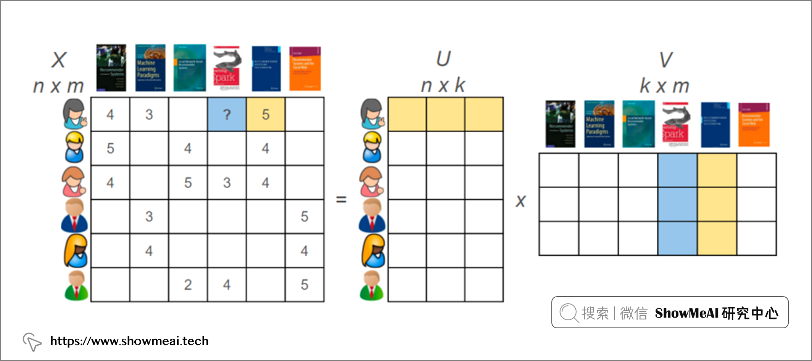


具体来说，每个因子可能代表某一个属性维度的程度，如下如，我们如果确定2个属性『年龄段』『题材娱乐性』，那我们可以基于打分矩阵对这两个维度进行分解。

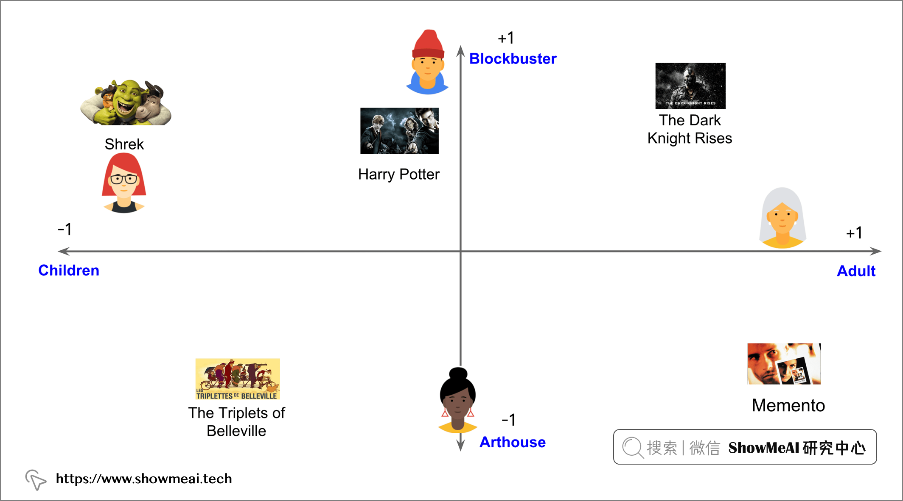


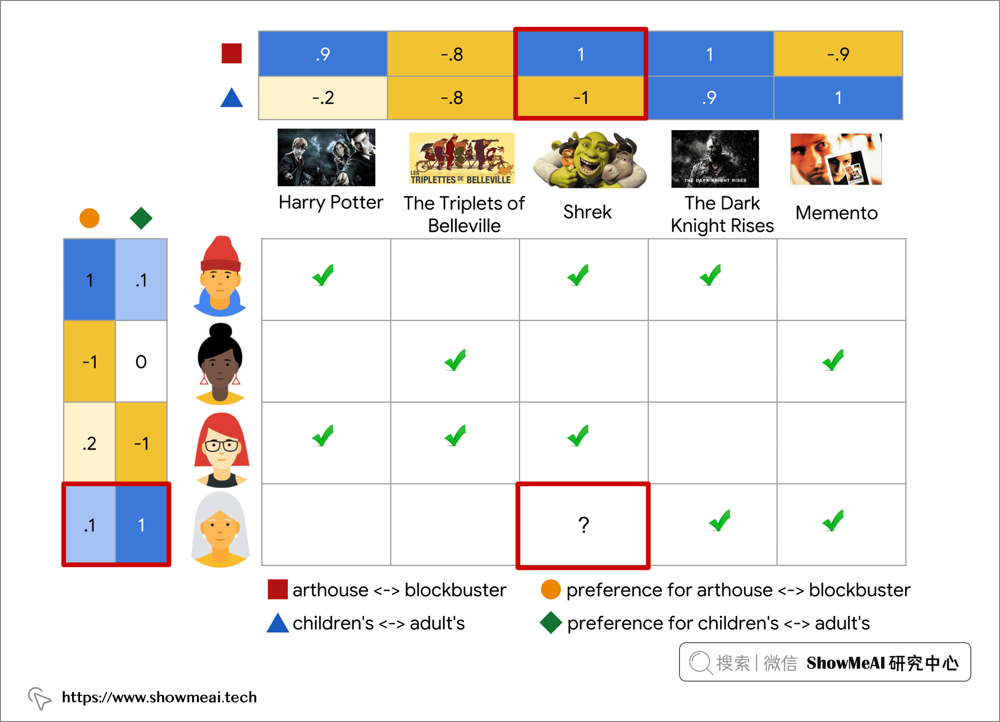

#### 代码实现

在 Python 中，要实现上述提到的2类协同过滤算法，最方便的工具库之一是 📘[**scikit-surprise**](https://pypi.org/project/scikit-surprise/)（从名字大家可以看出，它借助了 scikit-learn 的一些底层算法来实现上层的协同过滤）。它包含了上述提到的基于近邻的协同过滤和基于隐语义模型的协同过滤。

不过矩阵实现方法也是各种深度学习模型所擅长的，我们在这里使用tensorflow/keras来做一点实现。

我们先准备好『**用户-物品』**数据（本例中的用户是观众，物品是电影）：

```python
train = dtf_train.stack(dropna=True).reset_index().rename(columns={0:"y"})
train.head()
```

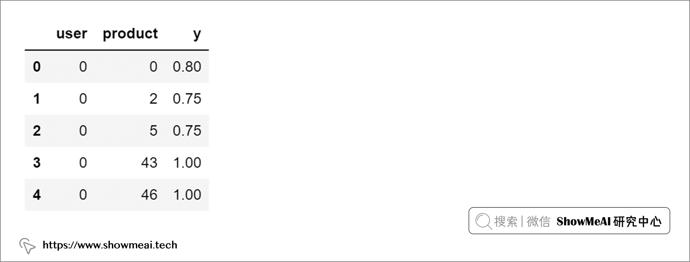


我们会利用神经网络的**嵌入层**来创建『**用户-因子』**和『**产品-因子』**矩阵，这里特别适合用神经网络的 embedding 层来完成映射矩阵构建，我们为用户和产品分别构建 embedding 矩阵。Embedding 矩阵的维度就是我们这个地方设定的因子的个数。下面我们使用 tensorflow 来完成这个过程。

```python
embeddings_size = 50
usr, prd = dtf_users.shape[0], dtf_users.shape[1]
# 用户 Users 维度(1,embedding_size)
xusers_in = layers.Input(name="xusers_in", shape=(1,))
xusers_emb = layers.Embedding(name="xusers_emb", input_dim=usr, output_dim=embeddings_size)(xusers_in)
xusers = layers.Reshape(name='xusers', target_shape=(embeddings_size,))(xusers_emb)
# 产品 Products 维度(1,embedding_size)
xproducts_in = layers.Input(name="xproducts_in", shape=(1,))
xproducts_emb = layers.Embedding(name="xproducts_emb", input_dim=prd, output_dim=embeddings_size)(xproducts_in)
xproducts = layers.Reshape(name='xproducts', target_shape=(embeddings_size,))(xproducts_emb)
# 矩阵乘法，即我们我们上面提到的因子矩阵相乘 维度(1)
xx = layers.Dot(name='xx', normalize=True, axes=1)([xusers, xproducts])
# 预测得分 维度(1)
y_out = layers.Dense(name="y_out", units=1, activation='linear')(xx)
# 编译
model = models.Model(inputs=[xusers_in,xproducts_in], outputs=y_out, name="CollaborativeFiltering")
model.compile(optimizer='adam', loss='mean_absolute_error', metrics=['mean_absolute_percentage_error'])
```

在本例中呢，因为我们最终是对电影的评分去做预测，所以我们把这个问题视作一个回归的问题使用模型来解决，我们会使用平均绝对误差作为最终的损失函数。当然我们实际在解决推荐这个问题的时候，可能并不需要得到精确的得分，而是希望基于这些得分去完成一个排序和最终的推荐。

我们把构建出来的模型示意图和中间层的维度打印一下，方便大家查看，如下

```python
utils.plot_model(model, to_file='model.png', show_shapes=True, show_layer_names=True)
```

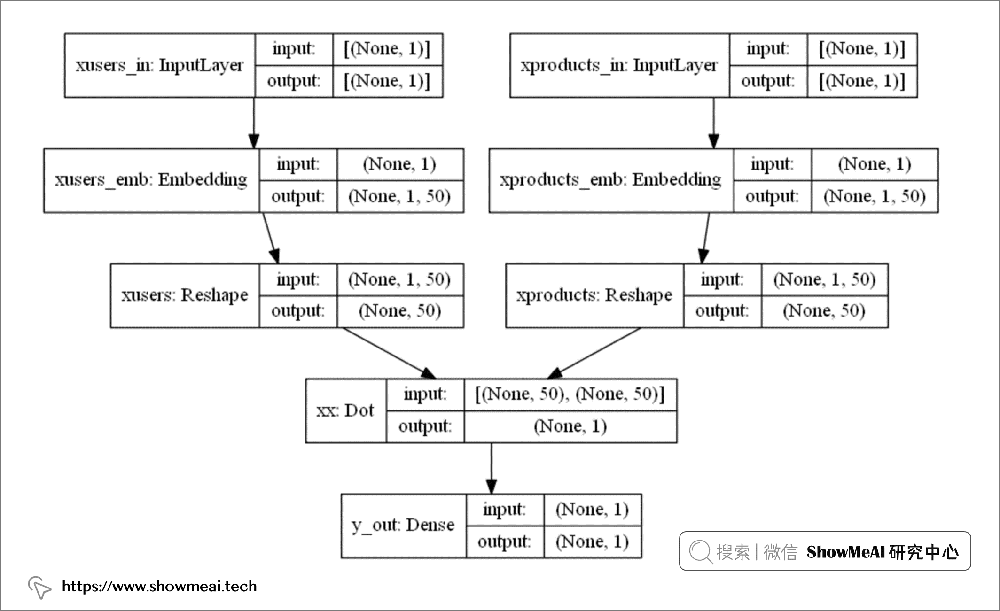


接下来我们就可以在我们的数据上去训练、评估和测试我们的模型了。

```python
# 训练
training = model.fit(x=[train["user"], train["product"]], y=train["y"], epochs=100, batch_size=128, shuffle=True, verbose=0, validation_split=0.3)
model = training.model
# 测试
test["yhat"] = model.predict([test["user"], test["product"]])
test
```

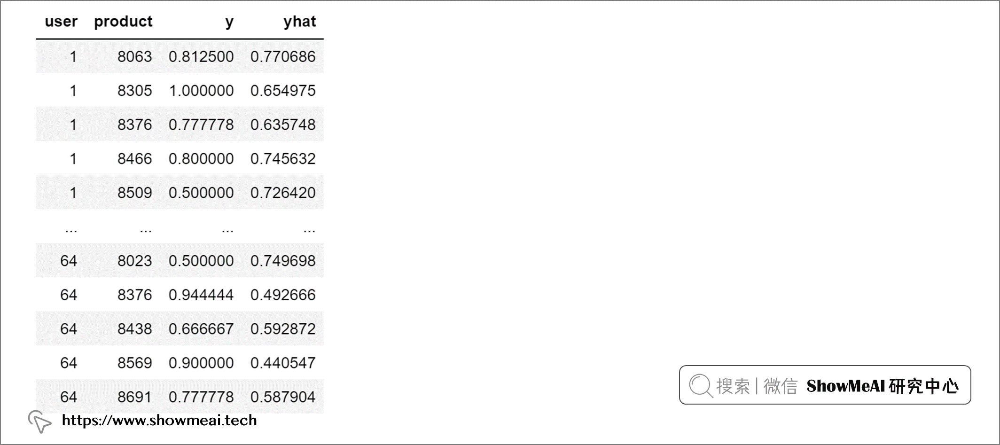


在这个模型最终的预估结果上，大家可以看到模型已经能够对没有见过的新的电影进行打分的预测了。我们可以基于这个得分进行排序和完成最终的推荐。以我们第1个用户为例，我们可以看到对于他进行基于预测得分的推荐，评估结果如下。

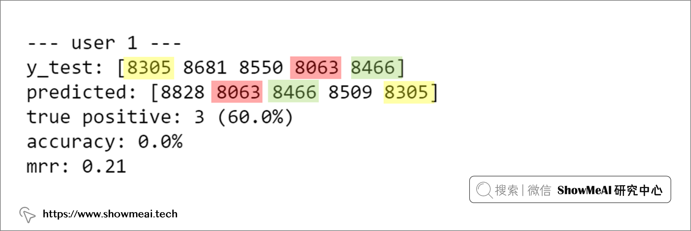

###  神经协同过滤算法

#### 模型介绍

大家在前面看到的协同过滤模型，学习能力相对比较弱，对于我们的信息做的是初步的挖掘，而现代的很多新的推荐系统实际上都使用了深度学习。也可以把深度学习和协同过滤结合，例如 **Neural Collaborative Filtering** (2017) 结合了来自神经网络的非线性和矩阵分解。该模型旨在充分利用嵌入空间，不仅将其用于传统的协同过滤，还用于完全连接的深度神经网络，新添加的模型组成部分会捕获矩阵分解可能遗漏的模式和特征，如下图所示：

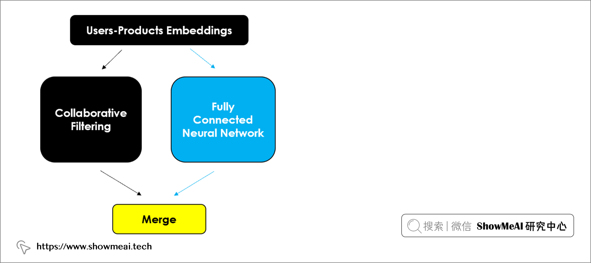

#### 代码实现

下面我们来实现一下这个模型的一个简易版本：

```python
# 用户与产品的embedding维度，相当于协同过滤中的因子数
embeddings_size = 50
usr, prd = dtf_users.shape[0], dtf_users.shape[1]
# 输入层
xusers_in = layers.Input(name="xusers_in", shape=(1,))
xproducts_in = layers.Input(name="xproducts_in", shape=(1,))
# A) 模型左侧：Matrix Factorization 矩阵分解
## embeddings 与 reshape
cf_xusers_emb = layers.Embedding(name="cf_xusers_emb", input_dim=usr, output_dim=embeddings_size)(xusers_in)
cf_xusers = layers.Reshape(name='cf_xusers', target_shape=(embeddings_size,))(cf_xusers_emb)
## embeddings 与 reshape
cf_xproducts_emb = layers.Embedding(name="cf_xproducts_emb", input_dim=prd, output_dim=embeddings_size)(xproducts_in)
cf_xproducts = layers.Reshape(name='cf_xproducts', target_shape=(embeddings_size,))(cf_xproducts_emb)
## 产品 product
cf_xx = layers.Dot(name='cf_xx', normalize=True, axes=1)([cf_xusers, cf_xproducts])
# B) 模型右侧：Neural Network 神经网络
## embeddings 与 reshape
nn_xusers_emb = layers.Embedding(name="nn_xusers_emb", input_dim=usr, output_dim=embeddings_size)(xusers_in)
nn_xusers = layers.Reshape(name='nn_xusers', target_shape=(embeddings_size,))(nn_xusers_emb)
## embeddings 与 reshape
nn_xproducts_emb = layers.Embedding(name="nn_xproducts_emb", input_dim=prd, output_dim=embeddings_size)(xproducts_in)
nn_xproducts = layers.Reshape(name='nn_xproducts', target_shape=(embeddings_size,))(nn_xproducts_emb)
## 拼接与全连接处理
nn_xx = layers.Concatenate()([nn_xusers, nn_xproducts])
nn_xx = layers.Dense(name="nn_xx", units=int(embeddings_size/2), activation='relu')(nn_xx)
# 合并A和B
y_out = layers.Concatenate()([cf_xx, nn_xx])
y_out = layers.Dense(name="y_out", units=1, activation='linear')(y_out)
# 编译
model = models.Model(inputs=[xusers_in,xproducts_in], outputs=y_out, name="Neural_CollaborativeFiltering")
model.compile(optimizer='adam', loss='mean_absolute_error', metrics=['mean_absolute_percentage_error'])
```

我们也同样可以对模型进行结构的绘制，如下所示。

```python
utils.plot_model(model, to_file=’model.png’, show_shapes=True, show_layer_names=True)
```

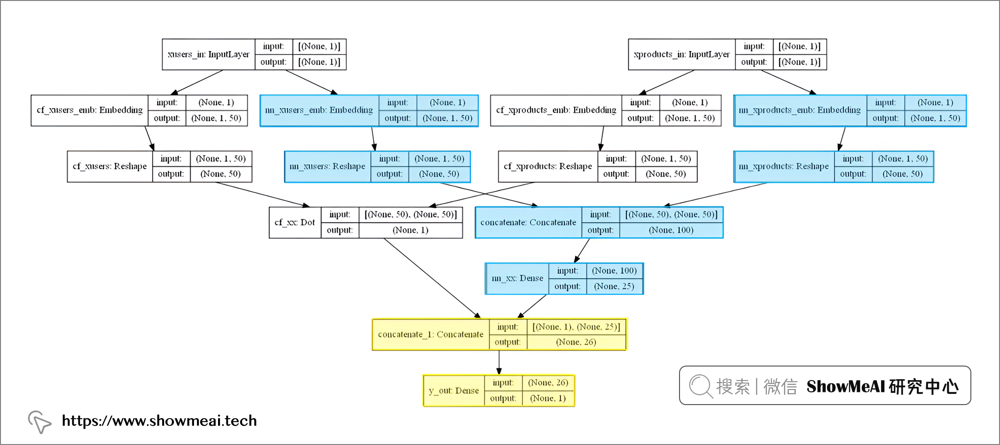


我们再基于现在这个神经网络的模型，去对我们最终的电影打评分进行预测，并且根据预测的得分进行排序和推荐，那评估的结果如下所示。

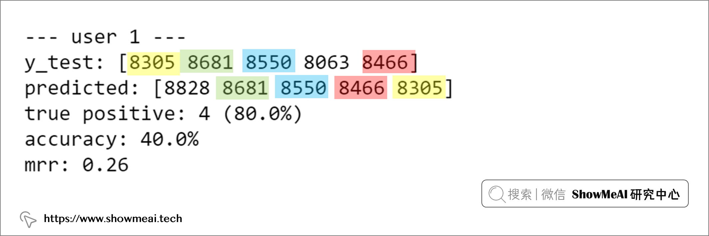

##  混合网络模型

###  模型介绍

我们在前面展示了如何结合我们的用户和产品（在当前场景下是电影推荐的场景）的打分数据来构建协同过滤算法和基础的神经网络算法，完成最终打分的预测和推荐，但实际我们的数据当中有着更丰富的信息。

- **用户行为** **：** 当前场景下是电影的打分，它是一种显式用户反馈；有些场景下我们会使用隐式的用户反馈，比如说用户的点击或者深度浏览和完播等行为。
- **产品信息** **：** 产品的标签和描述（这里的电影题材、标题等），主要用于基于内容的方法。
- **用户信息** **：** 人口统计学信息（即性别和年龄）或行为（即偏好、屏幕上的平均时间、最频繁的使用时间），主要用于基于知识的推荐。
- **上下文** **：** 关于评分情况的附加信息（如何时、何地、搜索历史），通常也包含在基于知识的推荐中。

现代推荐系统为了更精准的给大家进行推荐，会尽量的结合所有我们能够收集到的信息。大家日常使用的抖音或者B站，它们在给大家推荐视频类的内容的时候，会更加全面的使用我们上面提及到的所有的信息，甚至包含APP能采集到的更丰富的信息。

###  代码实现

下面结合本例，我们也把这些更丰富的信息（主要是上下文信息）结合到网络中来构建一个混合模型，以完成更精准的预估和推荐。

```python
# 基础特征
features = dtf_products.drop(["genres","name"], axis=1).columns
print(features)
# 上下文特征（时间段、工作日、周末等）
context = dtf_context.drop(["user","product"], axis=1).columns
print(context)
```

基础特征和上下文特征如下

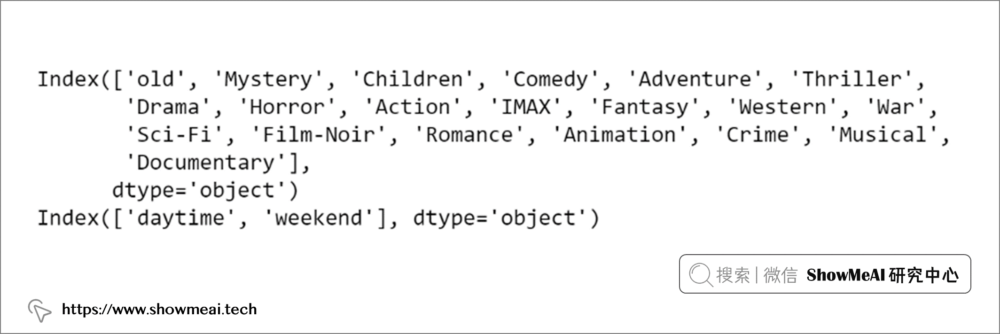


接下来我们把这些额外信息添加到**训练集**中：

```python
train = dtf_train.stack(dropna=True).reset_index().rename(columns={0:"y"})
## 添加特征
train = train.merge(dtf_products[features], how="left", left_on="product", right_index=True)
## 添加上下文信息
train = train.merge(dtf_context, how="left")
```

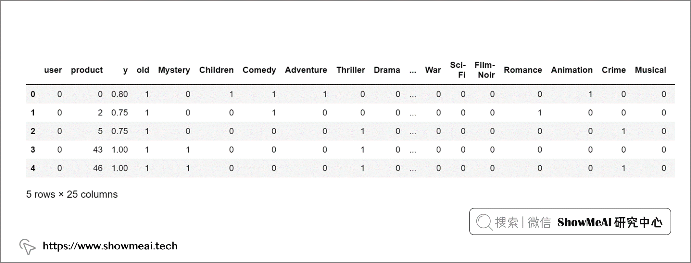


> 注意我们这里并没有对测试集直接去执行相同的操作，因为实际的生产环境当中，我们可能没有办法提前的去获知一些上下文的信息，所以我们会为上下文的信息去插入一个静态的值去做填充。
>
> 当然我们在实际预估的时候，是可以比较准确的去做填充的。比如我们在星期一晚上为我们平台的用户进行预测，则上下文变量应为 `daytime=0` 和 `week=0` 。

下面我们来构建**上下文感知混合模型**，神经网络的结构非常灵活，我们可以在网络中添加任何我们想要补充的信息，我们把上下文等额外信息也通过网络组件的形式补充到神经协同过滤网络结构中，如下所示。

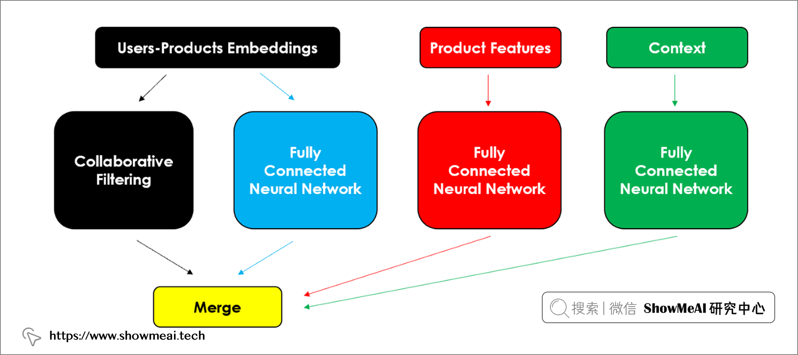

这个过程就相当于在刚才的神经协同过滤模型基础上，添加一些新的组块。下列实现代码看起来比较庞大，但实际上它只是在之前的实现基础上添加了一些行而已：

```python
embeddings_size = 50
usr, prd = dtf_users.shape[0], dtf_users.shape[1]
feat = len(features)
ctx = len(context)
################### 神经协同过滤 ########################
# 输入层
xusers_in = layers.Input(name="xusers_in", shape=(1,))
xproducts_in = layers.Input(name="xproducts_in", shape=(1,))
# A) 模型左侧：Matrix Factorization 矩阵分解
## embeddings 与 reshape
cf_xusers_emb = layers.Embedding(name="cf_xusers_emb", input_dim=usr, output_dim=embeddings_size)(xusers_in)
cf_xusers = layers.Reshape(name='cf_xusers', target_shape=(embeddings_size,))(cf_xusers_emb)
## embeddings 与 reshape
cf_xproducts_emb = layers.Embedding(name="cf_xproducts_emb", input_dim=prd, output_dim=embeddings_size)(xproducts_in)
cf_xproducts = layers.Reshape(name='cf_xproducts', target_shape=(embeddings_size,))(cf_xproducts_emb)
## 产品 product
cf_xx = layers.Dot(name='cf_xx', normalize=True, axes=1)([cf_xusers, cf_xproducts])
# B) 模型右侧：Neural Network 神经网络
## embeddings 与 reshape
nn_xusers_emb = layers.Embedding(name="nn_xusers_emb", input_dim=usr, output_dim=embeddings_size)(xusers_in)
nn_xusers = layers.Reshape(name='nn_xusers', target_shape=(embeddings_size,))(nn_xusers_emb)
## embeddings 与 reshape
nn_xproducts_emb = layers.Embedding(name="nn_xproducts_emb", input_dim=prd, output_dim=embeddings_size)(xproducts_in)
nn_xproducts = layers.Reshape(name='nn_xproducts', target_shape=(embeddings_size,))(nn_xproducts_emb)
## 拼接与全连接处理
nn_xx = layers.Concatenate()([nn_xusers, nn_xproducts])
nn_xx = layers.Dense(name="nn_xx", units=int(embeddings_size/2), activation='relu')(nn_xx)
######################### 基础信息 ############################
# 电影特征
features_in = layers.Input(name="features_in", shape=(feat,))
features_x = layers.Dense(name="features_x", units=feat, activation='relu')(features_in)
######################## 上下文特征 ###########################
# 上下文特征
contexts_in = layers.Input(name="contexts_in", shape=(ctx,))
context_x = layers.Dense(name="context_x", units=ctx, activation='relu')(contexts_in)
########################## 输出 ##################################
# 合并所有信息
y_out = layers.Concatenate()([cf_xx, nn_xx, features_x, context_x])
y_out = layers.Dense(name="y_out", units=1, activation='linear')(y_out)
# 编译
model = models.Model(inputs=[xusers_in,xproducts_in, features_in, contexts_in], outputs=y_out, name="Hybrid_Model")
model.compile(optimizer='adam', loss='mean_absolute_error', metrics=['mean_absolute_percentage_error'])
```

我们也绘制一下整个模型的结构

```python
utils.plot_model(model, to_file='model.png', show_shapes=True, show_layer_names=True)
```

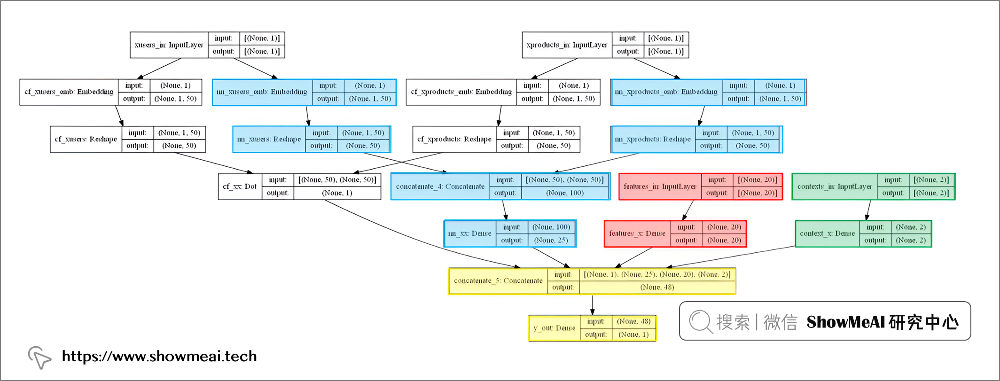


混合模型的输入数据源更多，实际训练时我们要把这些数据都送入模型：

```python
# 训练
training = model.fit(x=[train["user"], train["product"], train[features], train[context]], y=train["y"], 
                     epochs=100, batch_size=128, shuffle=True, verbose=0, validation_split=0.3)
model = training.model
# 预测
test["yhat"] = model.predict([test["user"], test["product"], test[features], test[context]])
```

最终基于混合模型的预测得分进行推荐，评估指标如下：

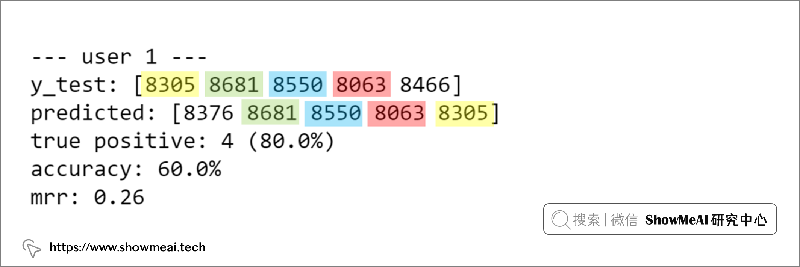


我们单独看 user1 这个用户，混合模型在多种信息的支撑下，获得了最高的准确度。

##  结论

本文讲解了推荐系统的基础知识，以及不同的推荐系统搭建方法，我们对各种方法进行了实现和效果改进，包括基于内容的推荐实现，基于协同过滤的推荐实现，我们把更丰富的产品信息和上下文信息加入网络实现了混合网络模型。大家可以参考实现流程应用在自己的场景中。


