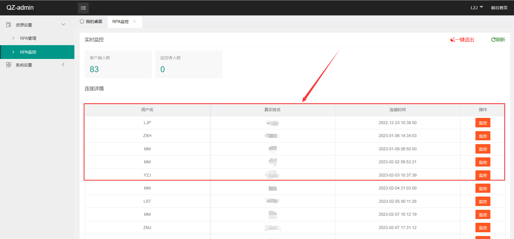
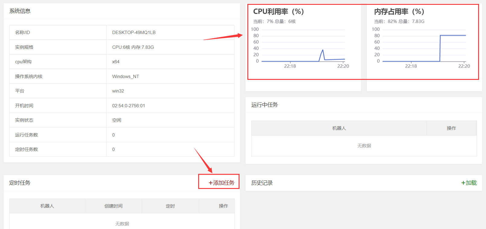
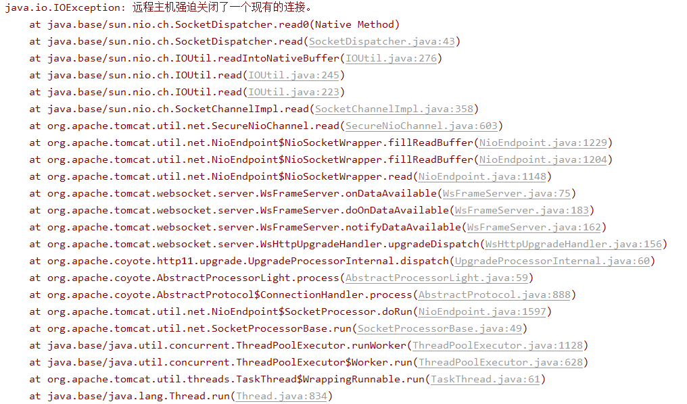
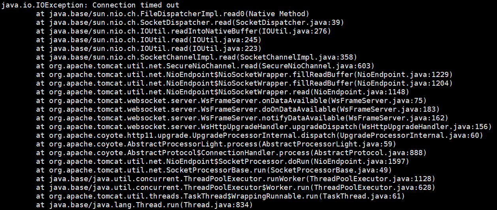

我在一个线上项目中用：

- `SpringBoot`的管理平台
- `Nodejs的Electron`框架做的桌面应用

其中要完成**管理平台对客户端的监控功能**，比如平台可以监控客户端的内存、CPU占用情况，以及可以通过平台主动调用客户端的某些功能（自动运行），当时候就想着用 **WebSocket来解决客户端与管理平台的各种数据交互**比较合适。

> 简单流程：后台ConcurrentHashMap存放所有在线的客户端Session信息,平台通过监控用户信息页面就可以查看在线的用户信息。

<div align=center>

</div>

> 进入监控后，后台就会向客户端发送监控通知，客户端就会源源不断地发送监控日志给后台，转接给管理后台的监控详细页面；这样就可以用户在线的时候对客户端进行实时监控和操控了。

<div align=center>

</div>
> 当用户下线后，就会将客户端Session信息从ConcurrentHashMap中移除，监控用户信息页面自然看不到不在线的用户。整个流程也就这样了。


## 问题发现

诡异的事情发生了，在一次线上的时候发现监控用户信息页面竟然有不在线的用户！不过我的WebSocket 并没有实现心跳机制，TCP KeepAlive也默认不开启。可为什么我的后台接收不到客户端的TCP关闭，就算 **直接杀死进程** 抑或是 **直接关机** 了，操作系统都是会通过网卡发送 `FIN`报文的。 

后台接收到 `FIN`报文自然会将 `ConcurrentHashMap`中的用户`Session`信息删除，管理后台自然也看不到不在线的用户。也就是说唯一的可能就是 后台没有接收到客户端的 `FIN`报文，到底是什么原因导致的**没有挥手**呢？

并且后台主动向不存在的`socket通道`发送消息没有收到回应，并没有立刻关闭本机的socket通道，这导致一段时间内我很疑惑。

## 场景复现

### 后台代码

**springboot整合WebSocket的配置类**

```java
import org.springframework.web.socket.server.standard.ServerEndpointExporter;

@Configuration
public class WebSocketConfig {

    /**
     * 注入一个ServerEndpointExporter,该Bean会自动注册使用@ServerEndpoint注解申明的websocket endpoint
     */
    @Bean
    public ServerEndpointExporter serverEndpointExporter() {
        return new ServerEndpointExporter();
    }

}
```


**WebSocket服务端的实现类**

```java
@ServerEndpoint(value = "/client")
@Component
public class ControlWebSocket {
    /** 存放所有在线的登录后台的客户端 */
    private static Map<String, Session> controls = new ConcurrentHashMap<>();
    
    /**
     * 连接建立成功调用的方法
     */
    @OnOpen
    public void onOpen(Session session) {
		/** 将建立连接的用户session存放在ConcurrentHashMap中 **/
        controls.put(session.getId(), session);
    }
    
    /**
     * 连接关闭调用的方法
     */
    @OnClose
    public void onClose(Session session) {
		/** 将下线的用户session从在ConcurrentHashMap中移除 **/
        controls.remove(session.getId());

    }
```

### 客户端代码

**WebSocket客户端的实现 js**

```js
//初始化连接
  function initWebSocket() {
    websocket = new WebSocket("wss://你的ip地址/client");
    
    //连接发生错误的回调方法
    websocket.onerror = function () {
    };

    //连接成功建立的回调方法
    websocket.onopen = function (event) {
  		// 向后台注册用户信息
    }

    //接收到消息的回调方法
    websocket.onmessage = function (event) {
      	//比如收到监控通知消息，就间隔发送日志信息
        //websocket.send("your message")
    }
      
    //连接关闭的回调方法
    websocket.onclose = function () {
    }

    //监听窗口关闭事件，当窗口关闭时，主动去关闭websocket连接，防止连接还没断开就关闭窗口，server端会抛异常。
    window.onbeforeunload = function () {
      websocket.close();
    }
  }
```


## 真相大白

### 断网问题

其实监控用户信息页面出现不在线的用户总是那特定几个，其他用户都会正常的关闭走上面的流程。然后我问了一下那个经常异常的同学，原来他经常下班后将笔记本带走，这就导致了**断网问题**，也就是说没关闭应用前换了一个网络 Wife，换网的话是不会发送 FIN 报文的。

就算用户将应用关闭，换了一个ip地址WebSocket 找不到原来的用户session了，回调不了close方法。这要等到 WebSocket后台主动发消息才能知道该用户已经下线了回调error方法，并从ConcurrentHashMap中移除用户Session信息。

这也是因为我的WebSocket没有实现**心跳机制**，后台不主动的话永远不知道换网的用户已经下线的问题。


且上面说到后台主动向不存在的`socket通道`发送消息没有收到回应，并没有立刻关闭本机的socket通道的情况。**对于发送信息收不到TCP确认报文的情况，不同操作系统有不同的处理方式：**

```java
@OnMessage
public void onMessage(String message, Session session) {
	session.getBasicRemote().sendText(message);
}
```

**window立即关闭tcp连接**



**linux会选择重连，一段时间内都不成功连接成功,才会关闭tcp连接**




### **断网时有数据传输**

断网时如果有数据发送，由于收不到 ACK，所以会重试，但并不会无限重试下去，达到一定的重发次数之后，如果仍然没有任何确认应答返回，就会判断为网络或者对端主机发生了异常，强制关闭连接。此时的关闭是直接关闭，而没有挥手（数据都发不出去，还挥啥手），Linux 下的设置为

> 最小重传时间是200ms 最大重传时间是120s 重传次数为15


### **断网时没有数据传输**

断网时如果没有数据传输，还得看 TCP 连接的 KeepAlive 是否打开，关于 TCP 的 KeepAlive 简介如下：

- TCP KeepAlive 是一种在不影响数据流内容的情况下探测对方的方式，采用 `保活计时器`实现，当计时器被触发时，一端发送保活报文，另一端接收到报文后发送 ACK 响应
- 它并不是 TCP 的规范，但大部分的实现都提供了这一机制
- 该机制存在争议，有的人保活机制应该在应用程序中实现


### **开启KeepAlive**

操作系统中有这么几个参数控制 KeepAlive 的配置：

- Keepalive_time：空闲时间，即多长时间连接没有发送数据时开始 KeepAlive 检测
- Keepalive_intvl：发送间隔时间，即上述代码的设置
- Keepalive_probs：最多发送多少个检测数据包

在 Linux 上可以通过如下文件查看

```bash
cat /proc/sys/net/ipv4/tcp_keepalive_time
cat /proc/sys/net/ipv4/tcp_keepalive_intvl
cat /proc/sys/net/ipv4/tcp_keepalive_probes
```

