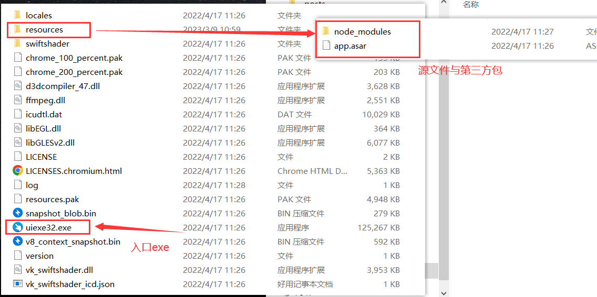
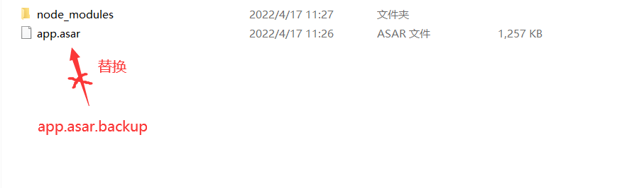

> 在用`Electron` 来开发桌面客户端遭老罪了，感觉像是摸着石头过河。不像是用vue写个web前端这么简单，桌面应用的开发逻辑要与操作系统相关联，差别还是有点大的。并且网上的视频以及博客也比较少，碰到一个问题这让解决起来挺费时间的。

网上的应用打包一般都是`electron-builder` 配合使用 electron-updataer 可以实现本次下载下次打开后更新的用户无感效果。

但是我用的是`electron-packager`打包工具。不过我也有尝试过上面的方法`electron-builder`：过程繁琐（一会要安装这配置那的）；并且更新程序也不知道怎么对接的，花了挺长的一段时间还是弄不好干脆放弃了。

于是决定用 `electron-packager`打包，和自定义一个更新程序


## 总览情况

> 我的源程序目录如下
<div align=center>

</div>

> package.json的electron-packager打包命令如下，就会生成 uiexe-win32-x64文件夹，里面resources就是源文件夹了（包括源程序与第三方包）。

```js
  "scripts": {
    "package": "electron-packager . uiexe --platform=win32 --arch=x64 --icon=favicon.ico --app-version=1.0.1 --overwrite --asar",
  },
```
<div align=center>

</div>


我的更新思路：

- 打开应用后先查找最新的版本。
- 如果有，就下载新版本的上述 node_modules 或是 app.asar，替换掉旧的版本。
- 如果没有就进入登录页面

```js
$.ajax({
    type: 'get',
    url: '你的网址',
    success: function (res) {
	  /* 返回最新版本的json，对比现在版本 */	
      res = JSON.parse(res)
      if (pjson.version != res.version) {
      	updateApp(res.version);	/*不一致下载新的，替换旧的文件*/
      }else{
        ipcRenderer.send('updateSuccess', '');	/*一致则跳转登录页面*/
      }
    },
    error: function (err) {
      layer.msg("网络连接异常", { icon: 5 })
    }
  })
```


## 问题发现

我发现了一个问题，将下载好的`backup`文件替换不到旧的文件，原因是Electron应用启动后**不允许修改源文件夹**
<div align=center>

</div>

这就把我整麻了，这就需要我退出应用后才能替换文件。那我退出了程序怎么完成**自动更新**？


## 解决方案

Electron应用关闭前所要做的事情是这样子：

- 启动子进程运行 C++更新程序 （**elevate.cpp**）
- 退出应用

```js
    
winArgs = `${JSON.stringify(updateExe)} ${JSON.stringify(newAsar)} ${JSON.stringify(oldAsar)} ${JSON.stringify(reloadExe)}`

// 启动子进程运行 C++更新程序 elevate.cpp
const child = child_process.spawn('cmd', ['/s', '/c', '"' + winArgs + '"'], {
	detached: true,
    windowsVerbatimArguments: true,
    stdio: 'ignore'
})
child.unref();

// 退出应用
app.quit();
```


自己手写了一个C++更新程序 **elevate.cpp**，这负责在关闭Electron应用后：

- 等待 3 秒让Electron应用完全退出
- 自行将 backup 文件替换掉旧的文件
- 然后重新打开Electron应用

```c++
#include <Windows.h>
#include <stdio.h>
int main(int argc, char *argv[])
{

  ShowWindow(GetForegroundWindow(),0);
  Sleep(3000);
  if (argc < 4)
    return -1;
  // 自行将 backup 文件替换掉旧的文件
  remove(argv[2]);
  rename(argv[1], argv[2]);
  // 然后重新打开Electron应用  
  WinExec(argv[3], SW_SHOW);
  return 0;
}
```


## 总结

开发 Web 前端与开发桌面应用真的大不一样，比起 Web 前端开发，Electron的网上资料少得可怜，并且能真正解决问题的博客更少。并且我也发现 Nodejs开发起来真的不太友好（可能是我菜），整合其他组件就会报一些奇奇怪怪的错，而且过程也比较繁琐，让你原本想好的思路按照它提供的框架来，有时候还不一定能实现你的思路。果然，只有试过很多办法都没有效果的话，就自定义一个解决方案来实现你的思路是最好不过了

