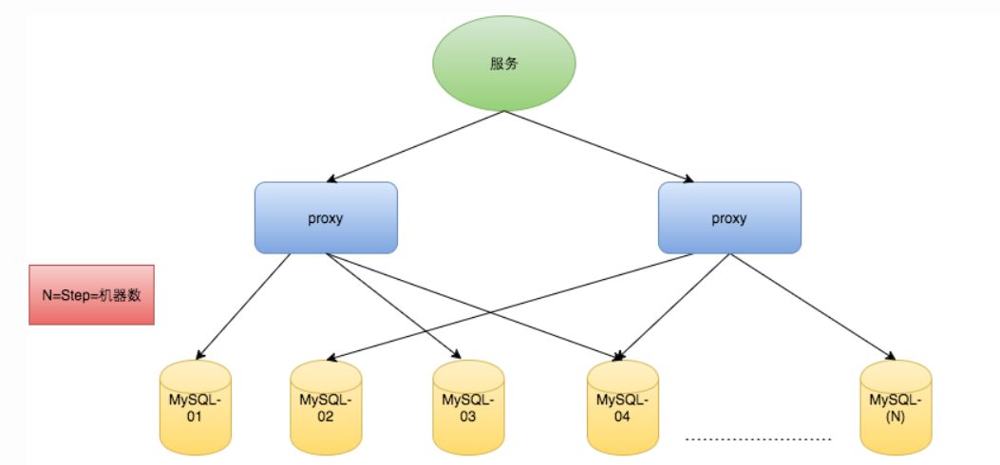
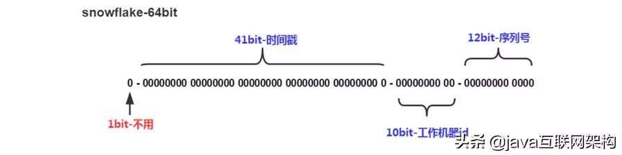

## 开篇几个问题

### 为什么需要分布式全局唯一ID

在复杂分布式系统中，往往需要对大量的数据和消息进行唯一标识。

- 如在美团点评的金融、支付、餐饮、酒店等业务场景
- 猫眼电影等产品的系统中数据日渐增长，对数据分库分表后需要有一个唯一ID来表示一条数据或者消息。
- 特别一点的如订单、骑手、优惠劵也都需要一个唯一ID做为标识。

此时一个能生成唯一ID的系统是非常必要的。


### ID生成规则部分硬性要求

- 全局唯一：既然是唯一标识，那么全局唯一是最基本的要求。
- 趋势递增：在MySQL的InnoDB引擎中使用的是聚集索引，由于多数RDBMS使用Btree的数据结构来存储索引数据，在主键的选择上面我们应该尽量使用有序的主键来保证写入性能。
- 单调递增：保证下一个ID一定大于上一个ID，例如事务版本号、IM增量消息、排序等特殊需求。
- 信息安全：如果ID是连续的，那么恶意用户的扒取工作就非常容易做了，直接按照顺序下载指定URL即可;如果是订单号那么更加危险，竞争对手可以知道我们一天的单量;所以在一些应用场景下，需要ID无规则不规则，让竞争对手不好猜。
- 含时间戳：这样就能在开发中快速了解这个分布式ID的生成时间。


### ID生成系统的可用性要求

- 高可用：发一个获取分布式ID的请求，服务器就要保证99.999%的情况下给我创建一个唯一分布式ID
- 低延迟：发一个获取分布式ID的请求，服务器就要快，极速
- 高QPS：假如并发一口气10万个创建分布式ID请求同时过来，服务器需要顶得住且成功创建10万个分布式ID


## 常用方案

### 基于UUID

```
UUID(Universally Unique Identifier)的标准型式包含32个16进制数字，以连字号分为五段，形式为8-4-4-4-12的36个字符，示例：550e8400-e29b-41d4-a716-446655440000，到目前为止业界一共有5种方式生成UUID，详情见IETF发布的UUID规范 A Universally Unique IDentifier (UUID) URN Namespace。
```

**优点：**

- 代码实现简单
- UUID可以实现唯一性
- 性能非常高（本地生成，没有网络消耗）。

**缺点：**

- 每次生成的ID是无序的，无法保证趋势递增

- ID本事无业务含义，不可读

- 不易于存储：UUID太长，16字节128位，通常以36长度的字符串表示，很多场景不适用。

- 信息不安全：基于MAC地址生成UUID的算法可能会造成MAC地址泄露，这个漏洞曾被用于寻找梅丽莎病毒的制作者位置。

- ID作为主键时在特定的环境会存在一些问题，比如做DB主键的场景下，UUID就非常不适用：

  ① MySQL官方有明确的建议主键要尽量越短越好[4]，36个字符长度的UUID不符合要求。
  ② 对MySQL索引不利：如果作为数据库主键，在InnoDB引擎下，UUID的无序性可能会引起数据位置频繁变动，严重影响性能。

**适用场景**

- 可以用来生成如token令牌一类的场景，足够没辨识度，而且无序可读，长度足够。
- 可以用于无纯数字要求、无序自增、无可读性要求的场景。

**实现：**

```java
// 使用JDK1.5提供的UUID类
UUID uuid = UUID.randomUUID();
System.out.println(uuid); // 0e070a22-0e2f-422e-96ca-f63987dadba5
```


### 基于数据库主键自增

基于数据库的`auto_increment`自增ID完全可以充当`分布式ID`，具体实现：需要一个单独的MySQL实例用来生成ID，建表结构如下：

```sql
CREATE DATABASE `SEQ_IDT`;
CREATE TABLE SEQID.SEQUENCE_ID(
    id bigint(20)unsigned NOT NULL auto_increment,
    value char(10)NOT NULL default '',
    PRIMARY KEY (id),
)ENGINE=MyISAM;
insert into SEQUENCE_ID(value) VALUES ("values");
```

当我们需要一个ID的时候，向表中插入一条记录返回`主键ID`，但这种方式有一个比较致命的缺点，访问量激增时MySQL本身就是系统的瓶颈，用它来实现分布式服务风险比较大，不推荐！

**优点**

  - 实现简单，依靠数据库即可，成本小。
  - ID数字化，单调自增，满足数据库存储和查询性能。
  - 具有一定的业务可读性。

**缺点**

  - 强依赖DB，存在单点问题，如果数据库宕机，则业务不可用。
  - DB生成ID性能有限，单点数据库压力大，无法扛高并发场景。

**适用场景**

  - 小规模的，数据访问量小的业务场景。
  - 无高并发场景，插入记录可控的场景。


### 基于数据库多实例主键自增

这个方案就是解决mysql的单点问题，在auto_increment基础上，设置step步长。

在分布式系统中我们可以多部署几台机器，每台机器设置不同的初始值，且步长和机器数相等。比如有两台机器。设置步长step为2，TicketServer1的初始值为1（1，3，5，7，9，11…）、TicketServer2的初始值为2（2，4，6，8，10…）。这是Flickr团队在2010年撰文介绍的一种主键生成策略（Ticket Servers: Distributed Unique Primary Keys on the Cheap ）。如下所示，为了实现上述方案分别设置两台机器对应的参数，TicketServer1从1开始发号，TicketServer2从2开始发号，两台机器每次发号之后都递增2。

```sql
TicketServer1:
auto-increment-increment = 2
auto-increment-offset = 1

TicketServer2:
auto-increment-increment = 2
auto-increment-offset = 2
```

假设我们要部署N台机器，步长需设置为N，每台的初始值依次为0,1,2…N-1那么整个架构就变成了如下图所示：

**优点**

  - 解决了ID生成的单点问题，同时平衡了负载。

 **缺点**

  - 一定确定好步长，将对后续的扩容带来困难，而且单个数据库本身的压力还是大，无法满足高并发。

 **适用场景**

  - 数据库不需要扩容的场景。

这种方案，除了难以适应大规模分布式和高并发的场景，普通的业务规模还是能够胜任的，所以这种方案还是值得积累。


### 基于Redis生成方案

`Redis`也同样可以实现，原理就是利用`redis`的 `incr`命令实现ID的原子性自增

```shell
127.0.0.1:6379> set seq_id 11 /初始化自增ID为1OK
127.8.0.1:6379> incr seq_id  //增加1，并返回递增后的数值
(integer) 2
```

用`redis`实现需要注意一点，要考虑到redis持久化的问题。`redis`有两种持久化方式`RDB`和`AOF`

- `RDB`会定时打一个快照进行持久化，假如连续自增但`redis`没及时持久化，而这会Redis挂掉了，重启Redis后会出现ID重复的情况。
- `AOF`会对每条写命令进行持久化，即使`Redis`挂掉了也不会出现ID重复的情况，但由于incr命令的特殊性，会导致`Redis`重启恢复的数据时间过长。

**优点**

- 有序递增，可读性强。
- 能够满足一定性能。

**缺点**

- 强依赖于Redis，可能存在单点问题。
- 占用宽带，而且需要考虑网络延时等问题带来地性能冲击。

**适用场景**

- 对性能要求不是太高，而且规模较小业务较轻的场景，而且Redis的运行情况有一定要求，注意网络问题和单点压力问题，如果是分布式情况，那考虑的问题就更多了，所以一帮情况下这种方式用的比较少。

Redis的方案其实可靠性有待考究，毕竟依赖于网络，延时故障或者宕机都可能导致服务不可用，这种风险是不得不考虑在系统设计内的。


### **基于雪花算法（Snowflake）**

雪花算法（Snowflake）是twitter公司内部分布式项目采用的ID生成算法，开源后广受国内大厂的好评，在该算法影响下各大公司相继开发出各具特色的分布式生成器。



这种方案巧妙地把64位分别划分成多段，分开表示时间戳差值、机器标识和随机序列，先以此生成一个64位地二进制正整数，然后再转换成十进制进行存储。

其中，**1位标识符**，不使用且标记为0；**41位时间戳**，用来存储时间戳的差值；**10位机器码**，可以标识1024个机器节点，如果机器分机房部署（IDC），这10位还可以拆分，比如5位表示机房ID，5位表示机器ID，这样就有32*32种组合，一般来说是足够了；最后的**12位随即序列**，用来记录毫秒内的计数，一个节点就能够生成4096个ID序号。所以综上所述，综合计算下来，理论上Snowflake算法方案的QPS大约为409.6w/s，性能足够强悍了，而且这种方式，能够确保集群中每个节点生成的ID都是不同的，且区间内递增。

**优点**

- 每秒能够生成百万个不同的ID，性能佳。
- 时间戳值在高位，中间是固定的机器码，自增的序列在地位，整个ID是趋势递增的。
- 能够根据业务场景数据库节点布置灵活挑战bit位划分，灵活度高。

**缺点**

- **强依赖于机器时钟**，如果时钟回拨，会导致重复的ID生成，所以一般基于此的算法发现时钟回拨，都会抛异常处理，阻止ID生成，这可能导致服务不可用。

**适用场景**

- 雪花算法有很明显的缺点就是时钟依赖，如果确保机器不存在时钟回拨情况的话，那使用这种方式生成分布式ID是可行的，当然小规模系统完全是能够使用的。