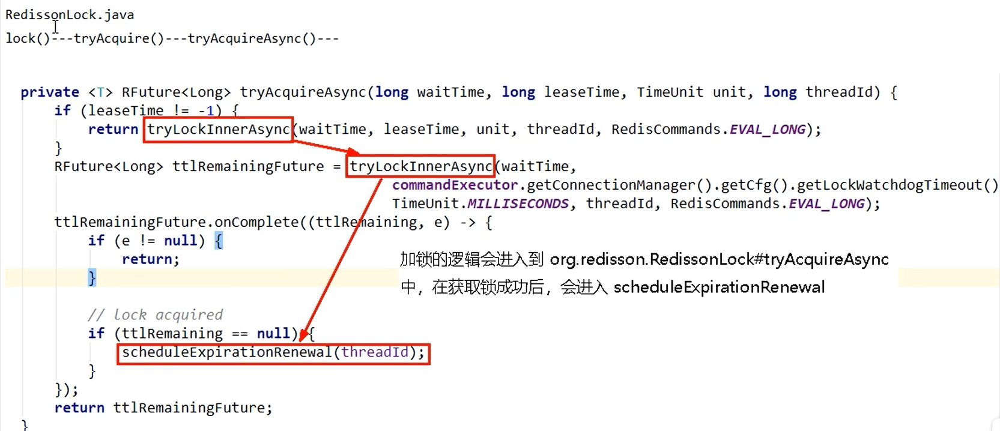
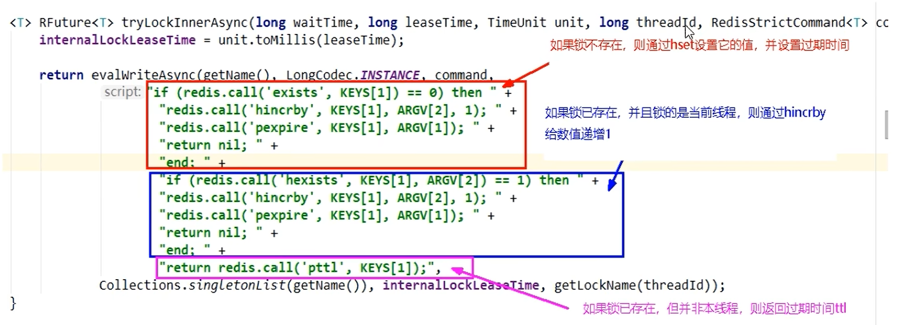
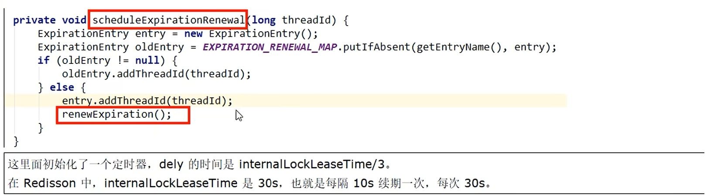
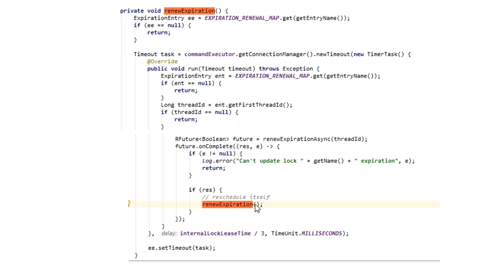

使用 Redis 作为分布式锁，本质上要实现的目标就是一个进程在 Redis 里面占据了仅有的一个“茅坑”，当别的进程也想来占坑时，发现已经有人蹲在那里了，就只好放弃或者等待稍后再试。

目前基于 Redis 实现分布式锁主要有两大类，一类是基于单机，另一类是基于 Redis 多机，不管是哪种实现方式，均需要实现加锁、解锁、锁超时这三个分布式锁的核心要素。


## Redis普通分布式锁

> 基于set 的实现：set + NX + PX 

特性：

- 宕机与过期+防止死锁
-  防止误删key的问题
-  Lua保证原子性


**在客户机上编写lua脚本，lock.lua文件防止客户端A请求的锁被客户端B勿除**

```lua
if redis.call ( "get" ,KEYS[1])== ARGV[1] then
	return redis.call( "del" ,KEYS[1])
else
    return 0
end
```


### 加锁与解锁

**while判断并自旋重试获取锁+setnx含自然过期时间+Lua脚本官网删除锁命令**

```java
public class RedisLockUtil {
    /** 锁键 -> key */
    private final String LOCK_KEY = "lock_key";
    
    /** 锁过期时间 -> TTL */
    private Long millisecondsToExpire = 10000L;
    
    /** 获取锁超时时间 -> get lock timeout for return */
    private Long timeout = 300L;
    
    /** LUA脚本 -> 分布式锁解锁原子操作脚本 */
    private static final String LUA_SCRIPT =
            "if redis.call('get',KEYS[1]) == ARGV[1] then" +
                    " return redis.call('del',KEYS[1]) " +
                    "else" +
                    " return 0 " +
                    "end";
    
    /** set命令参数 */
    private SetParams params = SetParams.setParams().nx().px(millisecondsToExpire);
 
    @Autowired
    private JedisPool jedisPool;
 
 
    /**
     * 加锁 -> 超时锁
     *
     * @param lockId  一个随机的不重复id -> 区分不同客户端
     * @return
     */
    public boolean timeLock(String lockId) {
        Jedis client = jedisPool.getResource();
        long start = System.currentTimeMillis();
        try {
            for(;;) {
                String lock = client.set(LOCK_KEY, lockId, params);
                if ("OK".equalsIgnoreCase(lock)) {
                    return true;
                }
                // sleep -> 获取失败暂时让出CPU资源
                TimeUnit.MILLISECONDS.sleep(100);
                long time = System.currentTimeMillis() - start;
                if (time >= timeout) {
                    return false;
                }
            }
        } catch (Exception e) {
            e.printStackTrace();
            logger.error(e.getMessage());
        } finally {
            client.close();
        }
        return false;
    }
 
 
 
    /**
     * 解锁
     *
     * @param lockId 一个随机的不重复id -> 区分不同客户端
     * @return
     */
    public boolean unlock(String lockId) {
        Jedis client = jedisPool.getResource();
        try {
            Object result = client.eval(LUA_SCRIPT, Arrays.asList(LOCK_KEY), Arrays.asList(lockId));
            if (result != null && "1".equalsIgnoreCase(result.toString())) {
                return true;
            }
            return false;
        } catch (Exception e) {
            e.printStackTrace();
            logger.error(e.getMessage());
        }
        return false;
    }
}
```


## Redis分布式重入锁+自动续期

> 基于 hash 的实现：hexists + hincrby + px

特性：

- 可重入
- 自动续期

### 实现分布式重入锁

#### **加锁流程：**

- 先判断redis分布式锁这个key是否存在 EXISTS key
- 返回 0 说明不存在，hset新建当前线程属于自己的锁
- 返回 1 说明已经有锁，需进一步判断是不是当前线程自己的id，是的话加 1

**加锁lua脚本实现**

```lua
if redis.call( 'exists','key') == 0 then
    redis.call('hset','key','uuid:threadid',1)
    redis.call('expire','key',30)
    return 1
elseif redis.call( 'hexists','key','uuid:threadid' ) == 1 then
    redis.call( 'hincrby','key','uuid: threadid',1)
    redis.call('expire','key',30)
    return 1
else
    return 0
end

改进版本 
if redis.call('exists','key') == 0 or redis.call('hexists','key','uuid:threadid') == 1 then
    redis.call('hincrby','key','uuid:threadid',1)
	redis.call('expire','key',30)
    return 1
else
    return 0
end

参数化形式
if redis.call('exists',KEYS[1]) == 0 or redis.call('hexists',KEYS[1],ARGV[1])== 1 then
    redis.call('hincrby',KEYS[1],ARGV[1],1)
	redis.call('expire',KEYS[1],ARGV[2])
    return 1
else
    return 0
end
```

#### 解锁流程

- 判断有锁且且还是自己的锁 HEXISTS key uuid:ThreadID
- 返回 0，说明根本没有锁，程序块返回nil
- 不是 0 ，说明有锁且是自己的锁，直接调用HINCRBY -1 解锁一次
- 直到它变为 0 表示可以删除该锁key，del锁key

**解锁lua脚本实现**

```lua
if redis.call('hexists','key','uuid:threadid') == 0 then
    return nil
elseif redis.call( 'hincrby','key','uuid:threadid',-1) == 0 then
    return redis.call('del',key)
else
    return 0
end

参数化形式
if redis.call('hexists',KEYS[1],ARGV[1]) == 0 then
    return nil
elseif redis.call( 'hincrby',KEYS[1],ARGV[1],-1) == 0 then
    return redis.call('del',KEYS[1])
else
    return 0
end
```


### 加个自动续期

自动续期加个钟的Lua脚本

```lua
if redis.call( 'HEXISTS',KEYS[1],ARGV[1])== 1 then
    return redis.call( 'expire',KEYs[1],ARGV[2])
else
    return 0
```

RedisDistributedLock

```java
@Override
public boolean tryLock(long time, TimeUnit unit) throws InterruptedException{
    if(time == -1L){
        String script = 
            "if redis.call('exists',KEYS[1]) == 0 or redis.call('hexists',KEYS[1],ARGV[1])== 1 then" +
                "redis.call('hincrby',KEYS[1],ARGV[1],1)" +
                "redis.call('expire',KEYS[1],ARGV[2])" +
                "return 1" +
            "else" +
                "return 0" +
            "end";
        while(!stringRedisTemplate.execute(new DefaultRedisScript<>(script,Boolean.class),Arrays.asList(LOCK_KEY), uuidValue,String.valueOf(expireTime))){
            //暂停60毫秒
            TimeUnit.MillISECONDS.sleep(60);
        }
        //新建一个后台扫描程序，来坚持key目前的ttl，是否到我们规定的1/2 1/3来实现续期
        renewExpiration();
        return true;
    }
}

private void renewExpiration(){
    String script = 
            "if redis.call( 'HEXISTS',KEYS[1],ARGV[1])== 1 then" +
                "return redis.call( 'expire',KEYs[1],ARGV[2])" +
            "else" +
                "return 0" +
            "end";
    new Timer().schedule(new TimerTask(){
        @Override
        public void run(){
            if(!stringRedisTemplate.execute(new DefaultRedisScript<>(script,Boolean.class),Arrays.asList(LOCK_KEY), uuidValue,String.valueOf(expireTime))){
                resetExpire();
            }
        }
    },(this.expireTime * 1000)/3);
}

```


## Redlock算法和底层源码分析

### Redis分布式锁-Redlock红锁

Redis官网提出了一种称为Redlock的算法,是一个更规范的算法来使用Redis实现分布式锁。

以上几种基于 Redis 单机实现的分布式锁其实都存在一个问题，就是加锁时只作用在一个 Redis 节点上，即使 Redis 通过 Sentinel 保证了高可用，但由于 Redis 的复制是异步的，Master 节点获取到锁后在未完成数据同步的情况下发生故障转移，此时其他客户端上的线程依然可以获取到锁，因此会丧失锁的安全性。

整个过程如下：

- 客户端 A 从 Master 节点获取锁。
- Master 节点出现故障，主从复制过程中，锁对应的 key 没有同步到 Slave 节点。
- Slave升 级为 Master 节点，但此时的 Master 中没有锁数据。
- 客户端 B 请求新的 Master 节点，并获取到了对应同一个资源的锁。
- 出现多个客户端同时持有同一个资源的锁，不满足锁的互斥性。


### Redlock算法的设计理念

**基于多个实例的分布式锁，实现高可靠分布式锁的一种有效解决方案：**

该方案也是基于（set加锁、Lua脚本解锁）进行改良的，所以redis之父antirez只描述了差异的地方，大致方案如下。假设我们有N个Redis主节点，例如N= 5这些节点是完全独立的，我们不使用复制或任何其他隐式协调系统。

**获取锁的过程，客户端应执行如下操作：**

- 获取当前 Unix 时间，以毫秒为单位。
- 按顺序依次尝试从5个实例使用相同的 key 和具有唯一性的 value（例如 UUID）获取锁。当向 Redis 请求获取锁时，客户端应该设置一个网络连接和响应超时时间，这个超时时间应该小于锁的失效时间。例如锁自动失效时间为10秒，则超时时间应该在5-50毫秒之间。这样可以避免服务器端 Redis 已经挂掉的情况下，客户端还在一直等待响应结果。如果服务器端没有在规定时间内响应，客户端应该尽快尝试去另外一个 Redis 实例请求获取锁。
- 客户端使用当前时间减去开始获取锁时间（步骤1记录的时间）就得到获取锁使用的时间。当且仅当从大多数（N/2+1，这里是3个节点）的 Redis 节点都取到锁，并且使用的时间小于锁失效时间时，锁才算获取成功。
- 如果取到了锁，key 的真正有效时间等于有效时间减去获取锁所使用的时间（步骤3计算的结果）。
- 如果因为某些原因，获取锁失败（没有在至少N/2+1个 Redis 实例取到锁或者取锁时间已经超过了有效时间），客户端应该在所有的 Redis 实例上进行解锁（使用 Redis Lua 脚本）。

**释放锁的过程相对比较简单**：客户端向所有 Redis 节点发起释放锁的操作，包括加锁失败的节点，也需要执行释放锁的操作，antirez 在算法描述中特别强调这一点，这是为什么呢？

原因是可能存在某个节点加锁成功后返回客户端的响应包丢失了，这种情况在异步通信模型中是有可能发生的：客户端向服务器通信是正常的，但反方向却是有问题的。虽然对客户端而言，由于响应超时导致加锁失败，但是对 Redis 节点而言，SET 指令执行成功，意味着加锁成功。因此，释放锁的时候，客户端也应该对当时获取锁失败的那些 Redis 节点同样发起请求。

除此之外，为了避免 Redis 节点发生崩溃重启后造成锁丢失，从而影响锁的安全性，antirez 还提出了延时重启的概念，即一个节点崩溃后不要立即重启，而是等待一段时间后再进行重启，这段时间应该大于锁的有效时间。


### 剖析Redisson分布式redlock源码

> 分布式红锁的加锁的lua底层设计原理：RedissonLock



尝试加锁

- 如果锁不存在,则通过hset设置它的值，并设置过期时间
- 如果锁已存在，并且锁的是当前线程，则通过hincrby给数值递增1
- 如果锁已存在，但并非本线程，则返回过期时间ttl



> 分布式红锁的waitTime的设计原理

这里面初始化了一个定时器，dely 的时间是internalLockLeaseTime/3。
在Redisson 中，internalLockLeaseTime是30s，也就是每隔10s 续期一次






## 总结

分布式系统设计是实现复杂性和收益的平衡，既要尽可能地安全可靠，也要避免过度设计。Redlock 确实能够提供更安全的分布式锁，但也是有代价的，需要更多的 Redis 节点。在实际业务中，一般使用基于单点的 Redis 实现分布式锁就可以满足绝大部分的需求，偶尔出现数据不一致的情况，可通过人工介入回补数据进行解决，正所谓“技术不够，人工来凑”！。