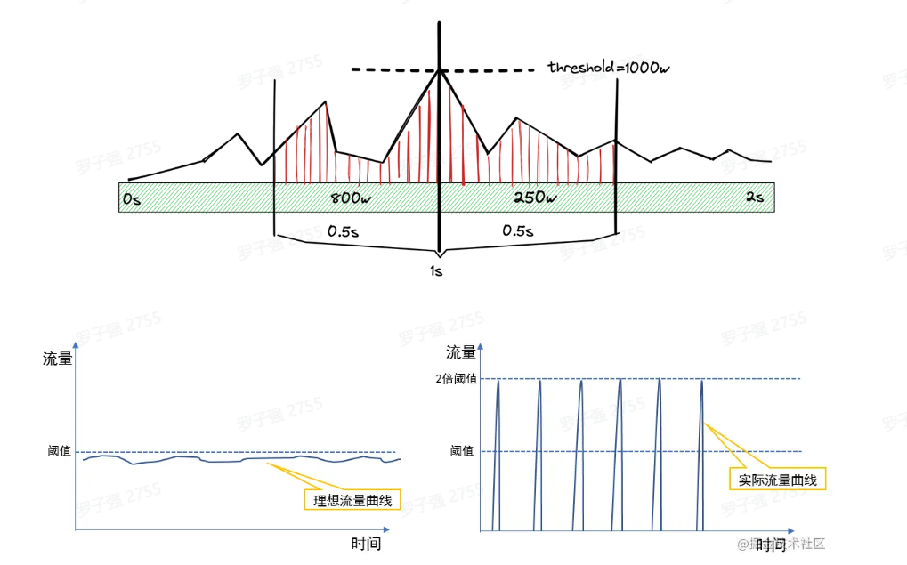
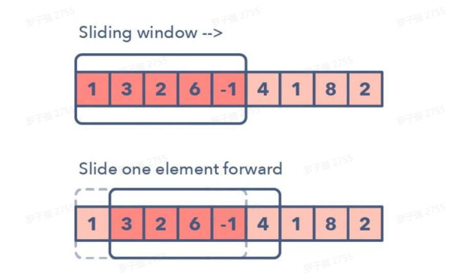
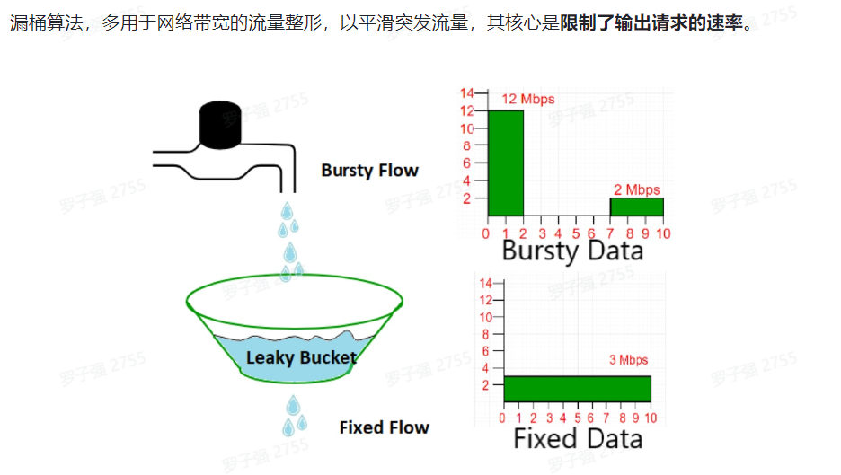
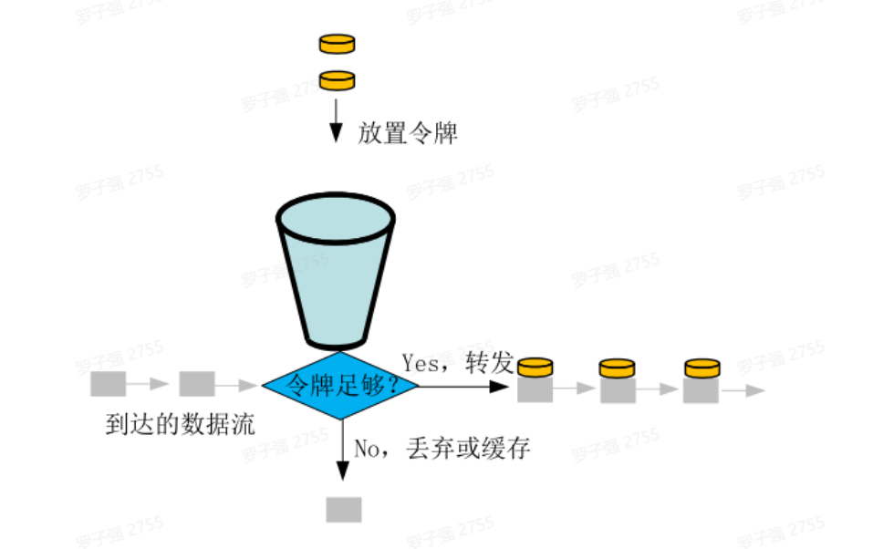
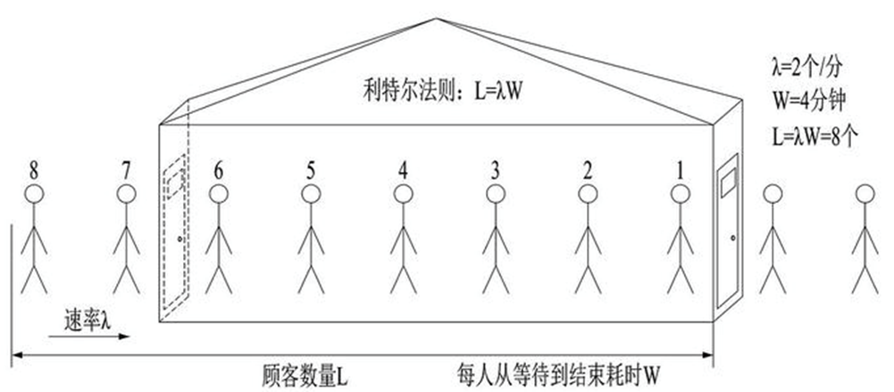
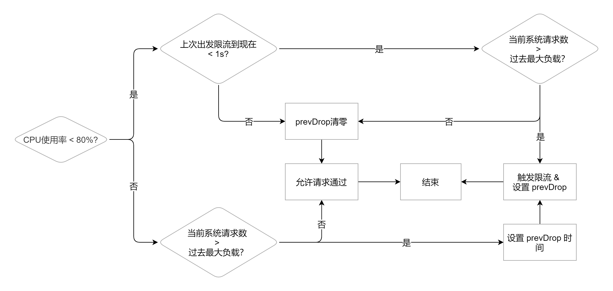

## 业务场景

现代互联网很多业务场景，比如秒杀、下单、查询商品详情，最大特点就是**高并发**，而往往我们的系统不能承受这么大的流量，继而产生了很多的应对措施：CDN、消息队列、多级缓存、异地多活。

但是无论如何优化，终究由硬件的物理特性决定了我们系统性能的上限，如果强行接收所有请求，往往造成雪崩。

这时候**限流熔断**就发挥作用了，限制请求数，快速失败，保证系统满负载又不超限。

> 极致的优化，就是将硬件使用率提高到100%，但永远不会超过100%


## 常用限流算法

### 固定窗口-计数器算法

```java
public class CounterLimiter {
    //初始时间
    private static long startTime = System.currentTimeMillis();
    //初始计数值
    private static final AtomicInteger ZERO = new AtomicInteger(0);
    //时间窗口限制
    private static final long interval = 10000;
    //限制通过请求
    private static int limit = 100;
    //请求计数
    private AtomicInteger requestCount = ZERO;
    //获取限流
    public boolean tryAcquire() {
        long now = System.currentTimeMillis();
        //在时间窗口内
        if (now < startTime + interval) {
            //判断是否超过最大请求
            if (requestCount.get() < limit) {
                requestCount.incrementAndGet();
                return true;
            }
            return false;
        } else {
            //超时重置
            startTime = now;
            requestCount = ZERO;
            return true;
        }
    }
}
```

qps的定义是1s内的请求数量，但是在1s中请求也可能是不均匀的，这就导致在1s中切换的边界丢失限流状态，如果在此时流量徒增就会导致服务雪崩。




**缺点：最糟糕的情况2倍的请求量才触发限流，误报率为50%**，业界要控制在10%左右。


### **滑动窗口-队列算法**

> [工业实现](https://github.com/RussellLuo/slidingwindow/blob/master/window.go)

确定一个起始时间点，一般就是系统启动的时间，并记录该点为时间窗口的开始点。然后创建一个空的列表作为时间窗口内请求进入的时间戳记录。

当请求到来时，使用当前时间戳比较它是否在时间窗口起始点加上T时间段（从开始点到开始点+T就是时间窗口）内。

如果在，则查看当前时间窗口内记录的所有请求的数量:

- 如果超过，则拒绝请求。
- 如果没有，则将该请求加入7到时间戳记录中，并将请求交给后端业务服务器。

 如果不在，则查看时间戳记录，将时间戳最久远的记录删除，然后将时间窗口的开始点更新为第二久远的记录时间，然后回到步骤2，再次检查时间戳是否在时间窗口内。



```go
func check() bool{
    if (startTime + T) > now && now > startTime {
        if heap.Size() > M{
            return false
        }
        heap.Push(now)
        return true
    }
    t := heap.Pop()
    startTime = heap.Top()
    return check()
}
```

**缺点：**

- 滑窗方法，需要额外的存储空间并且由于使用了优先级队列，性能受到影响，**单机百万请求下延迟会很高**。
- 滑动窗口是一种否决式限流，对于超出阈值的流量只能拒绝**很难做到削峰填谷**的作用。

### 漏桶算法

> [Leaky Bucket Wiki](https://en.wikipedia.org/wiki/Leaky_bucket)

> [工业实现](https://github.com/uber-go/ratelimit)

> [简单实现](https://lailin.xyz/post/go-training-week6-4-leaky-bucket.html)

漏桶算法，多用于网络带宽的流量整形，以平滑突发流量，其核心是**限制了输出请求的速率**。



```java
public class LeakyLimiter {
    //桶的容量
    private int capacity;
    //漏水速度
    private int ratePerMillSecond;
    //水量
    private double water;
    //上次漏水时间
    private long lastLeakTime;

    public LeakyLimiter(int capacity, int ratePerMillSecond) {
        this.capacity = capacity;
        this.ratePerMillSecond = ratePerMillSecond;
        this.water = 0;
    }

    //获取限流
    public boolean tryAcquire() {
        //执行漏水，更新剩余水量
        refresh();
        //尝试加水，水满则拒绝
        if (water + 1 > capacity) {
            return false;
        }
        water = water + 1;
        return true;

    }
    private void refresh() {
        //当前时间
        long currentTime = System.currentTimeMillis();
        if (currentTime > lastLeakTime) {
            //距上次漏水的时间间隔
            long millisSinceLastLeak = currentTime - lastLeakTime;
            long leaks = millisSinceLastLeak * ratePerMillSecond;
            //允许漏水
            if (leaks > 0) {
                //已经漏光
                if (water <= leaks) {
                    water = 0;
                } else {
                    water = water - leaks;
                }
                this.lastLeakTime = currentTime;
            }
        }
    }
}
```

漏桶算法中，出水的速率是恒定的，这就很难应对突发流量在某一毫秒，QPS可能极高超过剩余容量，大量请求被拒绝或自旋，但下一秒却又恢复。这就会导致1s内拒绝掉了更多的请求。

这里我们不难发现，我们有了一个**新的技术约束**: 

> **应对突发流量，尽可能的减少发生限流时被拒绝请求的比例。**

### 令牌桶算法

> [token bucket wiki](https://en.wikipedia.org/wiki/Token_bucket)

> [令牌桶与漏桶的区别](https://int64.me/2018/漏桶算法 && 令牌桶算法.html)



```java
public class TokenBucketLimiter {
    private long capacity;
    private long windowTimeInSeconds;
    long lastRefillTimeStamp;
    long refillCountPerSecond;
    long availableTokens;

    public TokenBucketLimiter(long capacity, long windowTimeInSeconds) {
        this.capacity = capacity;
        this.windowTimeInSeconds = windowTimeInSeconds;
        lastRefillTimeStamp = System.currentTimeMillis();
        refillCountPerSecond = capacity / windowTimeInSeconds;
        availableTokens = 0;
    }

    public long getAvailableTokens() {
        return this.availableTokens;
    }

    public boolean tryAcquire() {
        //更新令牌桶
        refill();
        if (availableTokens > 0) {
            --availableTokens;
            return true;
        } else {
            return false;
        }
    }


    private void refill() {
        long now = System.currentTimeMillis();
        if (now > lastRefillTimeStamp) {
            long elapsedTime = now - lastRefillTimeStamp;
            int tokensToBeAdded = (int) ((elapsedTime / 1000) * refillCountPerSecond);
            if (tokensToBeAdded > 0) {
                availableTokens = Math.min(capacity, availableTokens + tokensToBeAdded);
                lastRefillTimeStamp = now;
            }
        }
    }
}
```

这两种算法最大的一个问题就是他们都属于**需要提前设置阈值的算法**，基于 QPS 进行限流的时候最麻烦的就是这个阈值应该怎么设定。一般来说我们可以通过压测来决定这个阈值。

- 但是如果每个系统上线前都要经过很严格的压测，那么成本相对来说会比较大
- 并且我们很多时候压测都会在测试环境进行压测，测试环境一般来说和生产环境会有一定的差异，即使我们在生产环境做了压测，现在我们的应用都是以容器的形式跑在不同的宿主机上的，每台宿主机上的差异，以及不同的负载都会导致这个压测时的结果不一定就一定是正确的
- 当我们的机器型号、数量等发生改变时，之前压测的指标能不能用其实是一个问题，这些数据对于系统负载的影响其实不是线性的，举个例子之前一台机器，后面再加一台，负载就一定能到 2 倍么？其实是不一定的
- 如果需要修改限流的值，虽然之前我们将令牌桶的限流是可以动态调整，但是靠人去调整，如果真出现问题然后再叫运维或者是开发同学去调整可能黄花菜都凉了

**如何更小的降低对流量的折损?**

> 自适应限流器

> 对下游负载情况进行分析根据反馈指标调节令牌桶平均放入令牌的速率，来做到使用限流减少误限率

## 自适应限流

### 自适应限流怎么做

前面我们遇到的主要问题就是每个服务实例的限流阈值实际应该是动态变化的，我们应该根据系统能够承载的最大吞吐量，来进行限流，当当前的流量大于最大吞吐的时候就限制流量进入，反之则允许通过。那现在的问题就是

- **系统的吞吐量该如何计算？**
- **什么时候系统的吞吐量就是最大的吞吐量了？**

### 计算吞吐量：利特尔法则 L = λ * W

> 利特尔法则由麻省理工大学斯隆商学院（MIT Sloan School of Management）的教授 John Little﹐于 1961 年所提出与证明。它是一个有关提前期与在制品关系的简单数学公式，这一法则为精益生产的改善方向指明了道路。 —- [MBA 智库百科 (mbalib.com)](https://wiki.mbalib.com/wiki/利特尔法则)



如上图所示，如果我们开一个小店，平均每分钟进店 2 个客人(λ)，每位客人从等待到完成交易需要 4 分钟(W)，那我们店里能承载的客人数量就是 2 * 4 = 8 个人

同理，我们可以将 `λ` 当做 QPS， `W` 呢是每个请求需要花费的时间，那我们的系统的吞吐就是 `L = λ * W` ，所以我们可以使用利特尔法则来计算系统的吞吐量。

#### 什么时候系统的吞吐量就是最大的吞吐量？

首先我们可以通过统计过去一段时间的数据，获取到平均每秒的请求量，也就是 QPS，以及请求的耗时时间，为了避免出现前面 900ms 一个请求都没有最后 100ms 请求特别多的情况，我们可以使用滑动窗口算法来进行统计。

最容易想到的就是我们从系统启动开始，就把这些值给保存下来，然后计算一个吞吐的最大值，用这个来表示我们的最大吞吐量就可以了。但是这样存在一个问题是，我们很多系统其实都不是独占一台机器的，一个物理机上面往往有很多服务，并且一般还存在一些超卖，所以可能第一个小时最大处理能力是 100，但是这台节点上其他服务实例同时都在抢占资源的时候，这个处理能力最多就只能到 80 了

所以我们需要一个数据来做启发阈值，只要这个指标达到了阈值那我们就进入流控当中。常见的选择一般是 CPU、Memory、System Load，这里我们以 CPU 为例

只要我们的 CPU 负载超过 80% 的时候，获取过去 5s 的最大吞吐数据，然后再统计当前系统中的请求数量，只要当前系统中的请求数大于最大吞吐那么我们就丢弃这个请求。

## kratos 自适应限流分析

### 限流公式

```go
// PS: 官方文档这里写的是 cpu > 800 AND (Now - PrevDrop) < 1s
// 应该是写错了，等下看源码就知道了
(cpu > 800 OR (Now - PrevDrop) < 1s) AND (MaxPass * MinRt * windows / 1000) < InFlight
Copy
```

- `cpu > 800` 表示 CPU 负载大于 80% 进入限流

- `(Now - PrevDrop) < 1s` 这个表示只要触发过 1 次限流，那么 1s 内都会去做限流的判定，这是为了避免反复出现限流恢复导致请求时间和系统负载产生大量毛刺

- ```go
  (MaxPass * MinRt * windows / 1000) < InFlight
  ```

   判断当前负载是否大于最大负载

  - `InFlight` 表示当前系统中有多少请求
  - `(MaxPass * MinRt * windows / 1000)` 表示过去一段时间的最大负载
  - `MaxPass` 表示最近 5s 内，单个采样窗口中最大的请求数
  - `MinRt` 表示最近 5s 内，单个采样窗口中最小的响应时间
  - `windows` 表示一秒内采样窗口的数量，默认配置中是 5s 50 个采样，那么 windows 的值为 10。

### 源码分析

#### BBR 结构体

```go
type BBR struct {
	cpu             cpuGetter
    // 请求数，和响应时间的采样数据，使用滑动窗口进行统计
	passStat        metric.RollingCounter
	rtStat          metric.RollingCounter

    // 当前系统中的请求数
	inFlight        int64
	// 每秒钟内的采样数量，默认是10
    winBucketPerSec int64
    // 单个 bucket 的时间
	bucketDuration  time.Duration
	// 窗口数量
    winSize         int
	// 配置
    conf            *Config
	prevDrop        atomic.Value
    // 表示最近 5s 内，单个采样窗口中最大的请求数的缓存数据
	maxPASSCache    atomic.Value
    // 表示最近 5s 内，单个采样窗口中最小的响应时间的缓存数据
	minRtCache      atomic.Value
}
```

#### Allow: 判断请求是否允许通过

```go
func (l *BBR) Allow(ctx context.Context, opts ...limit.AllowOption) (func(info limit.DoneInfo), error) {
	// ... 省略配置修改代码

    if l.shouldDrop() {
		return nil, ecode.LimitExceed
	}

	atomic.AddInt64(&l.inFlight, 1)
	stime := time.Since(initTime)

	return func(do limit.DoneInfo) {
		rt := int64((time.Since(initTime) - stime) / time.Millisecond)
		l.rtStat.Add(rt)
		atomic.AddInt64(&l.inFlight, -1)
		switch do.Op {
		case limit.Success:
			l.passStat.Add(1)
			return
		default:
			return
		}
	}, nil
}
```

- 这个方法主要是给中间件使用的

  - 首先使用 `shouldDrop` 方法判断这个请求是否应该丢弃
  - 如果成功放行，那么当前系统中的请求数就 +1
  - 然后返回一个`function`用于请求结束之后
    - 统计请求的响应时间
    - 如果请求成功了，给成功的请求数 +1
    - 并且当前系统中的请求数量 `Inflight` -1

  

#### shouldDrop: 判断请求是否应该被丢弃

```go
func (l *BBR) shouldDrop() bool {
	if l.cpu() < l.conf.CPUThreshold {
		prevDrop, _ := l.prevDrop.Load().(time.Duration)
		if prevDrop == 0 {
			return false
		}
		if time.Since(initTime)-prevDrop <= time.Second {
			inFlight := atomic.LoadInt64(&l.inFlight)
			return inFlight > 1 && inFlight > l.maxFlight()
		}
		l.prevDrop.Store(time.Duration(0))
		return false
	}
	inFlight := atomic.LoadInt64(&l.inFlight)
	drop := inFlight > 1 && inFlight > l.maxFlight()
	if drop {
		prevDrop, _ := l.prevDrop.Load().(time.Duration)
		if prevDrop != 0 {
			return drop
		}
		l.prevDrop.Store(time.Since(initTime))
	}
	return drop
}
```

这个方法其实就是开头讲到的限流公式了，逻辑如下图所示



- 首先看 CPU 的使用率是否达到了阈值
- 如果没到，则回去判断一下上次触发限流到现在是否在一秒以内
  - 如果在一秒内，就判断当前负载是否超过限制，如果超过了就需要丢弃
  - 如果不在 1s 内或者是请求数量已经降下来了，那么就吧 `prevDrop` 清零然后返回 false
- 如果到了，则判断一下当前负载是否超过限制
  - 如果超过了，则设置丢弃时间 `prevDrop`，返回 true 需要丢弃请求
  - 如果没超过直接返回 false

#### maxFlight: 系统的最大负载

```go
func (l *BBR) maxFlight() int64 {
	return int64(math.Floor(float64(l.maxPASS()*l.minRT()*l.winBucketPerSec)/1000.0 + 0.5))
}
```

这个就是计算过去一段时间系统的最大负载是多少


### 总结

上述我们讲了一下常用的限流算法，以及详细了解为什么需要自适应限流，令牌桶和漏桶这类需要手动设置 rps 算法的问题所在，了解了自适应限流的实现原理，最后看了一下 kratos 当中是如何实现自适应限流的。但是由于篇幅关系，CPU 的数据如何进行统计，文章中提到了很多次的滑动窗口是个什么原理这些知识点大家可以自行查看 kratos 中的源码，或者去看极客时间的 Go 进阶训练营都有讲到。

kratos 中的限流算法其实灵感源于 Google SRE，实现上参考了 sentinel，其中一个有意思的点是 sentinel 默认使用 load 作为启发阈值，而 kratos 使用了 cpu，kratos 为什么要使用 cpu 呢？这个大家可以自己想想（答案可以自行观看极客时间的 Go 进阶训练营）

而 sentinel 的实现其实是参考了 TCP 中的 BBR 算法，在 BBR 的基础上加上了 load 作为启发阈值的判断，所以多了解一下基础知识总是没错的，指不定当下遇到的场景就能解决。


## 限流方案

### 一、容器限流

#### 1. Tomcat

tomcat能够配置连接器的最大线程数属性，该属性`maxThreads`是Tomcat的最大线程数，当请求的并发大于`maxThreads`时，请求就会排队执行(**排队数设置：accept-count**)，这样就完成了限流的目的。

```java
<Connector port="8080" protocol="HTTP/1.1"
          connectionTimeout="20000"
          maxThreads="150"
          redirectPort="8443" />
```

#### 2. Nginx

Nginx 提供了两种限流手段：一是控制速率，二是控制并发连接数。

- **控制速率**

  我们需要使用 `limit_req_zone`配置来限制单位时间内的请求数，即速率限制，示例配置如下：

```nginx
limit_req_zone $binary_remote_addr zone=mylimit:10m rate=2r/s;
```

第一个参数：$binary_remote_addr 表示通过remote_addr这个标识来做限制，“binary_”的目的是缩写内存占用量，是限制同一客户端ip地址。

第二个参数：zone=mylimit:10m表示生成一个大小为10M，名字为one的内存区域，用来存储访问的频次信息。

第三个参数：rate=2r/s表示允许相同标识的客户端的访问频次，这里限制的是每秒2次，还可以有比如30r/m的。

- **并发连接数**

  利用 `limit_conn_zone` 和 `limit_conn` 两个指令即可控制并发数，示例配置如下

```nginx
limit_conn_zone $binary_remote_addr zone=perip:10m;
limit_conn_zone $server_name zone=perserver:10m;
server {   
    ...
    limit_conn perip 10; # 限制同一个客户端ip
    limit_conn perserver 100;
}
```

**只有当 request header 被后端处理后，这个连接才进行计数**

### 二、服务端限流

#### 1. Semaphore

JUC包中提供的**信号量**工具，它的内部维护了一个同步队列，我们可以在每个请求进来的时候，尝试获取信号量，获取不到可以阻塞或者快速失败

简单样例：

```java
Semaphore sp = new Semaphore(3);
sp.require(); // 阻塞获取
System.out.println("执行业务逻辑");
sp.release();
```

#### 2. RateLimiter

Guava中基于令牌桶实现的一个限流工具，使用非常简单，通过方法`create()`创建一个桶，然后通过`acquire()`或者`tryAcquire()`获取令牌：

```java
RateLimiter rateLimiter = RateLimiter.create(5); // 初始化令牌桶，每秒往桶里存放5个令牌
rateLimiter.acquire(); // 自旋阻塞获取令牌，返回阻塞的时间，单位为秒
rateLimiter.tryAcquire(); // 获取令牌，返回布尔结果，超过超时时间（默认为0，单位为毫秒）则返回失败
```

RateLimiter在实现时，允许暴增请求的突发情况存在。

举个例子，我们有一个速率为每秒5个令牌的RateLimiter：

当令牌桶空了的时候，如果继续获取一个令牌，那么会在下一次补充令牌的时候返回结果

但如果直接获取5个令牌，并不是等待桶内补齐5个令牌后再返回，而是仍旧会在令牌桶补充下一个令牌的时候直接返回，而预支令牌所需的补充时间会在下一次请求时进行补偿

```java
public void testSmoothBursty() {
    RateLimiter r = RateLimiter.create(5);
    for (int i = 0; i < 2; i++) {       
        System.out.println("get 5 tokens: " + r.acquire(5) + "s");
        System.out.println("get 1 tokens: " + r.acquire(1) + "s");
        System.out.println("get 1 tokens: " + r.acquire(1) + "s");
        System.out.println("get 1 tokens: " + r.acquire(1) + "s");
        System.out.println("end");
    }
}

/**
* 控制台输出
* get 5 tokens: 0.0s	  初始化时桶是空的，直接从空桶获取5个令牌
* get 1 tokens: 0.998068s 滞后效应，需要替前一个请求进行等待
* get 1 tokens: 0.196288s
* get 1 tokens: 0.200394s
* end
* get 5 tokens: 0.195756s
* get 1 tokens: 0.995625s 滞后效应，需要替前一个请求进行等待
* get 1 tokens: 0.194603s
* get 1 tokens: 0.196866s
* end
*/
```

#### 3.Hystrix

Netflix开源的熔断组件，支持两种资源隔离策略：THREAD（默认）或者SEMAPHORE

- 线程池：每个command运行在一个线程中，限流是通过线程池的大小来控制的

- 信号量：command是运行在调用线程中，但是通过信号量的容量来进行限流

线程池策略对每一个资源创建一个线程池以进行流量管控，优点是资源隔离彻底，缺点是容易造成资源碎片化。

使用样例：

```java
// HelloWorldHystrixCommand要使用Hystrix功能 
public class HelloWorldHystrixCommand extends HystrixCommand {  
    private final String name; 
    public HelloWorldHystrixCommand(String name) {   
        super(HystrixCommandGroupKey.Factory.asKey("ExampleGroup"));     
        this.name = name; 
    } 
    // 如果继承的是HystrixObservableCommand，要重写Observable construct() 
    @Override 
    protected String run() {     
        return "Hello " + name; 
    } 
} 
```

调用该command：

```java
String result = new HelloWorldHystrixCommand("HLX").execute();
System.out.println(result);  // 打印出Hello HLX 
```

**Hystrix已经在2018年停止开发，官方推荐替代项目[\**Resilience4j\**](https://resilience4j.readme.io/)**

更多使用介绍可查看：[Hystrix熔断器的使用](https://blog.csdn.net/hystrix)

#### 4.Sentinel

阿里开源的限流熔断组件，底层统计采用滑动窗口算法，限流方面有两种使用方式：API调用和注解，内部采插槽链来统计和执行校验规则。

通过为方法增加注解@SentinelResource(String name)或者手动调用SphU.entry(String name)方法开启流控。
**使用API手动调用流控示例：**

### 三、分布式下限流方案

线上环境下，如果对共用资源（如数据库、下游服务）做统一流量限制，那么单机限流显然不能满足，而需要分布式流控方案。

分布式限流主要采取中心系统流量管控的方案，由一个中心系统统一管控流量配额。

**这种方案的缺点就是中心系统的可靠性，所以一般需要备用方案，在中心系统不可用时，退化为单机流控。**
