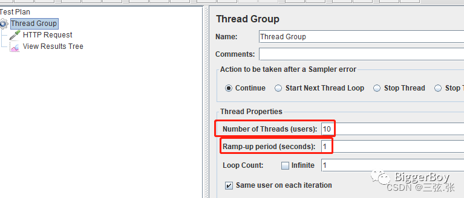
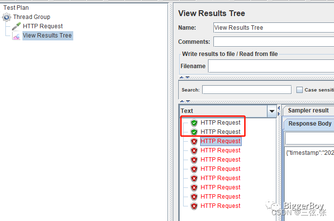

这篇文章介绍Redis+Lua实现分布式限流，虽然 Redis 官方没有直接提供限流相应的API，但却支持了 Lua 脚本的功能，可以使用它实现复杂的令牌桶或漏桶算法，也是分布式系统中实现限流的主要方式之一。

Redis 理论上单机最大QPS是10w, 执行incrby操作不怎么耗费内存和CPU，瓶颈在于IO并发度。**可以利用Group 机制使用hash 分区将**` key-{id}`**，散列到多个redis集群上。** incr 和 get/设置过期 等操作并不是原子的，高并发情况下会导致限流失效，**这可以使用lua脚本。**redis给key一个随机后缀，分区incr多个key，不同的server访问不同的redis master。


## 实战

首先创建一个springboot项目，在pom.xml中引入依赖：

```xml
<dependency>
    <groupId>org.springframework.boot</groupId>
    <artifactId>spring-boot-starter-data-redis</artifactId>
</dependency>
<dependency>
    <groupId>redis.clients</groupId>
    <artifactId>jedis</artifactId>
</dependency>
<dependency>
    <groupId>com.google.guava</groupId>
    <artifactId>guava</artifactId>
    <version>21.0</version>
</dependency>
<dependency>
    <groupId>org.springframework.boot</groupId>
    <artifactId>spring-boot-starter-aop</artifactId>
</dependency>
<dependency>
    <groupId>org.apache.commons</groupId>
    <artifactId>commons-lang3</artifactId>
    <version>3.9</version>
</dependency>
<dependency>
    <groupId>org.projectlombok</groupId>
    <artifactId>lombok</artifactId>
    <optional>true</optional>
</dependency>
```

## 配置RedisTemplate

首先application.properties配置Redis连接信息

```properties
spring.redis.host=127.0.0.1
spring.redis.port=6379
spring.redis.database=0
```

然后通过@Bean配置RedisTemplate

```java
import org.springframework.context.annotation.Bean;
import org.springframework.context.annotation.Configuration;
import org.springframework.data.redis.connection.RedisConnectionFactory;
import org.springframework.data.redis.connection.jedis.JedisConnectionFactory;
import org.springframework.data.redis.core.RedisTemplate;
import org.springframework.data.redis.serializer.GenericJackson2JsonRedisSerializer;
import org.springframework.data.redis.serializer.StringRedisSerializer;

import java.io.Serializable;

/**
 * redis配置类.
 */
@Configuration
public class RedisConfig {
    @Bean
    JedisConnectionFactory jedisConnectionFactory() {
        return new JedisConnectionFactory();
    }

    @Bean
    public RedisTemplate<String, Serializable> limitRedisTemplate(RedisConnectionFactory redisConnectionFactory) {
        RedisTemplate<String, Serializable> template = new RedisTemplate<>();
        template.setKeySerializer(new StringRedisSerializer());
        template.setValueSerializer(new GenericJackson2JsonRedisSerializer());
        template.setConnectionFactory(redisConnectionFactory);
        return template;
    }
}
```

## 创建自定义注解

然后我们创建自定义注解：

```java
import com.biggerboy.redislimiter.enums.LimitType;
import java.lang.annotation.*;

/**
 * redis限流注解.
 */
@Target({ElementType.METHOD, ElementType.TYPE})
@Retention(RetentionPolicy.RUNTIME)
@Inherited
@Documented
public @interface MyRedisLimiter {
    /**
     * 缓存到Redis的key
     */
    String key();
    /**
     * Key的前缀
     */
    String prefix() default "limiter:";
    /**
     * 给定的时间范围 单位(秒)
     * 默认1秒 即1秒内超过count次的请求将会被限流
     */
    int period() default 1;
    /**
     * 一定时间内最多访问的次数
     */
    int count();
    /**
     * 限流的维度(用户自定义key 或者 调用方ip)
     */
    LimitType limitType() default LimitType.CUSTOMER;
}
```

## 创建切面类RedisLimitAspect

大致逻辑是获取方法上的注解MyRedisLimiter，从注解上获取配置信息，组装keys和参数，然后调用RedisTemplate的execute方法获取当前时间内请求数，小于等于limitCount则不限流，否则限流降级处理。

```java
/**
 * @param pjp
 */
@Around("execution(public * *(..)) && @annotation(com.wenbei.annotation.MyRedisLimiter)")
public Object limit(ProceedingJoinPoint pjp) {
    MethodSignature signature = (MethodSignature) pjp.getSignature();
    Method method = signature.getMethod();
    MyRedisLimiter limitAnnotation = method.getAnnotation(MyRedisLimiter.class);
    LimitType limitType = limitAnnotation.limitType();
    int limitPeriod = limitAnnotation.period();
    int limitCount = limitAnnotation.count();

    String key = getKey(limitAnnotation, limitType);
    ImmutableList<String> keys = ImmutableList.of(StringUtils.join(limitAnnotation.prefix(), key));
    try {
        Number count = limitRedisTemplate.execute(redisScript, keys, limitCount, limitPeriod);
        logger.info("try to access, this time count is {} for key: {}", count, key);
        if (count != null && count.intValue() <= limitCount) {
            return pjp.proceed();
        } else {
            demote();//降级
            return null;
        }
    } catch (Throwable e) {
        if (e instanceof RuntimeException) {
            throw new RuntimeException(e.getLocalizedMessage());
        }
        throw new RuntimeException("服务器出现异常，请稍后再试");
    }
}
```

到这里，最关键的Lua是如何使用的还没讲到。我们可以看到上述代码调用limitRedisTemplate.execute参数的第一个是redisScript，这便是Redis用于执行Lua脚本的重要支持。

## 加载Lua脚本

在切面类中，我们可以通过初始化加载Lua脚本，如下new

```java
private static final String LIMIT_LUA_PATH = "limit.lua";
private DefaultRedisScript<Number> redisScript;
@PostConstruct
public void init() {
    redisScript = new DefaultRedisScript<>();
    redisScript.setResultType(Number.class);
    ClassPathResource classPathResource = new ClassPathResource(LIMIT_LUA_PATH);
    try {
        classPathResource.getInputStream();//探测资源是否存在
        redisScript.setScriptSource(new ResourceScriptSource(classPathResource));
    } catch (IOException e) {
        logger.error("未找到文件：{}", LIMIT_LUA_PATH);
    }
}
```

我们传入常量limit.lua，这是classpath下创建的脚本文件，Lua脚本如下，也很简单，就不在赘述。通常应该在limit.lua文件中放置脚本文件，这样如果需要修改脚本，仅需要修改文件重启即可。

```java
local count
count = redis.call('get',KEYS[1])
--不超过最大值，则直接返回
if count and tonumber(count) > tonumber(ARGV[1]) then
    return count;
end
    --执行计算器自加
    count = redis.call('incr',KEYS[1])
if tonumber(count) == 1 then
    --从第一次调用开始限流，设置对应key的过期时间
    redis.call('expire',KEYS[1],ARGV[2])
end
return count;
```

## 降级

然后在降级方法中写我们的降级逻辑，通过抛异常或往HttpServletResponse写入返回信息都可以。

```java
/**
 * 降级策略
 */
private void demote() {
    logger.info("try to access fail, this request will be demoted");
    //throw new RuntimeException("限流了");
    response.setHeader("Content-Type", "text/html;charset=UTF8");
    PrintWriter writer = null;
    try {
        writer = response.getWriter();
        writer.println("访问失败，请稍后再试...");
        writer.flush();
    } catch (Exception e) {
        e.printStackTrace();
    } finally {
        if (writer != null) {
            writer.close();
        }
    }
}
```

## 接口限流

好了，准备工作都ok了，下面我们在controller接口上加上注解，测试一下。

```java
/** * 测试限流controller
 */
@RestController
public class TestLimiterController {

    @MyRedisLimiter(key = "limitTest", count = 2)
    @RequestMapping(value = "/limitTest")
    public Long limitTest() {
        System.out.println("limitTest");
        return 1L;
    }


    @MyRedisLimiter(key = "customer_limit_test", period = 10, count = 3, limitType = LimitType.CUSTOMER)
    @GetMapping("/limitTest2")
    public Integer testLimiter2() {
        System.out.println("limitTest2");
        return 1;
    }


    @MyRedisLimiter(key = "ip_limit_test", period = 10, count = 3, limitType = LimitType.IP)
    @GetMapping("/limitTest3")
    public Integer testLimiter3() {
        System.out.println("limitTest3");
        return 3;
    }
}
```

## 测试

接口限制每秒2个请求，我们使用jmeter1秒发10个请求



结果只有前两个成功了（上述降级采用的直接抛异常，方便在这里看到限流时下面时红色的）



## 总结

以上 springboot + aop + Lua 限流实现是比较简单的，旨在让大家认识下什么是限流？如何做一个简单的限流功能，面试要知道这是个什么东西。上面虽然说了几种实现限流的方案，但选哪种还要结合具体的业务场景，不能为了用而用。在真正的场景里，不止设置一种限流规则，而是会设置多个限流规则共同作用，如连接数、访问频率、黑白名单、传输速率等。
