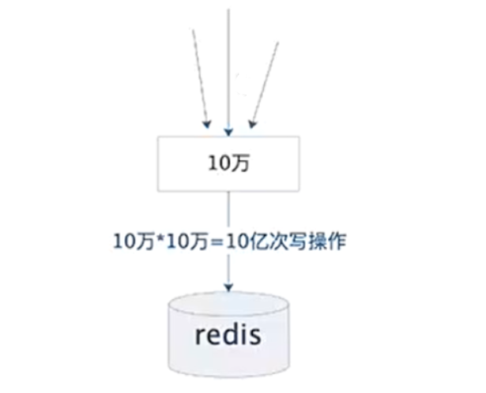
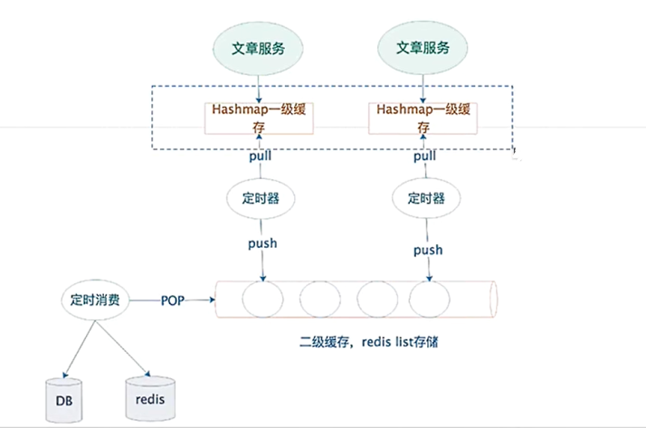

> 高并发微信文章的阅读量：在一些需要统计 PV(Page View), 即页面浏览量或点击量高并发系统中，如：知乎文章浏览量，淘宝商品页浏览量等，需要统计相应数据做分析。假设微信公众号每天要统计 10 万篇文章，每篇文章的访问量 10 万，如果采用 Redis 的 incr命令来实现计数器的话，每天 Redis=100 亿次的写操作，按照每天高峰 12 小时来算，那么 Redis 大约 **QPS=57万**。


## 业务场景分析
<div align=center>

</div>
假设微信每天有10万篇文章，每篇文章的访问量10万
如果采用redis的incr命令来实现计数器的话，每天redis=10亿次的写操作，1天高峰12小时算的话，redis大约QPS=57万。
如此大的并发量，CPU单核必定100%，**此种技术方案是行不通的**


## 二级缓存

<div align=center>

</div>

如此大的并发量，唯一出路就是减少redis的访问量;那如何减少redis的访问量?上图的设计了二级缓存和2个定时器。

**1.文章服务采用了集群部署，在线上可以部署N台**

**2.每个文章服务，增加了一级JVM缓存，即用Map存储在jvm**

```java
Map<Long,Map<Integer,Integer>> =Map<时间块，Map<文章ld,访问量>>
```


> 什么是时间块?
> 就是把时间切割为一块块，例如︰一般文章在1小时，30分钟、5分钟的时间内产生了多少阅读量。
> 那如何切割时间块呢?如何把当前的时间切入时间块中?

> 例如,我们要计算"小时块"，先把当前的时间转换为为毫秒的时间戳，然后除以一个小时，即当前时间T/1000 * 60 * 60=小时key，然后用这个小时序号作为key。
> 例如:

```
2020-01-12 15:30:00=1578814200000毫秒转换小时key=1578814200000/1000 * 60 * 60=438560
2020-01-12 15:59:00=1578815940000毫秒转换小时key=1578815940000/1000 * 60 * 60=438560
2020-01-12 16:30:00=1578817800000毫秒转换小时key=1578817800000/1000 * 60 * 60=438561
```

> 剩下的以此类推
>
> 每一次PV操作时，先计算当前时间是那个时间块，然后存储Map中。

```
Map<时间块,Map<文章ld,访问量>>
=Map<2020-01-12 15:30:00到15:59:00，Map<文章ld,访问量>>
=Map<438560，Map<文章ld,访问量>>
```


**3.一级缓存定时器消费**

定时器，定时（5分钟）从jvm的map把时间块的阅读PV取出来，然后push到reids的list数据结构中，list的存储为`Map<文章id，访问量PV>`即每个时间块的pv数据


**4.二级缓存定时器消费**

定时器，定时〈6分钟)，从redis的list数据结构pop弹出`Map<文章id，访问量PV>`，弹出来做了2件事:

> 第一件事:先把Map<文章id，访问量PV>，保存到数据库
>
> 第二件事:再把Map<文章id，访问量PV>，同步到redis缓存的计数器incr。


以上4个步骤:**用了一级缓存，所有的高并发流量都收集到了本地JVM，然后5分钟同步给二级缓存，从而给redis降压**。


## 案例实战

### 步骤1：模拟大量PV请求

```java
@Service
@Slf4j
public class InitPVTask {
    @Autowired
    private RedisTemplate redisTemplate;

    @PostConstruct
    public void initPV(){
        log.info("启动模拟大量PV请求定时器..... .. :." );
        new Thread( ( )->runArticlePV 0).start();
    }
    /**
     *模拟大量PV请求
     */
    public void runArticlePv( ) {
        while (true){
            this.batchAddArticle( );
            try {
                //5秒执行一次
                Thread.sleep( millis: 5000);
            }catch (InterruptedException e) {
                e.printStackTrace( );
            }
        }
    }
}
```

### 步骤2：一级缓存定时器消费

```java
@Service
@Slf4j
public class OneCacheTask i
        @Autowired
        private RedisTemplate redisTemplate;

        @PostConstruct
        public void cacheTask() {
            log.info("启动定时器:一级缓存消费...:.... ..");
            new Thread(() -> runCache()).start();
        }

        /**
         * 一级缓存定时器消费
         * 定时器，定时(5分钟)从jvm的map把时间块的阅读pv取出来,
         * 然后push到reids的list数据结构中，list的存储的书为Map<文章id，访问量PV>即每个时间块的pv数据
         */
        public void runcache() {
            while (true) {
                this.consumepv();
                try {
                    //间隔1.5分钟执行一遍
                    Thread.sleep(millis:90000);
                } catch (InterruptedException e) {
                    e.printStackTrace();
                }
                log.info("消费一级缓存，定时刷新.... . . . ... . . ..");
            }
        }

        public void consumePV() {
            //为了方便测试改为1分钟时间块
            long m1 = System.currentTimeMillis() / (1000 * 60 * 1);
            Iterator<Long> iterator = Constants.PV_MAP.keySet().iterator();
            while (iterator.hasNext()) {
                //取出map的时间块
                Long key = iterator.next();//小于当前的分钟时间块key ,就消费
                if (key < m1) {
                    //先push
                    Map<Integer, Integer> map = constants.PV_MAP.get(key);
                    // push到reids的list数据结构中，list的存储的书为Map<文章id，访问量PV>即每个时间块的pv数据
                    this.redisTemplate.opsForList().leftPush(Constants.CACHE_PV_LIST, map);
                    //后remove
                    Constants.Pv_PAP.remove(key);
                    log.info("push进{", map);
                }
            }
        }
}

```

### 步骤3：二级缓存定时器消费

```java
@Service
@slf4j
public class TwoCacheTask {
  @Autowired
  private RedisTemplate redisTemplate;

  @PostConstruct
  public void cacheTask() {
    log.info("启动定时器:二级缓存消费...:.. ....");
    new Thread(() -> runCache()).start();
  }

  // 二级缓存定时器消费
  // 定时器，定时(6分钟)，从redis的list数据结构pop弹出Map<文章id，访问量PV>，弹出来做了2件事:
  // 第一件事:先把Map<文章id，访问量PV>，保存到数据库
  // 第二件事:再把Map<文章id，访问量PV>，同步到redis缓存的计数器incr。
  public void runCache() {
    while (true){
      while ( this.pop()){
        try {
          //间隔2分钟执行一遍
          Thread.sleep(1000*60*2);
        }catch (InterruptedException e) {
          e.printStackTrace( );
        }
        log.info("消费二级缓存，定时刷新... . .. . .. . . ...");
      }
    }
  }

  public boolean pop(){
    //从redis的list数据结构pop弹出Map<文章id，访问量PV>
    Listoperations<String,Map<Integer,Integer>> operations= this.redisTemplate.opsForList();
    Map<Integer,Integer> map= operations.rightPop(Constants.CACHE_PV_LIST);
    log.info("弹出pop=0",map ) ;
    if(coilectionUtils.isEmpty(map)){
      return false;
    }
    //第一步:先存入数据库 
    // ToDo:插入数据库
    //第二步:同步redis缓存
    for (Map.Entry<Integer,Integer> entry:map.entrySet( )){
      String key=constants.CACHE_ARICLE+entry.getKey( );
      //调用redis的increment命令
      long n=this.redisTemplate.opsForValue().increment( key,entry.getValue());
    }
    return true;
}
```

### 步骤4：查看浏览量

```java
@RestController
@slf4j
public class viewController {
  @Autowired
  private StringRedisTemplate stringRedisTemplate;

  @GetMapping(value = " /view")
  public String view(Integer id) {
    String key = Constants.CACHE_ARTICLE + id;// 调用redis的increment命令
    string n = this.stringRedisTemplate.opsForValue().get(key);
    log.info("key=f,阅读量为{(", key, n);
    return n;
  }
}
```


## 总结

当我们把数据缓存到本地内存中之后，就极大的减少了对于 Redis 的访问。

但是我们还是得把数据同步到 Redis 里面去，因为访问文章数据的时候还是得从 Redis 中获取数据。

其中一级缓存定时器的逻辑是这样的：假设每 5 分钟（可以根据需求调整）从 JVM 的 Map 里面把时间块的阅读 PV 读取出来，然后 push 到 Redis 的 list 数据结构中。

list 存储的数据为 Map<文章Id，访问量PV>，即每个时间块的 PV 数据。

另外一个二级缓存定时器的逻辑是这样的：每 6 分钟（需要比一级缓存的时间长），从 Redis 的 list 数据结构中 pop 出数据，即Map<文章Id，访问量PV>。

然后把对应的数据同步到 DB 和 Redis 中。

这个方案就是一种**合并提交的理念**。
