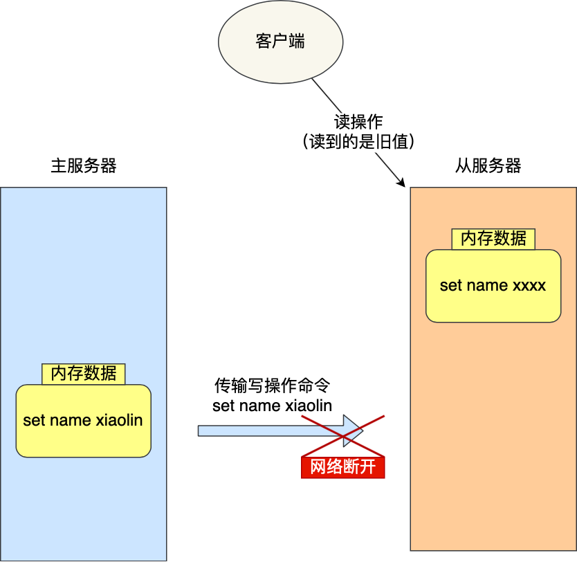
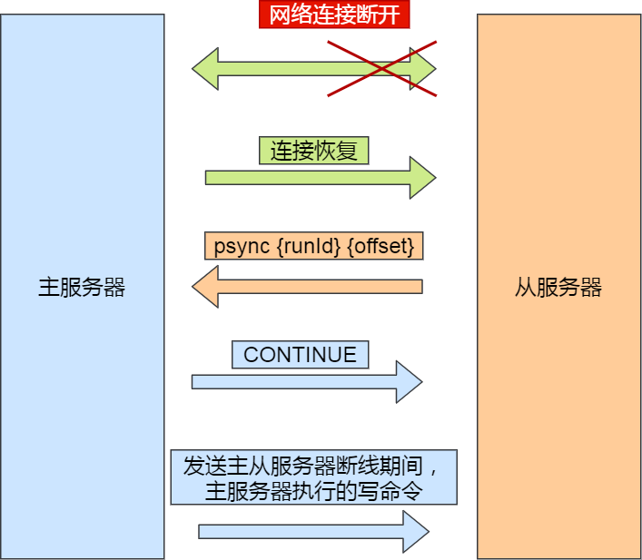
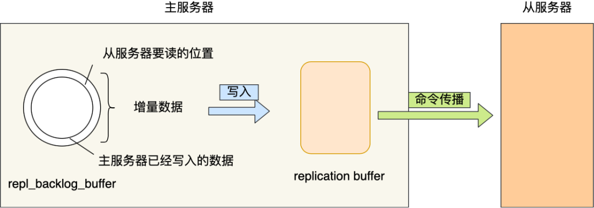

## 单点故障问题？

> AOF 和 RDB，这两个持久化技术保证了即使在服务器重启的情况下也不会丢失数据（或少量损失）。

不过，由于数据都是存储在一台服务器上，如果出事就完犊子了，比如：

- 如果服务器发生了宕机，由于数据恢复是需要点时间，那么这个期间是无法服务新的请求的；
- 如果这台服务器的硬盘出现了故障，可能数据就都丢失了。

要避免这种单点故障，最好的办法是将数据备份到其他服务器上，让这些服务器也可以对外提供服务，这样即使有一台服务器出现了故障，其他服务器依然可以继续提供服务。


多台服务器要保存同一份数据，这里问题就来了。

这些服务器之间的数据如何保持一致性呢？数据的读写操作是否每台服务器都可以处理？


## 主从复制模式

Redis 提供了**主从复制模式**，来避免上述的问题。

这个模式可以保证多台服务器的数据一致性，且主从服务器之间采用的是「读写分离」的方式。

主服务器可以进行读写操作，当发生写操作时自动将写操作同步给从服务器，而从服务器一般是只读，并接受主服务器同步过来写操作命令，然后执行这条命令。


也就是说，所有的数据修改只在主服务器上进行，然后将最新的数据同步给从服务器，这样就使得主从服务器的数据是一致的。

同步这两个字说的简单，但是这个同步过程并没有想象中那么简单，要考虑的事情不是一两个。

我们先来看看，主从服务器间的第一次同步是如何工作的？


### 第一次同步

多台服务器之间要通过什么方式来确定谁是主服务器，或者谁是从服务器呢？

我们可以使用 `replicaof`（Redis 5.0 之前使用 slaveof）命令形成主服务器和从服务器的关系。

比如，现在有服务器 A 和 服务器 B，我们在服务器 B 上执行下面这条命令：

```bash
# 服务器 B 执行这条命令
replicaof <服务器 A 的 IP 地址> <服务器 A 的 Redis 端口号>
```

接着，服务器 B 就会变成服务器 A 的「从服务器」，然后与主服务器进行第一次同步。

主从服务器间的第一次同步的过程可分为三个阶段：

- 第一阶段是建立链接、协商同步；
- 第二阶段是主服务器同步数据给从服务器；
- 第三阶段是主服务器发送新写操作命令给从服务器。

为了让你更清楚了解这三个阶段，我画了一张图。


接下来，我在具体介绍每一个阶段都做了什么。

#### *第一阶段：建立链接、协商同步*

执行了 replicaof 命令后，从服务器就会给主服务器发送 `psync` 命令，表示要进行数据同步。

psync 命令包含两个参数，分别是**主服务器的 runID** 和**复制进度 offset**。

- runID，每个 Redis 服务器在启动时都会自动生产一个随机的 ID 来唯一标识自己。当从服务器和主服务器第一次同步时，因为不知道主服务器的 run ID，所以将其设置为 "?"。
- offset，表示复制的进度，第一次同步时，其值为 -1。

主服务器收到 psync 命令后，会用 `FULLRESYNC` 作为响应命令返回给对方。

并且这个响应命令会带上两个参数：主服务器的 runID 和主服务器目前的复制进度 offset。从服务器收到响应后，会记录这两个值。

FULLRESYNC 响应命令的意图是采用**全量复制**的方式，也就是主服务器会把所有的数据都同步给从服务器。

所以，第一阶段的工作时为了全量复制做准备。

那具体怎么全量同步呀呢？我们可以往下看第二阶段。

#### *第二阶段：主服务器同步数据给从服务器*

接着，主服务器会执行 bgsave 命令来生成 RDB 文件，然后把文件发送给从服务器。

从服务器收到 RDB 文件后，会先清空当前的数据，然后载入 RDB 文件。

这里有一点要注意，主服务器生成 RDB 这个过程是不会阻塞主线程的，也就是说 Redis 依然可以正常处理命令。

但是这期间的写操作命令并没有记录到刚刚生成的 RDB 文件中，这时主从服务器间的数据就不一致了。

那么为了保证主从服务器的数据一致性，**主服务器会将在 RDB 文件生成后收到的写操作命令，写入到 replication buffer 缓冲区里。**

#### *第三阶段：主服务器发送新写操作命令给从服务器*

在主服务器生成的 RDB 文件发送后，然后将 replication buffer 缓冲区里所记录的写操作命令发送给从服务器，然后从服务器重新执行这些操作。

至此，主从服务器的第一次同步的工作就完成了。


### 命令传播

主从服务器在完成第一次同步后，双方之间就会维护一个 TCP 连接。


后续主服务器可以通过这个连接继续将写操作命令传播给从服务器，然后从服务器执行该命令，使得与主服务器的数据库状态相同。

而且这个连接是长连接的，目的是避免频繁的 TCP 连接和断开带来的性能开销。

上面的这个过程被称为**基于长连接的命令传播**，通过这种方式来保证第一次同步后的主从服务器的数据一致性。


### 分摊主服务器的压力

在前面的分析中，我们可以知道主从服务器在第一次数据同步的过程中，主服务器会做两件耗时的操作：生成 RDB 文件和传输 RDB 文件。

主服务器是可以有多个从服务器的，如果从服务器数量非常多，而且都与主服务器进行全量同步的话，就会带来两个问题：

- 由于是通过 bgsave 命令来生成 RDB 文件的，那么主服务器就会忙于使用 fork() 创建子进程，如果主服务器的内存数据非大，在执行 fork() 函数时是会阻塞主线程的，从而使得 Redis 无法正常处理请求；
- 传输 RDB 文件会占用主服务器的网络带宽，会对主服务器响应命令请求产生影响。

这种情况就好像，刚创业的公司，由于人不多，所以员工都归老板一个人管，但是随着公司的发展，人员的扩充，老板慢慢就无法承担全部员工的管理工作了。

要解决这个问题，老板就需要设立经理职位，由经理管理多名普通员工，然后老板只需要管理经理就好。

Redis 也是一样的，从服务器可以有自己的从服务器，我们可以把拥有从服务器的从服务器当作经理角色，它不仅可以接收主服务器的同步数据，自己也可以同时作为主服务器的形式将数据同步给从服务器，组织形式如下图：


通过这种方式，**主服务器生成 RDB 和传输 RDB 的压力可以分摊到充当经理角色的从服务器**。

那具体怎么做到的呢？

其实很简单，我们在「从服务器」上执行下面这条命令，使其作为目标服务器的从服务器：

```bash
replicaof <目标服务器的IP> 6379
```

此时如果目标服务器本身也是「从服务器」，那么该目标服务器就会成为「经理」的角色，不仅可以接受主服务器同步的数据，也会把数据同步给自己旗下的从服务器，从而减轻主服务器的负担。


### 增量复制

主从服务器在完成第一次同步后，就会基于长连接进行命令传播。

可是，网络总是不按套路出牌的嘛，说延迟就延迟，说断开就断开。

如果主从服务器间的网络连接断开了，那么就无法进行命令传播了，这时从服务器的数据就没办法和主服务器保持一致了，客户端就可能从「从服务器」读到旧的数据。



那么问题来了，如果此时断开的网络，又恢复正常了，要怎么继续保证主从服务器的数据一致性呢？

在 Redis 2.8 之前，如果主从服务器在命令同步时出现了网络断开又恢复的情况，从服务器就会和主服务器重新进行一次全量复制，很明显这样的开销太大了，必须要改进一波。

所以，从 Redis 2.8 开始，网络断开又恢复后，从主从服务器会采用**增量复制**的方式继续同步，也就是只会把网络断开期间主服务器接收到的写操作命令，同步给从服务器。

网络恢复后的增量复制过程如下图：



主要有三个步骤：

- 从服务器在恢复网络后，会发送 psync 命令给主服务器，此时的 psync 命令里的 offset 参数不是 -1；
- 主服务器收到该命令后，然后用 CONTINUE 响应命令告诉从服务器接下来采用增量复制的方式同步数据；
- 然后主服务将主从服务器断线期间，所执行的写命令发送给从服务器，然后从服务器执行这些命令。

那么关键的问题来了，**主服务器怎么知道要将哪些增量数据发送给从服务器呢？**

答案藏在这两个东西里：

- **repl_backlog_buffer**，是一个「**环形**」缓冲区，用于主从服务器断连后，从中找到差异的数据；
- **replication offset**，标记上面那个缓冲区的同步进度，主从服务器都有各自的偏移量，主服务器使用 master_repl_offset 来记录自己「*写*」到的位置，从服务器使用 slave_repl_offset 来记录自己「*读*」到的位置。

那repl_backlog_buffer 缓冲区是什么时候写入的呢？

在主服务器进行命令传播时，不仅会将写命令发送给从服务器，还会将写命令写入到 repl_backlog_buffer 缓冲区里，因此 这个缓冲区里会保存着最近传播的写命令。

网络断开后，当从服务器重新连上主服务器时，从服务器会通过 psync 命令将自己的复制偏移量 slave_repl_offset 发送给主服务器，主服务器根据自己的 master_repl_offset 和 slave_repl_offset 之间的差距，然后来决定对从服务器执行哪种同步操作：

- 如果判断出从服务器要读取的数据还在 repl_backlog_buffer 缓冲区里，那么主服务器将采用**增量同步**的方式；
- 相反，如果判断出从服务器要读取的数据已经不存在 
  repl_backlog_buffer 缓冲区里，那么主服务器将采用**全量同步**的方式。

当主服务器在 repl_backlog_buffer 中找到主从服务器差异（增量）的数据后，就会将增量的数据写入到 replication buffer 缓冲区，这个缓冲区我们前面也提到过，它是缓存将要传播给从服务器的命令。



repl_backlog_buffer 缓行缓冲区的默认大小是 1M，并且由于它是一个环形缓冲区，所以当缓冲区写满后，主服务器继续写入的话，就会覆盖之前的数据。

因此，当主服务器的写入速度远超于从服务器的读取速度，缓冲区的数据一下就会被覆盖。

那么在网络恢复时，如果从服务器想读的数据已经被覆盖了，主服务器就会采用全量同步，这个方式比增量同步的性能损耗要大很多。

因此，为了避免在网络恢复时，主服务器频繁地使用全量同步的方式，我们应该调整下 repl_backlog_buffer 缓冲区大小，尽可能的大一些，减少出现从服务器要读取的数据被覆盖的概率，从而使得主服务器采用增量同步的方式。

那 repl_backlog_buffer 缓冲区具体要调整到多大呢？

repl_backlog_buffer 最小的大小可以根据这面这个公式估算。


我来解释下这个公式的意思：

- second 为从服务器断线后重新连接上主服务器所需的平均 时间(以秒计算)。
- write_size_per_second 则是主服务器平均每秒产生的写命令数据量大小。

举个例子，如果主服务器平均每秒产生 1 MB 的写命令，而从服务器断线之后平均要 5 秒才能重新连接主服务器。

那么 repl_backlog_buffer 大小就不能低于 5 MB，否则新写地命令就会覆盖旧数据了。

当然，为了应对一些突发的情况，可以将 repl_backlog_buffer 的大小设置为此基础上的 2 倍，也就是 10 MB。

关于 repl_backlog_buffer 大小修改的方法，只需要修改配置文件里下面这个参数项的值就可以。

```
repl-backlog-size 1mb
```


## 总结

主从复制共有三种模式：**全量复制、基于长连接的命令传播、增量复制**。

主从服务器第一次同步的时候，就是采用全量复制，此时主服务器会两个耗时的地方，分别是生成 RDB 文件和传输 RDB 文件。为了避免过多的从服务器和主服务器进行全量复制，可以把一部分从服务器升级为「经理角色」，让它也有自己的从服务器，通过这样可以分摊主服务器的压力。

第一次同步完成后，主从服务器都会维护着一个长连接，主服务器在接收到写操作命令后，就会通过这个连接将写命令传播给从服务器，来保证主从服务器的数据一致性。

如果遇到网络断开，增量复制就可以上场了，不过这个还跟 repl_backlog_size 这个大小有关系。

如果它配置的过小，主从服务器网络恢复时，可能发生「从服务器」想读的数据已经被覆盖了，那么这时就会导致主服务器采用全量复制的方式。所以为了避免这种情况的频繁发生，要调大这个参数的值，以降低主从服务器断开后全量同步的概率。