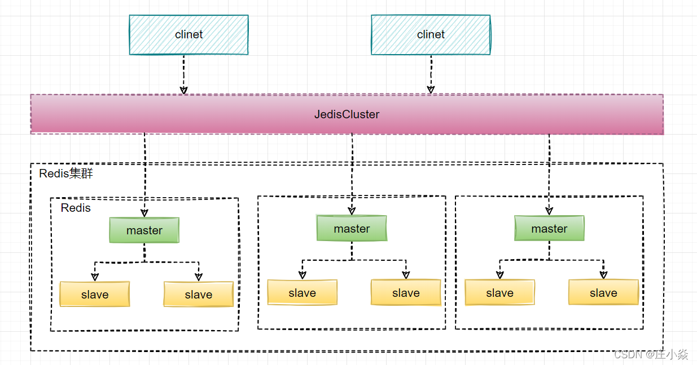
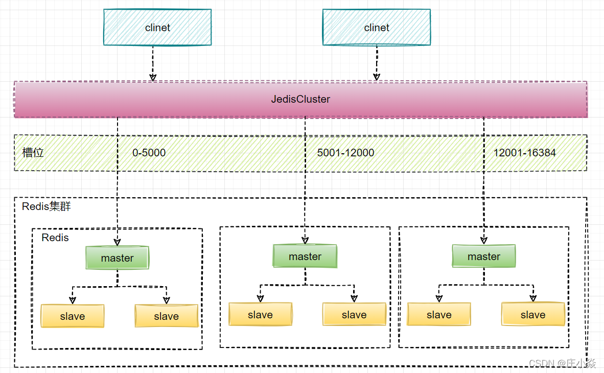
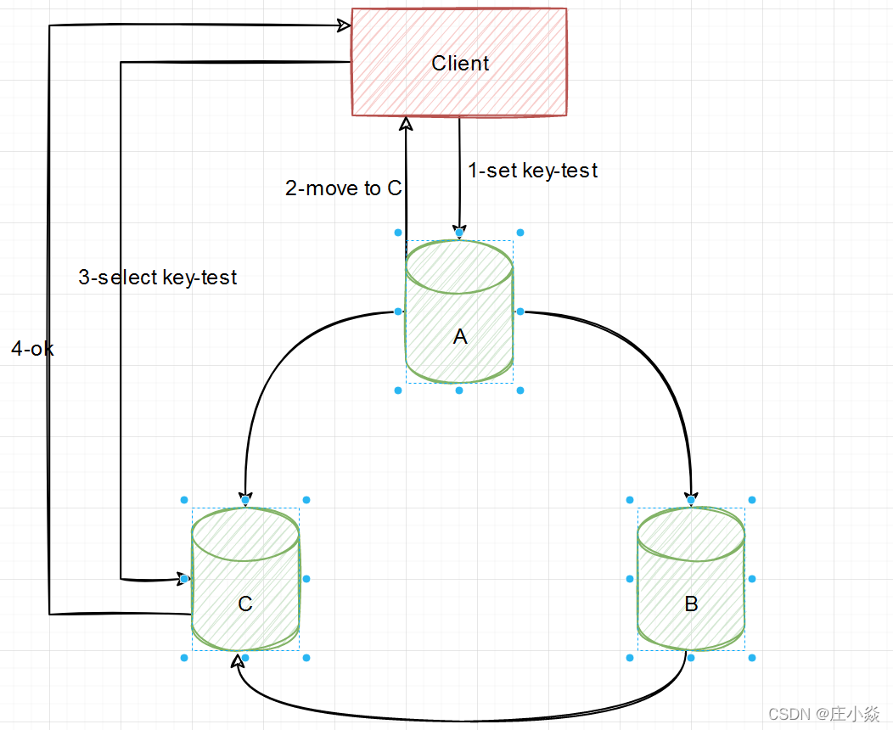
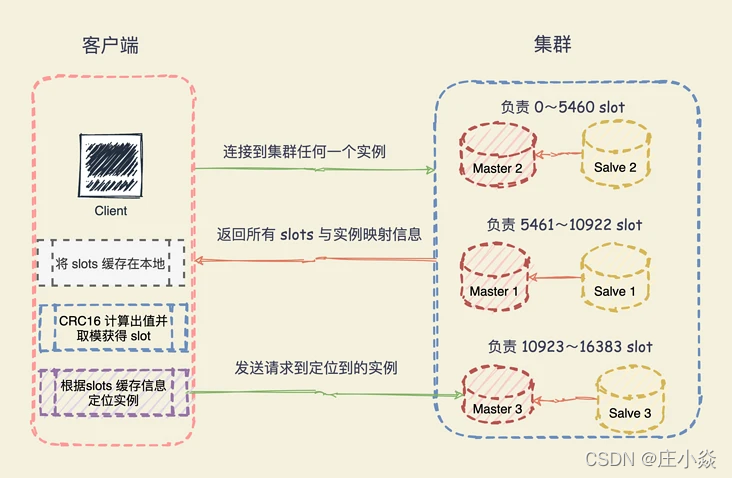
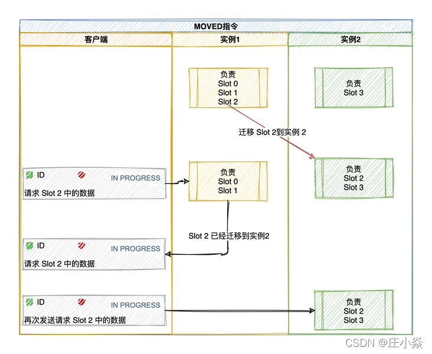
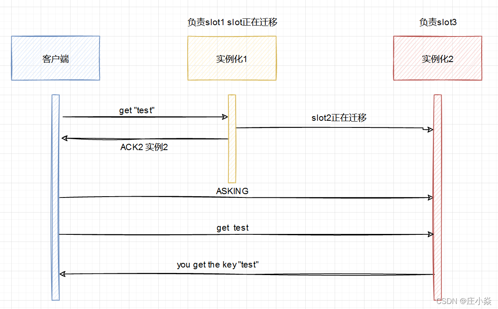
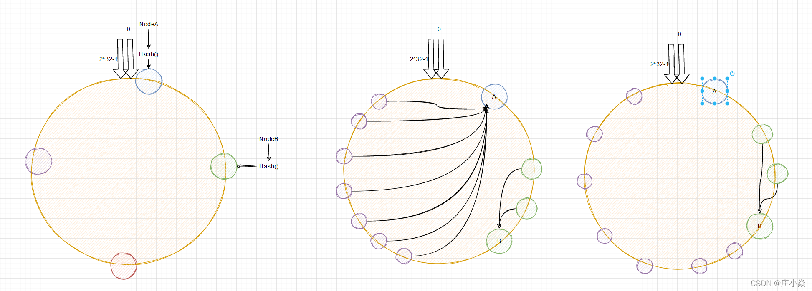
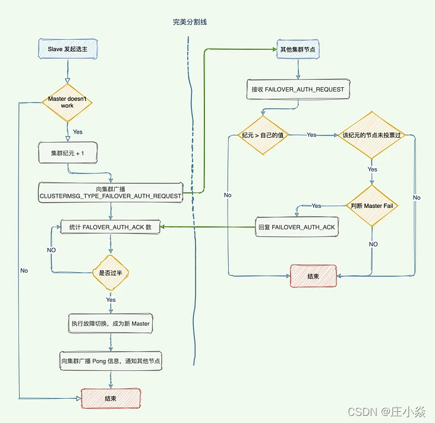
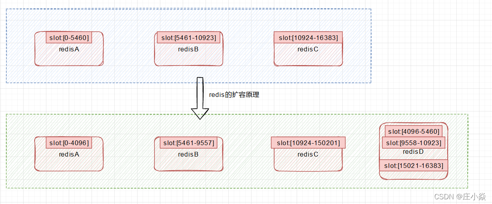
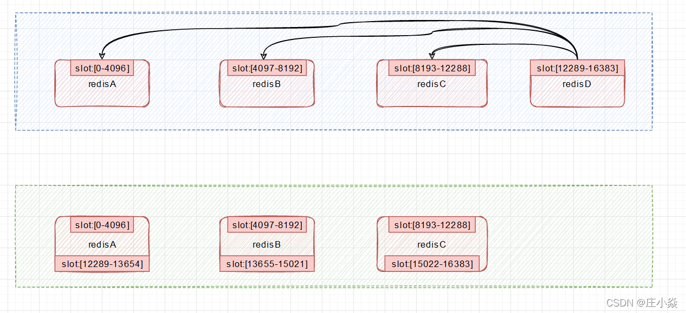

## 为什么要有集群模式？

在之前redis的哨兵架构，如果 master 节点异常，则会做主从切换，将一台 slave 作为 master。当master挂掉的时候，sentinel 会选举出来一个 master，**选举的时候是没有办法去访问Redis的**，会存在访问瞬断的情况；若是在电商网站大促的时候master给挂掉了，几秒钟损失好多订单数据；哨兵模式，对外只有master节点可以写，slave节点只能用于读。尽管Redis单节点最多支持10W的QPS，但是在电商大促的时候，**写数据的压力全部在master上**。Redis的单节点内存不能设置过大，若数据过大在主从同步将会很慢；在节点启动的时候，时间特别长；（从节点上有主节点的所有数据）。

## redis集群架构

Redis 集群是一种分布式数据库方案，**集群通过分片（sharding）来进行数据管理（分治思想的一种实践）**，并提供复制和故障转移功能。将数据划分为 **16384 的 slots**，每个节点负责一部分槽位。槽位的信息存储于每个节点中。**它是去中心化的**，如图所示，该集群有三个 Redis 节点组成，每个节点负责整个集群的一部分数据，每个节点负责的数据多少可能不一样。三个节点相互连接组成一个对等的集群，它们之间通过 Gossip协议相互交互集群信息，最后每个节点都保存着其他节点的 slots 分配情况。



## redis数据分片原理

集群的整个数据库被分为 16384 个槽（slot），数据库中的每个键都属于这 16384 个槽的其中一个，集群中的每个节点可以处理 0 个或最多 16384 个槽。

Key 与哈希槽映射过程可以分为两大步骤：

- 根据键值对的 key，使用 CRC16 算法，计算出一个 16 bit 的值；
- 将 16 bit 的值对 16384 执行取模，得到 0 ～ 16383 的数表示 key 对应的哈希槽。

Cluster 还允许用户强制某个 key 挂在特定槽位上，通过在 key 字符串里面嵌入 tag 标记，这就可以强制 key 所挂在的槽位等于 tag 所在的槽位。


## redis Cluster 请求路由方式

客户端直连 Redis 服务，进行读写操作时，Key 对应的 Slot 可能并不在当前直连的节点上，经过“重定向”才能转发到正确的节点。



和普通的查询路由相比，Redis Cluster 借助客户端实现的请求路由是一种混合形式的查询路由，它并非从一个 Redis 节点到另外一个 Redis，而是借助客户端转发到正确的节点。实际应用中，可以在客户端缓存 Slot 与 Redis 节点的映射关系，当接收到 MOVED 响应时修改缓存中的映射关系。如此，基于保存的映射关系，请求时会直接发送到正确的节点上，从而减少一次交互，提升效率。

### 客户端确认数据分布在哪个实例

**客户端又怎么确定访问的数据到底分布在哪个实例上呢？**

Redis 实例会将自己的哈希槽信息通过 Gossip 协议发送给集群中其他的实例，实现了哈希槽分配信息的扩散。这样，集群中的每个实例都有所有哈希槽与实例之间的映射关系信息。

在切片数据的时候是将 key 通过 CRC16 计算出一个值再对 16384 取模得到对应的 Slot，这个计算任务可以在客户端上执行发送请求的时候执行。但是，定位到槽以后还需要进一步定位到该 Slot 所在 Redis 实例。当客户端连接任何一个实例，实例就将哈希槽与实例的映射关系响应给客户端，客户端就会将哈希槽与实例映射信息缓存在本地。当客户端请求时，会计算出键所对应的哈希槽，在通过本地缓存的哈希槽实例映射信息定位到数据所在实例上，再将请求发送给对应的实例。


### cluster数据分布发生改变会如何

**哈希槽与实例之间的映射关系由于新增实例或者负载均衡重新分配导致改变了咋办？**

集群中的实例通过 Gossip 协议互相传递消息获取最新的哈希槽分配信息，但是，客户端无法感知。Redis Cluster 提供了重定向机制：客户端将请求发送到实例上，这个实例没有相应的数据，该 Redis 实例会告诉客户端将请求发送到其他的实例上。

Redis 如何告知客户端重定向访问新实例呢？分为两种情况：MOVED 错误、ASK 错误。

**MOVED 错误：**

**MOVED** 错误（负载均衡，数据已经迁移到其他实例上）：当客户端将一个键值对操作请求发送给某个实例，而这个键所在的槽并非由自己负责的时候，该实例会返回一个 MOVED 错误指引转向正在负责该槽的节点。

```bash
(error) MOVED 16330 172.17.18.2:6379
```

该响应表示客户端请求的键值对所在的哈希槽 16330 迁移到了 172.17.18.2 这个实例上，端口是 6379。这样客户端就与 172.17.18.2:6379 建立连接，并发送 GET 请求。同时，客户端还会更新本地缓存，将该 slot 与 Redis 实例对应关系更新正确。


**ASK 错误：如果某个 slot 的数据比较多，部分迁移到新实例，还有一部分没有迁移咋办？**

如果请求的 key 在当前节点找到就直接执行命令，否则时候就需要 ASK 错误响应了，槽部分迁移未完成的情况下，如果需要访问的 key 所在 Slot 正在从从 实例 1 迁移到 实例 2，实例 1 会返回客户端一条 ASK 报错信息：客户端请求的 key 所在的哈希槽正在迁移到实例 2 上，你先给实例 2 发送一个 ASKING 命令，接着发发送操作命令。

```bash
(error) ASK 16330 172.17.18.2:6379
```

比如客户端请求定位到 key的槽16330 在实例 172.17.18.1 上，节点1如果找得到就直接执行命令，否则响应 ASK 错误信息，并指引客户端转向正在迁移的目标节点 172.17.18.2。



注意：ASK 错误指令并不会更新客户端缓存的哈希槽分配信息。所以客户端再次请求 Slot 16330 的数据，还是会先给 `172.17.18.1` 实例发送请求，只不过节点会响应 ASK 命令让客户端给新实例发送一次请求。`MOVED`指令则更新客户端本地缓存，让后续指令都发往新实例。

## redis的一致性哈希算法

采用一致性哈希算法(consistent hashing)，将key和节点name同时hashing，然后进行映射匹配，采用的算法是MURMUR_HASH。采用一致性哈希而不是采用简单类似哈希求模映射的主要原因是当增加或减少节点时，不会产生由于重新匹配造成的rehashing。一致性哈希只影响相邻节点key分配，影响量小。

为了避免一致性哈希只影响相邻节点造成节点分配压力，ShardedJedis会对每个Redis节点根据名字(没有，Jedis会赋予缺省名字)会虚拟化出160个虚拟节点进行散列。根据权重weight，也可虚拟化出160倍数的虚拟节点。用虚拟节点做映射匹配，可以在增加或减少Redis节点时，key在各Redis节点移动再分配更均匀，而不是只有相邻节点受影响。


Hash环的数据倾斜问题：一致性Hash算法在服务节点太少时，容易因为节点分部不均匀而造成数据倾斜（被缓存的对象大部分集中缓存在某一台服务器上）问题，例如系统中只有两台服务器，其环分布如图所示，此时必然造成大量数据集中到Node A上，而只有极少量会定位到Node B上。为了解决这种数据倾斜问题，一致性Hash算法引入了虚拟节点机制，即对每一个服务节点计算多个哈希，每个计算结果位置都放置一个此服务节点，称为虚拟节点。具体做法可以在服务器IP或主机名的后面增加编号来实现。例如上面的情况，可以为每台服务器计算三个虚拟节点，于是可以分别计算 “Node A#1”、“Node A#2”、“Node A#3”、“Node B#1”、“Node B#2”、“Node B#3”的哈希值，于是形成六个虚拟节点。


## redis集群通信原理

Redis 自3.0版本起，支持 Redis Cluster，真正意义上实现了分布式。在分布式系统中，节点间的通信十分重要，是构建集群的基石。那么 Redis Cluster 中，节点间是如何通信的呢？又是如何保障一致性、可用性的呢？欲知答案，必先了解 Gossip 算法。Gossip 算法源自流行病学的研究，经过不断的发展演化，作为一种分布式一致性协议而得到广泛应用，如 Cassandra、Akka、Redis 都有用到。

Gossip 特点：在一个有界网络中，每个节点都随机地与其它节点通信，经过一番杂乱无章的通信，最终所有节点的状态都会达成一致。每个节点可能知道所有其它节点，也可能仅知道几个邻居节点，只要这些节可以通过网络连通，最终它们的状态都是一致的。要注意到的一点是，即使有的节点因宕机而重启，有新节点加入，但经过一段时间后，这些节点的状态也会与其他节点达成一致，也就是说，Gossip 天然具有分布式容错的优点。

Gossip 是一个带冗余的容错算法，更进一步，Gossip 是一个最终一致性算法。虽然无法保证在某个时刻所有节点状态一致，但可以保证在“最终”所有节点一致，“最终”是一个现实中存在，但理论上无法证明的时间点。因为 Gossip 不要求节点知道所有其它节点，因此又具有去中心化的特点，节点之间完全对等，不需要任何的中心节点。实际上 Gossip 可以用于众多能接受“最终一致性”的领域：失败检测、路由同步、Pub/Sub、动态负载均衡。但 Gossip 的缺点也很明显，冗余通信会对网路带宽、CUP 资源造成很大的负载，而这些负载又受限于通信频率，该频率又影响着算法收敛的速度，

Gossip 在 Redis Cluster 中的作用：

在分布式系统中，需要提供维护节点元数据信息的机制，所谓元数据是指节点负责哪些数据、主从属性、是否出现故障等状态信息。常见的元数据维护方式分为集中式和无中心式。Redis Cluster 采用 Gossip 协议实现了无中心式。Redis Cluster 中使用 Gossip 主要有两大作用：

- 去中心化，以实现分布式和弹性扩展；
- 失败检测，以实现高可用；


### Gossip 消息种类

发送的消息结构是 `clusterMsgDataGossip`结构体组成：

```c
typedef struct {
    char nodename[CLUSTER_NAMELEN];  //40字节
    uint32_t ping_sent; //4字节
    uint32_t pong_received; //4字节
    char ip[NET_IP_STR_LEN]; //46字节
    uint16_t port;  //2字节
    uint16_t cport;  //2字节
    uint16_t flags;  //2字节
    uint32_t notused1; //4字节
} clusterMsgDataGossip;
```

所以每个实例发送一个 Gossip消息，就需要发送 104 字节。如果集群是 1000 个实例，那么每个实例发送一个 PING 消息则会占用 大约 10KB。除此之外，实例间在传播 Slot 映射表的时候，每个消息还包含了 一个长度为 16384 bit 的 Bitmap。每一位对应一个 Slot，如果值 = 1 则表示这个 Slot 属于当前实例，这个 Bitmap 占用 2KB，所以一个 PING 消息大约 12KB。PONG与PING 消息一样，一发一回两个消息加起来就是 24 KB。集群规模的增加，心跳消息越来越多就会占据集群的网络通信带宽，降低了集群吞吐量。

Gossip 协议的主要职责就是信息交换。信息交换的载体就是节点彼此发送的Gossip 消息，常用的 Gossip 消息可分为：Ping 消息、Pong 消息、Meet 消息、Fail 消息。

- Meet 消息：用于通知新节点加入。消息发送者通知接收者加入到当前集群，Meet 消息通信正常完成后，接收节点会加入到集群中并进行周期性的 Ping、Pong 消息交换；
- Ping 消息：集群内交换最频繁的消息，集群内每个节点每秒向多个其它节点发送 Ping 消息，用于检测节点是否在线和交换彼此状态信息。Ping 消息发送封装了自身节点和部分其它节点的状态数据；
- Pong 消息：当接收到 Ping、Meet 消息时，作为响应消息回复给发送方确认消息正常通信。Pong 消息内部封装了自身状态数据。节点也可以向集群内广播自身的 Pong 消息来通知整个集群对自身状态进行更新；
- Fail 消息：当节点判定集群内另一个节点下线时，会向集群内广播一个 Fail 消息，其他节点接收到 Fail 消息之后把对应节点更新为下线状态。

由于集群内部需要频繁地进行节点信息交换，而 Ping/Pong 消息携带当前节点和部分其它节点的状态数据，势必会加重带宽和计算的负担。Redis 集群内节点通信采用固定频率（定时任务每秒执行10次），因此，节点每次选择需要通信的节点列表变得非常重要。通信节点选择过多虽然可以做到信息及时交换但成本过高。节点选择过少则会降低集群内所有节点彼此信息交换的频率，从而影响故障判定、新节点发现等需求的速度。因此 Redis 集群的 Gossip 协议需要兼顾信息交换实时性和成本开销。

**发送 PING 消息的频率也会影响集群带宽吧？**

Redis Cluster 的实例启动后，默认会每秒从本地的实例列表中随机选出 5 个实例，再从这 5 个实例中找出一个最久没有收到 PING 消息的实例，把 PING 消息发送给该实例。

**随机选择 5 个，但是无法保证选中的是整个集群最久没有收到 PING 通信的实例，有的实例可能一直没有收到消息，导致他们维护的集群信息早就过期了，咋办呢？**

这个问题问的好，Redis Cluster 的实例每 100 ms 就会扫描本地实例列表，当发现有实例最近一次收到 PONG 消息的时间 > cluster-node-timeout / 2。那么就立刻给这个实例发送 PING 消息，更新这个节点的集群状态信息。当集群规模变大，就会进一步导致实例间网络通信延迟怎加。可能会引起更多的 PING 消息频繁发送。


### 降低实例间的通信开销

- 每个实例每秒发送一条 PING消息，降低这个频率可能会导致集群每个实例的状态信息无法及时传播。
- 每 100 ms 检测实例 PONG消息接收是否超过 cluster-node-timeout / 2，这个是 Redis 实例默认的周期性检测任务频率，我们不会轻易修改。

所以，只能修改 cluster-node-timeout的值：集群中判断实例是否故障的心跳时间，默认 15 S。所以，为了避免过多的心跳消息占用集群宽带，将 cluster-node-timeout调成 20 秒或者 30 秒，这样 PONG 消息接收超时的情况就会缓解。但是，也不能设置的太大。都则就会导致实例发生故障了，等待 cluster-node-timeout时长才能检测出这个故障，影响集群正常服务、


## redis集群的故障转移原理

**如果某个主节点没有从节点，那么当它发生故障时，集群将完全处于不可用状态。**

不过 Redis 也提供了一个参数cluster-require-full-coverage可以允许部分节点故障，其它节点还可以继续提供对外访问。比如 7000 主节点宕机，作为 slave 的 7003 成为 Master 节点继续提供服务。当下线的节点 7000 重新上线，它将成为当前 70003 的从节点。

### 故障检测

一个节点认为某个节点失联了并不代表所有的节点都认为它失联了。只有当大多数负责处理 slot 节点都认定了某个节点下线了，集群才认为该节点需要进行主从切换。Redis 集群节点采用 Gossip协议来广播自己的状态以及自己对整个集群认知的改变。比如一个节点发现某个节点失联了 (PFail)，它会将这条信息向整个集群广播，其它节点也就可以收到这点失联信息。

如果一个节点收到了某个节点失联的数量 (PFail Count) 已经达到了集群的大多数，就可以标记该节点为确定下线状态 (Fail)，然后向整个集群广播，强迫其它节点也接收该节点已经下线的事实，并立即对该失联节点进行主从切换。

### 故障转移

当一个 Slave 发现自己的主节点进入已下线状态后，从节点将开始对下线的主节点进行故障转移。

1. 从下线的 Master 及节点的 Slave 节点列表选择一个节点成为新主节点。
2. 新主节点会撤销所有对已下线主节点的 slot 指派，并将这些 slots 指派给自己。
3. 新的主节点向集群广播一条 PONG 消息，这条 PONG 消息可以让集群中的其他节点立即知道这个节点已经由从节点变成了主节点，并且这个主节点已经接管了原本由已下线节点负责处理的槽。
4. 新的主节点开始接收处理槽有关的命令请求，故障转移完成。

### 选主流程

1. 集群的配置纪元 +1，是一个自曾计数器，初始值 0 ，每次执行故障转移都会 +1。
2. 检测到主节点下线的从节点向集群广播一条CLUSTERMSG_TYPE_FAILOVER_AUTH_REQUEST消息，要求所有收到这条消息、并且具有投票权的主节点向这个从节点投票。
3. 这个主节点尚未投票给其他从节点，那么主节点将向要求投票的从节点返回一条CLUSTERMSG_TYPE_FAILOVER_AUTH_ACK消息，表示这个主节点支持从节点成为新的主节点。
4. 参与选举的从节点都会接收CLUSTERMSG_TYPE_FAILOVER_AUTH_ACK消息，如果收集到的票 >= (N/2) + 1 支持，那么这个从节点就被选举为新主节点。
5. 如果在一个配置纪元里面没有从节点能收集到足够多的支持票，那么集群进入一个新的配置纪元，并再次进行选举，直到选出新的主节点为止。



## redis集群扩容与缩容原理

随着应用场景的升级，缓存可能需要扩容，扩容的方式有两种：垂直扩容（Scale Up）和水平扩容（Scale Out)。垂直扩容无需详述。实际应用场景中，采用水平扩容更多一些，根据是否增加主节点数量，水平扩容方式有两种。

### Redis集群的扩容方式

**主节点数量不变**

比如，当前有一台物理机 A，构建了一个包含3个 Redis 实例的集群；扩容时，我们新增一台物理机 B，拉起一个 Redis 实例并加入物理机 A 的集群；B 上 Redis 实例对 A 上的一个主节点进行复制，然后进行主备倒换；如此，Redis 集群还是3个主节点，只不过变成了 A2-B1 的结构，将一部分请求压力分担到了新增的节点上，同时物理容量上限也会增加，主要步骤如下：

- 将新增节点加入集群；
- 将新增节点设置为某个主节点的从节点，进而对其进行复制；
- 进行主备倒换，将新增的节点调整为主。

**增加主节点数量。**

不增加主节点数量的方式扩容比较简单，但是，从负载均衡的角度来看，并不是很好的选择。例如，如果主节点数量较少，那么单个节点所负责的 Slot 的数量必然较多，很容易出现大量 Key 的读写集中于少数节点的现象，而增加主节点的数量，可以更有效的分摊访问压力，充分利用资源。主要步骤如下：

- 将新增节点加入集群；
- 将集群中的部分 Slot 迁移至新增的节点。


### Redis集群的扩容原理

新节点刚开始都是master节点，但是由于没有负责的槽，所以不能接收任何读写操作，对新节点的后续操作，一般有两种选择：

- 从其他的节点迁移槽和数据给新节点
- 作为其他节点的slave负责故障转移

```bash
# 新节点加入集群
redis-trib.rb add-node new_host:new_port old_host:old_port
# 新节点加入集群并作为指定master的slave
redis-trib.rb add-node new_host:new_port old_host:old_port --slave --master-id <master-id>
```

建议使用`redis-trib.rb add-node`将新节点添加到集群中，该命令会检查新节点的状态，如果新节点已经加入了其他集群或者已经包含数据，则会报错，而使用`cluster meet`命令则不会做这样的检查，假如新节点已经存在数据，则会合并到集群中，造成数据不一致。


#### 迁移slot和数据

- 假设原有3个master，每个master负责10384 / 3 ≈ 5461个slot
- 加入一个新的master之后，每个master负责10384 / 4 = 4096个slot
- 确定好迁移计划之后，例如，每个master将超过4096个slot的部分迁移到新的master中，然后开始以slot为单位进行迁移。



 **slot迁移的其他说明**

- 迁移过程是同步的，在目标节点执行restore指令到原节点删除key之间，原节点的主线程处于阻塞状态，直到key被删除成功
- 如果迁移过程突然出现网路故障，整个slot迁移只进行了一半，这时两个节点仍然会被标记为中间过滤状态，即"migrating"和"importing"，下次迁移工具连接上之后，会继续进行迁移
- 在迁移过程中，如果每个key的内容都很小，那么迁移过程很快，不会影响到客户端的正常访问
- 如果key的内容很大，由于迁移一个key的迁移过程是阻塞的，就会同时导致原节点和目标节点的卡顿，影响集群的稳定性，所以，**集群环境下，业务逻辑要尽可能的避免大key的产生**


### Redis集群的缩容

- 如果下线的是slave，那么通知其他节点忘记下线的节点
- 如果下线的是master，那么将此master的slot迁移到其他master之后，通知其他节点忘记此master节点
- 其他节点都忘记了下线的节点之后，此节点就可以正常停止服务了



## Redis集群总结

- 哨兵集群实现故障转移，但是当数据量过大导致生成 RDB 时间过长。而 Fork 执行的时候会阻塞主线程，由于数据量过大导致阻塞主线程过长，所以出现了 Redis 响应慢的表象。
- 使用 Redis Cluster 集群，主要解决大数据量存储导致的各种慢问题，同时也便于横向拓展。面向百万、千万级别的用户规模时，横向扩展的 Redis 切片集群会是一个非常好的选择。
- 集群的整个数据库被分为 16384 个槽（slot），数据库中的每个键都属于这 16384 个槽的其中一个，集群中的每个节点可以处理 0 个或最多 16384 个槽。
- Redis 集群节点采用 Gossip 协议来广播自己的状态以及自己对整个集群认知的改变。
- 客户端连接到集群候任何一个实例后，实例会将哈希槽与实例映射信息发送给客户端，客户端将信息保存，用于将 key 定位到对应的节点。
- 集群并不能无限增加，由于集群通过 Gossip协议传播集群实例信息，所以通信频率是限制集群大小的主要原因，主要可以通过修改 cluster-node-timeout调整频率。

