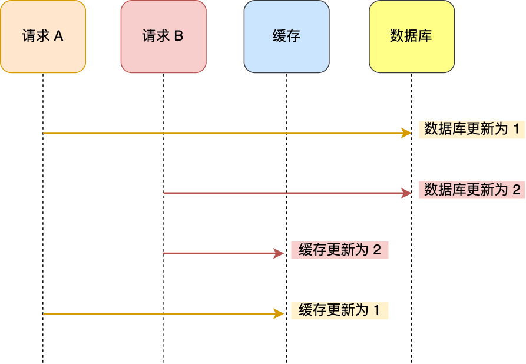
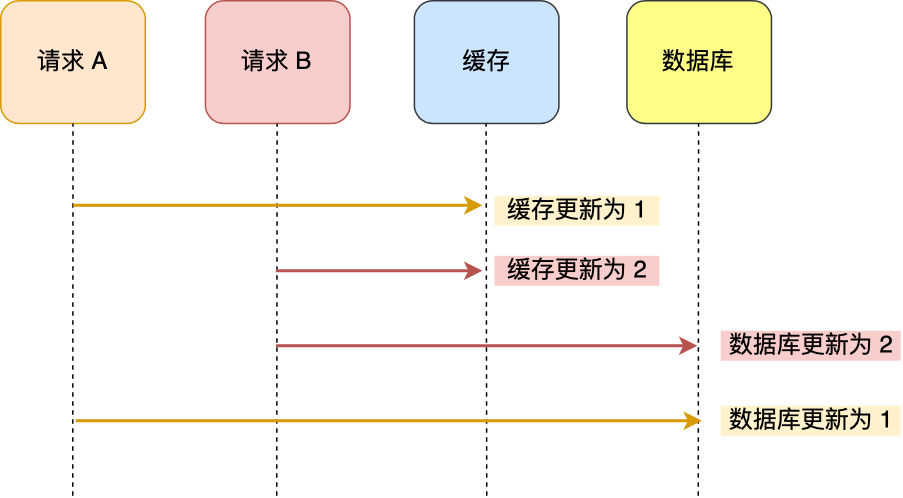
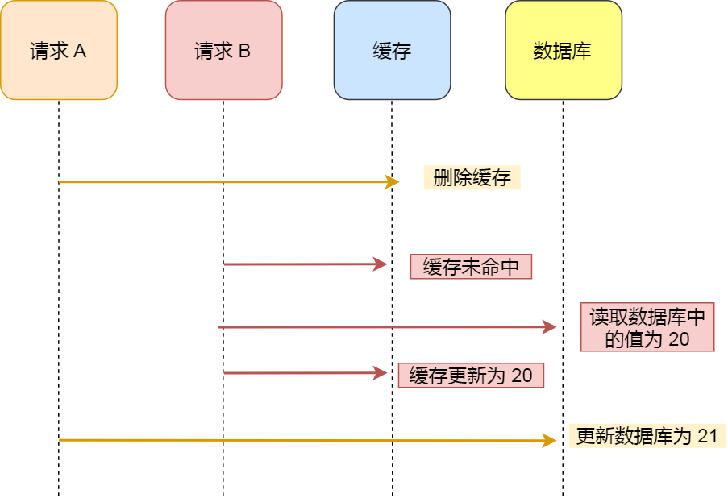
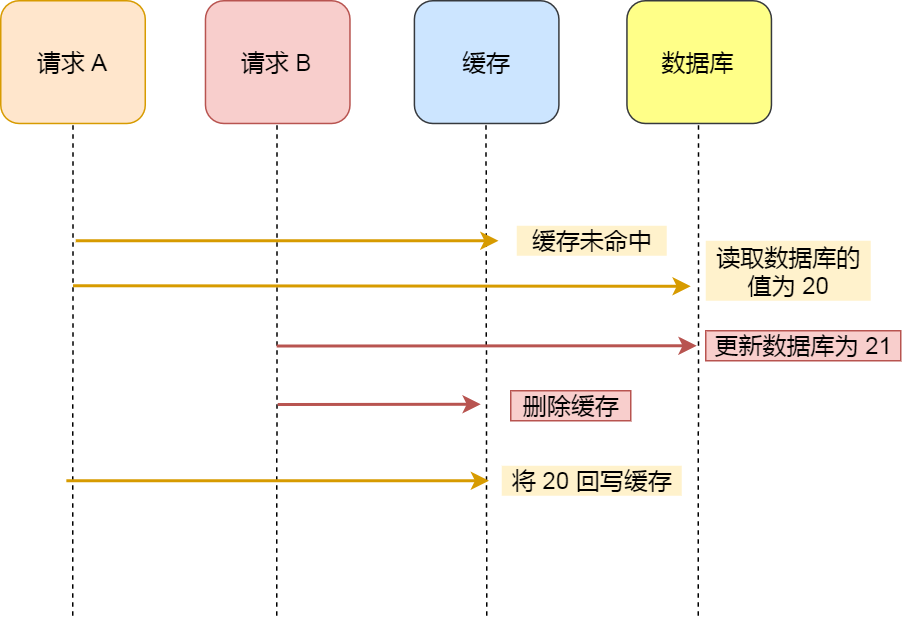
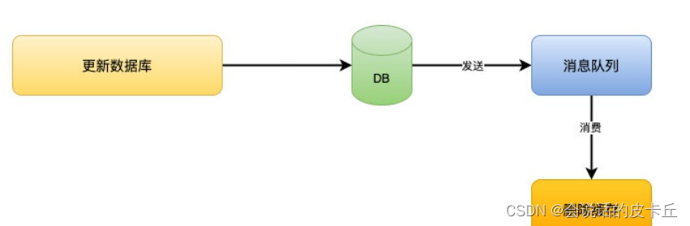
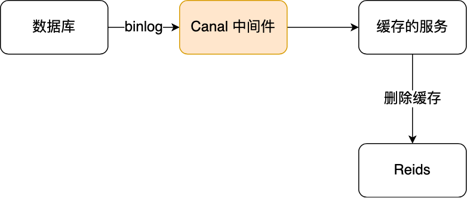

##  先更新数据库，还是先更新缓存？

### 先更新数据库，再更新缓存

举个例子，比如「请求 A 」和「请求 B 」两个请求，同时更新「同一条」数据，则可能出现这样的顺序：

<div align="center">

</div>

A 请求先将数据库的数据更新为 1，然后在更新缓存前，请求 B 将数据库的数据更新为 2，紧接着也把缓存更新为 2，然后 A 请求更新缓存为 1。

此时，数据库中的数据是 2，而缓存中的数据却是 1，**出现了缓存和数据库中的数据不一致的现象**。


### 先更新缓存，再更新数据库

那换成「**先更新缓存，再更新数据库**」这个方案，还会有问题吗？

依然还是存在并发的问题，分析思路也是一样。

假设「请求 A 」和「请求 B 」两个请求，同时更新「同一条」数据，则可能出现这样的顺序：
<div align="center">

</div>

A 请求先将缓存的数据更新为 1，然后在更新数据库前，B 请求来了， 将缓存的数据更新为 2，紧接着把数据库更新为 2，然后 A 请求将数据库的数据更新为 1。

此时，数据库中的数据是 1，而缓存中的数据却是 2，**出现了缓存和数据库中的数据不一致的现象**。

所以，**无论是「先更新数据库，再更新缓存」，还是「先更新缓存，再更新数据库」，这两个方案都存在并发问题，当两个请求并发更新同一条数据的时候，可能会出现缓存和数据库中的数据不一致的现象**。


### 分布式锁与过期时间

前面我们也分析过，在两个更新请求并发执行的时候，会出现数据不一致的问题，因为更新数据库和更新缓存这两个操作是独立的，而我们又没有对操作做任何并发控制，那么当两个线程并发更新它们的话，就会因为写入顺序的不同造成数据的不一致。


解决一：**在更新缓存前先加个分布式锁** ，保证同一时间只运行一个请求更新缓存，就会不会产生并发问题了，当然引入了锁后，对于写入的性能就会带来影响

解决二：在更新完缓存时，**给缓存加上较短的过期时间** ，这样即时出现缓存不一致的情况，缓存的数据也会很快过期，对业务还是能接受的。


------

## 先更新数据库，还是先删除缓存？

### 先删除缓存，再更新数据库

假设某个用户的年龄是 20，请求 A 要更新用户年龄为 21，所以它会删除缓存中的内容。这时，另一个请求 B 要读取这个用户的年龄，它查询缓存发现未命中后，会从数据库中读取到年龄为 20，并且写入到缓存中，然后请求 A 继续更改数据库，将用户的年龄更新为 21。

<div align="center">

</div>

最终，该用户年龄在缓存中是 20（旧值），在数据库中是 21（新值），缓存和数据库的数据不一致。

可以看到，**先删除缓存，再更新数据库，在「读 + 写」并发的时候，还是会出现缓存和数据库的数据不一致的问题**。


### 延迟双删

针对「先删除缓存，再更新数据库」方案在「读 + 写」并发请求而造成缓存不一致的解决办法是「**延迟双删**」。

延迟双删实现的伪代码如下：

```text
#删除缓存
redis.delKey(X)
#更新数据库
db.update(X)
#睡眠
Thread.sleep(N)
#再删除缓存
redis.delKey(X)
```


## 先更新数据库，再删除缓存

继续用「读 + 写」请求的并发的场景来分析。

假如某个用户数据在缓存中不存在，请求 A 读取数据时从数据库中查询到年龄为 20，在未写入缓存中时另一个请求 B 更新数据。它更新数据库中的年龄为 21，并且清空缓存。这时请求 A 把从数据库中读到的年龄为 20 的数据写入到缓存中。

<div align="center">

</div>
最终，该用户年龄在缓存中是 20（旧值），在数据库中是 21（新值），缓存和数据库数据不一致。

从上面的理论上分析，先更新数据库，再删除缓存也是会出现数据不一致性的问题，**但是在实际中，这个问题出现的概率并不高**。

**因为缓存的写入通常要远远快于数据库的写入**，所以在实际中很难出现请求 B 已经更新了数据库并且删除了缓存，请求 A 才更新完缓存的情况。

而一旦请求 A 早于请求 B 删除缓存之前更新了缓存，那么接下来的请求就会因为缓存不命中而从数据库中重新读取数据，所以不会出现这种不一致的情况。

所以，**「先更新数据库 + 再删除缓存」的方案，是可以保证数据一致性的**。

而且为了确保万无一失，还给缓存数据加上了「**过期时间**」，就算在这期间存在缓存数据不一致，有过期时间来兜底，这样也能达到最终一致。

但是「先更新数据库， 再删除缓存」其实是两个操作，前面的所有分析都是建立在这两个操作都能同时执行成功，而这次客户投诉的问题就在于，**在删除缓存（第二个操作）的时候失败了，导致缓存中的数据是旧值**。


### 如何保证两个操作都能执行成功？

#### 消息队列

先更新数据库，成功后往消息队列发消息，消费到消息后再删除缓存，借助**消息队列的重试机制**来实现，达到最终一致性的效果。




#### 订阅数据库变更日志binlog

「**先更新数据库，再删缓存**」的策略的第一步是更新数据库，那么更新数据库成功，就会产生一条变更日志，记录在 binlog 里。

于是我们就可以通过订阅 binlog 日志，拿到具体要操作的数据，然后再执行缓存删除，阿里巴巴开源的 Canal 中间件就是基于这个实现的。

Canal 模拟 MySQL 主从复制的交互协议，把自己伪装成一个 MySQL 的从节点，向 MySQL 主节点发送 dump 请求，MySQL 收到请求后，就会开始推送 Binlog 给 Canal，Canal 解析 Binlog 字节流之后，转换为便于读取的结构化数据，供下游程序订阅使用。

下图是 Canal 的工作原理：



所以，**如果要想保证「先更新数据库，再删缓存」策略第二个操作能执行成功，我们可以使用「消息队列来重试缓存的删除」，或者「订阅 MySQL binlog 再操作缓存」，这两种方法有一个共同的特点，都是采用异步操作缓存。**


------


## 为什么要删除缓存而不是更新缓存?

1	因为更新缓存会涉及到很多的无用操作.....  很多时候redis中存入的数据和mysql中并不是一一对应的.
而是通过mysql中值然后计算后才写到redis中.这种方案缓存的利用率不高!

2	很多你更新的缓存并不会立马被访问到,由此存放了许多冗余的数据

当然,**如果我们的业务对缓存命中率有很高的要求，我们可以采用「更新数据库 + 更新缓存」的方案，因为更新缓存并不会出现缓存未命中的情况**。


------


## 解决缓存不一致的整体思路

1. 超时剔除策略     -----> 低一致性需求(很少发生变更的数据)

2. 主动更新策略(超时剔除作为兜底)    ------>高一致性需求(常发生变更的数据)

   - 读操作(读缓存)

     - 缓存命中直接返回
     - 缓存未命中,查库然后更新缓存

   - 写操作(写缓存)

     - 「更新数据库 + 更新缓存」

       **[读写并发问题]**

       [解决方案]

       ​	在更新缓存前先加个**分布式锁**

       ​	在更新完缓存时，给缓存加上较短的**过期时间**

     - 「更新缓存? 删除缓存?」

       [**过多冗余数据,对缓存的利用率不高**]

       可以考虑对缓存命中率要求高的时候用,空间换性能!

     - 「先删除缓存,后更新数据库」

       [读写并发问题]

       [解决方案]**延时双删**

       ​	就是更新数据库后让线程睡一会,再去删除一遍缓存

       ​	延迟双删实现的伪代码如下：

       ```text
       #删除缓存
       redis.delKey(X)
       #更新数据库
       db.update(X)
       #睡眠
       Thread.sleep(N)
       #再删除缓存
       redis.delKey(X)
       ```

     - 「先更新数据库,后删除缓存!」

       **[读写并发问题]	但是出现不一致性的概率太低了,几乎不可能**

       ​	(为什么发生概率低.要结合发生的场景:写入缓存前要完成更新数据库+删除缓存的动作,几乎不可能)

       ​	因为写数据库一般会先「加锁」﹐所以写数据库，通常是要比读数据库的时间更长的。

       ​	这么来看，「先更新数据库＋再删除缓存」的方案，是可以保证数据一致性的

       [**两个操作的一致性问题**]   (一个操作成功,一个操作失败.怎么如何解决?)

       [解决方案]

       ​	1  消息队列

       ​	2  订阅数据库变更日志binlog       两种方案本质都是**重试**

**结论:采取了[更新数据库＋删除缓存]的操作,并配合消息队列来解决缓存一致性的问题!**

