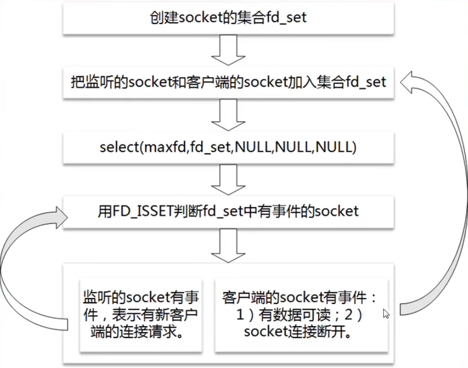
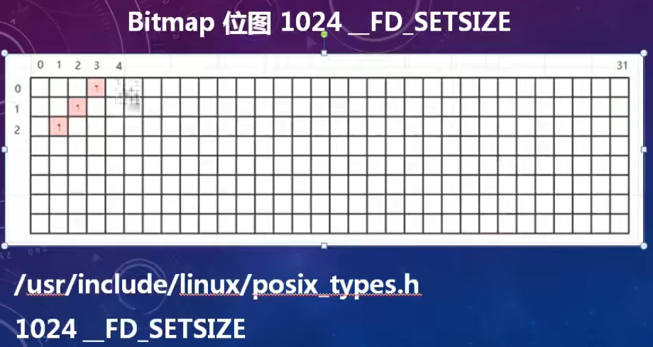
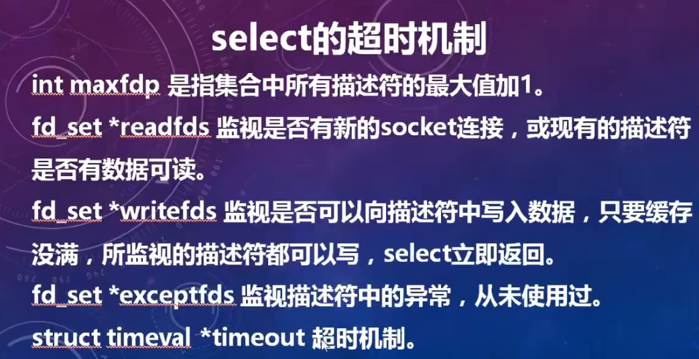
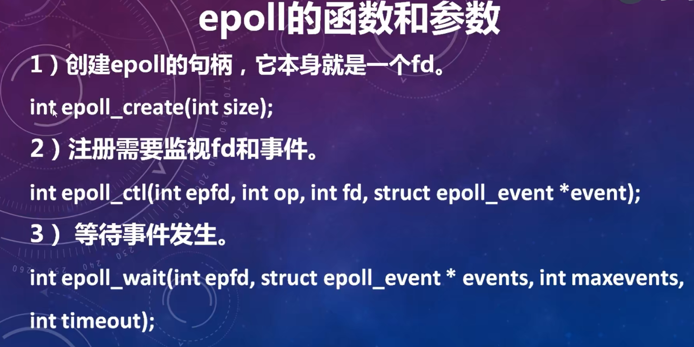

> 在网上看了很多帖子，很多人只是对概念熟知一二，就算配上一些图也不容易深刻理解。其实根本不需要这么麻烦，直接实操代码就知道一清二楚。**多路复用**就是人家 Linux内核实现的函数 **select、poll、epoll**（就是一个函数，完全不用多想）。那么上述函数就用于 **socket** 编程的，不管你用的是什么语言，如果你没接触过 socket 编程就意味着人家底层已经帮你实现封装好了，你只是被屏蔽掉去开发上层应用。那接下来我们来看看 socket 编程是怎么演练的。


## 客户/服务端模式

### 服务端的工作流程

1）创建服务端的socket。

2）把服务端用于通信的地址和端口绑定到socket上。

3）把socket设置为监听模式。

4）接受客户端的连接。

5）与客户端通信，接收客户端发过来的报文后，回复处理结果。

6）不断的重复第 5 步，直到客户端断开连接。

7）关闭socket，释放资源。

**服务端示例（server.cpp）**

```c++
/*
 * 程序名：server.cpp，此程序用于演示socket通信的服务端
 */
#include <stdio.h>
#include <string.h>
#include <unistd.h>
#include <stdlib.h>
#include <netdb.h>
#include <sys/types.h>
#include <sys/socket.h>
#include <arpa/inet.h>

int main(int argc, char *argv[])
{

  // 第1步：创建服务端的socket。
  int listenfd;
  if ((listenfd = socket(AF_INET, SOCK_STREAM, 0)) == -1)
  {
    perror("socket");
    return -1;
  }


  // 第2步：把服务端用于通信的地址和端口绑定到socket上。
  struct sockaddr_in servaddr; // 服务端地址信息的数据结构。
  memset(&servaddr, 0, sizeof(servaddr));
  servaddr.sin_family = AF_INET;                // 协议族，在socket编程中只能是AF_INET。
  servaddr.sin_addr.s_addr = htonl(INADDR_ANY); // 任意ip地址。
  // servaddr.sin_addr.s_addr = inet_addr("192.168.190.134"); // 指定ip地址。
  servaddr.sin_port = htons(atoi(argv[1])); // 指定通信端口。
  if (bind(listenfd, (struct sockaddr *)&servaddr, sizeof(servaddr)) != 0)
  {
    perror("bind");
    close(listenfd);
    return -1;
  }
  // 上面一堆可以忽视

  // 第3步：把socket设置为监听模式。
  if (listen(listenfd, 5) != 0)
  {
    perror("listen");
    close(listenfd);
    return -1;
  }

  while (true)
  {
    // 第4步：接受客户端的连接。
    int clientfd;                             // 客户端的socket。
    int socklen = sizeof(struct sockaddr_in); // struct sockaddr_in的大小
    struct sockaddr_in clientaddr;            // 客户端的地址信息。
    if ((clientfd = accept(listenfd, (struct sockaddr *)&clientaddr, (socklen_t *)&socklen)) < 0){
      printf("TcpServer.Accept() failed.\n"); // 连接失败
      continue;
    }

    if (fork() > 0){ close(clientfd); continue;} // 父进程返回到循环首部。以下为子进程

    close(listenfd);

    // 以下是子进程，负责与客户端通信。
    printf("客户端（%s）已连接。\n", inet_ntoa(clientaddr.sin_addr));

    // 第5步：与客户端通信，接收客户端发过来的报文后.
    char buffer[1024];
    while (true)
    {
      int iret;
      memset(buffer, 0, sizeof(buffer));
      if ((iret = recv(clientfd, buffer, sizeof(buffer), 0)) <= 0){// 接收客户端的请求报文。
        break;
      } 
      printf("接收：%s\n", buffer);

      strcpy(buffer, "ok");
      if ((iret = send(clientfd, buffer, strlen(buffer), 0)) <= 0){ // 向客户端发送响应结果。
        break;
      }
      printf("发送：%s\n", buffer);
    }
    printf("客户端已断开。\n");
    
    // 第6步：关闭socket，释放资源。
    close(clientfd);
    exit(0);  // 通信完成后，子进程退出。
  }  
}
```

### 客户端的工作流程

1）创建客户端的socket。

2）向服务器发起连接请求。

3）与服务端通信，发送一个报文后等待回复，然后再发下一个报文。

4）不断的重复第 3 步，直到全部的数据被发送完。

5）第4步：关闭socket，释放资源。

```c++
/*
 * 程序名：client.cpp，此程序用于演示socket的客户端
*/
#include <stdio.h>
#include <string.h>
#include <unistd.h>
#include <stdlib.h>
#include <netdb.h>
#include <sys/types.h>
#include <sys/socket.h>
#include <arpa/inet.h>
 
int main(int argc,char *argv[])
{ 
  // 第1步：创建客户端的socket。
  int sockfd;
  if ( (sockfd = socket(AF_INET,SOCK_STREAM,0))==-1) { perror("socket"); return -1; }
 
  // 第2步：向服务器发起连接请求。
  struct hostent* h;
  if ( (h = gethostbyname(argv[1])) == 0 )   // 指定服务端的ip地址。
  { printf("gethostbyname failed.\n"); close(sockfd); return -1; }
  struct sockaddr_in servaddr;
  memset(&servaddr,0,sizeof(servaddr));
  servaddr.sin_family = AF_INET;
  servaddr.sin_port = htons(atoi(argv[2])); // 指定服务端的通信端口。
  memcpy(&servaddr.sin_addr,h->h_addr,h->h_length);
  if (connect(sockfd, (struct sockaddr *)&servaddr,sizeof(servaddr)) != 0)  // 向服务端发起连接清求。
  { perror("connect"); close(sockfd); return -1; }
 
  char buffer[1024];
 
  // 第3步：与服务端通信，发送一个报文后等待回复，然后再发下一个报文。
  for (int ii=0;ii<3;ii++)
  {
    int iret;
    memset(buffer,0,sizeof(buffer));
    sprintf(buffer,"这是第%d个超级女生，编号%03d。",ii+1,ii+1);
    if ( (iret=send(sockfd,buffer,strlen(buffer),0))<=0) // 向服务端发送请求报文。
    { perror("send"); break; }
    printf("发送：%s\n",buffer);
 
    memset(buffer,0,sizeof(buffer));
    if ( (iret=recv(sockfd,buffer,sizeof(buffer),0))<=0) // 接收服务端的回应报文。
    {
       printf("iret=%d\n",iret); break;
    }
    printf("接收：%s\n",buffer);
  }
 
  // 第4步：关闭socket，释放资源。
  close(sockfd);
}
```

### 问题分析

有没有发现，要实现服务端每当有一个新的连接都要**fork**一个进程去处理客户端的读写请求（在Linux下,*其实没有真正意义上的线程概念*），如果有十万个连接，那么就得 fork 十万次进程（进程是占用资源的，用不了多久你的计算机就资源耗光）。因此linux才有了select、poll、epoll函数，可以一个进程就可以处理所有的连接请求。**多路复用其实就是监听多个文件描述符**。


## Select模型

### select模型服务程序的流程
<div align="center">

</div>

### **服务端示例（tcpselect.cpp）**

```c++
#include <stdio.h>
#include <unistd.h>
#include <stdlib.h>
#include <string.h>
#include <sys/socket.h>
#include <arpa/inet.h>
#include <sys/fcntl.h>

// 初始化服务端的监听端口。
int initserver(int port);

int main(int argc,char *argv[])
{
  if (argc != 2)
  {
    printf("usage: ./tcpselect port\n"); return -1;
  }

  // 初始化服务端用于监听的socket。
  int listensock = initserver(atoi(argv[1]));
  printf("listensock=%d\n",listensock);

  if (listensock < 0)
  {
    printf("initserver() failed.\n"); return -1;
  }

  fd_set readfdset;  // 读事件的集合，包括监听socket和客户端连接上来的socket。
  int maxfd;  // readfdset中socket的最大值。

  // 初始化结构体，把listensock添加到集合中。
  FD_ZERO(&readfdset);

  FD_SET(listensock,&readfdset);
  maxfd = listensock;

  while (1)
  {
    // 调用select函数时，会改变socket集合的内容，所以要把socket集合保存下来，传一个临时的给select。
    fd_set tmpfdset = readfdset;

    int infds = select(maxfd+1,&tmpfdset,NULL,NULL,NULL);
    // printf("select infds=%d\n",infds);

    // 返回失败。
    if (infds < 0)
    {
      printf("select() failed.\n"); perror("select()"); break;
    }

    // 超时，在本程序中，select函数最后一个参数为空，不存在超时的情况，但以下代码还是留着。
    if (infds == 0)
    {
      printf("select() timeout.\n"); continue;
    }

    // 检查有事情发生的socket，包括监听和客户端连接的socket。
    // 这里是客户端的socket事件，每次都要遍历整个集合，因为可能有多个socket有事件。
    for (int eventfd=0; eventfd <= maxfd; eventfd++)
    {
      if (FD_ISSET(eventfd,&tmpfdset)<=0) continue;

      if (eventfd==listensock)
      { 
        // 如果发生事件的是listensock，表示有新的客户端连上来。
        struct sockaddr_in client;
        socklen_t len = sizeof(client);
        int clientsock = accept(listensock,(struct sockaddr*)&client,&len);
        if (clientsock < 0)
        {
          printf("accept() failed.\n"); continue;
        }

        printf ("client(socket=%d) connected ok.\n",clientsock);

        // 把新的客户端socket加入集合。
        FD_SET(clientsock,&readfdset);

        if (maxfd < clientsock) maxfd = clientsock;

        continue;
      }
      else
      {
        // 客户端有数据过来或客户端的socket连接被断开。
        char buffer[1024];
        memset(buffer,0,sizeof(buffer));

        // 读取客户端的数据。
        ssize_t isize=read(eventfd,buffer,sizeof(buffer));

        // 发生了错误或socket被对方关闭。
        if (isize <=0)
        {
          printf("client(eventfd=%d) disconnected.\n",eventfd);

          close(eventfd);  // 关闭客户端的socket。

          FD_CLR(eventfd,&readfdset);  // 从集合中移去客户端的socket。

          // 重新计算maxfd的值，注意，只有当eventfd==maxfd时才需要计算。
          if (eventfd == maxfd)
          {
            for (int ii=maxfd;ii>0;ii--)
            {
              if (FD_ISSET(ii,&readfdset))
              {
                maxfd = ii; break;
              }
            }

            printf("maxfd=%d\n",maxfd);
          }

          continue;
        }

        printf("recv(eventfd=%d,size=%d):%s\n",eventfd,isize,buffer);

        // 把收到的报文发回给客户端。
        write(eventfd,buffer,strlen(buffer));
      }
    }
  }

  return 0;
}

// 初始化服务端的监听端口。
int initserver(int port)
{
  int sock = socket(AF_INET,SOCK_STREAM,0);
  if (sock < 0)
  {
    printf("socket() failed.\n"); return -1;
  }

  // Linux如下
  int opt = 1; unsigned int len = sizeof(opt);
  setsockopt(sock,SOL_SOCKET,SO_REUSEADDR,&opt,len);
  setsockopt(sock,SOL_SOCKET,SO_KEEPALIVE,&opt,len);

  struct sockaddr_in servaddr;
  servaddr.sin_family = AF_INET;
  servaddr.sin_addr.s_addr = htonl(INADDR_ANY);
  servaddr.sin_port = htons(port);

  if (bind(sock,(struct sockaddr *)&servaddr,sizeof(servaddr)) < 0 )
  {
    printf("bind() failed.\n"); close(sock); return -1;
  }

  if (listen(sock,5) != 0 )
  {
    printf("listen() failed.\n"); close(sock); return -1;
  }

  return sock;
}
```

可以看到，上述用了 `select(maxfd+1,&tmpfdset,NULL,NULL,NULL)`函数，一旦监听的`fd_set`（文件描述符集合）有事件发生就会立刻返回。那么无论是处理客户端连接或是客户端的读写请求都可以在一个进程中完成了。

**socket集合fd_set的数据结构是1024bit的位图**，一个`fd` 文件描述符就对应一个bit，select 就通过不断地轮询位图中的 fd去查看是否有事件发生。

<div align="center">

</div>
### select的超时机制

**select** 函数可以设置超时，如果轮询没有事件发生就不会一直阻塞，待超时时间后返回。如果我们的代码需求不想一直等待，想利用空闲的时间去处理别的事情，那么就可以用到这个超时机制了，这可以增强我们代码的灵活性。

<div align="center">

</div>


### select的水平触发
<div align="center">

</div>

### select的缺点

1 ) select支持的文件描述符数量太小了,**默认是1024** ,虽然可以调整,但是,描述符数量越大,效率将更低,调整的意义不大。

2 )每次调用select ,都需要把fdset从**用户态拷贝到内核**。

3 )同时在线的大量客户端有事件发生的可能很少,但还是需要遍历fdset ,因此随着监视的描述符数量的增长,**其效率也会线性下降**。


## Poll模型

poll和select在本质上没有差别，管理多个描述符也是进行轮询，根据描述符的状态进行处理，但是**poll没有最大文件描述符数量的限制**。

select采用 fdset 采用 bitmap  ,  poll 采用了数组。
poll和select同样存在一个缺点就是，文件描述符的数组被整体复制于用户态和内核态的地址空间之间，而不论这些文件描述符是否有事件，它的开销随着文件描述符数量的增加而线性增大。
还有poll返回后，也需要历遍整个描述符的数组才能得到有事件的描述符。

### poll函数和参数

```c
int poll(struct pollfd *fds, nfds t nfds, int timeout);
struct pollfd
{
  int fd;        /*file descriptor*/
  short events;  /*requested events */
  short revents; /* returned events */
};
```

### 服务器实例（tcppoll.cpp）

```c++
#include <stdio.h>
#include <unistd.h>
#include <stdlib.h>
#include <string.h>
#include <poll.h>
#include <sys/socket.h>
#include <arpa/inet.h>
#include <sys/fcntl.h>

// ulimit -n
#define MAXNFDS  1024

// 初始化服务端的监听端口。
int initserver(int port);

int main(int argc,char *argv[])
{
  if (argc != 2)
  {
    printf("usage: ./tcppoll port\n"); return -1;
  }

  // 初始化服务端用于监听的socket。
  int listensock = initserver(atoi(argv[1]));
  printf("listensock=%d\n",listensock);

  if (listensock < 0)
  {
    printf("initserver() failed.\n"); return -1;
  }

  int maxfd;   // fds数组中需要监视的socket的大小。
  struct pollfd fds[MAXNFDS];  // fds存放需要监视的socket。

  for (int ii=0;ii<MAXNFDS;ii++) fds[ii].fd=-1; // 初始化数组，把全部的fd设置为-1。

  // 把listensock添加到数组中。
  fds[listensock].fd=listensock;
  fds[listensock].events=POLLIN;  // 有数据可读事件，包括新客户端的连接、客户端socket有数据可读和客户端socket断开三种情况。
  maxfd=listensock;

  while (1)
  {
    int infds = poll(fds,maxfd+1,5000);
    // printf("poll infds=%d\n",infds);

    // 返回失败。
    if (infds < 0)
    {
      printf("poll() failed.\n"); perror("poll():"); break;
    }

    // 超时。
    if (infds == 0)
    {
      printf("poll() timeout.\n"); continue;
    }

    // 检查有事情发生的socket，包括监听和客户端连接的socket。
    // 这里是客户端的socket事件，每次都要遍历整个集合，因为可能有多个socket有事件。
    for (int eventfd=0; eventfd <= maxfd; eventfd++)
    {
      if (fds[eventfd].fd<0) continue;

      if ((fds[eventfd].revents&POLLIN)==0) continue;

      fds[eventfd].revents=0;  // 先把revents清空。

      if (eventfd==listensock)
      {
        // 如果发生事件的是listensock，表示有新的客户端连上来。
        struct sockaddr_in client;
        socklen_t len = sizeof(client);
        int clientsock = accept(listensock,(struct sockaddr*)&client,&len);
        if (clientsock < 0)
        {
          printf("accept() failed.\n"); continue;
        }

        printf ("client(socket=%d) connected ok.\n",clientsock);

        if (clientsock>MAXNFDS)
        {    
          printf("clientsock(%d)>MAXNFDS(%d)\n",clientsock,MAXNFDS); close(clientsock); continue;
        }

        fds[clientsock].fd=clientsock;
        fds[clientsock].events=POLLIN; 
        fds[clientsock].revents=0; 
        if (maxfd < clientsock) maxfd = clientsock;

        printf("maxfd=%d\n",maxfd);
        continue;
      }
      else 
      {
        // 客户端有数据过来或客户端的socket连接被断开。
        char buffer[1024];
        memset(buffer,0,sizeof(buffer));

        // 读取客户端的数据。
        ssize_t isize=read(eventfd,buffer,sizeof(buffer));

        // 发生了错误或socket被对方关闭。
        if (isize <=0)
        {
          printf("client(eventfd=%d) disconnected.\n",eventfd);

          close(eventfd);  // 关闭客户端的socket。

          fds[eventfd].fd=-1;

          // 重新计算maxfd的值，注意，只有当eventfd==maxfd时才需要计算。
          if (eventfd == maxfd)
          {
            for (int ii=maxfd;ii>0;ii--)
            {
              if ( fds[ii].fd != -1)
              {
                maxfd = ii; break;
              }
            }

            printf("maxfd=%d\n",maxfd);
          }

          continue;
        }

        printf("recv(eventfd=%d,size=%d):%s\n",eventfd,isize,buffer);

        // 把收到的报文发回给客户端。
        write(eventfd,buffer,strlen(buffer));
      }
    }
  }

  return 0;
}

// 初始化服务端的监听端口。
int initserver(int port)
{
  int sock = socket(AF_INET,SOCK_STREAM,0);
  if (sock < 0)
  {
    printf("socket() failed.\n"); return -1;
  }

  // Linux如下
  int opt = 1; unsigned int len = sizeof(opt);
  setsockopt(sock,SOL_SOCKET,SO_REUSEADDR,&opt,len);
  setsockopt(sock,SOL_SOCKET,SO_KEEPALIVE,&opt,len);

  struct sockaddr_in servaddr;
  servaddr.sin_family = AF_INET;
  servaddr.sin_addr.s_addr = htonl(INADDR_ANY);
  servaddr.sin_port = htons(port);

  if (bind(sock,(struct sockaddr *)&servaddr,sizeof(servaddr)) < 0 )
  {
    printf("bind() failed.\n"); close(sock); return -1;
  }

  if (listen(sock,5) != 0 )
  {
    printf("listen() failed.\n"); close(sock); return -1;
  }

  return sock;
}
```

虽说 poll 函数没有最大文件描述符数量的限制，但是Linux是有默认的限制。查看系统参数（可以看到打开文件的最大数量为100001）

```shell
[root@VM-12-10-centos ~]# ulimit -a
core file size          (blocks, -c) unlimited
data seg size           (kbytes, -d) unlimited
scheduling priority             (-e) 0
file size               (blocks, -f) unlimited
pending signals                 (-i) 30945
max locked memory       (kbytes, -l) 64
max memory size         (kbytes, -m) unlimited
open files                      (-n) 100001   # this
pipe size            (512 bytes, -p) 8
POSIX message queues     (bytes, -q) 819200
real-time priority              (-r) 0
stack size              (kbytes, -s) 8192
cpu time               (seconds, -t) unlimited
max user processes              (-u) 30945
virtual memory          (kbytes, -v) unlimited
file locks                      (-x) unlimited
```


## epoll模型

**epoll解决了select和poll所有的问题( fdset拷贝和轮询) ,采用了最合理的设计和实现方案。**

### epoll的函数和参数
<div align="center">

</div>

### 服务端实例（tcpepoll.cpp）

```c++
#include <stdio.h>
#include <stdlib.h>
#include <string.h>
#include <errno.h>
#include <unistd.h>
#include <fcntl.h>
#include <arpa/inet.h>
#include <netinet/in.h>
#include <sys/epoll.h>
#include <sys/socket.h>
#include <sys/types.h>

#define MAXEVENTS 100

// 把socket设置为非阻塞的方式。
int setnonblocking(int sockfd);

// 初始化服务端的监听端口。
int initserver(int port);

int main(int argc,char *argv[])
{
  if (argc != 2)
  {
    printf("usage:./tcpepoll port\n"); return -1;
  }

  // 初始化服务端用于监听的socket。
  int listensock = initserver(atoi(argv[1]));
  printf("listensock=%d\n",listensock);

  if (listensock < 0)
  {
    printf("initserver() failed.\n"); return -1;
  }

  int epollfd;

  char buffer[1024];
  memset(buffer,0,sizeof(buffer));

  // 创建一个描述符
  epollfd = epoll_create(1);

  // 添加监听描述符事件
  struct epoll_event ev;
  ev.data.fd = listensock;
  ev.events = EPOLLIN;
  epoll_ctl(epollfd,EPOLL_CTL_ADD,listensock,&ev);

  while (1)
  {
    struct epoll_event events[MAXEVENTS]; // 存放有事件发生的结构数组。

    // 等待监视的socket有事件发生。
    int infds = epoll_wait(epollfd,events,MAXEVENTS,-1);
    // printf("epoll_wait infds=%d\n",infds);

    // 返回失败。
    if (infds < 0)
    {
      printf("epoll_wait() failed.\n"); perror("epoll_wait()"); break;
    }

    // 超时。
    if (infds == 0)
    {
      printf("epoll_wait() timeout.\n"); continue;
    }

    // 遍历有事件发生的结构数组。
    for (int ii=0;ii<infds;ii++)
    {
      if ((events[ii].data.fd == listensock) &&(events[ii].events & EPOLLIN))
      {
        // 如果发生事件的是listensock，表示有新的客户端连上来。
        struct sockaddr_in client;
        socklen_t len = sizeof(client);
        int clientsock = accept(listensock,(struct sockaddr*)&client,&len);
        if (clientsock < 0)
        {
          printf("accept() failed.\n"); continue;
        }

        // 把新的客户端添加到epoll中。
        memset(&ev,0,sizeof(struct epoll_event));
        ev.data.fd = clientsock;
        ev.events = EPOLLIN;
        epoll_ctl(epollfd,EPOLL_CTL_ADD,clientsock,&ev);

        printf ("client(socket=%d) connected ok.\n",clientsock);

        continue;
      }
      else if (events[ii].events & EPOLLIN)
      {
        // 客户端有数据过来或客户端的socket连接被断开。
        char buffer[1024];
        memset(buffer,0,sizeof(buffer));

        // 读取客户端的数据。
        ssize_t isize=read(events[ii].data.fd,buffer,sizeof(buffer));

        // 发生了错误或socket被对方关闭。
        if (isize <=0)
        {
          printf("client(eventfd=%d) disconnected.\n",events[ii].data.fd);

          // 把已断开的客户端从epoll中删除。
          memset(&ev,0,sizeof(struct epoll_event));
          ev.events = EPOLLIN;
          ev.data.fd = events[ii].data.fd;
          epoll_ctl(epollfd,EPOLL_CTL_DEL,events[ii].data.fd,&ev);
          close(events[ii].data.fd);
          continue;
        }

        printf("recv(eventfd=%d,size=%d):%s\n",events[ii].data.fd,isize,buffer);

        // 把收到的报文发回给客户端。
        write(events[ii].data.fd,buffer,strlen(buffer));
      }
    }
  }

  close(epollfd);

  return 0;
}

// 初始化服务端的监听端口。
int initserver(int port)
{
  int sock = socket(AF_INET,SOCK_STREAM,0);
  if (sock < 0)
  {
    printf("socket() failed.\n"); return -1;
  }

  // Linux如下
  int opt = 1; unsigned int len = sizeof(opt);
  setsockopt(sock,SOL_SOCKET,SO_REUSEADDR,&opt,len);
  setsockopt(sock,SOL_SOCKET,SO_KEEPALIVE,&opt,len);

  struct sockaddr_in servaddr;
  servaddr.sin_family = AF_INET;
  servaddr.sin_addr.s_addr = htonl(INADDR_ANY);
  servaddr.sin_port = htons(port);

  if (bind(sock,(struct sockaddr *)&servaddr,sizeof(servaddr)) < 0 )
  {
    printf("bind() failed.\n"); close(sock); return -1;
  }

  if (listen(sock,5) != 0 )
  {
    printf("listen() failed.\n"); close(sock); return -1;
  }

  return sock;
}

// 把socket设置为非阻塞的方式。
int setnonblocking(int sockfd)
{  
  if (fcntl(sockfd, F_SETFL, fcntl(sockfd, F_GETFD, 0)|O_NONBLOCK) == -1)  return -1;

  return 0;  
}  
```

### epoll的水平触发和边缘触发
<div align="center">

</div>

**边缘触发**以事件驱动事件：假设A为服务器，B为客户端。 B向A发送数据“first hello world  "，A的epoll只会报告一次该读事件，如果没有被处理（也就是没有read该B的socket），就算再怎么调用epoll监听事件也没有返回。那么要等到下一次B再发送数据“second answer me!"，epoll才会再报告读事件。那么接收到的是“first hello world  second answer me!”。

**水平触发**：B向A发送数据“first hello world  "，A的epoll报告该读事件，如果没有被处理，再到 for 循环下一次调用epoll还是会报告该读事件。


## 总结

select,poll 和 epoll 允许应用程序**监视一组文件描述符**，等待一个或者多个描述符成为就绪状态，从而完成 I/O 操作。

**select 和 poll 的功能基本相同，不过在一些实现细节上有所不同。**

select 的文件描述符类型使用数组（位图）实现，**FD_SETSIZE 大小默认为 1024，因此默认只能监听少于 1024 个描述符**。如果要监听更多文件描述符的话，需要修改 FD_SETSIZE 之后重新编译；而 **poll 没有最大文件描述符数量的限制**，poll 中的描述符是 pollfd 类型的数组（结构体数组）；

**poll 提供了更多的事件类型，并且对描述符的重复利用上比 select 高。**

如果一个线程对某个描述符调用了 select 或者 poll，另一个线程关闭了该描述符，会导致调用结果不确定。

**缺点：**

**select 和 poll 速度都比较慢，每次调用都需要将fd集合从用户态拷贝到内核态，且返回后都要遍历fd集合是否有事件，开销随着文件描述符数量的增加而线性增大**


当某个进程**调用 epoll_create() 方法时，内核会创建一个 eventpoll 对象**。

创建 epoll 对象后，**可以用 epoll_ctl() 向内核注册新的描述符或者是改变某个文件描述符的状态**。**已注册的描述符在内核中会被维护在一棵红黑树上，通过回调函数内核会将 I/O 准备好的描述符加入到一个链表中管理，进程调用 epoll_wait() 便可以得到事件完成的描述符。**

**就绪列表：epoll 使用双向链表来实现就绪队列，是一种能够快速插入和删除的数据结构。索引结构：epoll 使用红黑树去监听并维护所有文件描述符。**

**epoll 的描述符事件有两种触发模式：LT（水平触发）和 ET（边沿触发）。**

当 epoll_wait() 检测到描述符事件到达时，**将此事件通知进程，进程可以不立即处理该事件，下次调用 epoll_wait()会再次通知进程。**

**和 LT 模式不同的是，通知之后进程必须立即处理事件，下次再调用 epoll_wait() 时不会再得到事件到达的通知。**

**边沿触发仅触发一次，水平触发会一直触发。**


**优点：**

**效率提升，不是轮询的方式，不会随着FD数目的增加效率下降。只有活跃可用的FD才会调用callback函数；**

**内存拷贝，利用mmap()文件映射内存加速与内核空间的消息传递；即epoll使用mmap减少复制开销。**