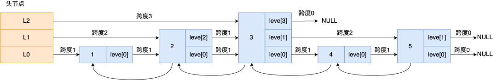

> **Redis 为什么那么快？**

除了它是内存数据库，使得所有的操作都在内存上进行之外，还有一个重要因素，**它实现的数据结构**，使得我们对数据进行增删查改操作时，Redis 能高效的处理。

因此，这次我们就来好好聊一下 Redis 数据结构，这个在面试中太常问了。

注意，**Redis 数据结构并不是指 String（字符串）对象、List（列表）对象、Hash（哈希）对象、Set（集合）对象和 Zset（有序集合）对象，因为这些是 Redis 键值对中值的数据类型，也就是数据的保存形式，这些对象的底层实现的方式就用到了数据结构**。


> Redis 数据类型（也叫 Redis 对象）和底层数据结构的对应关图


可以看到，Redis 数据类型的底层数据结构随着版本的更新也有所不同，比如：

- 在 Redis 3.0 版本中 List 对象的底层数据结构由「双向链表」或「压缩表列表」实现，但是在 3.2 版本之后，List 数据类型底层数据结构是由 quicklist（**其实也就是ziplist和linkedlist的结合体**） 实现的；
- 在最新的 **Redis7** 代码中，压缩列表数据结构已经废弃了，交由 **listpack** [紧凑列表]数据结构来实现了。

**共有 8 种数据结构：SDS、双向链表、压缩列表、哈希表、跳表、整数集合、quicklist、listpack。**

## 对象

### 键值对数据库是怎么实现的？

在开始讲数据结构之前，先给介绍下 Redis 是怎样实现键值对（key-value）数据库的。

Redis 的键值对中的 **key 就是字符串对象**，而 **value 可以是字符串对象，也可以是集合数据类型的对象（RedisObject封装）**，比如 List 对象、Hash 对象、Set 对象和 Zset 对象。

这些键值对是如何保存在 Redis 中的呢？

Redis 是**使用了一个「哈希表」保存所有键值对**，哈希表的最大好处就是让我们可以用 O(1) 的时间复杂度来快速查找到键值对。哈希表其实就是一个数组，数组中的元素叫做哈希桶。

Redis 的哈希桶是怎么保存键值对数据的呢？

哈希桶存放的是指向键值对数据的指针（dictEntry*），这样通过指针就能找到键值对数据，然后因为键值对的值可以保存字符串对象和集合数据类型的对象，所以键值对的数据结构中并不是直接保存值本身，而是保存了 void * key 和 void * value 指针，分别指向了实际的键对象和值对象，这样一来，即使值是集合数据，也可以通过 void * value 指针找到。

这里是一张 Redis 保存键值对所涉及到的数据结构。


### 对象结构设计

- redisDb 结构，表示 Redis 数据库的结构，结构体里存放了指向了 dict 结构的指针；

```c
typedef struct redisDb {
    //字典
    dict *dict;
} redisDb;
```

- dict 结构，结构体里存放了 2 个哈希表，正常情况下都是用「哈希表1」，「哈希表2」只有在 rehash 的时候才用，具体什么是 rehash，我在本文的哈希表数据结构会讲；

```c
typedef struct dict {
    dictType *type;
    void *privdata;
    //哈希表
    dictht ht[2];	
    long rehashidx; 
    int16_t pauserehash;
} dict;
```

- ditctht 结构，表示哈希表的结构，结构里存放了哈希表数组，数组中的每个元素都是指向一个哈希表节点结构（dictEntry）的指针；

```c
typedef struct dictht {
    //哈希表数组
    dictEntry **table;
    //哈希表大小
    unsigned long size;  
    //哈希表大小掩码，用于计算索引值
    unsigned long sizemask;
    //该哈希表已有的节点数量
    unsigned long used;
} dictht;
```

- dictEntry 结构，表示哈希表节点的结构，结构里存放了 **void \* key 和 void \* value 指针， \*key 指向的是 String 对象，而 \*value 则可以指向 String 对象，也可以指向集合类型的对象，比如 List 对象、Hash 对象、Set 对象和 Zset 对象**。

```c
typedef struct dictEntry {
    //键值对中的键
    void *key;
    //键值对中的值
    union {
        void *val;
        uint64_t u64;
        int64_t s64;
        double d;
    } v;
    //指向下一个哈希表节点，形成链表
    struct dictEntry *next;
} dictEntry;
```

- void * key 和 void * value 指针指向的是 **Redis 对象**，Redis 中的每个对象都由 redisObject 结构表示

```c
typedef struct redisObject {
    // 对象的类型，包括：OBJ_STRING、OBJ_LIST、OBJ_HASH、OBJ_SET、OBJ_ZSET
    unsigned type:4;
    // 具体的数据结构
    unsigned encoding:4;
    // 24位，对象最后一次被命令程序访问的时间，与内存回收有关
    unsigned lru:LRU_BITS;
    // 引用计数，当refcount位0的时候，表示该对象以及不被任何对象引用，则可以进行垃圾回收
    int refcount;
    // 指向对象时间的数据结构
    void *ptr;
} robj
```
<div align="center">

</div>

## String

Redis 是用 C 语言实现的，但是它没有直接使用 C 语言的 char* 字符数组来实现字符串，而是自己封装了一个名为**简单动态字符串**（simple dynamic string，SDS） 的数据结构来表示字符串，也就是 Redis 的 String 数据类型的底层数据结构是 SDS。

既然 **Redis 设计了 SDS 结构来表示字符串**，肯定是 C 语言的 char* 字符数组存在一些缺陷。

### C 语言字符串的缺陷

C 语言的字符串其实就是一个字符数组，即数组中每个元素是字符串中的一个字符。

比如，下图就是字符串“xiaolin”的 char* 字符数组的结构：

<div align="center">

</div>
在 C 语言里，对字符串操作时，char * 指针只是指向字符数组的起始位置，而**字符数组的结尾位置就用“\0”表示，意思是指字符串的结束**。

> C 语言的字符串不足之处以及可以改进的地方：

- **获取字符串长度的时间复杂度为  O（N）**；
  - C 语言获取字符串长度的函数 `strlen`，就是通过字符数组中的每一个字符，并进行计数，等遇到字符为 “\0” 后，就会停止遍历，然后返回已经统计到的字符个数，即为字符串长度。
- 字符串的结尾是以 “\0” 字符标识，字符串**里面不能包含有 “\0” 字符，因此不能保存二进制数据**；
  - C 语言字符串用 “\0” 字符作为结尾标记有个缺陷。假设有个字符串中有个 “\0” 字符，这时在操作这个字符串时就会**提早结束**，比如 “xiao\0lin” 字符串，计算字符串长度的时候则会是 4
- 字符串操作函数不高效且不安全，比如有缓冲区溢出的风险，有可能会造成程序运行终止；
  - **C 语言的字符串是不会记录自身的缓冲区大小的**，所以 strcat 函数假定程序员在执行这个函数时，已经为 dest 分配了足够多的内存，可以容纳 src 字符串中的所有内容，而**一旦这个假定不成立，就会发生缓冲区溢出将可能会造成程序运行终止**


### SDS 结构设计

下图就是 Redis 的 SDS 的数据结构：

<div align="center">

</div>
结构中的每个成员变量分别介绍下：

- **len，记录了字符串长度**。这样获取字符串长度的时候，只需要返回这个成员变量值就行，时间复杂度只需要 O（1）。
- **alloc，分配给字符数组的空间长度**。这样在修改字符串的时候，可以通过 `alloc - len` 计算出剩余的空间大小，可以用来判断空间是否满足修改需求，如果不满足的话，就会自动将 SDS  的空间扩展至执行修改所需的大小，然后才执行实际的修改操作，所以使用 SDS 既不需要手动修改 SDS 的空间大小，也不会出现前面所说的缓冲区溢出的问题。
- **flags，用来表示不同类型的 SDS**。
  - 一共设计了 5 种类型，分别是 sdshdr5、sdshdr8、sdshdr16、sdshdr32 和 sdshdr64。
  - **区别就在于，它们数据结构中的 len 和 alloc 成员变量的数据类型不同**。
- **buf[]，字符数组，用来保存实际数据**。不仅可以保存字符串，也可以保存二进制数据。

总的来说，Redis 的 SDS 结构在原本字符数组之上，增加了三个元数据：len、alloc、flags，用来解决 C 语言字符串的缺陷。


- **O（1）复杂度获取字符串长度**

C 语言的字符串长度获取 strlen 函数，需要通过遍历的方式来统计字符串长度，时间复杂度是 O（N）。

而 Redis 的 SDS 结构因为加入了 len 成员变量，那么**获取字符串长度的时候，直接返回这个成员变量的值就行，所以复杂度只有 O（1）**。


- **二进制安全**

因为 SDS 不需要用 “\0” 字符来标识字符串结尾了，而是**有个专门的 len 成员变量来记录长度，所以可存储包含 “\0” 的数据**。但是 SDS 为了兼容部分 C 语言标准库的函数， SDS 字符串结尾还是会加上 “\0” 字符。

因此， SDS 的 API 都是以处理二进制的方式来处理 SDS 存放在 buf[] 里的数据，程序不会对其中的数据做任何限制，数据写入的时候时什么样的，它被读取时就是什么样的。

通过使用二进制安全的 SDS，而不是 C 字符串，使得 Redis 不仅可以保存文本数据，也可以保存任意格式的二进制数据。


- **不会发生缓冲区溢出**

C 语言的字符串标准库提供的字符串操作函数，大多数（比如 strcat 追加字符串函数）都是不安全的，因为这些函数把缓冲区大小是否满足操作需求的工作交由开发者来保证，程序内部并不会判断缓冲区大小是否足够用，当发生了缓冲区溢出就有可能造成程序异常结束。

所以，Redis 的 SDS 结构里引入了 alloc 和 len 成员变量，这样 SDS API 通过 `alloc - len` 计算，可以算出剩余可用的空间大小，这样在对字符串做修改操作的时候，就可以由程序内部判断缓冲区大小是否足够用。

而且，**当判断出缓冲区大小不够用时，Redis 会自动将扩大 SDS 的空间大小（小于 1MB 翻倍扩容，大于 1MB 按 1MB 扩容）**，以满足修改所需的大小。

在扩展 SDS 空间之前，SDS API 会优先检查未使用空间是否足够，如果不够的话，API 不仅会为 SDS 分配修改所必须要的空间，还会给 SDS 分配额外的「未使用空间」。

这样的好处是，下次在操作 SDS 时，如果 SDS 空间够的话，API 就会直接使用「未使用空间」，而无须执行内存分配，**有效的减少内存分配次数**。

所以，使用 SDS 即不需要手动修改 SDS 的空间大小，也不会出现缓冲区溢出的问题。


- **节省内存空间**

SDS 结构中有个 flags 成员变量，表示的是 SDS 类型。

Redos 一共设计了 5 种类型，分别是 sdshdr5、sdshdr8、sdshdr16、sdshdr32 和 sdshdr64。

这 5 种类型的主要**区别就在于，它们数据结构中的 len 和 alloc 成员变量的数据类型不同**。

比如 sdshdr16 和 sdshdr32 这两个类型，它们的定义分别如下：

```c
struct __attribute__ ((__packed__)) sdshdr16 {
    uint16_t len;
    uint16_t alloc; 
    unsigned char flags; 
    char buf[];
};


struct __attribute__ ((__packed__)) sdshdr32 {
    uint32_t len;
    uint32_t alloc; 
    unsigned char flags;
    char buf[];
};
```

可以看到：

- sdshdr16 类型的 len 和 alloc 的数据类型都是 uint16_t，表示字符数组长度和分配空间大小不能超过 2 的 16 次方。
- sdshdr32 则都是 uint32_t，表示表示字符数组长度和分配空间大小不能超过 2 的 32 次方。

**之所以 SDS 设计不同类型的结构体，是为了能灵活保存不同大小的字符串，从而有效节省内存空间**。比如，在保存小字符串时，结构头占用空间也比较少。

除了设计不同类型的结构体，Redis 在编程上还**使用了专门的编译优化来节省内存空间**，即在 struct 声明了 `__attribute__ ((packed))` ，它的作用是：**告诉编译器取消结构体在编译过程中的优化对齐，按照实际占用字节数进行对齐**。


比如，sdshdr16 类型的 SDS，默认情况下，编译器会按照 16 字节对齐的方式给变量分配内存，这意味着，即使一个变量的大小不到 16 个字节，编译器也会给它分配 16 个字节。

举个例子，假设下面这个结构体，它有两个成员变量，类型分别是 char 和 int，如下所示：

```c
#include <stdio.h>

 struct test1 {
    char a;
    int b;
 } test1;

int main() {
     printf("%lu\n", sizeof(test1));
     return 0;
}
```

大家猜猜这个结构体大小是多少？我先直接说答案，这个结构体大小计算出来是 8。
<div align="center">

</div>
这是因为默认情况下，编译器是使用「字节对齐」的方式分配内存，虽然 char 类型只占一个字节，但是由于成员变量里有 int 类型，它占用了 4 个字节，所以在成员变量为 char 类型分配内存时，会分配 4 个字节，其中这多余的 3 个字节是为了字节对齐而分配的，相当于有 3 个字节被浪费掉了。

如果不想编译器使用字节对齐的方式进行分配内存，可以采用了 `__attribute__ ((packed))` 属性定义结构体，这样一来，结构体实际占用多少内存空间，编译器就分配多少空间。

比如，我用 `__attribute__ ((packed))` 属性定义下面的结构体 ，同样包含 char 和 int 两个类型的成员变量，代码如下所示：

```c
#include <stdio.h>

struct __attribute__((packed)) test2  {
    char a;
    int b;
 } test2;

int main() {
     printf("%lu\n", sizeof(test2));
     return 0;
}
```

这时打印的结果是 5（1 个字节 char  + 4 字节 int）。
<div align="center">

</div>
可以看得出，这是按照实际占用字节数进行分配内存的，这样可以节省内存空间。


### 三大物理编码方式

**int**：Long类型整数时，**RedisObject中的ptr指针直接赋值为整数数据**，不再额外的指针再指向整数了，节省了指针的空间开销。

**embstr**：当保存的是字符串数据且字符串小于等于44字节时，embstr类型将会调用内存分配函数，**只分配一块连续的内存空间**，空间中依次包含redisObject与 **sdshdr** 两个数据结构，让元数据、指针和SDS是一块连续的内存区域，这样就可以避免内存碎片

**raw**：当字符串大于44字节时，SDS的数据量变多变大了，SDS和RedisObject布局分家各自过，会给SDS分配多的空间并用指针指向SDS结构，raw类型将会**调用两次内存分配函数**，分配两块内存空间，一块用于包含redisObject结构，而另一块用于包含sdshdr结构


只有整数才会使用int，如果是浮点数， Redis 内部其实先将浮点数转化为字符串值，然后再保存。embstr 与 raw类型底层的数据结构其实都是**SDS(简单动态字符串**，Redis内部定义sdshdr一种结构)。

那这两者的区别见下图:


**Redis内部会根据用户给的不同键值而使用不同的编码格式，自适应地选择较优化地内部编码格式，而这一切对用户完全透明**


## Hash

### Hash的两种编码格式

**Redis6的Hash：采用 压缩列表（Ziplist） 或者 哈希表（hashtable）**

```bash
127.0.0.1:6379> config get hash*
1) "hash-max-ziplist-entries"
2) "512"
3) "hash-max-ziplist-value"
4) "64"
```

- hash-max-ziplist-entries:使用压缩列表保存时哈希集合中的最大元素个数。
- hash-max-ziplist-value:使用压缩列表保存时哈希集合中单个元素的最大长度。


**Redis7的Hash ：采用 紧凑列表（listpack）或者 哈希表（hashtable）**

```bash
127.0.0.1:6379> config get hash*
1) "hash-max-listpack-entries"
2) "512"
3) "hash-max-listpack-value"
4) "64"
```

- hash-max-listpack-entries:使用紧凑列表保存时哈希集合中的最大元素个数。
- hash-max-listpack-value:使用紧凑列表保存时哈希集合中单个元素的最大长度。


### HSet的流程

1. 哈希对象保存的键值对数量小于512个;
2. 所有的键值对的健和值的字符串长度都小于等于64byte时用ziplist/listpack，反之用hashtable
3. ziplist/listpack 升级到hashtable可以，反过来降级不可以


### hashTable 结构设计

Redis 的哈希表结构如下：

```c
typedef struct dictht {
    //哈希表数组
    dictEntry **table;
    //哈希表大小
    unsigned long size;  
    //哈希表大小掩码，用于计算索引值
    unsigned long sizemask;
    //该哈希表已有的节点数量
    unsigned long used;
} dictht;
```

可以看到，哈希表是一个数组（dictEntry **table），数组的每个元素是一个指向「哈希表节点（dictEntry）」的指针。


哈希表节点的结构如下：

```c
typedef struct dictEntry {
    //键值对中的键
    void *key;

    //键值对中的值
    union {
        void *val;
        uint64_t u64;
        int64_t s64;
        double d;
    } v;
    //指向下一个哈希表节点，形成链表
    struct dictEntry *next;
} dictEntry;
```

dictEntry 结构里不仅包含指向键和值的指针，还包含了指向下一个哈希表节点的指针，这个指针可以将多个哈希值相同的键值对链接起来，以此来解决哈希冲突的问题，这就是链式哈希。


### zipList 结构设计

ZipList压缩列表的最大特点，就是它被设计成一种内存紧凑型的数据结构，占用一块连续的内存空间，不仅可以利用 CPU 缓存，而且会针对不同长度的数据，进行相应编码，这种方法可以有效地节省内存开销。

但是，压缩列表的缺陷也是有的：

- 不能保存过多的元素，否则查询效率就会降低；
- 新增或修改某个元素时，压缩列表占用的内存空间需要重新分配，甚至可能引发连锁更新的问题。

因此，Redis 对象（List 对象、Hash 对象、Zset 对象）包含的元素数量较少，或者元素值不大的情况才会使用压缩列表作为底层数据结构。

#### 压缩列表结构设计

压缩列表是 Redis 为了节约内存而开发的，它是**由连续内存块组成的顺序型数据结构**，有点类似于数组。


压缩列表在表头有三个字段：

- **zlbytes**，记录整个压缩列表占用对内存字节数；
- **zltail**，记录压缩列表「尾部」节点距离起始地址由多少字节，也就是列表尾的偏移量；
- **zllen**，记录压缩列表包含的节点数量；
- **zlend**，标记压缩列表的结束点，固定值 0xFF（十进制255）。

在压缩列表中，如果我们要查找定位第一个元素和最后一个元素，可以通过表头三个字段的长度直接定位，复杂度是 O(1)。而**查找其他元素时，就没有这么高效了，只能逐个查找，此时的复杂度就是 O(N) 了，因此压缩列表不适合保存过多的元素**。

另外，压缩列表节点（entry）的构成如下：


压缩列表节点包含三部分内容：

- **prevlen**，记录了「前一个节点」的长度；
- **encoding**，记录了当前节点实际数据的类型以及长度；
- **data**，记录了当前节点的实际数据；

当我们往压缩列表中插入数据时，压缩列表就会根据数据是字符串还是整数，以及数据的大小，会使用不同空间大小的 prevlen 和 encoding 这两个元素里保存的信息，**这种根据数据大小和类型进行不同的空间大小分配的设计思想，正是 Redis 为了节省内存而采用的**。

分别说下，prevlen 和 encoding 是如何根据数据的大小和类型来进行不同的空间大小分配。

压缩列表里的每个节点中的  prevlen 属性都记录了「前一个节点的长度」，而且 prevlen 属性的空间大小跟前一个节点长度值有关，比如：

- 如果**前一个节点的长度小于 254 字节**，那么 prevlen 属性需要用 **1 字节的空间**来保存这个长度值；
- 如果**前一个节点的长度大于等于 254 字节**，那么 prevlen 属性需要用 **5 字节的空间**来保存这个长度值；

encoding 属性的空间大小跟数据是字符串还是整数，以及字符串的长度有关：

- 如果**当前节点的数据是整数**，则 encoding 会使用 **1 字节的空间**进行编码。
- 如果**当前节点的数据是字符串，根据字符串的长度大小**，encoding 会使用 **1 字节/2字节/5字节的空间**进行编码。


#### 连锁更新

压缩列表除了查找复杂度高的问题，还有一个问题。

**压缩列表新增某个元素或修改某个元素时，如果空间不不够，压缩列表占用的内存空间就需要重新分配。而当新插入的元素较大时，可能会导致后续元素的 prevlen 占用空间都发生变化，从而引起「连锁更新」问题，导致每个元素的空间都要重新分配，造成访问压缩列表性能的下降**。

前面提到，压缩列表节点的 prevlen 属性会根据前一个节点的长度进行不同的空间大小分配：

- 如果前一个**节点的长度小于 254 字节**，那么 prevlen 属性需要用 **1 字节的空间**来保存这个长度值；
- 如果前一个**节点的长度大于等于 254 字节**，那么 prevlen 属性需要用 **5 字节的空间**来保存这个长度值；

现在假设一个压缩列表中有多个连续的、长度在 250～253 之间的节点，如下图：


因为这些节点长度值小于 254 字节，所以 prevlen 属性需要用 1 字节的空间来保存这个长度值。

这时，如果将一个长度大于等于 254 字节的新节点加入到压缩列表的表头节点，即新节点将成为 e1 的前置节点，如下图：


因为 e1 节点的 prevlen 属性只有 1 个字节大小，无法保存新节点的长度，此时就需要对压缩列表的空间重分配操作，并将 e1 节点的 prevlen 属性从原来的 1 字节大小扩展为 5 字节大小。

多米诺牌的效应就此开始。


e1 原本的长度在 250～253 之间，因为刚才的扩展空间，此时 e1 的长度就大于等于 254 了，因此原本 e2 保存 e1 的 prevlen 属性也必须从 1 字节扩展至 5 字节大小。

正如扩展 e1 引发了对 e2 扩展一样，扩展 e2 也会引发对 e3 的扩展，而扩展 e3 又会引发对 e4 的扩展…. 一直持续到结尾。

**这种在特殊情况下产生的连续多次空间扩展操作就叫做「连锁更新」**，就像多米诺牌的效应一样，第一张牌倒下了，推动了第二张牌倒下；第二张牌倒下，又推动了第三张牌倒下….，

#### 压缩列表的缺陷

空间扩展操作也就是重新分配内存，因此**连锁更新一旦发生，就会导致压缩列表占用的内存空间要多次重新分配，这就会直接影响到压缩列表的访问性能**。

所以说，**虽然压缩列表紧凑型的内存布局能节省内存开销，但是如果保存的元素数量增加了，或是元素变大了，会导致内存重新分配，最糟糕的是会有「连锁更新」的问题**。

因此，**压缩列表只会用于保存的节点数量不多的场景**，只要节点数量足够小，即使发生连锁更新，也是能接受的。

虽说如此，Redis 针对压缩列表在设计上的不足，在后来的版本中，新增设计了两种数据结构：quicklist（Redis 3.2 引入） 和 listpack（Redis 5.0 引入）。这两种数据结构的设计目标，就是尽可能地保持压缩列表节省内存的优势，同时解决压缩列表的「连锁更新」的问题。


### listpack 结构设计

于是，Redis 在 5.0 新设计一个数据结构叫 listpack，目的是替代压缩列表，它最大特点是 listpack 中每个节点不再包含前一个节点的长度了，压缩列表每个节点正因为需要保存前一个节点的长度字段，就会有连锁更新的隐患。

listpack 采用了压缩列表的很多优秀的设计，比如还是用一块连续的内存空间来紧凑地保存数据，并且为了节省内存的开销，listpack 节点会采用不同的编码方式保存不同大小的数据。

我们先看看 listpack 结构：


listpack 头包含两个属性，分别记录了 listpack 总字节数和元素数量，然后 listpack 末尾也有个结尾标识。图中的 listpack entry 就是 listpack 的节点了。

每个 listpack 节点结构如下：


主要包含三个方面内容：

- encoding，定义该元素的编码类型，会对不同长度的整数和字符串进行编码；
- data，实际存放的数据；
- len，encoding+data的总长度；

可以看到，**listpack 没有压缩列表中记录前一个节点长度的字段了，listpack 只记录当前节点的长度，当我们向 listpack 加入一个新元素的时候，不会影响其他节点的长度字段的变化，从而避免了压缩列表的连锁更新问题**。


## List

### List的三种编码格式

- Redis 3.0 之前：采用**双向链表（LinkedList）或者 压缩列表（ziplist）**。
- Redis 3.2 的时候：采用**quicklist （就是「双向链表 + 压缩列表」组合）**。
- Redis 7：采用quciklist（「双向链表 + **紧凑列表**」组合）


配置项：

```bash
127.0.0.1:6379> config get list*
1) "list-max-ziplist-size"
2) "-2"
3) "list-compress-depth"
4) "0"
```

（1）ziplist压缩配置：**list-compress-depth 0**
表示一个quicklist两端不被压缩的节点个数。这里的节点是指quicklist双向链表的节点，而不是指ziplist里面的数据项个数参数list-compress-depth的取值含义如下:

- **0：是个特殊值，表示都不压缩。这是Redis的默认值。**
- 1：表示quicklist两端各有1个节点不压缩，中间的节点压缩。
- 2：表示quicklist两端各有2个节点不压缩，中间的节点压缩。
- 3：表示quicklist两端各有3个节点不压缩，中间的节点压缩。
- 依此类推…

（2）ziplist中entry配置：**list-max-ziplist-size -2**
当取正值的时候，表示按照数据项个数来限定每个quicklist节点上的ziplist长度。比如，当这个参数配置成5的时候，表示每个quicklist节点的ziplist最多包含5个数据项。**当取负值的时候，表示按照占用字节数来限定每个quicklist节点上的ziplist长度。**这时，它只能取-1到-5这五个值，每个值含义如下:

- -5:每个quicklist攸点上的ziplist大小不能超过64 Kb。（注: 1kb => 1024 bytes)
- -4:每个quicklist节点上的ziplist大小不能超过32 Kb。
- -3:每个quicklist节点上的ziplist大小不能超过16 Kb。
- **-2:每个quicklist节点上的ziplist大小不能超过8 Kb。(-2是Redis给出的默认值)**
- -1:每个quicklist节点上的ziplist大小不能超过4 Kb。


### 双向链表结构设计

Redis 的 List 对象的底层实现之一就是链表。C 语言本身没有链表这个数据结构的，所以 Redis 自己设计了一个链表数据结构。

#### 链表节点结构设计

先来看看「链表节点」结构的样子：

```c
typedef struct listNode {
    //前置节点
    struct listNode *prev;
    //后置节点
    struct listNode *next;
    //节点的值
    void *value;
} listNode;
```

有前置节点和后置节点，可以看的出，这个是一个双向链表。


#### 链表结构设计

不过，Redis 在 listNode 结构体基础上又封装了 list 这个数据结构，这样操作起来会更方便，链表结构如下：

```c
typedef struct list {
    //链表头节点
    listNode *head;
    //链表尾节点
    listNode *tail;
    //节点值复制函数
    void *(*dup)(void *ptr);
    //节点值释放函数
    void (*free)(void *ptr);
    //节点值比较函数
    int (*match)(void *ptr, void *key);
    //链表节点数量
    unsigned long len;
} list;
```

list 结构为链表提供了链表头指针 head、链表尾节点 tail、链表节点数量 len、以及可以自定义实现的 dup、free、match 函数。

举个例子，下面是由 list 结构和 3 个 listNode 结构组成的链表。


#### 链表的优势与缺陷

Redis 的链表实现优点如下：

- listNode 链表节点的结构里带有 prev 和 next 指针，**获取某个节点的前置节点或后置节点的时间复杂度只需O(1)，而且这两个指针都可以指向 NULL，所以链表是无环链表**；
- list 结构因为提供了表头指针 head 和表尾节点 tail，所以**获取链表的表头节点和表尾节点的时间复杂度只需O(1)**；
- list 结构因为提供了链表节点数量 len，所以**获取链表中的节点数量的时间复杂度只需O(1)**；
- listNode 链表节使用 void* 指针保存节点值，并且可以通过 list 结构的 dup、free、match 函数指针为节点设置该节点类型特定的函数，因此**链表节点可以保存各种不同类型的值**；

链表的缺陷也是有的：

- 链表每个节点之间的内存都是不连续的，意味着**无法很好利用 CPU 缓存**。能很好利用 CPU 缓存的数据结构就是数组，因为数组的内存是连续的，这样就可以充分利用 CPU 缓存来加速访问。
- 还有一点，保存一个链表节点的值都需要一个链表节点结构头的分配，**内存开销较大**。

因此，Redis 3.0 的 List 对象在数据量比较少的情况下，会采用「压缩列表」作为底层数据结构的实现，它的优势是节省内存空间，并且是内存紧凑型的数据结构。

不过，**压缩列表存在性能问题**，所以 Redis 在 3.2 版本设计了新的数据结构 quicklist，并将 List 对象的底层数据结构改由 quicklist 实现。

然后在  Redis 5.0 设计了新的数据结构 listpack，沿用了压缩列表紧凑型的内存布局，最终在最新的 Redis7 版本，将 Hash 对象和 Zset 对象的底层数据结构实现之一的压缩列表，**替换成由  listpack** 实现。


### quicklist 结构设计

在 Redis 3.0 之前，List 对象的底层数据结构是双向链表或者压缩列表。然后在  Redis 3.2 的时候，List 对象的底层改由 quicklist 数据结构实现。

其实 quicklist 就是「双向链表 + 压缩列表」组合，因为一个 quicklist 就是一个链表，而链表中的每个元素又是一个压缩列表。

在前面讲压缩列表的时候，我也提到了压缩列表的不足，虽然压缩列表是通过紧凑型的内存布局节省了内存开销，但是因为它的结构设计，如果保存的元素数量增加，或者元素变大了，压缩列表会有「连锁更新」的风险，一旦发生，会造成性能下降。

quicklist 解决办法，**通过控制每个链表节点中的压缩列表的大小或者元素个数，来规避连锁更新的问题。因为压缩列表元素越少或越小，连锁更新带来的影响就越小，从而提供了更好的访问性能。**

quicklist 的结构体跟链表的结构体类似，都包含了表头和表尾，区别在于 quicklist 的节点是 quicklistNode。

```c
typedef struct quicklist {
    //quicklist的链表头
    quicklistNode *head;      //quicklist的链表头
    //quicklist的链表头
    quicklistNode *tail; 
    //所有压缩列表中的总元素个数
    unsigned long count;
    //quicklistNodes的个数
    unsigned long len;       
    ...
} quicklist;
```

接下来看看，quicklistNode 的结构定义：

```c
typedef struct quicklistNode {
    //前一个quicklistNode
    struct quicklistNode *prev;     //前一个quicklistNode
    //下一个quicklistNode
    struct quicklistNode *next;     //后一个quicklistNode
    //quicklistNode指向的压缩列表
    unsigned char *zl;              
    //压缩列表的的字节大小
    unsigned int sz;                
    //压缩列表的元素个数
    unsigned int count : 16;        //ziplist中的元素个数 
    ....
} quicklistNode;
```

可以看到，quicklistNode 结构体里包含了前一个节点和下一个节点指针，这样每个 quicklistNode 形成了一个双向链表。但是链表节点的元素不再是单纯保存元素值，而是保存了一个压缩列表，所以 quicklistNode 结构体里有个指向压缩列表的指针 *zl。


在向 quicklist 添加一个元素的时候，不会像普通的链表那样，直接新建一个链表节点。而是会检查插入位置的压缩列表是否能容纳该元素，如果能容纳就直接保存到 quicklistNode 结构里的压缩列表，如果不能容纳，才会新建一个新的 quicklistNode 结构。

quicklist 会控制 quicklistNode 结构里的压缩列表的大小或者元素个数，来规避潜在的连锁更新的风险，但是这并没有完全解决连锁更新的问题。

**而 Redis7已经将所有用到压缩列表底层数据结构的 Redis 对象替换成 listpack 数据结构来实现**


## Set

### Set的两种编码格式

- 采用**整数集合（intset）或者 哈希表（hashtable）**。


**配置项：集合元素都是longlong类型并且元素个数<=set-max-intset-entries编码就是intset,反之就是hashtable**

```bash
127.0.0.1:6379> config get *set
1) "set-max-intset-entries"
2) "512"
```


### intset 结构设计

intset整数集合是  Set 对象的底层实现之一。当一个 Set 对象只包含整数值元素，并且元素数量<=set-max-intset-entries时，就会使用整数集这个数据结构作为底层实现。

#### 整数集合结构设计

整数集合本质上是一块连续内存空间，它的结构定义如下：

```c
typedef struct intset {
    //编码方式
    uint32_t encoding;
    //集合包含的元素数量
    uint32_t length;
    //保存元素的数组
    int8_t contents[];
} intset;
```

可以看到，保存元素的容器是一个 contents 数组，虽然 contents 被声明为 int8_t 类型的数组，但是实际上 contents 数组并不保存任何 int8_t 类型的元素，contents 数组的真正类型取决于 intset 结构体里的 encoding 属性的值。比如：

- 如果 encoding 属性值为 INTSET_ENC_INT16，那么 contents 就是一个 int16_t 类型的数组，数组中每一个元素的类型都是 int16_t；
- 如果 encoding 属性值为 INTSET_ENC_INT32，那么 contents 就是一个 int32_t 类型的数组，数组中每一个元素的类型都是 int32_t；
- 如果 encoding 属性值为 INTSET_ENC_INT64，那么 contents 就是一个 int64_t 类型的数组，数组中每一个元素的类型都是 int64_t；

不同类型的 contents 数组，意味着数组的大小也会不同。

#### 整数集合的升级操作

整数集合会有一个升级规则，就是当我们将一个新元素加入到整数集合里面，如果新元素的类型（int32_t）比整数集合现有所有元素的类型（int16_t）都要长时，整数集合需要先进行升级，也就是按新元素的类型（int32_t）扩展 contents 数组的空间大小，然后才能将新元素加入到整数集合里，当然升级的过程中，也要维持整数集合的有序性。

整数集合升级的过程不会重新分配一个新类型的数组，而是在原本的数组上扩展空间，然后在将每个元素按间隔类型大小分割，如果 encoding 属性值为 INTSET_ENC_INT16，则每个元素的间隔就是 16 位。

举个例子，假设有一个整数集合里有 3 个类型为 int16_t 的元素。


现在，往这个整数集合中加入一个新元素 65535，这个新元素需要用 int32_t 类型来保存，所以整数集合要进行升级操作，首先需要为 contents 数组扩容，**在原本空间的大小之上再扩容多 80 位（4x32-3x16=80），这样就能保存下 4 个类型为 int32_t 的元素**。


扩容完 contents 数组空间大小后，需要将之前的三个元素转换为 int32_t 类型，并将转换后的元素放置到正确的位上面，并且需要维持底层数组的有序性不变，整个转换过程如下：


> 整数集合升级有什么好处呢？

如果要让一个数组同时保存 int16_t、int32_t、int64_t 类型的元素，最简单做法就是直接使用 int64_t 类型的数组。不过这样的话，当如果元素都是 int16_t 类型的，就会造成内存浪费的情况。

整数集合升级就能避免这种情况，如果一直向整数集合添加 int16_t 类型的元素，那么整数集合的底层实现就一直是用 int16_t 类型的数组，只有在我们要将 int32_t 类型或 int64_t 类型的元素添加到集合时，才会对数组进行升级操作。

因此，整数集合升级的好处是**节省内存资源**。

> 整数集合支持降级操作吗？

**不支持降级操作**，一旦对数组进行了升级，就会一直保持升级后的状态。比如前面的升级操作的例子，如果删除了 65535 元素，整数集合的数组还是 int32_t 类型的，并不会因此降级为 int16_t 类型。


## ZSet

### Zset的两种编码格式

- Redis 6：采用**跳表（skiplist）或者 压缩列表（ziplist）**。
- Redis 7：采用**跳表（skiplist）或者 紧凑列表（listpack）**。

```bash
127.0.0.1:6379> config get zset*
1) "zset-max-ziplist-entries"
2) "128"
3) "zset-max-ziplist-value"
4) "64"
```

当有序集合中包含的元素数量超过服务器属性 server.zset_max_ziplist_entries 的值（默认值为128）**或者**有序集合中新添加元素的 member的长度大于服务器属性server.zset_max_ziplist_value的值（默认值为64〉时，redis会使用**跳跃表**作为有序集合的底层实现。
否则会使用**ziplist/listpack**作为有序集合的底层实现


### Skiplist 结构设计

Redis 只有在 Zset 对象的底层实现用到了跳表，跳表的优势是能支持平均 O(logN) 复杂度的节点查找。

Zset 对象是唯一一个同时使用了两个数据结构来实现的 Redis 对象，这两个数据结构一个是跳表，一个是哈希表。这样的好处是既能进行高效的范围查询，也能进行高效单点查询。

```
typedef struct zset {
    dict *dict;
    zskiplist *zsl;
} zset;
```

Zset 对象能支持范围查询（如 ZRANGEBYSCORE 操作），这是因为它的数据结构设计采用了跳表，而又能以常数复杂度获取元素权重（如 ZSCORE 操作），这是因为它同时采用了哈希表进行索引。

接下来，详细的说下跳表。

#### 跳表结构设计

链表在查找元素的时候，因为需要逐一查找，所以查询效率非常低，时间复杂度是O(N)，于是就出现了跳表。**跳表是在链表基础上改进过来的，实现了一种「多层」的有序链表**，这样的好处是能快读定位数据。

那跳表长什么样呢？我这里举个例子，下图展示了一个层级为 3 的跳表。


图中头节点有 L0~L2 三个头指针，分别指向了不同层级的节点，然后每个层级的节点都通过指针连接起来：

- L0 层级共有 5 个节点，分别是节点1、2、3、4、5；
- L1 层级共有 3 个节点，分别是节点 2、3、5；
- L2 层级只有 1 个节点，也就是节点 3 。

如果我们要在链表中查找节点 4 这个元素，只能从头开始遍历链表，需要查找 4 次，而使用了跳表后，只需要查找 2 次就能定位到节点 4，因为可以在头节点直接从 L2 层级跳到节点 3，然后再往前遍历找到节点 4。

可以看到，这个查找过程就是在多个层级上跳来跳去，最后定位到元素。当数据量很大时，跳表的查找复杂度就是 O(logN)。

那跳表节点是怎么实现多层级的呢？这就需要看「跳表节点」的数据结构了，如下：

```c
typedef struct zskiplistNode {
    //Zset 对象的元素值
    sds ele;
    //元素权重值
    double score;
    //后向指针
    struct zskiplistNode *backward;

    //节点的level数组，保存每层上的前向指针和跨度
    struct zskiplistLevel {
        struct zskiplistNode *forward;
        unsigned long span;
    } level[];
} zskiplistNode;
```

Zset 对象要同时保存元素和元素的权重，对应到跳表节点结构里就是 sds 类型的 ele 变量和 double 类型的 score 变量。每个跳表节点都有一个后向指针，指向前一个节点，目的是为了方便从跳表的尾节点开始访问节点，这样倒序查找时很方便。

跳表是一个带有层级关系的链表，而且每一层级可以包含多个节点，每一个节点通过指针连接起来，实现这一特性就是靠跳表节点结构体中的**zskiplistLevel 结构体类型的 level 数组**。

level 数组中的每一个元素代表跳表的一层，也就是由 zskiplistLevel 结构体表示，比如 leve[0] 就表示第一层，leve[1] 就表示第二层。zskiplistLevel 结构体里定义了「指向下一个跳表节点的指针」和「跨度」，跨度时用来记录两个节点之间的距离。

比如，下面这张图，展示了各个节点的跨度。



第一眼看到跨度的时候，以为是遍历操作有关，实际上并没有任何关系，遍历操作只需要用前向指针就可以完成了。

**跨度实际上是为了计算这个节点在跳表中的排位**。具体怎么做的呢？因为跳表中的节点都是按序排列的，那么计算某个节点排位的时候，从头节点点到该结点的查询路径上，将沿途访问过的所有层的跨度累加起来，得到的结果就是目标节点在跳表中的排位。

举个例子，查找图中节点 3 在跳表中的排位，从头节点开始查找节点 3，查找的过程只经过了一个层（L3），并且层的跨度是 3，所以节点 3 在跳表中的排位是 3。

另外，图中的头节点其实也是 zskiplistNode 跳表节点，只不过头节点的后向指针、权重、元素值都会被用到，所以图中省略了这部分。

问题来了，由谁定义哪个跳表节点是头节点呢？这就介绍「跳表」结构体了，如下所示：

```c
typedef struct zskiplist {
    struct zskiplistNode *header, *tail;
    unsigned long length;
    int level;
} zskiplist;
```

跳表结构里包含了：

- 跳表的头尾节点，便于在O(1)时间复杂度内访问跳表的头节点和尾节点；
- 跳表的长度，便于在O(1)时间复杂度获取跳表节点的数量；
- 跳表的最大层数，便于在O(1)时间复杂度获取跳表中层高最大的那个节点的层数量；

#### 跳表节点查询过程

查找一个跳表节点的过程时，跳表会从头节点的最高层开始，逐一遍历每一层。在遍历某一层的跳表节点时，会用跳表节点中的 SDS 类型的元素和元素的权重来进行判断，共有两个判断条件：

- 如果当前节点的权重「小于」要查找的权重时，跳表就会访问该层上的下一个节点。
- 如果当前节点的权重「等于」要查找的权重时，并且当前节点的 SDS 类型数据「小于」要查找的数据时，跳表就会访问该层上的下一个节点。

如果上面两个条件都不满足，或者下一个节点为空时，跳表就会使用目前遍历到的节点的 level 数组里的下一层指针，然后沿着下一层指针继续查找，这就相当于跳到了下一层接着查找。

举个例子，下图有个 3 层级的跳表。


如果要查找「元素：abcd，权重：4」的节点，查找的过程是这样的：

- 先从头节点的最高层开始，L2 指向了「元素：abc，权重：3」节点，这个节点的权重比要查找节点的小，所以要访问该层上的下一个节点；
- 但是该层上的下一个节点是空节点，于是就会跳到「元素：abc，权重：3」节点的下一层去找，也就是 leve[1];
- 「元素：abc，权重：3」节点的  leve[1] 的下一个指针指向了「元素：abcde，权重：4」的节点，然后将其和要查找的节点比较。虽然「元素：abcde，权重：4」的节点的权重和要查找的权重相同，但是当前节点的 SDS 类型数据「大于」要查找的数据，所以会继续跳到「元素：abc，权重：3」节点的下一层去找，也就是 leve[0]；
- 「元素：abc，权重：3」节点的 leve[0] 的下一个指针指向了「元素：abcd，权重：4」的节点，该节点正是要查找的节点，查询结束。

#### 跳表节点层数设置

跳表的相邻两层的节点数量的比例会影响跳表的查询性能。

举个例子，下图的跳表，第二层的节点数量只有 1 个，而第一层的节点数量有 6 个。


这时，如果想要查询节点 6，那基本就跟链表的查询复杂度一样，就需要在第一层的节点中依次顺序查找，复杂度就是 O(N) 了。所以，为了降低查询复杂度，我们就需要维持相邻层结点数间的关系。

**跳表的相邻两层的节点数量最理想的比例是 2:1，查找复杂度可以降低到 O(logN)**。

下图的跳表就是，相邻两层的节点数量的比例是 2 : 1。


> 那怎样才能维持相邻两层的节点数量的比例为 2 : 1  呢？

如果采用新增节点或者删除节点时，来调整跳表节点以维持比例的方法的话，会带来额外的开销。

Redis 则采用一种巧妙的方法是，**跳表在创建节点的时候，随机生成每个节点的层数**，并没有严格维持相邻两层的节点数量比例为 2 : 1 的情况。

具体的做法是，**跳表在创建节点时候，会生成范围为[0-1]的一个随机数，如果这个随机数小于 0.25（相当于概率 25%），那么层数就增加 1 层，然后继续生成下一个随机数，直到随机数的结果大于 0.25 结束，最终确定该节点的层数**。

这样的做法，相当于每增加一层的概率不超过 25%，层数越高，概率越低，层高最大限制是 64。
