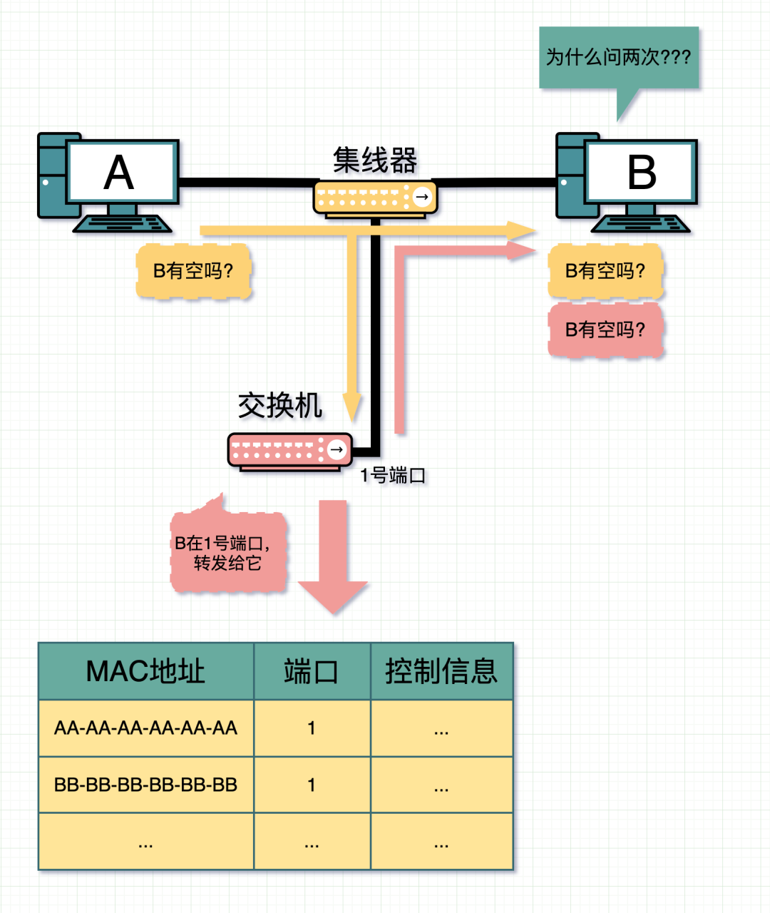
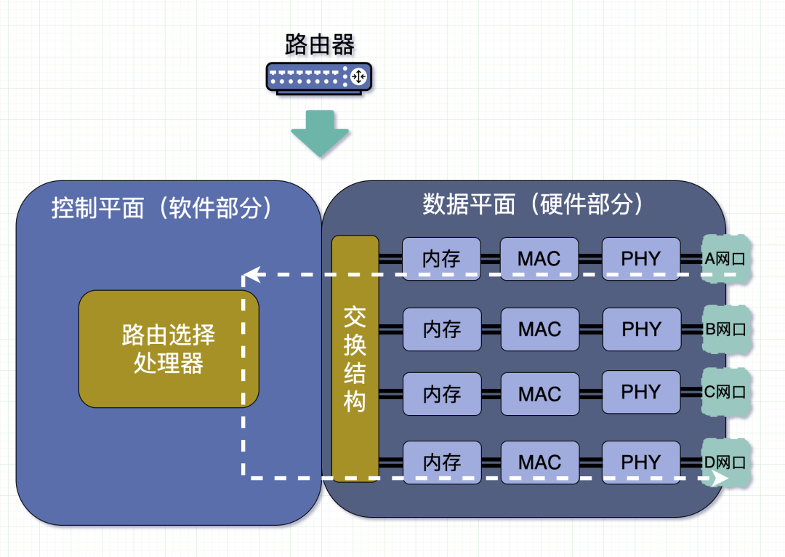

## 一根网线互联电脑

从最简单的场景说起，假设网吧内只有**两台**电脑

## 集线器

**集线器（hub）**是个工作在**物理层**的设备。

有**多个网口**，很好的解决了电脑上只有一个网口的问题，可以做到多台电脑的网线都插入到集线器上。

同时工作原理也非常简单，会把某个端口收到的数据，输入到**中继电路**。中继电路的基本功能是将输入的信号广播到集线器的所有端口上。简单来说就是**无脑复制N份到其余N个端口**上。

### 集线器内部结构

从A网口进入集线器的消息，此时还是电信号。这里经过一个PHY模块。

> 要理解PHY模块的作用，首先要先了解每个网口，都可能接着网线（*废话*），而每根网线的传输的格式都是有可能不同的。而PHY的作用，就是把这些格式转化为一个通用的格式。
>
> 举个例子。PHY就好比一个翻译器，有的人说英文，有的人说日文。但是PHY，会把它统一转为普通话，给内部电路处理。内部电路处理完之后，再经过PHY模块，转为英语，或日文从对应网口里输出。

经过PHY的处理后，以电信号的形式输入到中继电路，被无脑广播，再次经过PHY模块后变成BCD网口的格式输出。

### 那信号如果出错了怎么办？

这里面的电信号，是会受噪声干扰，导致信号形变出错的。但就算是错了，也还是会**原封不动**的广播出去，这就是上面提到**无脑**的精髓所在。

只能让接收方收到消息后进行校验。

数据链路层的MAC报头里最末尾有个**FCS**，FCS里存放的是发送方通过循环冗余校验CRC计算得到的值。**接收方**用收到的数据算一次CRC，与FCS里的值进行对比。如果一致，那证明数据没问题。如果出错，则**直接丢弃**。

## 交换机

集线器每台机器发一条消息，**都会被广播**。交换机接收到的数据，都会先进入交换机的缓存区。接着消息再被**转发**到对应机器上。

**交换机**，又叫**switch**，跟集线器长得很像。但是功能更强一些，从网络分层上来说，属于**数据链路层**，比集线器所在的**物理层**还要高一层。

### MAC地址表

交换机内部维护了一张**MAC地址表**。记录了 端口号和MAC地址的对应关系。

这个表的数据是交换机**不断学习**的结果。

当A发消息到交换机时，交换机发现消息是从1号端口进来的，则会在MAC地址表上，记录A的MAC地址对应1号端口。如果A没有很长时间没发消息到这个1号端口，那这条记录就会**过期并被删除**。那么，当时间足够长，ABC 都发过消息给交换机后，地址表就会有完整的关系信息。

- A准备发送消息给B，此时A会把B的MAC地址，放入要发送的数据里。数据顺着网线发出。
- 交换机从端口收到数据，会把数据里的源和目的MAC地址提出来，跟MAC地址表进行对比。
- 发现**B的MAC地址正好在2号端口**，那么就把数据转发给2号端口。
- 此时B电脑从网线收到来自交换机2号端口的数据。

### 两种特殊情况

正常流程很清楚了，看两个**特殊情况**：

1. 交换机查询地址表时，发现目的 MAC 地址的目标端口和这个包的源端口，是同一个端口，怎么办？

   **会直接丢弃这个包**。

   我们看下，假设它不丢弃，会发生什么情况。
   

   
   

   - A发了个消息给B，中间经过一个**集线器**，此时消息会被**广播**到B和交换机。
   - 此时B收到**第一条**A发给它的消息
   - 交换机从1号端口收到A的消息后，解包，获得目的MAC地址是BB-BB-BB-BB-BB-BB。查MAC地址表，发现要发到1号端口。此时，源和目的端口都是同一个，**如果交换机不丢弃这个消息**，B会收到**第二条**A发给它的消息。

2. MAC地址表里找不到对应的MAC地址，怎么办？

   这可能是因为具有该地址的设备，还没有向交换机发送过包，或者这个设备一段时间没有工作，导致地址被从地址表中删除了。

   这种情况下，交换机无法判断应该把包转发到哪个端口，只能将包转发到除了源端口之外的所有端口上，无论该设备连接在哪个端口上，都能收到这个包。

   此时，交换机就会跟集线器一样进行**广播**。

   发送了包之后目标设备会作出响应，只要返回了响应包，交换机就可以将它的地址写入地址表，下次也就不需要把包 发到所有端口了。

### 交换机内部结构

再看下交换机内部结构。

其实对比可以发现，交换机和集线器内部结构很像。

重点需要提到的是MAC模块。消息以**电信号**的形式从网口进入，到了PHY会被转成**通用格式**的电信号。而MAC模块的作用是把这个电信号转为**数字信号**，这样就能提取出MAC包头，并通过MAC数据帧末尾的**FCS校验**这个包有没有问题，如果没问题，则把数据放到**内存缓冲区**里，否则直接丢弃。

另外，这个MAC模块，虽然这么叫。但其实**交换机MAC模块不具有 MAC 地址**。因此交换机的端口不核对接收方 MAC 地址，而是直接接收所有的包并存放到缓冲区中。

放入到内存缓冲区后，还会把MAC地址和端口号记录到MAC地址表中。同时检查**目的MAC地址**在不在MAC地址表中，在的话则会**转发**到对应端口。否则**广播**。

### 交换机与网桥的区别

网桥，本质上可以理解为**两个网线口的交换机**，正好可以把两台电脑给连起来，也叫**桥接**。而交换机，则是**多网线口的网桥**，可以把多台电脑给连（桥接）起来。

其他功能方面，大差不差，不必太过纠结。

### 交换机和二层交换机和三层交换机有什么区别

这一部分提到的**交换机**，其实就是**二层交换机**，也就是工作在第二层（**数据链路层**）的交换机，二者**没区别**。

而**三层交换机**，是工作在第三层（**网络层**）的交换机，其实就是接下来要提到的**路由器**。

## 路由器

有了交换机之后，小网吧里的电脑就都可以被连起来了。交换机网口不够？那就再接个交换机。但世界上电脑这么多，交换机里的MAC地址表难道全都要记住吗?显然做不到。为了解决这个问题。

于是就有了**路由器**，工作在**网络层**，比数据链路层更高一层。

### 路由表

路由器的作用，可以帮助我们在互联网世界里转发消息到对应的IP。

对比一下。

交换机，是通过 MAC 头部中，接收方 MAC 地址，来判断转发目标的。

路由器，则是根据 IP 头部中， IP 地址来判断的。

由于使用的地址不同，记录转发信息的表也会不同。

类似交换机的MAC地址表，路由器也维护了一张**路由表**。

而路由表，是用于告诉路由器，什么样的消息该转发到什么端口。

假设A要发消息到D。也就是`192.168.0.105/24`要发消息到`192.168.1.11/24`。

那么A会把消息经过交换机发到路由器。

路由器通过`192.168.0.105/24`获得其网络号是 `192.168.0.0` ，而目的地的网络号是`192.168.1.0`，二者网络号不同，处于不同局域网。

查**路由表**，发现`192.168.1.0`,在e2端口，那么就会把消息从e2端口发出，到达交换机，交换机发现MAC地址是它局域网下的D机器，就把消息打过去。

当然，如果路由表里找不到，那就打到默认**网关**吧，也就是从e1口发出，发到IP`192.0.2.1`。**这个路由器的路由表不知道该去哪，说不定其他路由器知道**。

### 路由器的内部结构

路由器内部，分为**控制平面和数据平面**，说白了就是对应**软件部分和硬件部分**。

硬件部分跟交换机很像。数据从A**网口**进入，此时数据还是网线上格式的电信号，会被**PHY模块**转为通用信号格式，再被**MAC模块**转为数字信号，通过FCS进行错误校验，同时**校验MAC地址是否是自己**，通过校验则进入**内存**缓冲区，否则丢弃。

再进入**软件部分**，由路由选择处理器，通过一定规则（软件逻辑），查询**路由表**判断转发目标和对应**转发口**，再经由**硬件部分**的**交换结构**转发出去。

如果路由表中**无法找到**匹配记录，路由器会丢弃这个包，并通过**ICMP**消息告知发送方。

### 路由器和交换机的主要区别

##### **MAC模块的区别**

路由器和交换机不同点在于，它的**每个网口下，都有一个MAC地址和IP地址**。

交换机，是不具备MAC地址的，而**MAC报头**是需要填上目的MAC地址的。因此交换机从来都不是数据的目的地，它只**简单转发**数据帧到**目的地**。

而同时因为交换机不具有MAC地址，因此也**不会校验收到的数据帧的MAC地址是不是自己的**，全部收下做转发。而路由器则会校验数据帧的MAC报头里的目的MAC地址是不是自己，是的话才会收入内存缓冲区，否则丢弃。

正因为路由器具有 MAC 地址，因此它能够成为数据链路层的的**发送方和接收方**。

到了路由器后，路由器可以再次组装下一站的目的MAC地址是再下一个路由，通过这一点，让数据在路由和路由之间传输。

##### 找不到转发目的地时的处理方式有区别

如果在**路由表中**无法找到匹配的记录，路由器会**丢弃这个包**，并通过 ICMP消息告知发送方。

而交换机在**MAC地址表**里找不到转发端口时会选择广播。

这里的处理方式两者是不同的，原因在于网络规模的大小。

交换机连接的网络最多也就是几千台设备的规模，这个规模并 不大。如果只有几千台设备，遇到不知道应该转发到哪里的包，交换机可以将包发送到所有的端口上，虽然这个方法很简单粗暴，但不会引发什么 问题。

但路由器工作的网络环境就是互联网，全世界所有的设备都连接在互联网上，规模非常大，并且这个规模还在持续扩大中。如果此时它的操作跟交换机一样，将不知道应该转发到哪里的包发送到整个网络上，那就会产生大量的网络包，造成网络拥塞。因此，路由器遇到不知道该转发到哪里的包， 就会直接丢弃。

### 路由器和光猫有什么区别

不管是交换机还是路由器，前面都是提到网口输入的是**电信号**。但现在流行的是**光纤传输**，传输的是**光信号**。

而**光猫**（modem），是一种调制解调器，其实就是用于**光电信号转换**的设备。

接收数据时，可以将光纤里的**光信号转化为电信号**，发给路由器，路由器内部再转成数字信号，并在此基础上做各种处理。

相反，也会把路由器传来的**电信号转为光信号**，发到光纤，并进入互联网。

## 总结

- **集线器**（物理层）上，集线器会不管三七二十一进行**广播**，而且也不会对MAC数据帧进行校验。
- 不想广播，可以用（二层）**交换机**（数据链路层），又叫多端口网桥，它比较聪明，会自我学习生产MAC地址表，知道消息发到哪，那就**不需要广播**啦，交换机**网口没有MAC地址，只能负责转发，不能作为目的地址**
  1. 先对到达的 MAC 帧进行校验，解封装帧内目标MAC地址，与MAC地址表匹配，如匹配失败，则进行**广播**所有端口，发送了包之后目标设备会作出响应，只要返回了响应包，交换机就可以将它的地址写入地址表。
  2. 匹配成功，则转发到指定网络端口；但发现目的 MAC 地址的目标端口和这个包的源端口，是同一个端口，则**会直接丢弃这个包**。
- 互联网电脑这么多，交换机MAC地址表总不能全放下吧。改用**路由器**（网络层），也叫三层交换机，通过网段的方式定位要把消息转发到哪，就不需要像交换机那样苦哈哈一条条记录MAC地址啦，路由器**具有接收和发送能力，每个网口下，都有一个MAC地址和IP地址**。
  1. 一个帧到达路由器后，首先检查帧中目标MAC地址是否是本接口的MAC，如不是则丢弃，如是则`解封装并将IP包移动到路由器内部；`
  2. 将IP包中`目标IP`与路由表进行匹配，如匹配路由表不成功，则丢弃，返回ICMP（互联网控制消息协议）错误消息；若`成功，则将数据路由到相应的出口，再封装帧头帧尾MAC地址`；
  3. 检查ARP缓存中是否有下一跳的MAC，如有则重新封装出去；如没有，则发送ARP请求广播报文获取下一跳的MAC，并记录到ARP缓存表中，再重新封装数据帧发送出去。
- 路由器和光猫之间是好搭档，**光猫**负责把光纤里的光信号转换成电信号给路由器。
- 现在一般情况下，家里已经不用集线器和交换机了，大部分路由器也支持交换机的功能。所以可以看到，家里的台式机电脑一般就连到一个路由器，再连个光猫就够能快乐上网了。