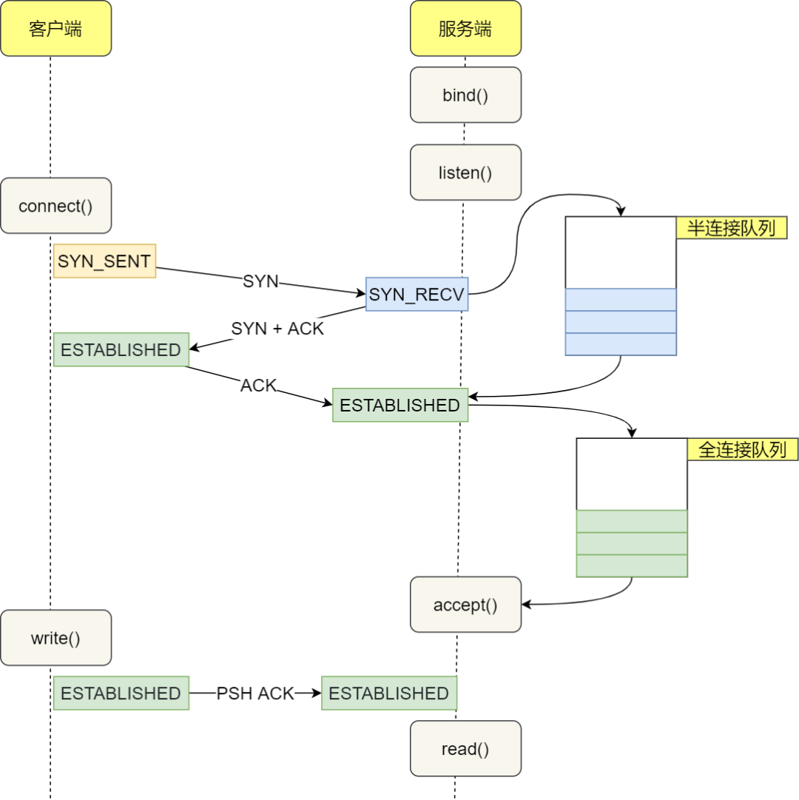
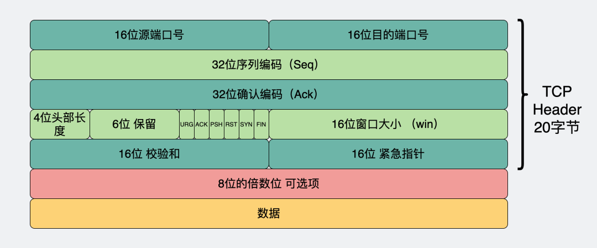
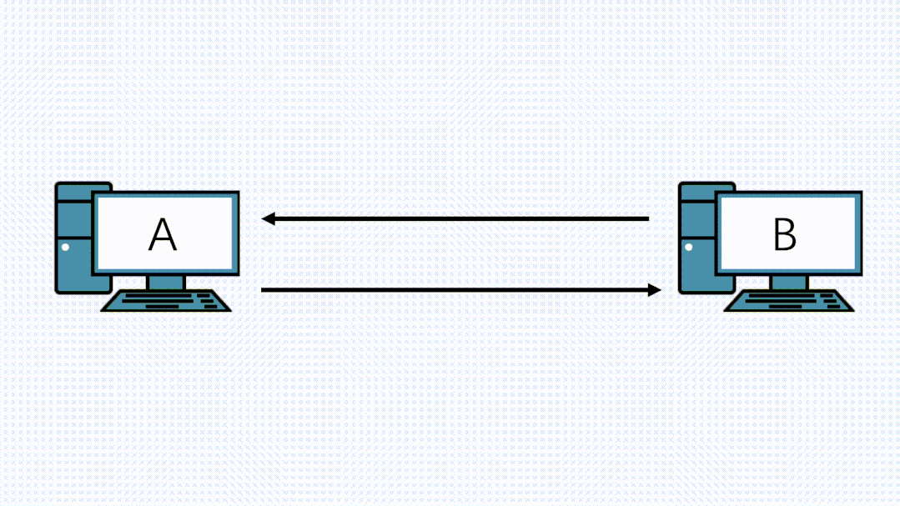

## 什么是TCP分段和IP分片

数据包过大时会把数据包切分小块，这个行为在**传输层和网络层**都有可能发生。

在传输层（`TCP`协议）里，叫**分段**。在网络层（`IP`层），叫**分片**。

那么不管是分片还是分段，肯定需要**按照一定的长度**切分。在`TCP`里，这个长度是`MSS`。在`IP`层里，这个长度是`MTU`。


## MSS是什么

**MSS：Maximum Segment Size** 。TCP 提交给 IP 层最大分段大小，不包含 TCP Header 和  TCP Option，只包含 TCP Payload ，MSS 是 TCP 用来限制应用层最大的发送字节数。
假设 MTU= 1500 byte，那么 **MSS = 1500- 20(IP Header) -20 (TCP Header) = 1460 byte**，如果应用层有 **2000 byte** 发送，那么需要两个切片才可以完成发送，第一个 TCP 切片 = 1460，第二个 TCP 切片 = 540。


### 如何查看MSS？

我们都知道TCP三次握手，而`MSS`会在三次握手的过程中传递给对方，用于通知对端本地最大可以接收的TCP报文数据大小（不包含TCP和IP报文首部）。



比如上图中，B将自己的MSS发送给A，建议A在发数据给B的时候，采用`MSS=1420`进行分段。而B在发数据给A的时候，同样会带上`MSS=1372`。两者在对比后，会采用**小的**那个值（1372）作为通信的`MSS值`，这个过程叫`MSS协商`。

> 另外，一般情况下MSS + 20（TCP头）+ 20（IP头）= MTU，上面抓包的图里对应的MTU分别是1372+40 和 1420+40。同一个路径上，**MTU不一定是对称的**，也就是说A到B和B到A，两条路径上的MTU可以是不同的，对应的MSS也一样。


### 三次握手中协商了MSS就不会改变了吗？

当然不是，每次执行TCP发送消息的函数时，会重新计算一次MSS，再进行分段操作。

### 对端不传MSS会怎么样？

我们再看TCP的报头。其实MSS是作为可选项引入的，只不过一般情况下MSS都会传，但是万一遇到了哪台机器的实现上比较调皮，**不传MSS**这个可选项。那对端该怎么办？



**如果没有接收到对端TCP的MSS，本端TCP默认采用MSS=536Byte**。

那为什么会是`536`？

```
536（data） + 20（tcp头）+20（ip头）= 576Byte
```

前面提到了IP会切片，那会切片，也就会重组，而这个576正好是 IP 最小重组缓冲区的大小。


## MTU是什么

**MTU: Maximum Transmit Unit**，最大传输单元。其实这个是由**数据链路层**提供，为了告诉上层IP层，自己的传输能力是多大。IP层就会根据它进行数据包切分。一般 MTU=**1500 Byte**。
假设IP层有 <= `1500` byte 需要发送，只需要一个 IP 包就可以完成发送任务；假设 IP 层有 > `1500` byte 数据需要发送，需要分片才能完成发送，分片后的 IP Header ID 相同，同时为了分片后能在接收端把切片组装起来，还需要在分片后的IP包里加上各种信息。比如这个分片在原来的IP包里的偏移offset。


### 如何查看MTU

在`mac`控制台输入 `ifconfig`命令，可以看到MTU的值为多大。

```bash
$ ipconfig
lo0: flags=8049<UP,LOOPBACK,RUNNING,MULTICAST> mtu 16384
    ...
en0: flags=8863<UP,BROADCAST,SMART,RUNNING,SIMPLEX,MULTICAST> mtu 1500
    ...
p2p0: flags=8843<UP,BROADCAST,RUNNING,SIMPLEX,MULTICAST> mtu 2304
    ...
```

可以看到这上面有好几个**MTU**，可以简单理解为每个网卡的处理能力不同，所以对应的MTU也不同。当然这个值是可以修改的，但不在今天的讨论范畴内，不再展开。

在一台机器的应用层到这台机器的网卡，**这条链路上**，基本上可以保证，`MSS < MTU`。


### 为什么MTU一般是1500

这其实是由传输效率决定的。越大的包，发生丢包的概率就越大。

那是不是包越小就越好？也不是。

但是如果选择一个比较小的长度，假设选择`MTU`为`300Byte`，`TCP payload = 300 - IP Header - TCP Header = 300 - 20 - 20 = 260 byte`。那有效传输效率`= 260 / 300 = 86%`

而如果以太网长度为1500，那有效传输效率`= 1460 / 1500 = 96%` ，显然比 `86%` 高多了。

**包越小越不容易丢包，包越大，传输效率又越高，因此权衡之下，选了`1500`。**


## 为什么IP层会分片，TCP还要分段

由于本身IP层就会做分片这件事情。**就算TCP不分段**，到了IP层，数据包也会被分片，数据也能**正常传输**

既然网络层就会分片了，那么TCP为什么还要分段？是不是有些多此一举？

假设有一份数据，较大，且在TCP层不分段，如果这份数据在发送的过程中出现**丢包**现象，TCP会发生重传，那么重传的就是这一大份数据（虽然IP层会把数据切分为MTU长度的N多个小包，但是TCP重传的单位却是那一大份数据）。


如果TCP把这份数据，分段为N个小于等于MSS长度的数据包，到了IP层后加上IP头和TCP头，还是小于MTU，那么IP层也不会再进行分包。此时在传输路上发生了丢包，那么TCP重传的时候也只是重传那一小部分的MSS段。效率会比TCP不分段时更高。



类似的，传输层除了TCP外，还有UDP协议，但UDP本身不会分段，所以当数据量较大时，只能交给IP层去分片，然后传到底层进行发送。

也就是说，正常情况下，在一台机器的传输层到网络层**这条链路上**，如果传输层对数据做了分段，那么IP层就不会再分片。如果传输层没分段，那么IP层就可能会进行分片。

说白了，**数据在TCP分段，就是为了在IP层不需要分片，同时发生重传的时候只重传分段后的小份数据**。


## TCP分段了，IP层就一定不会分片了吗

上面提到了，在发送端，TCP分段后，IP层就不会再分片了。

但是整个传输链路中，可能还会有其他网络层设备，而这些设备的MTU可能小于发送端的MTU。此时虽然数据包在发送端已经**分段**过了，但是在IP层就还会再分片一次。

如果链路上还有设备有**更小的MTU**，那么还会再分片，最后所有的分片都会在**接收端**处进行组装。


<div align="center">
IP分片再分片
</div>

因此，就算TCP分段过后，在链路上的其他节点的IP层也是有可能再分片的，而且哪怕数据被第一次IP分片过了，也是有可能被其他机器的IP层进行二次、三次、四次….分片的。

## IP层怎么做到不分片

上面提到的IP层在传输过程中**因为各个节点间MTU**可能不同，导致数据是可能被多次分片的。而且每次分片都要加上各种信息便于在接收端进行分片重组。那么IP层是否可以做到不分片？

如果有办法知道整个链路上，最小的MTU是多少，并且以最小MTU长度发送数据，那么不管数据传到哪个节点，都不会发生分片。

整个链路上，**最小的MTU，就叫PMTU**（path MTU）。

有一个**获得这个PMTU的方法，叫 Path MTU Discovery**。

```bash
$cat /proc/sys/net/ipv4/ip_no_pmtu_disc
0
```

默认为`0`，意思是开启PMTU发现的功能。现在一般机器上都是开启的状态。

原理比较简单，首先我们先回去看下IP的数据报头。

IP报头DF

这里有个标红的标志位`DF`（Don't Fragment），当它置为1，意味着这个IP报文不分片。

当链路上某个路由器，收到了这个报文，当IP报文长度大于路由器的MTU时，路由器会看下这个IP报文的`DF`

- 如果为`0`（允许分片），就会分片并把分片后的数据传到下一个路由器
- 如果为`1`，就会把数据丢弃，同时返回一个ICMP包给发送端，并告诉它数据不可达，需要分片，同时带上当前机器的MTU

理解了上面的原理后，我们再看下PMTU发现是怎么实现的。

- 应用通过TCP正常发送消息，传输层**TCP分段**后，到**网络层**加上IP头，**DF置为1**，消息再到更底层执行发送
- 此时链路上有台**路由器**由于各种原因**MTU变小了**
- IP消息到这台路由器了，路由器发现消息长度大于自己的MTU，且消息自带DF不让分片。就把消息丢弃。同时返回一个`ICMP`错误给发送端，同时带上自己的`MTU`。


## 总结

- 数据在TCP分段，在IP层就不需要分片，同时发生重传的时候只重传分段后的小份数据
- TCP分段时使用MSS，IP分片时使用MTU
- MSS是通过MTU计算得到，在三次握手和发送消息时都有可能产生变化。
- IP分片是**不得已**的行为，尽量不在IP层分片，尤其是链路上中间设备的IP分片。因此，在IPv6中已经禁止中间节点设备对IP报文进行分片，分片只能在链路的最开头和最末尾两端进行。
- 建立连接后，路径上节点的MTU值改变时，可以通过PMTU发现更新发送端MTU的值。这种情况下，PMTU发现通过浪费N次发送机会来换取的PMTU，TCP因为有重传可以保证可靠性，在UDP就相当于消息直接丢了。
