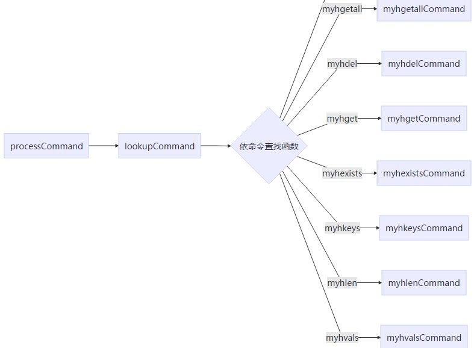
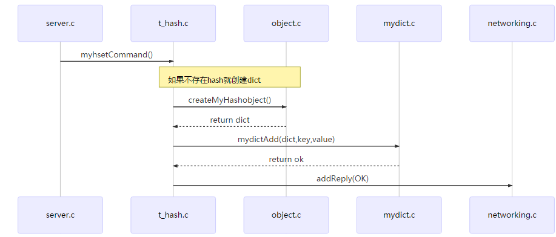

> 在实际场景中，如果Redis的数据结构不能满足业务的需求，我们可以通过自定义数据结构来完成定制化Redis来减少内存占用与提升服务性能，下面通过自定义**myhash**结构来完成向Redis扩展数据结构的过程。

## 效果演示

myhash实现命令以及对应的原生hash命令：


| 实现命令  | redis命令 |           含义            |
| :-------: | :-------: | :-----------------------: |
|  myhmset  |   hmset   |         新建hash          |
| myhgetall |  hgetall  |      查询所有键值对       |
|  myhdel   |   hdel    |    删除一个或多个field    |
|  myhget   |   hget    |      获取某个field值      |
| myhexists |  hexists  |    是否存在指定的field    |
|  myhkeys  |   hkeys   |       返回所有field       |
|  myhlen   |   hlen    |    获取hash键值对数量     |
|  myhmget  |   hmget   | 获取指定一个或多个filed值 |
|  myhvals  |   hvals   |       返回所有的值        |

演示效果
测试myhash

```bash
127.0.0.1:6379> myhmset gjwh1 gjwk1 gjwv1 gjwk2 gjwv2
OK
127.0.0.1:6379> myhlen gjwh1
(integer) 2
127.0.0.1:6379> myhgetall gjwh1
1) "gjwk2"
2) "gjwv2"
3) "gjwk1"
4) "gjwv1"
127.0.0.1:6379> myhget gjwh1 gjwk1
"gjwv1"
127.0.0.1:6379> myhdel gjwh1 gjwk1
(integer) 1
127.0.0.1:6379> myhgetall gjwh1
1) "gjwk2"
2) "gjwv2"
127.0.0.1:6379> mygexists gjwh1 gjwk1
(error) ERR unknown command `mygexists`, with args beginning with: `gjwh1`, `gjwk1`, 
127.0.0.1:6379> myhexists gjwh1 gjwk1
(integer) 0
127.0.0.1:6379> myhexists gjwh1 gjwk2
(integer) 1
127.0.0.1:6379> myhget gjwh1 gjwk2
"gjwv2"
127.0.0.1:6379> myhmset gjwh1 gjwk3 gjwv3 gjwk4 gjwv4
OK
127.0.0.1:6379> myhkeys gjwh1
1) "gjwk4"
2) "gjwk3"
3) "gjwk2"
127.0.0.1:6379> myvals gjwh1
(error) ERR unknown command `myvals`, with args beginning with: `gjwh1`, 
127.0.0.1:6379> myhvals gjwh1
1) "gjwv4"
2) "gjwv3"
3) "gjwv2"
```


## redis代码执行流程

此部分只选择与本文档相关部分做简单介绍，下面从server.c文件的processCommand函数开始。



下面以myhmset命令执行的时序图来说明具体调用的函数及其所在的文件，其他命令执行方式都类似.图中方框内的文件名，所有关于hash类型的命令都在文件t_hash.c中,其他类型的命令处理函数可以找对应的文件，redis命令非常规范，找起来不难。



## 开发一个新的数据类型

### 定义新数据类型的底层结构

**添加头文件mydict.h**
头文件中定义了基础的数据结构，需要实现的与数据结构有关的方法。最重要的是hashcode、rehash、还有一个迭代器，其他方法基本都是通常操作字典的基本方法。本文并非实现了全部方法，按照本文介绍的知识，可以比较方便的编写自己的方法。

```c
/*
 * mydict.h
 */
#ifndef SRC_MYDICT_H_
#define SRC_MYDICT_H_
#define mydictSlots(d) ((d)->ht[0].size+(d)->ht[1].size)
#define mydictSize(d) ((d)->ht[0].used+(d)->ht[1].used)

typedef struct mydictEntry {    
  void *key;    
  void *val;    
  struct mydictEntry *next;
} mydictEntry;
typedef struct mydictht {
    mydictEntry **table;
    unsigned long size;
    unsigned long sizemask;
    unsigned long used;
} mydictht;
typedef struct mydict {    //dictType *type;
    // void *privdata;
    mydictht ht[2];    
    long rehashidx; /* rehashing not in progress if rehashidx == -1 */
} mydict;
typedef struct mydictIterator{
    mydict * myd;
    mydictEntry *next;    
    int tableNum;    
    int index;
}mydictIterator;/* API */
mydict *mydictCreate();
int mydictExpand(mydict *d, unsigned long size);
int mydictAdd(mydict *d, void *key, void *val);
mydictEntry * doMydictIter(mydictIterator * iter);
mydictIterator * getMydictIterator(mydict *d);
int mydictReplace(mydict *d, void *key, void *val);
int mydictDelete(mydict *d, const void *key);
void mydictFreeUnlinkedEntry(mydict *d, mydictEntry *he);
void mydictRelease(mydict *d);
mydictEntry * mydictFind(mydict *d, const void *key);
void *mydictFetchValue(mydict *d, const void *key);
int mydictResize(mydict *d);
mydictEntry *mydictGetRandomKey(mydict *d);
unsigned int mydictGetSomeKeys(mydict *d, mydictEntry **des, unsigned int count);
int mydictGenHashFunction(const void *key, int len);
int mydictGenCaseHashFunction(const unsigned char *buf, int len);
void mydictEmpty(mydict *d, void(callback)(void*));
void mydictEnableResize(void);
void mydictDisableResize(void);
int mydictRehash(mydict *d, int n);
int mydictRehashMilliseconds(mydict *d, int ms);
void mydictSetHashFunctionSeed(int *seed);
int *mydictGetHashFunctionSeed(void);
int mydictGetHash(mydict *d, const void *key);//
mydictEntry **dictFindEntryRefByPtrAndHash(mydict *d, const void *oldptr, int hash);
mydictEntry *mydictGetRandomKey(mydict *d);
#endif /* SRC_MYDICT_H_ */
```

**mydict.c 实现具体的方法**

```c
/*
 * mydict.c
 *
 *  Created on: Jan 16, 2019
 *      Author: gjw
 */
#include "mydict.h"
#include <stdlib.h>
#include <stdint.h>
#include <string.h>
#include "sds.h"
unsigned int hashCode(char * key) {    
    int len = strlen(key);
    unsigned int hash = 0;    
    for (int i = 0; i < len; i++) {
        hash = 31 * hash + (key[i]);
    }    
    return hash ^ (hash >> 16);

}
static int _myinitht(mydictht * ht) {
    ht->table = NULL;
    ht->size = 0UL;
    ht->sizemask = 0UL;
    ht->used = 0UL;    
    return 0;
}
mydict *mydictCreate() {
    mydict * d = (mydict *) malloc(sizeof(*d));
    _myinitht(&d->ht[0]);
    _myinitht(&d->ht[1]);
    d->rehashidx = -1;    
    return d;
}
unsigned long _mydictNextPower(unsigned long size) {
    int i = 4;
    while (1){
        if (i >= size)
          return i;
        i = i * 2;
    }
}
int mydictExpand(mydict *d, unsigned long size) {    
    int realSize = _mydictNextPower(size);//    int index=d->ht[0].size==0?0:1;
    if (realSize <= d->ht[0].size)        return 1;
    mydictEntry ** entries = (mydictEntry **) malloc(realSize * sizeof(mydictEntry *));
    d->ht[1].table = entries;
    d->ht[1].size = realSize;
    d->ht[1].sizemask = realSize - 1;
    d->ht[1].used = 0;
    d->rehashidx = 0;    
    for (int i = 0; i < realSize; i++) {
        d->ht[1].table[i] = NULL;
    }    
    return 0;
}//return bucket index
int _myKeyIndex(mydict *d, void *key, unsigned long hash) {
    int index = 0, len1 = sdslen(key), len2 = 0;
    int i;
    for (i = 0; i <= 1; i++){
        if (d->ht[i].size == 0)
          continue;
        index = hash % d->ht[i].size;
        mydictEntry *e = d->ht[i].table[index];
        if (!e)
          break;
        len2 = sdslen(e->key);
        if (len1 == len2){
          if (memcmp(e->key, key, len1) == 0){
            return -1;
          }
        }
        if (d->rehashidx == -1)
          break;
    }
    return index;
}
int _mydictExpandIfNeeded(mydict *d) {    /* Incremental rehashing already in progress. Return. */
    if (d->rehashidx != -1){
        mydictRehash(d, 100);
        return 0;
    }
    if (d->ht[0].size == 0)
        return mydictExpand(d, 4);
    if (d->ht[0].used >= d->ht[0].size && (d->ht[0].used / d->ht[0].size > 2)){
        return mydictExpand(d, d->ht[0].used * 2);
    }
    return 0;
}
int mydictAdd(mydict *d, void *key, void *val){
    unsigned long hash = hashCode(key);
    _mydictExpandIfNeeded(d);
    int index = _myKeyIndex(d, key, hash);
    if (index == -1)
        return 1;
    mydictht *ht = (d->rehashidx == -1 ? &d->ht[0] : &d->ht[1]);
    mydictEntry *n = (mydictEntry *)malloc(sizeof(mydictEntry));
    n->key = key;
    n->val = val;
    n->next = ht->table[index];
    ht->table[index] = n;
    ht->used++;
    return 0;
}
void _mydestroyDictEntry(mydictEntry * e) {
    mydictEntry * e1 = e;    
    while (e) {
        sdsfree(e->key);
        sdsfree(e->val);
        e = e->next;
        e1->next = NULL;
        free(e1);
    }
}
    int mydictDelete(mydict *d, const void *key) {
    unsigned long hash = hashCode(key);    
    int index = 0;    int len1 = 0, len2 = 0;
    mydictEntry * n;
    mydictEntry * previous;
    mydictEntry * head;    
    if (index == -1)        return 1;    
    for (int i = 0; i <= 1; i++) {        
    if(d->ht[i].size==0)continue;
        index = hash % d->ht[i].size;
        head = d->ht[i].table[index];
        previous = head;
        n = head;        
    while (n) {
            len1 = sdslen(n->key);
            len2 = sdslen(key);            
    if (len1 == len2 && memcmp(n->key, key, len1) == 0) {                if (n == head) {
                    d->ht[i].table[index] = NULL;
                    _mydestroyDictEntry(head);
                } else {
                    previous->next = n->next;
                    _mydestroyDictEntry(n);
                }
                d->ht[i].used--;
                _mydictExpandIfNeeded(d);                return 0;
            }
            previous = n;
            n = n->next;
        }        if (d->rehashidx == -1)    break;
    }    return 1;

}

void mydictRelease(mydict *d) {    
    int size = 0;    
    for (int i = 0; i <= 1; i++) {
        size = d->ht[i].size;        
    for (int j = 0; j < size; j++) {
            _mydestroyDictEntry(d->ht[i].table[j]);
            d->ht[i].used--;
        }    
    if (d->rehashidx == -1)    break;
    }
free(d);
}
mydictEntry * mydictFind(mydict *d, const void *key) {
    unsigned int hash = hashCode(key);    
    int index, len1, len2;
    mydictEntry *e;    for (int i = 0; i <= 1; i++) {        
    if(d->ht[i].size==0)continue;
        index = hash % d->ht[i].size;
        e = d->ht[i].table[index];        
    while (e) {
            len1 = sdslen(e->key);
            len2 = sdslen(key);            
               if (len1 == len2 && memcmp(e->key, key, len1) == 0)                return e;
            e = e->next;
        }        
               return NULL;
    }
}
int mydictRehash(mydict *d, int n) {
    int emptySize = n * 10;
    int rehashinx = d->rehashidx;
    int inx;
    mydictEntry *e, *next;
    while (d->ht[0].size != 0 && d->ht[0].table[rehashinx] == NULL){
        rehashinx++;
        d->rehashidx++;
        d->ht[0].size--;
    }
    while (n--){
        if (d->ht[0].size == 0){
            d->rehashidx = -1;
            d->ht[0] = d->ht[1];
            _myinitht(&d->ht[1]);
            break;
        }
        e = d->ht[0].table[rehashinx];
        while (e){
            inx = hashCode(e->key) % (d->ht[1].size);
            next = d->ht[1].table[inx];
            e->next = next;
            d->ht[1].table[inx] = e;
            d->ht[1].used++;
            d->ht[0].used--;
            e = e->next;
        }
        d->ht[0].size--;
        rehashinx++;
        d->rehashidx = rehashinx;
    }
    return 0;
}
int mydictGetHash(mydict *d, const void *key) {    return hashCode(key);
}
int mydictRehashMilliseconds(mydict *d, int ms) {
    long long start = timeInMilliseconds();
    int rehashes = 0;
    while (mydictRehash(d, 100)){
        rehashes += 100;
        if (timeInMilliseconds() - start > ms)
            break;
    }
    return rehashes;
}
int mydictResize(mydict *d) {
    int minimal;
    if (d->rehashidx != -1)
        return 1;
    minimal = d->ht[0].used;
    if (minimal < 4)
        minimal = 4;
    return mydictExpand(d, minimal);
}
mydictIterator * getMydictIterator(mydict *d) {
    mydictIterator * mi = (mydictIterator *) malloc(sizeof(mydictIterator));
    mi->index = 0;
    mi->myd = d;
    mi->tableNum = 0;
    mi->next = NULL;    
return mi;
}

mydictEntry * doMydictIter(mydictIterator * iter) {
    mydictEntry *e;
    e = iter->next;    
int size = iter->myd->ht[0].size;    
int htindex = iter->index >= size ? iter->index - size : iter->index;    
while (!e) {        
if (iter->index >= mydictSlots(iter->myd)) {
            free(iter);            
                        return e;
        }    
              if (iter->index >= iter->myd->ht[0].size) {
            iter->tableNum = 1;
        }
        e = iter->myd->ht[iter->tableNum].table[htindex];
        htindex++;
        iter->index++;
    }
    iter->next = e->next;    
return e;
}
mydictEntry *mydictGetRandomKey(mydict *d){
    if (mydictSize(d) == 0)
        return NULL;
    while (d->rehashidx != -1)
        mydictRehash(d, 100);
    int index = random() % d->ht[0].size;
    mydictEntry *e = d->ht[0].table[index];
    mydictEntry *n;
    while (!e){
        index = random() % d->ht[0].size;
        e = d->ht[0].table[index];
    }
    n = e;
    int llen = 0;
    while (n){
        n = n->next;
        llen++;
    }
    int pos = random() % llen;
    for (int i = 0; i < pos; i++){
        e = e->next;
    }
    return e;
}
```

### 增加这个新类型的定义

这个定义是在 **Redis 的 `server.h `文件**中。

比如，我们增加一个叫作 `MYOBJ_HASH的宏定义`，用来在代码中指代 MyHashObject 这个新类型。

```c
#define OBJ_STRING 0    /* String object. */
#define OBJ_LIST 1      /* List object. */
#define OBJ_SET 2       /* Set object. */
#define OBJ_ZSET 3      /* Sorted set object. */
..
#define MYOBJ_HASH 10      /* MYHASH object. */
```

### 开发新类型的创建函数

在**object.c**中添加创建类型方法

```c
robj *createMyHashObject(void) {
    mydict *myd = mydictCreate();
    robj *o = createObject(MYOBJ_HASH, myd);
    o->encoding = OBJ_ENCODING_ZIPLIST;
    return o;
}
```


### 实现新类型的命令操作

在**t_hash.c中实现server.h声明**的操作函数

```c
void myhsetCommand(client *c)
{
    int i, created = 0;
    robj *o;
    if ((c->argc % 2) == 1)
    {
        addReplyError(c, "wrong number of arguments for HMSET");
        return;
    }
    o = lookupKeyWrite(c->db, c->argv[1]);
    if (o == NULL)
    {
        o = createMyHashObject();
        dbAdd(c->db, c->argv[1], o);
    }
    else
    {
        if (o->type != MYOBJ_HASH)
        {
            addReply(c, shared.wrongtypeerr);
            return;
        }
    } //    if ((o = hashTypeLookupWriteOrCreate(c,c->argv[1])) == NULL) return;//    hashTypeTryConversion(o,c->argv,2,c->argc-1);

    for (i = 2; i < c->argc; i += 2)
        created += !mydictAdd(o->ptr, sdsdup(c->argv[i]->ptr), sdsdup(c->argv[i + 1]->ptr));
    char *cmdname = c->argv[0]->ptr;
    if (cmdname[1] == 's' || cmdname[1] == 'S')
    { /* HSET */
        addReplyLongLong(c, created);
    }
    else
    { /* HMSET */
        addReply(c, shared.ok);
    }
    signalModifiedKey(c->db, c->argv[1]);
    notifyKeyspaceEvent(NOTIFY_HASH, "hset", c->argv[1], c->db->id);
    server.dirty++;
}
void myGenerichgetALLCommand(client *c, int flag)
{
    robj *o;
    int multiplier = 0;
    int length, count = 0;
    if ((o = lookupKeyReadOrReply(c, c->argv[1], shared.emptymultibulk)) == NULL || checkType(c, o, MYOBJ_HASH))
        return;
    length = mydictSize((const mydict *)o->ptr);
    if (flag == 3)
        length = length * 2;
    addReplyMultiBulkLen(c, length);
    mydictIterator *hi = getMydictIterator(o->ptr);
    mydictEntry *e = doMydictIter(hi);
    int len1 = 0, len2;
    while (e)
    {
        if (flag & OBJ_HASH_KEY)
        {
            len1 = sdslen(e->key);
            addReplyBulkCBuffer(c, e->key, len1);
            count++;
        }
        if (flag & OBJ_HASH_VALUE)
        {
            len2 = sdslen(e->val);
            addReplyBulkCBuffer(c, e->val, len2);
            count++;
        }

        e = doMydictIter(hi);
    }
    serverAssert(count == length);
}
void myhgetALLCommand(client *c)
{
    myGenerichgetALLCommand(c, OBJ_HASH_VALUE | OBJ_HASH_KEY);
}
void myhkeysCommand(client *c)
{
    myGenerichgetALLCommand(c, OBJ_HASH_KEY);
}
void myhvalsCommand(client *c)
{
    myGenerichgetALLCommand(c, OBJ_HASH_VALUE);
}
void myhdelCommand(client *c)
{
    robj *o;
    int j, deleted = 0, keyremoved = 0;
    if ((o = lookupKeyWriteOrReply(c, c->argv[1], shared.czero)) == NULL || checkType(c, o, MYOBJ_HASH))
        return;
    for (j = 2; j < c->argc; j++)
    {
        if (!mydictDelete(o->ptr, c->argv[j]->ptr))
        {
            deleted++;
            if (mydictSize((const mydict *)o->ptr) == 0)
            {
                dbDelete(c->db, c->argv[1]);
                keyremoved = 1;
                break;
            }
        }
    }
    if (deleted)
    {
        signalModifiedKey(c->db, c->argv[1]);
        notifyKeyspaceEvent(NOTIFY_HASH, "hdel", c->argv[1], c->db->id);
        if (keyremoved)
            notifyKeyspaceEvent(NOTIFY_GENERIC, "del", c->argv[1], c->db->id);
        server.dirty += deleted;
    }
    addReplyLongLong(c, deleted);
}

void myhgetCommand(client *c)
{
    robj *o;
    if ((o = lookupKeyReadOrReply(c, c->argv[1], shared.nullbulk)) == NULL || checkType(c, o, MYOBJ_HASH))
        return;
    mydictEntry *me = mydictFind(o->ptr, c->argv[2]->ptr);
    if (me)
        addReplyBulkCBuffer(c, me->val, sdslen(me->val));
    else
        addReply(c, shared.nullbulk);
}

void myhexistsCommand(client *c)
{
    robj *o;
    if ((o = lookupKeyReadOrReply(c, c->argv[1], shared.czero)) == NULL || checkType(c, o, MYOBJ_HASH))
        return;
    addReply(c, mydictFind(o->ptr, c->argv[2]->ptr) ? shared.cone : shared.czero);
}
void myhlenCommand(client *c)
{

    robj *o;
    if ((o = lookupKeyReadOrReply(c, c->argv[1], shared.czero)) == NULL || checkType(c, o, MYOBJ_HASH))
        return;
    addReplyLongLong(c, mydictSize((const mydict *)o->ptr));
}
void myhmgetCommand(client *c)
{
    robj *o;
    o = lookupKeyRead(c->db, c->argv[1]);
    if (o != NULL && o->type != OBJ_HASH)
    {
        addReply(c, shared.wrongtypeerr);
        return;
    }
    addReplyMultiBulkLen(c, c->argc - 2);
    for (int i = 2; i < c->argc; i++)
    {
        mydictEntry *me = mydictFind(o->ptr, c->argv[i]->ptr);
        if (me == NULL)
            addReply(c, shared.nullbulk);
        else
            addReplyBulkCBuffer(c, me->val, sdslen(me->val));
    }
}

```

### 添加新类型的命令操作

在 **server.h 文件**中，声明我们已经实现的命令，以便在 server.c 文件引用这个命令，例如：

```c
/* Commands prototypes */
void authCommand(client *c);
void pingCommand(client *c);
void echoCommand(client *c);
void commandCommand(client *c);
..
/* 添加如下 */
void myhgetALLCommand(client *c) ;
void myhsetCommand(client *c);
void myhkeysCommand(client *c) ;
void myhvalsCommand(client *c);
void myhdelCommand(client *c);
void myhgetCommand(client *c);
void myhexistsCommand(client *c);
void myhlenCommand(client *c);
void myhmgetCommand(client *c);
void mysaddCommand(client *c);
void myscardCommand(client *c);
void mysmembersCommand(client *c);
void myspopCommand(client *c);
void mysunionCommand(client *c);
void mysinterCommand(client *c);
void mysdiffCommand(client *c);
```


### 把新增命令和实现函数关联起来

在server.c添加字符串——执行函数映射：
```c
    {"myhmset",myhsetCommand,-4,"wmF",0,NULL,1,1,1,0,0},
    {"myhset",myhsetCommand,-4,"wmF",0,NULL,1,1,1,0,0},
    {"myhdel",myhdelCommand,-3,"wF",0,NULL,1,1,1,0,0},
    {"myhget",myhgetCommand,3,"rF",0,NULL,1,1,1,0,0},
    {"myhlen",myhlenCommand,2,"rF",0,NULL,1,1,1,0,0},
    {"myhkeys",myhkeysCommand,2,"rS",0,NULL,1,1,1,0,0},
    {"myhvals",myhvalsCommand,2,"rS",0,NULL,1,1,1,0,0},
    {"myhgetall",myhgetALLCommand,2,"rR",0,NULL,1,1,1,0,0},
    {"myhexists",myhexistsCommand,3,"rF",0,NULL,1,1,1,0,0},
    {"myhmget",myhmgetCommand,-3,"rF",0,NULL,1,1,1,0,0},
    {"mysadd",mysaddCommand,-3,"wmF",0,NULL,1,1,1,0,0},
    {"myscard",myscardCommand,2,"rF",0,NULL,1,1,1,0,0},
    {"mysmembers",mysmembersCommand,2,"rS",0,NULL,1,1,1,0,0},
    {"myspop",myspopCommand,-2,"wRF",0,NULL,1,1,1,0,0},
```


### Makefile的修改

Makefile的修改,找到 **REDIS_SERVER_OBJ**添加 **mydict.o**

```makefile
# 比如我的版本Redis7.0.9原本的为这样子
REDIS_SERVER_OBJ= adlist.o quicklist.o ae.o anet.o dict.o server.o sds.o zmalloc.o lzf_c.o lzf_d.o pqsort.o zipmap.o sha1.o ziplist.o release.o networking.o util.o object.o db.o replication.o rdb.o t_string.o t_list.o t_set.o t_zset.o t_hash.o config.o aof.o pubsub.o multi.o debug.o sort.o intset.o syncio.o cluster.o crc16.o endianconv.o slowlog.o scripting.o bio.o rio.o rand.o memtest.o crcspeed.o crc64.o bitops.o sentinel.o notify.o setproctitle.o blocked.o hyperloglog.o latency.o sparkline.o redis-check-rdb.o redis-check-aof.o geo.o lazyfree.o module.o evict.o expire.o geohash.o geohash_helper.o childinfo.o defrag.o siphash.o rax.o t_stream.o listpack.o localtime.o lolwut.o lolwut5.o lolwut6.o acl.o gopher.o tracking.o connection.o tls.o sha256.o timeout.o setcpuaffinity.o monotonic.o mt19937-64.o
# 修改为
REDIS_SERVER_OBJ= mydict.o,adlist.o .................
```

另外需要修改Makefile.dep，没有就创建

```makefile
mydict.o: mydict.c mydict.h sds.h
```


## 总结

通过对Redis的扩展，可以实现我们想要的数据结构。不过不要盲目的自定义数据结构；要在针对业务场景做定制化之前，先要了解Redis原来的5大基本数据结构，考虑到其优缺点并且知道为什么会出现不足，再针对性的做出优化才能实现良好的效果。
