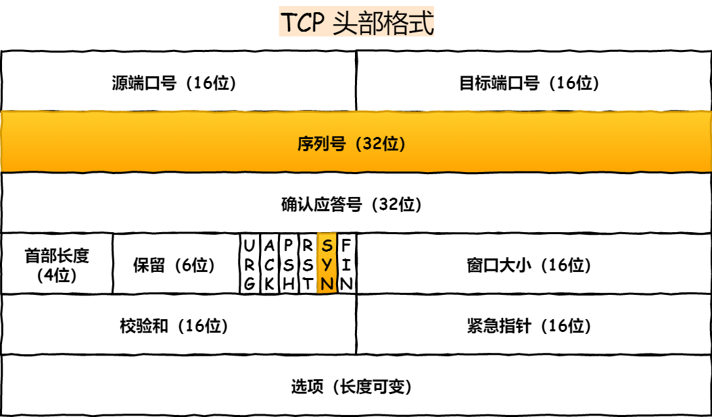
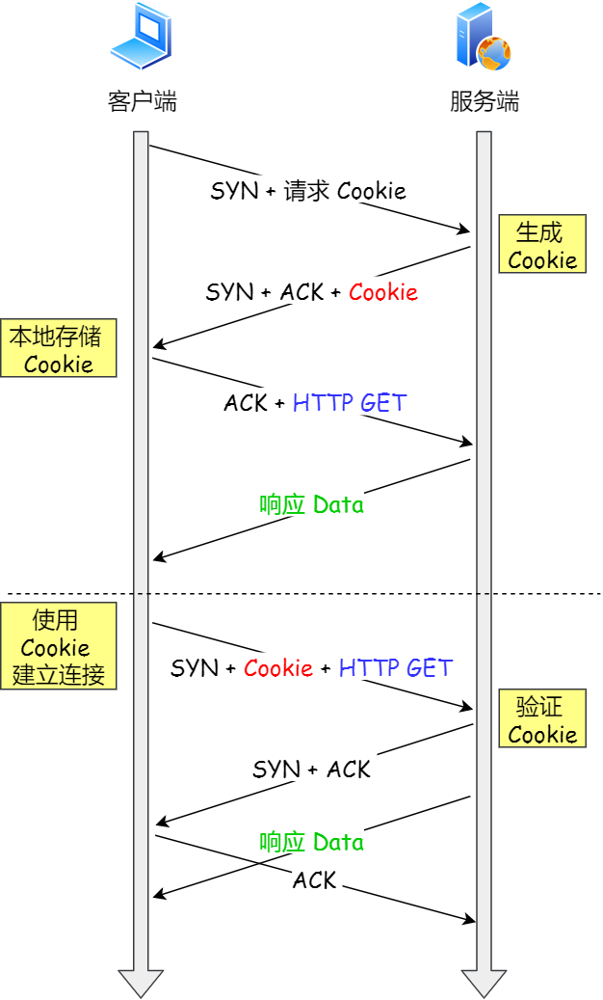

## TCP 三次握手的性能提升

三次握手的过程在一个 HTTP 请求的平均时间占比 10% 以上，在网络状态不佳、高并发或者遭遇 SYN 攻击等场景中，如果不能有效正确的**调节三次握手中的参数**，就会对性能产生很多的影响。

如何正确有效的使用这些参数，来提高 TCP 三次握手的性能，这就需要理解「三次握手的状态变迁」，这样当出现问题时，先用 `netstat` 命令查看是哪个握手阶段出现了问题，再来对症下药，而不是病急乱投医。

<div align="center">

</div>

客户端和服务端都可以针对三次握手优化性能。主动发起连接的客户端优化相对简单些，而服务端需要监听端口，属于被动连接方，其间保持许多的中间状态，优化方法相对复杂一些。

所以，客户端（主动发起连接方）和服务端（被动连接方）优化的方式是不同的，接下来分别针对客户端和服务端优化。


### 调整SYN报文重传次数

三次握手建立连接的首要目的是「同步序列号」。

只有同步了序列号才有可靠传输，TCP 许多特性都依赖于序列号实现，比如流量控制、丢包重传等，这也是三次握手中的报文称为 SYN 的原因，SYN 的全称就叫 *Synchronize Sequence Numbers*（同步序列号）。
<div align="center">

</div>

> SYN_SENT 状态的优化

客户端作为主动发起连接方，首先它将发送 SYN 包，于是客户端的连接就会处于 `SYN_SENT` 状态。

客户端在等待服务端回复的 ACK 报文，正常情况下，服务器会在几毫秒内返回 SYN+ACK ，但如果客户端长时间没有收到 SYN+ACK 报文，则会重发 SYN 包，**重发的次数由 tcp_syn_retries 参数控制**，默认是 5 次：

```bash
#tcp_syn_retries控制SYN包重传的次数，默认值是 5 次
$echo 5 > /proc/sys/net/ipv4/tcp_syn_retries
```

你可以根据网络的稳定性和目标服务器的繁忙程度修改 SYN 的重传次数，调整客户端的三次握手时间上限。比如内网中通讯时，就可以适当调低重试次数，尽快把错误暴露给应用程序。


### 调整SYN半连接队列长度

当服务端收到 SYN 包后，服务端会立马回复 SYN+ACK 包，表明确认收到了客户端的序列号，同时也把自己的序列号发给对方。

此时，服务端出现了新连接，状态是 `SYN_RCV`。在这个状态下，Linux 内核就会建立一个「半连接队列」来维护「未完成」的握手信息，当半连接队列溢出后，服务端就无法再建立新的连接。
<div align="center">

</div>

SYN 攻击，攻击的是就是这个半连接队列。

我们可以通过该 `netstat -s` 命令给出的统计结果中， 可以得到由于半连接队列已满，引发的失败次数：

```bash
$netstat -s | grep "SYNs to LISTEN"
3479887 SYNs to LISTEN sockets dropped
$netstat -s | grep "SYNs to LISTEN"
3526030 SYNs to LISTEN sockets dropped
```

上面输出的数值是**累计值**，表示共有多少个 TCP 连接因为半连接队列溢出而被丢弃。**隔几秒执行几次，如果有上升的趋势，说明当前存在半连接队列溢出的现象**。

> 如何调整 SYN 半连接队列大小？

要想增大半连接队列，**不能只单纯增大 tcp_max_syn_backlog 的值，还需一同增大 somaxconn 和 backlog，也就是增大 accept 队列。否则，只单纯增大 tcp_max_syn_backlog 是无效的。**

增大 tcp_max_syn_backlog 和 somaxconn 的方法是修改 Linux 内核参数：

```bash
#增大tcp_max_syn_backlog
$echo 1024 >/proc/sys/net/ipv4/tcp_max_syn_backlog
#增大somaxconn
$echo 1024 > /proc/sys/net/core/somaxconn
```

增大 backlog 的方式，每个 Web 服务都不同，比如 Nginx 增大 backlog 的方法如下：

```nginx
#/usr/local/nginx/conf/nginx.conf
server {
    listen 8088 default backlog=1024;
    server_name localhost;
    ....
}

```

最后，改变了如上这些参数后，要重启 Nginx 服务，因为 SYN 半连接队列和 accept 队列都是在 `listen()` 初始化的。


### 如何抵御SYN泛洪攻击

> 如果 SYN 半连接队列已满，只能丢弃连接吗？

并不是这样，**开启 syncookies 功能就可以在不使用 SYN 半连接队列的情况下成功建立连接**。

syncookies 的工作原理：服务器根据当前状态计算出一个值，放在己方发出的 SYN+ACK 报文中发出，当客户端返回 ACK 报文时，取出该值验证，如果合法，就认为连接建立成功，如下图所示。
<div align="center">

</div>


syncookies 参数主要有以下三个值：

- 0 值，表示关闭该功能；
- 1 值，表示仅当 SYN 半连接队列放不下时，再启用它；
- 2 值，表示无条件开启功能；

在半连接队列已满时，将开启SYNCOOKIES功能，抵御SYN泛洪攻击。

```bash
#开启tcp_syncookies 功能，默认是开启的 1
$echo 1 > /proc/sys/net/ipv4/tcp_syncookies
```

为什么不开启 2，因为 syncookies 需要耗费时间解析的，如果无条件开启就会 CPU 被拉满，也依然抵御不了SYN 泛洪攻击。


### 调整SYN确认报文重传次数

> SYN_RCV 状态的优化

当客户端接收到服务器发来的 SYN+ACK 报文后，就会回复 ACK 给服务器，同时客户端连接状态从 SYN_SENT 转换为 ESTABLISHED，表示连接建立成功。

服务器端连接成功建立的时间还要再往后，等到服务端收到客户端的 ACK 后，服务端的连接状态才变为 ESTABLISHED。

如果服务器没有收到 ACK，就会重发 SYN+ACK 报文，同时一直处于 SYN_RCV 状态。

当网络繁忙、不稳定时，报文丢失就会变严重，此时应该调大重发次数。反之则可以调小重发次数。**修改重发次数的方法是，调整 tcp_synack_retries 参数**：

```bash
# tcp_synack_retries控制SYN+ACK 包重传的次数，默认值是5次
$echo 5 > /proc/sys/net/ipv4/tcp_synack_retries
```

tcp_synack_retries 的默认重试次数是 5 次，与客户端重传 SYN 类似，它的重传会经历 1、2、4、8、16 秒，最后一次重传后会继续等待 32 秒，如果服务端仍然没有收到 ACK，才会关闭连接，故共需要等待 63 秒。


### 调整Accept队列长度

> accept 队列已满，只能丢弃连接吗？

丢弃连接只是 Linux 的默认行为，我们还可以选择向客户端发送 RST 复位报文，告诉客户端连接已经建立失败。打开这一功能需要将 tcp_abort_on_overflow 参数设置为 1。

```bash
#打开后，则当accpet 队列满了会回 RST，默认值是0关闭
$echo 1 > /proc/sys/net/ipv4/tcp_abort_on_overflow
```

tcp_abort_on_overflow 共有两个值分别是 0 和 1，其分别表示：

- 0 ：如果 accept 队列满了，那么 server 扔掉 client 发过来的 ack ；
- 1 ：如果 accept 队列满了，server 发送一个 `RST` 包给 client，表示废掉这个握手过程和这个连接；

如果要想知道客户端连接不上服务端，是不是服务端 TCP 全连接队列满的原因，那么可以把 tcp_abort_on_overflow 设置为 1，这时如果在客户端异常中可以看到很多 `connection reset by peer` 的错误，那么就可以证明是由于服务端 TCP 全连接队列溢出的问题。

通常情况下，应当把 tcp_abort_on_overflow 设置为 0，因为这样更有利于应对突发流量。

举个例子，当 accept 队列满导致服务器丢掉了 ACK，与此同时，客户端的连接状态却是 ESTABLISHED，客户端进程就在建立好的连接上发送请求。只要服务器没有为请求回复 ACK，客户端的请求就会被多次「重发」。**如果服务器上的进程只是短暂的繁忙造成 accept 队列满，那么当 accept 队列有空位时，再次接收到的请求报文由于含有 ACK，仍然会触发服务器端成功建立连接。**

<div align="center">

</div>
所以，tcp_abort_on_overflow 设为 0 可以提高连接建立的成功率，只有你非常肯定 TCP 全连接队列会长期溢出时，才能设置为 1 以尽快通知客户端。

> 如何调整 accept 队列的长度呢？

accept 队列的长度取决于 somaxconn 和 backlog 之间的最小值，也就是 min(somaxconn, backlog)，其中：

- somaxconn 是 Linux 内核的参数，默认值是 128，可以通过 `net.core.somaxconn` 来设置其值；
- backlog 是 `listen(int sockfd, int backlog)` 函数中的 backlog 大小；

Tomcat、Nginx、Apache 常见的 Web 服务的 backlog 默认值都是 511。

> 如何查看服务端进程 accept 队列的长度？

可以通过 `ss -ltn` 命令查看：

```bash
#-l显示正在监听（ listening )的socket
#-n不解析服务名称
# -t只显示tcp socket
$ss -lnt
state Recv-Q Send-Q Local Address:Port Peer Address:Port
LISTEN   0      128       *:8088               *:*
```

- Recv-Q：当前 accept 队列的大小，也就是当前已完成三次握手并等待服务端 `accept()` 的 TCP 连接；
- Send-Q：accept 队列最大长度，上面的输出结果说明监听 8088 端口的 TCP 服务，accept 队列的最大长度为 128；

> 如何查看由于 accept 连接队列已满，而被丢弃的连接？

当超过了 accept 连接队列，服务端则会丢掉后续进来的 TCP 连接，丢掉的 TCP 连接的个数会被统计起来，我们可以使用 netstat -s 命令来查看：

```bash
#查看 TCP accpet队列溢出情况
$date;netstat -s | grep overflowed
Sun May 17 07:35:40 CST 2020
	41150 times the listen queue of a socket overflowed
$date;netstat -s | grep overflowedSun May 17 07:35:41 CST 2020
	42512 times the listen queue of a socket overflowed
```

上面看到的 41150 times ，表示 accept 队列溢出的次数，注意这个是累计值。可以隔几秒钟执行下，如果这个数字一直在增加的话，说明 accept 连接队列偶尔满了。

如果持续不断地有连接因为 accept 队列溢出被丢弃，就应该调大 backlog 以及 somaxconn 参数。


###  如何绕过三次握手？

以上我们只是在对三次握手的过程进行优化，接下来我们看看如何绕过三次握手发送数据。

三次握手建立连接造成的后果就是，HTTP 请求必须在一个 RTT（从客户端到服务器一个往返的时间）后才能发送。

在 Linux 3.7 内核版本之后，提供了 TCP Fast Open 功能，这个功能可以减少 TCP 连接建立的时延。

<div align="center">

</div>
> 接下来说说，TCP Fast Open 功能的工作方式。

- 在客户端首次建立连接时的过程：

  1. 客户端发送 SYN 报文，该报文包含 Fast Open 选项，且该选项的 Cookie 为空，这表明客户端请求 Fast Open Cookie；
  2. 支持 TCP Fast Open 的服务器生成 Cookie，并将其置于 SYN-ACK 数据包中的 Fast Open 选项以发回客户端；
  3. 客户端收到 SYN-ACK 后，本地缓存 Fast Open 选项中的 Cookie。

  所以，第一次发起 HTTP GET 请求的时候，还是需要正常的三次握手流程。

- 之后，如果客户端再次向服务器建立连接时的过程：

  1. 客户端发送 SYN 报文，该报文包含「数据」（对于非 TFO 的普通 TCP 握手过程，SYN 报文中不包含「数据」）以及此前记录的 Cookie；
  2. 支持 TCP Fast Open 的服务器会对收到 Cookie 进行校验：如果 Cookie 有效，服务器将在 SYN-ACK 报文中对 SYN 和「数据」进行确认，服务器随后将「数据」递送至相应的应用程序；如果 Cookie 无效，服务器将丢弃 SYN 报文中包含的「数据」，且其随后发出的 SYN-ACK 报文将只确认 SYN 的对应序列号；
  3. 如果服务器接受了 SYN 报文中的「数据」，服务器可在握手完成之前发送「数据」，**这就减少了握手带来的 1 个 RTT 的时间消耗**；
  4. 客户端将发送 ACK 确认服务器发回的 SYN 以及「数据」，但如果客户端在初始的 SYN 报文中发送的「数据」没有被确认，则客户端将重新发送「数据」；
  5. 此后的 TCP 连接的数据传输过程和非 TFO 的正常情况一致。

  所以，之后发起 HTTP GET 请求的时候，可以绕过三次握手，这就减少了握手带来的 1 个 RTT 的时间消耗。


开启了 TFO 功能，cookie 的值是存放到 TCP option 字段里的：

<div align="center">

</div>

注：客户端在请求并存储了 Fast Open Cookie 之后，可以不断重复 TCP Fast Open 直至服务器认为 Cookie 无效（通常为过期）。

> Linux 下怎么打开 TCP Fast Open 功能呢？

在 Linux 系统中，可以通过**设置 tcp_fastopn 内核参数，来打开 Fast Open 功能**：

```bash
#无论作为客户端还是服务器，都可以使用Fast Open功能
$echo 3 > /proc/sys/net/ipv4/tcp_fastopen
```

tcp_fastopn 各个值的意义:

- 0 关闭
- 1 作为客户端使用 Fast Open 功能
- 2 作为服务端使用 Fast Open 功能
- 3 无论作为客户端还是服务器，都可以使用 Fast Open 功能

**TCP Fast Open 功能需要客户端和服务端同时支持，才有效果。**

### 小结

本小结主要介绍了关于优化 TCP 三次握手的几个 TCP 参数。
<div align="center">

</div>


## TCP 四次挥手的性能提升

接下来，我们一起看看针对 TCP 四次挥手关闭连接时，如何优化性能。

在开始之前，我们得先了解四次挥手状态变迁的过程。

客户端和服务端双方都可以主动断开连接，**通常先关闭连接的一方称为主动方，后关闭连接的一方称为被动方。**
<div align="center">

</div>


### 调用 close 函数和 shutdown 函数有什么区别？

关闭连接的方式通常有两种，分别是 RST 报文关闭和 FIN 报文关闭。

如果进程收到 RST 报文，就直接关闭连接了，不需要走四次挥手流程，是一个暴力关闭连接的方式。

安全关闭连接的方式必须通过四次挥手，它由进程调用 `close` 和 `shutdown` 函数发起 FIN 报文（shutdown 参数须传入 SHUT_WR 或者 SHUT_RDWR 才会发送 FIN）。

> 调用 close 函数和 shutdown 函数有什么区别？

调用了 close 函数意味着完全断开连接，**完全断开不仅指无法传输数据，而且也不能发送数据。 此时，调用了 close 函数的一方的连接叫做「孤儿连接」，如果你用 netstat -p 命令，会发现连接对应的进程名为空。**

使用 close 函数关闭连接是不优雅的。于是，就出现了一种优雅关闭连接的 `shutdown` 函数，**它可以控制只关闭一个方向的连接**：

```c
int shutdown( int sock, int howto);
```

第二个参数决定断开连接的方式，主要有以下三种方式：

- SHUT_RD(0)：**关闭连接的「读」这个方向**，如果接收缓冲区有已接收的数据，则将会被丢弃，并且后续再收到新的数据，会对数据进行 ACK，然后悄悄地丢弃。也就是说，对端还是会接收到 ACK，在这种情况下根本不知道数据已经被丢弃了。
- SHUT_WR(1)：**关闭连接的「写」这个方向**，这就是常被称为「半关闭」的连接。如果发送缓冲区还有未发送的数据，将被立即发送出去，并发送一个 FIN 报文给对端。
- SHUT_RDWR(2)：相当于 SHUT_RD 和 SHUT_WR 操作各一次，**关闭套接字的读和写两个方向**。

close 和 shutdown 函数都可以关闭连接，但这两种方式关闭的连接，不只功能上有差异，控制它们的 Linux 参数也不相同。

### 调整FIN报文重传次数

> FIN_WAIT1 状态的优化

主动方发送 FIN 报文后，连接就处于 FIN_WAIT1 状态，正常情况下，如果能及时收到被动方的 ACK，则会很快变为 FIN_WAIT2 状态。

但是当迟迟收不到对方返回的 ACK 时，连接就会一直处于 FIN_WAIT1 状态。此时，**内核会定时重发 FIN 报文，其中重发次数由 tcp_orphan_retries 参数控制**（注意，orphan 虽然是孤儿的意思，该参数却不只对孤儿连接有效，事实上，它对所有 FIN_WAIT1 状态下的连接都有效），默认值是 0。

```bash
#调整FIN 报文重传次数为5 次，默认值是0，特指8 次
$echo 5 > /proc/sys/net/ipv4/tcp_orphan_retries
```

如果 FIN_WAIT1 状态连接很多，我们就需要考虑降低 tcp_orphan_retries 的值，当重传次数超过 tcp_orphan_retries 时，连接就会直接关闭掉。

### 调整孤儿连接的上线个数（只适用close函数关闭的连接）

对于普遍正常情况时，调低 tcp_orphan_retries 就已经可以了。如果遇到恶意攻击，FIN 报文根本无法发送出去，这由 TCP 两个特性导致的：

- 首先，TCP 必须保证报文是有序发送的，FIN 报文也不例外，当发送缓冲区还有数据没有发送时，FIN 报文也不能提前发送。
- 其次，TCP 有流量控制功能，当接收方接收窗口为 0 时，发送方就不能再发送数据。所以，当攻击者下载大文件时，就可以通过接收窗口设为 0 ，这就会使得 FIN 报文都无法发送出去，那么连接会一直处于 FIN_WAIT1 状态。

解决这种问题的方法，是**调整 tcp_max_orphans 参数，它定义了「孤儿连接」的最大数量**：

```bash
#调整孤儿连接最大个数
$echo 16384 > /proc/sys/net/ipv4/tcp_max_orphans
```

当进程调用了 `close` 函数关闭连接，此时连接就会是「孤儿连接」，因为它无法再发送和接收数据。Linux 系统为了防止孤儿连接过多，导致系统资源长时间被占用，就提供了 `tcp_max_orphans` 参数。如果孤儿连接数量大于它，新增的孤儿连接将不再走四次挥手，而是直接发送 RST 复位报文强制关闭。


### 调整FIN_WAIT2状态时间（只适用close函数关闭的连接）

> FIN_WAIT2 状态的优化

当主动方收到 ACK 报文后，会处于 FIN_WAIT2 状态，就表示主动方的发送通道已经关闭，接下来将等待对方发送 FIN 报文，关闭对方的发送通道。

这时，**如果连接是用 shutdown 函数关闭的，连接可以一直处于 FIN_WAIT2 状态，因为它可能还可以发送或接收数据。但对于 close 函数关闭的孤儿连接，由于无法再发送和接收数据，所以这个状态不可以持续太久，而 tcp_fin_timeout 控制了这个状态下连接的持续时长**，默认值是 60 秒：

```bash
#调整孤儿连接FIN_WAIT2状态的持续时间，默认值是 60
$echo 60 > /proc/sys/net/ipv4/tcp_fin_timeout
```

它意味着对于孤儿连接（调用 close 关闭的连接），如果在 60 秒后还没有收到 FIN 报文，连接就会直接关闭。

这个 60 秒不是随便决定的，它与 TIME_WAIT 状态持续的时间是相同的，后面我们再来说说为什么是 60 秒。

### 调整time_wait状态的上限个数

<div align="center">

</div>

TIME-WAIT 的状态尤其重要，主要是两个原因：

- 防止历史连接中的数据，被后面相同四元组的连接错误的接收；
- 保证「被动关闭连接」的一方，能被正确的关闭；

客户端在收到服务端重传的 FIN 报文时，TIME_WAIT 状态的等待时间，会重置回 2MSL。

我们再回过头来看看，为什么 TIME_WAIT 状态要保持 60 秒呢？

这与孤儿连接 FIN_WAIT2 状态默认保留 60 秒的原理是一样的，**因为这两个状态都需要保持 2MSL 时长。MSL 全称是 Maximum Segment Lifetime，它定义了一个报文在网络中的最长生存时间**（报文每经过一次路由器的转发，IP 头部的 TTL 字段就会减 1，减到 0 时报文就被丢弃，这就限制了报文的最长存活时间）。

为什么是 2 MSL 的时长呢？这其实是相当于**至少允许报文丢失一次**。比如，若 ACK 在一个 MSL 内丢失，这样被动方重发的 FIN 会在第 2 个 MSL 内到达，TIME_WAIT 状态的连接可以应对。

为什么不是 4 或者 8 MSL 的时长呢？你可以想象一个丢包率达到百分之一的糟糕网络，连续两次丢包的概率只有万分之一，这个概率实在是太小了，忽略它比解决它更具性价比。

**因此，TIME_WAIT 和 FIN_WAIT2 状态的最大时长都是 2 MSL，由于在 Linux 系统中，MSL 的值固定为 30 秒，所以它们都是 60 秒。**

> TIME_WAIT 状态优化方式一

**Linux 提供了 tcp_max_tw_buckets 参数，当 TIME_WAIT 的连接数量超过该参数时，新关闭的连接就不再经历 TIME_WAIT 而直接关闭：**

```bash
#调整timewait最大个数
$echo 5000 > /proc/sys/net/ipv4/tcp_max_tw_buckets
```

当服务器的并发连接增多时，相应地，同时处于 TIME_WAIT 状态的连接数量也会变多，此时就应当调大 `tcp_max_tw_buckets` 参数，减少不同连接间数据错乱的概率。tcp_max_tw_buckets 也不是越大越好，毕竟系统资源是有限的。

### 复用time_wait状态的连接(只适用客户端)

> TIME_WAIT 状态优化方式二

**有一种方式可以在建立新连接时，复用处于 TIME_WAIT 状态的连接，那就是打开 tcp_tw_reuse 参数。但是需要注意，该参数是只用于客户端（建立连接的发起方），因为是在调用 connect() 时起作用的，而对于服务端（被动连接方）是没有用的。**

```bash
#打开tcp_tw_reuse 功能
$ echo 1 > /proc/sys/net/ipv4/tcp_tw_reuse
```

网上很多博客都说在服务端开启 tcp_tw_reuse 参数来优化 TCP，我信你个鬼，糟老头坏的很！**tcp_tw_reuse 只作用在 connect 函数，也就是客户端，跟服务端一毛关系的没有**。

tcp_tw_reuse 从协议角度理解是安全可控的，可以复用处于 TIME_WAIT 的端口为新的连接所用。

什么是协议角度理解的安全可控呢？主要有两点：

- 只适用于连接发起方，也就是 C/S 模型中的客户端；
- 对应的 TIME_WAIT 状态的连接创建时间超过 1 秒才可以被复用。

> TCP 时间戳

使用这个选项，还有一个前提，需要打开对 TCP 时间戳的支持（对方也要打开 ）：

```bash
#打开时间戳功能，默认值为1
$echo 1 > /proc/sys/net/ipv4/tcp_timestamps
```

开启tcp timestamp时，发送端的报文携带时间戳，接受端接受到报文进行应答时，会把发送的时间戳再返回给发送端。这样发送端可以有效计算TCP的RTT值。这是tcp timestamp的一个功能，另一个功能就是用于PAWS (Protection Against Wrapped Sequence numbers),，防止序号回绕。

PAWS如何解决序号回绕问题呢？ 由于接收的每个数据包都携带了时间戳，对于一个TCP链接来说，数据包的时间戳是单调递增的，所以若数据包时间戳的数值小于当前链接已处理数据包的时间戳，那么就认定序号发生了回绕，将消息丢弃。

时间戳是在 TCP 的选项字段里定义的，开启了时间戳功能，在 TCP 报文传输的时候会带上发送报文的时间戳。
<div align="center">

</div>

另外，老版本的 Linux 还提供了 `tcp_tw_recycle` 参数，但是当开启了它，允许处于 TIME_WAIT 状态的连接被快速回收，但是有个**大坑**。

开启了 recycle 和 timestamps 选项，就会开启一种叫 per-host 的 PAWS（判断TCP 报文中时间戳是否是历史报文） 机制，**per-host 是对「对端 IP 做 PAWS 检查」**，而非对「IP + 端口」四元组做 PAWS 检查。

如果客户端网络环境是用了 NAT 网关，那么客户端环境的每一台机器通过 NAT 网关后，都会是相同的 IP 地址，在服务端看来，就好像只是在跟一个客户端打交道一样，无法区分出来。

Per-host PAWS 机制利用 TCP option 里的 timestamp 字段的增长来判断串扰数据，而 timestamp 是根据客户端各自的 CPU tick 得出的值。

当客户端 A 通过 NAT 网关和服务器建立 TCP 连接，然后服务器主动关闭并且快速回收 TIME-WAIT 状态的连接后，**客户端 B 也通过 NAT 网关和服务器建立 TCP 连接，注意客户端 A 和 客户端 B 因为经过相同的 NAT 网关，所以是用相同的 IP 地址与服务端建立 TCP 连接，如果客户端 B 的 timestamp 比 客户端 A 的 timestamp 小，那么由于服务端的 per-host 的 PAWS 机制的作用，服务端就会丢弃客户端主机 B 发来的 SYN 包**。

因此，tcp_tw_recycle 在使用了 NAT 的网络下是存在问题的，如果它是对 TCP 四元组做 PAWS 检查，而不是对「相同的 IP 做 PAWS 检查」，那么就不会存在这个问题了。

网上很多博客都说开启 tcp_tw_recycle 参数来优化 TCP，我信你个鬼，糟老头坏的很！

所以，不建议设置为 1 ，在 Linux 4.12 版本后，Linux 内核直接取消了这一参数，建议关闭它：

```bash
#关闭tcp_tw_recycle功能
$echo 0 > /proc/sys/net/ipv4/tcp_tw_recycle
```

> TIME_WAIT 状态优化方式三

我们可以在程序中设置 socket 选项，来设置调用 close 关闭连接行为。


如果 `l_onoff` 为非 0， 且 `l_linger` 值为 0，**那么调用 close 后，会立该发送一个 RST 标志给对端，该 TCP 连接将跳过四次挥手，也就跳过了 TIME_WAIT 状态，直接关闭。**

这种方式只推荐在客户端使用，服务端千万不要使用。因为服务端一调用 close，就发送 RST 报文的话，客户端就总是看到 TCP 连接错误 “connnection reset by peer”。


### 小结

针对 TCP 四次挥手的优化，我们需要根据主动方和被动方四次挥手状态变化来调整系统 TCP 内核参数。

<div align="center">

</div>


## TCP 传输数据的性能提升

在前面介绍的是三次握手和四次挥手的优化策略，接下来主要介绍的是 TCP 传输数据时的优化策略。

TCP 连接是由内核维护的，内核会为每个连接建立内存缓冲区：

- 如果连接的内存配置过小，就无法充分使用网络带宽，TCP 传输效率就会降低；
- 如果连接的内存配置过大，很容易把服务器资源耗尽，这样就会导致新连接无法建立；

因此，我们必须理解 Linux 下 TCP 内存的用途，才能正确地配置内存大小。


### 扩大窗口大小

当接收方硬件不如发送方，或者系统繁忙、资源紧张时，是无法瞬间处理这么多报文的。于是，这些报文只能被丢掉，使得网络效率非常低。

**为了解决这种现象发生，TCP 提供一种机制可以让「发送方」根据「接收方」的实际接收能力控制发送的数据量，这就是滑动窗口的由来。**

接收方根据它的缓冲区，可以计算出后续能够接收多少字节的报文，这个数字叫做接收窗口。当内核接收到报文时，必须用缓冲区存放它们，这样剩余缓冲区空间变小，接收窗口也就变小了；当进程调用 read 函数后，数据被读入了用户空间，内核缓冲区就被清空，这意味着主机可以接收更多的报文，接收窗口就会变大。

因此，接收窗口并不是恒定不变的，接收方会把当前可接收的大小放在 TCP 报文头部中的**窗口字段**，这样就可以起到窗口大小通知的作用。

发送方的窗口等价于接收方的窗口吗？如果不考虑拥塞控制，发送方的窗口大小「约等于」接收方的窗口大小，因为窗口通知报文在网络传输是存在时延的，所以是约等于的关系。

<div align="center">

</div>
从上图中可以看到，窗口字段只有 2 个字节，因此它最多能表达 65535 字节大小的窗口，也就是 64KB 大小。

这个窗口大小最大值，在当今高速网络下，很明显是不够用的。所以后续有了扩充窗口的方法：**在 TCP 选项字段定义了窗口扩大因子，用于扩大 TCP 通告窗口，其值大小是 2^14，这样就使 TCP 的窗口大小从 16 位扩大为 30 位（2^16 \* 2^ 14 = 2^30），所以此时窗口的最大值可以达到 1GB。**

<div align="center">

</div>

Linux 中打开这一功能，需要把 tcp_window_scaling 配置设为 1（默认打开）：


要使用窗口扩大选项，通讯双方必须在各自的 SYN 报文中发送这个选项：

- 主动建立连接的一方在 SYN 报文中发送这个选项；
- 而被动建立连接的一方只有在收到带窗口扩大选项的 SYN 报文之后才能发送这个选项。

这样看来，只要进程能及时地调用 read 函数读取数据，并且接收缓冲区配置得足够大，那么接收窗口就可以无限地放大，发送方也就无限地提升发送速度。

**这是不可能的，因为网络的传输能力是有限的，当发送方依据发送窗口，发送超过网络处理能力的报文时，路由器会直接丢弃这些报文。因此，缓冲区的内存并不是越大越好。**

### 如何确定最大传输速度？

在前面我们知道了 TCP 的传输速度，受制于发送窗口与接收窗口，以及网络设备传输能力。其中，窗口大小由内核缓冲区大小决定。如果缓冲区与网络传输能力匹配，那么缓冲区的利用率就达到了最大化。

问题来了，如何计算网络的传输能力呢？

相信大家都知道网络是有「带宽」限制的，带宽描述的是网络传输能力，它与内核缓冲区的计量单位不同:

- 带宽是单位时间内的流量，表达是「速度」，比如常见的带宽 100 MB/s；
- 缓冲区单位是字节，当网络速度乘以时间才能得到字节数；

这里需要说一个概念，就是带宽时延积，它决定网络中飞行报文的大小，它的计算方式：


比如最大带宽是 100 MB/s，网络时延（RTT）是 10ms 时，意味着客户端到服务端的网络一共可以存放 100MB/s * 0.01s = 1MB 的字节。

这个 1MB 是带宽和时延的乘积，所以它就叫「带宽时延积」（缩写为 BDP，Bandwidth Delay Product）。同时，这 1MB 也表示「飞行中」的 TCP 报文大小，它们就在网络线路、路由器等网络设备上。如果飞行报文超过了 1 MB，就会导致网络过载，容易丢包。

**由于发送缓冲区大小决定了发送窗口的上限，而发送窗口又决定了「已发送未确认」的飞行报文的上限。因此，发送缓冲区不能超过「带宽时延积」。**

发送缓冲区与带宽时延积的关系：

- 如果发送缓冲区「超过」带宽时延积，超出的部分就没办法有效的网络传输，同时导致网络过载，容易丢包；
- 如果发送缓冲区「小于」带宽时延积，就不能很好的发挥出网络的传输效率。

所以，发送缓冲区的大小最好是往带宽时延积靠近。


### 调节发送缓冲区范围

在 Linux 中发送缓冲区和接收缓冲都是可以用参数调节的。设置完后，Linux 会根据你设置的缓冲区进行**动态调节**。

> 调节发送缓冲区范围

先来看看发送缓冲区，它的范围通过 tcp_wmem 参数配置；


上面三个数字单位都是字节，它们分别表示：

- 第一个数值是动态范围的最小值，4096 byte = 4K；
- 第二个数值是初始默认值，16384 byte ≈ 16K；
- 第三个数值是动态范围的最大值，4194304 byte = 4096K（4M）；

**发送缓冲区是自行调节的**，当发送方发送的数据被确认后，并且没有新的数据要发送，就会把发送缓冲区的内存释放掉。


### 调节接收缓冲区范围

而接收缓冲区的调整就比较复杂一些，先来看看设置接收缓冲区范围的 tcp_rmem 参数：


上面三个数字单位都是字节，它们分别表示：

- 第一个数值是动态范围的最小值，表示即使在内存压力下也可以保证的最小接收缓冲区大小，4096 byte = 4K；
- 第二个数值是初始默认值，87380 byte ≈ 86K；
- 第三个数值是动态范围的最大值，6291456 byte = 6144K（6M）；

**接收缓冲区可以根据系统空闲内存的大小来调节接收窗口：**

- 如果系统的空闲内存很多，就可以自动把缓冲区增大一些，这样传给对方的接收窗口也会变大，因而提升发送方发送的传输数据数量；
- 反之，如果系统的内存很紧张，就会减少缓冲区，这虽然会降低传输效率，可以保证更多的并发连接正常工作；

发送缓冲区的调节功能是自动开启的，**而接收缓冲区则需要配置 tcp_moderate_rcvbuf 为 1 来开启调节功能**：


### 调节 TCP 内存范围

接收缓冲区调节时，怎么知道当前内存是否紧张或充分呢？这是通过 tcp_mem 配置完成的：


上面三个数字单位不是字节，而是「页面大小」，1 页表示 4KB，它们分别表示：

- 当 TCP 内存小于第 1 个值时，不需要进行自动调节；
- 在第 1 和第 2 个值之间时，内核开始调节接收缓冲区的大小；
- 大于第 3 个值时，内核不再为 TCP 分配新内存，此时新连接是无法建立的；

一般情况下这些值是在系统启动时根据系统内存数量计算得到的。根据当前 tcp_mem 最大内存页面数是 177120，当内存为 (177120 * 4) / 1024K ≈ 692M 时，系统将无法为新的 TCP 连接分配内存，即 TCP 连接将被拒绝。

> 根据实际场景调节的策略

在高并发服务器中，为了兼顾网速与大量的并发连接，**我们应当保证缓冲区的动态调整的最大值达到带宽时延积，而最小值保持默认的 4K 不变即可。而对于内存紧张的服务而言，调低默认值是提高并发的有效手段。**

同时，如果这是网络 IO 型服务器，那么，**调大 tcp_mem 的上限可以让 TCP 连接使用更多的系统内存，这有利于提升并发能力**。需要注意的是，tcp_wmem 和 tcp_rmem 的单位是字节，而 tcp_mem 的单位是页面大小。而且，**千万不要在 socket 上直接设置 SO_SNDBUF 或者 SO_RCVBUF，这样会关闭缓冲区的动态调整功能。**


### 小结

本节针对 TCP 优化数据传输的方式，做了一些介绍。

<div align="center">

</div>