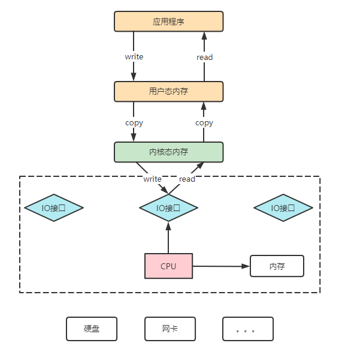

> 零拷贝是一种避免CPU将数据从一块存储拷贝到另外一块存储的技术。使用零拷贝技术可以极大的提升特定应用程序的性能，尤其是对于各种IO频繁的操作,提升非常明显。非常多的开源软件中都大量使用了零拷贝技术来提升IO操作的性能。
>
> 在Java当中,提供了两种零拷贝的实现，都是基于FileChannel提供的。一种是**mmap文件映射**的方式，一种是使用**sendfile**的方式。 但是到底什么是零拷贝呢?这里的零,体现在什么地方?由于零拷贝其实是一个**操作系统**中的技术,因此,很多应用开发人员其实并不是很清楚,我们这里就来深入探究一下。


## Channel与DMA直接存储器访问

应用程序与磁盘之间的数据写入写出，都需要在用户态和内核态之间来回复制数据，内核态中的数据通过操作系统层面的IO接口，完成与磁盘的数据存取。在应用程序调用这些系统IO接口时，由CPU完成一系列调度、任务分配，早先这些IO接口都是由CPU独立负责。所以，当发生大规模读写请求时，CPU的占用率很高。

<div align="center">

</div>

之后，操作系统**为了避免CPU完全被各种IO接口调用给占用**，引入了**DMA**(直接存储器存储)。当应用程序对操作系统发出一个读写请求时，会由DMA先向CPU申请权限，申请到权限之后，内存地址空间与磁盘空间之间的IO操作全部由DMA来负责。这样,在读写请求的过程中, CPU就不需要再参与,可以去做其他的事情。当然，DMA来独立完成数据在磁盘与内存空间中的来去，需要借助于DMA总线。但是当DMA总线过多时，大量的IO操作也会造成总线冲突,即也会影响最终的读写性能。
<div align="center">

</div>

为了避免DMA总线冲突对性能的影响，后来就有了**Channel通道**的方式。Channel,它是一个完全独立的处理器。CPU是中央处理器,通道本身也是一个处理器，专门负责IO操作。既然是处理器，通道也有自己的IO命令，与CPU无关。 他更适合于大型的IO操作,性能也更高。
<div align="center">

</div>

## 零拷贝是怎么回事

我们必须知道，零拷贝完全是一个操作系统底层的技术,而所谓的.上层应用，都只能调用,而无法实现零拷贝。所以,要真正理解零拷贝,必须深入操作系统。以一个典型的场景为例，一个文件下载的服务端应用程序,如果希望从本地磁盘上读取一个文件, 然后通过socket连接,发送给客户端。

`后面会解释为什么`
`大家总是拿这个场景来举例。`
在这个场景下，操作系统首先需要将磁盘中的文件读取到内核态的页缓存,然后加载到用户态的应用程序中，这样服务端应用程序才能拿到文件的内容。而服务端应用程序往客户端发送文件内容时，也需要先将文件写入内核态的Socket缓冲区,然后才能通过Socket往客户端发送消息。整个过程中有**四次文件拷贝**。

<div align="center">

</div>

而所谓零拷贝,主要任务就是要**避免这个过程中的CPU拷贝,**让CPU从这些繁重耗时的拷贝任务中解脱出来。这其中,硬件与页缓存之间的交互过程，已经可以通过DMA进行，不需要CPU参与,所以,零拷贝的重点就在于减少内核态与用户态之间的文件拷贝。

其中，**mmap的方式就是在用户态不再保存文件内容,而只保存文件的映射**。关于他的实现方式，在之前介绍NIO的Buffer组件时已经做了分享。
<div align="center">

</div>

另一种零拷贝实现方式就是使用FileChannel的transfer方法。

`sourceReadChannel.transferTo(0,sourceFile.length(),targetWriteChannel);`

这个方法在操作系统层面是调用的一个**sendFile系统调用**。 通过这个系统调用，可以在内核层直接完成文件内容的拷贝。
这里，站在应用程序的角度，其实并不知道sendfile是如何工作的，但是，其实在sendfile的底层， 其实操作系统层面也在**不断优化sendfile的实现**。

早期sendfile的实现机制其实还是依靠CPU进行页缓存与Socket缓冲区之间的拷贝。但是,在后期的不断改进中, sendfile优化了实现机制, 在拷贝过程中，并不直接拷贝文件内容,而是只拷贝一个带有文件位置和长度信息的缓冲区文件描述符到socket缓冲区,这样就大大减少了需要传递的数据。而真实的文件内容,则交由DMA控制器，从页缓存中打包发送到socket中。
<div align="center">

</div>

## 为什么很多的资料都喜欢拿磁盘到socket的示例来讲解零拷贝的示例呢?

```shell
[root@hadoop102 ~]# man 2 sendfile
```


在Linux2.6.33之前的版本, sendfile系统调用的使用范围是有限制的，in_ fd必须是一个可以mmap映射的fd,而out_ fd则必须是一个socket套接字。 但是从2.6.33 .版本之后，已经没有了换个限制。所以,关于零拷贝,你多看看网上的资料就会发现，老一点的资料都是在使用从磁盘到socket的示例来讲解零拷贝。**不是因为这个示例有多特殊，而是因为sendfile系统调用就只能这么用**。 而如果要进行文件与文件之间的复制，老版本中可以使用一个splice系统调用来完成。 当然随着内核的不断优化，现在sendfile已经没有了这个限制。

## 零拷贝总结

所谓零拷贝，其实并不是不拷贝，而是减少文件的拷贝次数。**这里的零，更多的是体现在减少CPU的拷贝次数**。

而mmap与sendfile两种机制，由于**mmap还是需要用户态的参与**，所以通常来说,对于映射文件的大小还是有点限制的,建议的映射文件大小不要超过1.5G。因此，RocketMQ开源框架设计的commitLog日志文件,都是以1G为固定大小。

而**sendfile机制**，则是纯内核态的操作,**不需要用户态的参与**。所以文件大小的限制并不大。但是,要使用senfile, 还是需要通过用户态来触发调度,此时，从用户态转为内核态的调用通知过程，系统性能的开销就比较重要了。因此，**sendfile通常用于大文件的传输， 最好是一次调度就能够把文件全部复制完。**