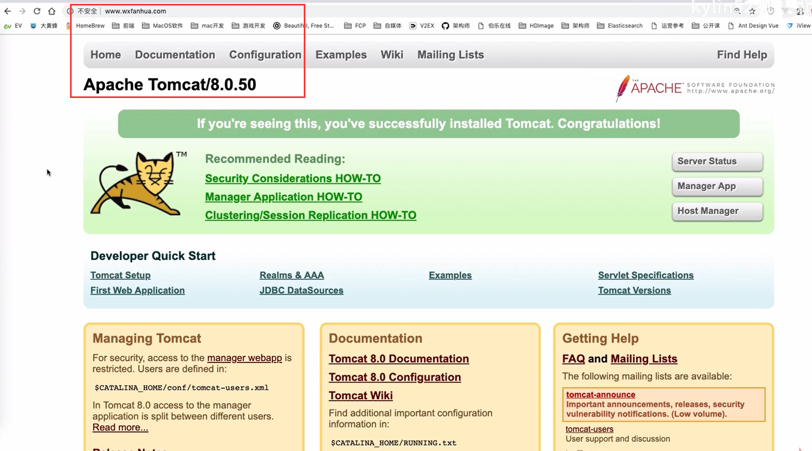

> 随着你的业务不断扩大，你发现单机模式下你的电商网站支撑不了那么大的流量，随时会出现宕机的风险。于是你使用了分布式架构，并使用nginx实现负载均衡功能

## 负载均衡案例

### 七层负载均衡

案例一：对所有请求实现一般轮询规则的负载均衡

```nginx
upstream backend {
	server 192.168.200.146:9001 weight = 7;
	server 192.168.200.146:9002;
	server 192.168.200.146:9003;
}
server {
	listen 8083;
	server_name locaThost;
 	location /{
		proxy_pass http://backend;
	}
}
```

案例二：对特定资源实现负载均衡，也就是不同的URL

```nginx
upstream videobackend{
	server 192.168.200.146:9001;
   	server 192.168.200.146:9002;
}
upstream filebackend{
	server 192.168.200.146:9003;
   	server 192.168.200.146:9004;
}
server {
	listen 8084;
	server_name localhost;
   	1ocation /video/ {
		proxy_pass http://videobackend;
	}
	location /file/ {
		proxy_pass http://filebackend;
	}
}
```

案例三：**对不同域名实现负载均衡**，这可以满足一台服务器要跑几个程序可以使用同一个端口（比如https的443）的需求，访问地址就默认不用加端口号美观挺多。只要将两个域名的DNS解析到同一台主机就可以，去网上买个域名，二级域名随便搞。

```nginx
upstream itcastbackend{
	server 192 .168.200.146:9001;
  	server 192.168.200.146:9002;
}
upstream itheimabackend{
	server 192.168.200.146:9003;
   	server 192.168.200.146:9004;
}
# 若监听端口相同，则根据server_name当作域名判断，要是请求过来的为
# bbb.domainname.cn，都不匹配默认选第一个 aaa.domainname.cn
server {
	listen 443;
	server_name aaa.domainname.cn;
   	location / {
		proxy_pass http://itcastbackend;
	}
}
server {
	listen 443;
	server_name www.domainname.cn;
   	location / {
		proxy_pass http://itheimabackend;
	}
}
```

### 四层负载均衡

Nginx在1.9之后，增加了一个stream模块，用来实现四层协议的转发、代理、负载均衡等。stream模块的用法跟http的用法类似，允许我们配置一组TCP或者UDP等协议的监听，然后通过proxy_pass来转发我们的请求，通过upstream添加多个后端服务，实现负载均衡。

四层协议负载均衡的实现，一般都会用到LVS、HAProxy、F5等，要么很贵要么配置很麻烦，而Nginx的配置相对来说更简单，更能快速完成工作。

**添加stream模块的支持**

Nginx默认是没有编译这个模块的，需要使用到stream模块，那么需要在编译的时候加上`--with-stream`。

完成添加`--with-stream`的实现步骤:

1. 将原有/usr/loca1/nginx/sbin/nginx进行备份
2. 拷贝nginx之前的配置信息
3. 在nginx的安装源码进行配置指定对应模块./configure --with-stream
4. 通过make模板进行编译
5. 将objs下面的nginx移动到/usr/loca1/nginx/sbin下
6. 在源码目录下执行make upgrade进行升级，这个可以实现不停机添加新模块的功能

```nginx
stream {
	upstream itheimabackend {
		server 192.168.200.146:9003;
		server 192.168.200.146:9004;
	}
	server {
		listen 443;
		location / {
			proxy_pass http://itcastbackend;
		}
	}
}
```


### 动静分离

```nginx
server {
    listen 80;
    server_name localhost;
    # 动态资源访问配置
    location /demo {
        proxy_pass http://192.168.200.146:8000:
    }
    # 静态资源访问配置
    location ~/.*\.(png|jpg|gif|js) {
        root html/web
    }
    location / {
        root html
        index index.html index.htm;
    }
    error_page 500 502 503 504 /50x.html
        location = /50x.html{
        root html
    }
}
```


### 问题分析

突然有一天，你的 nginx 撑不了那么大的流量，出现了宕机故障，那么用户发起的所有请求都到不了你的后端 web 服务器上

那么该如何解决 nginx 单点问题呢？

你想到了将 nginx 做成分布式+ **keepalived** 的方式

**如果 nginx master 出现宕机，keepalived则会将服务切到 nginx slave上，保证业务不受影响**

这样就可以避免 nginx 单机故障问题，以此来实现高可用


## Nginx 高可用 HA
<div align="center">

</div>

### 初识Keepalived

Keepalived是Linux一个轻量级别的高可用解决方案，通过**虚拟路由冗余协议**来实现服务或者网络的高可用

起初是为LVS设计的，专门用来监控集群系统中各个服务节点的状态

如果某个服务器节点出现故障，Keepalived将检测到后自动将节点从集群系统中剔除

而在故障节点恢复正常后，Keepalived又可以自动将此节点重新加入集群中

这些工作自动完成，不需要人工干预，需要人工完成的只是修复出现故障的节点


**特点：**

1、部署简单，只需要配置一个配置文件即可

2、加入了虚拟路由冗余协议，可以保证业务或网络不间断稳定运行


**核心功能：**

1、健康检查

```text
采用tcp三次握手，icmp请求，http请求，udp 、
echo请求等方式对负载均衡器后面的实际的服务器(通常是承载真实业务的服务器)进行保活
```

2、故障切换

```text
主要应用在配置了主备的服务器上，使用虚拟路由冗余协议维持主备之间的心跳
当主服务器出现问题时，由备服务器承载对应的业务，从而在最大限度上减少损失，并提供服务的稳定性
```


### VRRP协议

在现实的网络环境中，主机之间的通信都是通过配置静态路由（默认网关）来完成的

而主机之间的路由器一旦出现故障，就会通信失败

因此在这种通信模式下，路由器就会有单点瓶颈问题，为了解决这个问题，引入了**VRRP 协议**（虚拟路由冗余协议）

通过VRRP可以在网络发生故障时透明的进行设备切换而不影响主机之间的数据通信

VRRP可以将两台或多台物理路由器设备虚拟成一个虚拟路由器，这个虚拟路由器通过虚拟IP（一个或多个）对外提供服务，而在虚拟路由器内部是多个物理路由器协同工作，VRRP角色如下：

1、角色

- 虚拟路由器：VRRP组中所有的路由器，拥有虚拟的IP+MAC(00-00-5e-00-01-VRID)地址
- 主路由器（master）：虚拟路由器内部通常只有一台物理路由器对外提供服务，主路由器是由选举算法产生，对外提供各种网络功能
- 备份路由器（backup）：VRRP组中除主路由器之外的所有路由器，不对外提供任何服务，只接受主路由的通告，当主路由器挂掉之后，重新进行选举算法接替master路由器

master路由器由选举算法产生，它拥有对外服务的VIP，提供各种网络服务，如ARP请求、数据转发、ICMP等等，而backup路由器不拥有VIP，也不对外提供网络服务

当master发生故障时，backup将重新进行选举，产生一个新的master继续对外提供服务


### 原理

就是上一篇的虚拟 IP原理

　主要是靠 TCP/IP 的 ARP 协议。因为 ip 地址只是一个逻辑 地址，在以太网中 MAC 地址才是真正用来进行数据传输的物理地址，每台主机中都有一个 ARP 高速缓存，存储同一个网络内的 IP 地址与 MAC 地址的对应关系，以太网中的主机发送数据时会先从这个缓存中查询目标 IP 对应的 MAC 地址，会向这个 MAC 地址发送数据。操作系统会自动维护这个缓存。这就是整个实现的关键。

　　下边就是我电脑上的 arp 缓存的内容。

```ini
(192.168.1.219) at 00:21:5A:DB:68:E8 [ether] on bond0
(192.168.1.217) at 00:21:5A:DB:68:E8 [ether] on bond0
(192.168.1.218) at 00:21:5A:DB:7F:C2 [ether] on bond0
```

　　192.168.1.217、192.168.1.218 是两台真实的电脑，

　　192.168.1.217 为对外提供数据库服务的主机。

　　192.168.1.218 为热备的机器。

　　192.168.1.219 为**虚拟IP**。

　　大家注意 219、217 的 MAC 地址是相同的。

　　**再看看那 217 宕机后，我电脑上的的 arp 缓存**

```ini
(192.168.1.219) at 00:21:5A:DB:7F:C2 [ether] on bond0
(192.168.1.217) at 00:21:5A:DB:68:E8 [ether] on bond0
(192.168.1.218) at 00:21:5A:DB:7F:C2 [ether] on bond0
```

这就是奥妙所在。当 218 发现 217 宕机后会向网络**发送一个 ARP 数据包**，告诉所有主机 192.168.1.219 这个 IP 对应的 MAC 地址是 00:21:5A:DB:7F:C2，这样所有发送到 219 的数据包都会发送到 mac 地址为 00:21:5A:DB:7F:C2 的机器，也就是 218 的机器。


## Keepalived双机主备

### 安装&配置

演示：**两台虚拟机 192.168.1.171 ，192.168.1.172**，用 **192.168.1.161** 虚拟 IP 完成对 nginx 服务的访问
<div align="center">

</div>

```shell
yum install -y keepalived
./configure --prefix=/usr/local/keepalived --sysconf=/etc
```

**keepalived.conf 核心配置文件**

主机

```nginx
global_defs {
	#路由id:当前安装keepalived节点主机的标识符,全局唯一
    router_id keep_171
}
#计算机节点
vrrp_instance VI_1 {
	#表示的状态，当前的171位nginx的主节点，MASTER/BACKUP
    state MASTER
	#当前实例绑定的网卡
    interface ens33
	#保证主备节点一致
    virtual_router_id 51
	#优先级/权重,谁的优先级高，在MASTER挂掉以后，就能成为MASTER
    priority 100
    #主备之间同步检查的时间间隔,默认1s
    advert_int 1
    #认证授权的密码,防止非法节点的进入
    authentication {
        auth_type PASS
        auth_pass 1111
	}
    virtual_ipaddress {
        192.168.1.161
    }
}
```

启动 keepalived 程序后，可以看到 171 主机多了一个**虚拟IP ：192.168.1.161**。外部通过 192.168.1.171 和 192.168.1.161都可以访问到 171 主机的 nginx 服务


### 双机主备高可用

备机 172 的配置文件只是将 keep_171 改为 keep_172，MASTER 改为 BACKUP；更改priority权重比主机 171小点。

```nginx
global_defs {
	#路由id:当前安装keepalived节点主机的标识符,全局唯一
    router_id keep_172
}
#计算机节点
vrrp_instance VI_1 {
	#表示的状态，当前的172位nginx的主节点，MASTER/BACKUP
    state BACKUP
	#当前实例绑定的网卡
    interface ens33
	#保证主备节点一致
    virtual_router_id 51
	#优先级/权重,谁的优先级高，在MASTER挂掉以后，就能成为MASTER
    priority 80
    #主备之间同步检查的时间间隔,默认1s
    advert_int 1
    #认证授权的密码,防止非法节点的进入
    authentication {
        auth_type PASS
        auth_pass 1111
	}
    virtual_ipaddress {
        192.168.1.161
    }
}
```

备机 172 启动 keepalived 程序后，备机 172 还没有虚拟IP ：192.168.1.161


把主机  171 宕掉，备机 172 出现虚拟IP ：192.168.1.161。备机成功故障转移，设备切换。不影响外部访问 192.168.1.161的 nginx 访问服务


### Keepalived配置Nginx自动重启
设想以下，如果 171 主机只是 nginx 挂了，keepalived 服务没挂，那么是不会切换到 172 备机的 。这时我们需要**配置nginx 自动重启脚本**：keepalived 不断监听 nginx 服务，若是 nginx 挂了就重启，要是重启失败（nginx遇到某种错误）就把 keepalived 服务停止，不影响主备切换。

```shell
#!/bin/bash
A=`ps -C nginx --no-header |wc -l`
#判断nginx是否宕机,如果宕机了,尝试重启
if [ $A -eq 0 ]; then
	/usr/local/nginx/sbin/nginx
	# 等待一小会再次检查nginx，如果没有启动成功，则停止keepalived，使其启动备用机
	sleep 3
	if [ `ps -C nginx --no-header |wc -l` -eq 0 ]; then
		killall keepalived
fi
```

**keepalived.conf 配置如下**,主备双机都新增 vrrp_script 脚本执行

```nginx
global_defs {
	#路由id:当前安装keepalived节点主机的标识符,全局唯一
    router_id keep_171
}

# ----------新增 vrrp_script 脚本执行 ---------
vrrp_script check_nginx_alive {
    script "/etc/keepalived/check_nginx_alive_or_not.sh"
    interval 2     #每隔两秒运行上一行脚本
    weight 10      #如果脚本运行成功,则升级权重+10
    # weight -10   #如果脚本运行成功,则升级权重+10
}


#计算机节点
vrrp_instance VI_1 {
	#表示的状态，当前的171位nginx的主节点，MASTER/BACKUP
    state MASTER
	#当前实例绑定的网卡
    interface ens33
	#保证主备节点一致
    virtual_router_id 51
	#优先级/权重,谁的优先级高，在MASTER挂掉以后，就能成为MASTER
    priority 100
    #主备之间同步检查的时间间隔,默认1s
    advert_int 1
    #认证授权的密码,防止非法节点的进入
    authentication {
        auth_type PASS
        auth_pass 1111
	}
    virtual_ipaddress {
        192.168.1.161
    }
}
```


## Keepalived双机热备
### 介绍

如果主机 171 正常，所有的 161 请求都会打在 171上，那么备机 172 就会造成**资源浪费**（部门的老大肯定不允许这样的事情发生）。这时通过再增加一个**虚拟 IP ：192.168.1.162**，在这种情况下：161 访问 171，162 访问 172，互为主备。


<div align="center">

</div>

在用户请求端通过云服务的 DNS 解析实现负载均衡。
<div align="center">

</div>

### 云服务的DNS解析配置与负载均衡

以腾讯云为例，对 `www.wsfanhua.com`域名负载均衡两个 ip：118.89.153.35 和 122.152.205.72（以自己的实际情况为例），完成每次请求均分到两个地址。


演示如下：访问以后，一个主机有一个 Tomcat 服务



再次刷新，就会刷到另外一个主机的 SpringBoot 服务，这样就完成 **DNS 轮询解析**


### 实现Keepalived双机热备

过程很简单，只需要在 keepalived.conf 配置文件，新增虚拟IP：192.168.1.162的主备操作，角色相反。

主机下的 keepalived.conf 配置文件,增加 vrrp_instance VI_2

```nginx
global_defs {
	#路由id:当前安装keepalived节点主机的标识符,全局唯一
    router_id keep_171
}
#计算机节点
vrrp_instance VI_1 {
	#表示的状态，当前的171位nginx的主节点，MASTER/BACKUP
    state MASTER
	#当前实例绑定的网卡
    interface ens33
	#保证主备节点一致
    virtual_router_id 51
	#优先级/权重,谁的优先级高，在MASTER挂掉以后，就能成为MASTER
    priority 100
    #主备之间同步检查的时间间隔,默认1s
    advert_int 1
    #认证授权的密码,防止非法节点的进入
    authentication {
        auth_type PASS
        auth_pass 1111
	}
    virtual_ipaddress {
        192.168.1.161
    }
}

#---------------192.168.1.162 下这个角色就是备机----------------
vrrp_instance VI_2 {
	#表示的状态，当前的171位nginx的主节点，MASTER/BACKUP
    state BACKUP
	#当前实例绑定的网卡
    interface ens33
	#保证主备节点一致
    virtual_router_id 52
	#优先级/权重,谁的优先级高，在MASTER挂掉以后，就能成为MASTER
    priority 80
    #主备之间同步检查的时间间隔,默认1s
    advert_int 1
    #认证授权的密码,防止非法节点的进入
    authentication {
        auth_type PASS
        auth_pass 1111
	}
    virtual_ipaddress {
        192.168.1.162
    }
}
```

备机下的 keepalived.conf 配置文件,也是增加 vrrp_instance VI_2：

```nginx
global_defs {
	#路由id:当前安装keepalived节点主机的标识符,全局唯一
    router_id keep_172
}
#计算机节点
vrrp_instance VI_1 {
	#表示的状态，当前的172位nginx的主节点，MASTER/BACKUP
    state BACKUP
	#当前实例绑定的网卡
    interface ens33
	#保证主备节点一致
    virtual_router_id 51
	#优先级/权重,谁的优先级高，在MASTER挂掉以后，就能成为MASTER
    priority 80
    #主备之间同步检查的时间间隔,默认1s
    advert_int 1
    #认证授权的密码,防止非法节点的进入
    authentication {
        auth_type PASS
        auth_pass 1111
	}
    virtual_ipaddress {
        192.168.1.161
    }
}

#---------------192.168.1.162 下这个角色就是主机----------------
vrrp_instance VI_2 {
	#表示的状态，当前的172位nginx的主节点，MASTER/BACKUP
    state MASTER
	#当前实例绑定的网卡
    interface ens33
	#保证主备节点一致
    virtual_router_id 52
	#优先级/权重,谁的优先级高，在MASTER挂掉以后，就能成为MASTER
    priority 100
    #主备之间同步检查的时间间隔,默认1s
    advert_int 1
    #认证授权的密码,防止非法节点的进入
    authentication {
        auth_type PASS
        auth_pass 1111
	}
    virtual_ipaddress {
        192.168.1.162
    }
}
```

