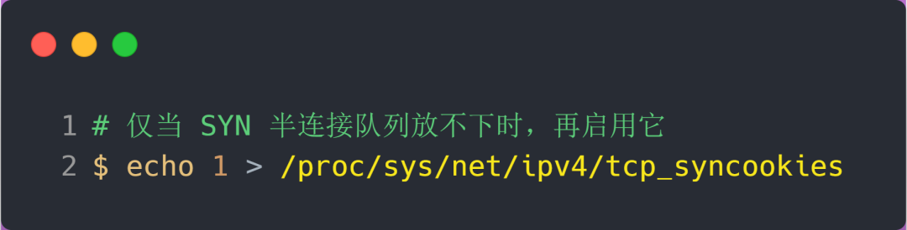
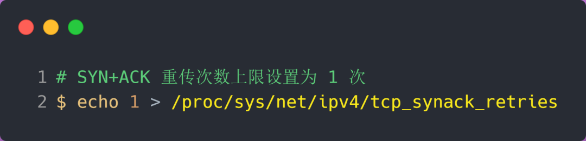

## HTTPS 一定安全可靠吗？

这个问题的场景是这样的：客户端通过浏览器向服务端发起 HTTPS 请求时，被「假基站」转发到了一个「中间人服务器」，于是客户端是和「中间人服务器」完成了 TLS 握手，然后这个「中间人服务器」再与真正的服务端完成 TLS 握手。


从客户端的角度看，其实并不知道网络中存在中间人服务器这个角色。那么中间人就可以解开浏览器发起的 HTTPS 请求里的数据，也可以解开服务端响应给浏览器的 HTTPS 响应数据。相当于，中间人能够 “偷看” 浏览器与服务端之间的 HTTPS 请求和响应的数据。

但是要发生这种场景是有前提的，前提是用户点击接受了中间人服务器的证书。

中间人服务器与客户端在 TLS 握手过程中，实际上发送了自己伪造的证书给浏览器，而这个伪造的证书是能被浏览器（客户端）识别出是非法的，于是就会提醒用户该证书存在问题。


如果用户执意点击「继续浏览此网站」，相当于用户接受了中间人伪造的证书，那么后续整个 HTTPS 通信都能被中间人监听了。

所以，这其实并不能说 HTTPS 不够安全，毕竟浏览器都已经提示证书有问题了，如果用户坚决要访问，那不能怪 HTTPS ，得怪自己手贱。

另外，如果你的电脑中毒了，被恶意导入了中间人的根证书，那么在验证中间人的证书的时候，由于你操作系统信任了中间人的根证书，那么等同于中间人的证书是合法的，这种情况下，浏览器是不会弹出证书存在问题的风险提醒的。

这其实也不关 HTTPS 的事情，是你电脑中毒了才导致 HTTPS 数据被中间人劫持的。

所以，**HTTPS 协议本身到目前为止还是没有任何漏洞的，即使你成功进行中间人攻击，本质上是利用了客户端的漏洞（用户点击继续访问或者被恶意导入伪造的根证书），并不是 HTTPS 不够安全**。


### 为什么抓包工具能截取 HTTPS 数据？

很多抓包工具 之所以可以明文看到 HTTPS 数据，工作原理与中间人一致的。

对于 HTTPS 连接来说，中间人要满足以下两点，才能实现真正的明文代理:

1. 中间人，作为客户端与真实服务端建立连接这一步不会有问题，因为服务端不会校验客户端的身份；
2. 中间人，作为服务端与真实客户端建立连接，这里会有客户端信任服务端的问题，也就是服务端必须有对应域名的私钥；

中间人要拿到私钥只能通过如下方式：

1. 去网站服务端拿到私钥；
2. 去CA处拿域名签发私钥；
3. 自己签发证书，切要被浏览器信任；

不用解释，抓包工具只能使用第三种方式取得中间人的身份。

使用抓包工具进行 HTTPS 抓包的时候，需要在客户端安装 Fiddler 的根证书，这里实际上起认证中心（CA）的作用。

抓包工具能够抓包的关键是客户端会往系统受信任的根证书列表中导入抓包工具生成的证书，而这个证书会被浏览器信任，也就是抓包工具给自己创建了一个认证中心 CA，客户端拿着中间人签发的证书去中间人自己的 CA 去认证，当然认为这个证书是有效的。


### 如何避免被中间人抓取数据？

我们要保证自己电脑的安全，不要被病毒乘虚而入，而且也不要点击任何证书非法的网站，这样 HTTPS 数据就不会被中间人截取到了。

当然，我们还可以通过 **HTTPS 双向认证**来避免这种问题。

一般我们的 HTTPS 是单向认证，客户端只会验证了服务端的身份，但是服务端并不会验证客户端的身份。


如果用了双向认证方式，不仅客户端会验证服务端的身份，而且服务端也会验证客户端的身份。服务端一旦验证到请求自己的客户端为不可信任的，服务端就拒绝继续通信，客户端如果发现服务端为不可信任的，那么也中止通信。

------


## 前向安全

HTTPS 常用的密钥交换算法有两种，分别是 **RSA 和 ECDHE 算法**。

其中，RSA 是比较传统的密钥交换算法，它不具备前向安全的性质，因此现在很少服务器使用的。而 ECDHE 算法具有前向安全，所以被广泛使用。


### RSA 算法的缺陷

**使用 RSA 密钥协商算法的最大问题是不支持前向保密**。

因为客户端传递随机数（用于生成对称加密密钥的条件之一）给服务端时使用的是公钥加密的，服务端收到后，会用私钥解密得到随机数。所以一旦服务端的私钥泄漏了，**过去被第三方截获的所有 TLS 通讯密文都会被破解**。

为了解决这个问题，后面就出现了 ECDHE 密钥协商算法，我们现在大多数网站使用的正是 ECDHE 密钥协商算法。


### ECDHE 算法

DHE 算法由于计算性能不佳，因为需要做大量的乘法，为了提升 DHE 算法的性能，所以就出现了现在广泛用于密钥交换算法 —— **ECDHE 算法**。

ECDHE 算法是在 DHE 算法的基础上利用了 ECC 椭圆曲线特性，可以用更少的计算量计算出公钥，以及最终的会话密钥。

小红和小明使用 ECDHE 密钥交换算法的过程：

- 双方事先确定好使用哪种椭圆曲线，和曲线上的基点 G，这两个参数都是公开的；
- 双方各自随机生成一个随机数作为**私钥d**，并与基点 G相乘得到**公钥Q**（Q = dG），此时小红的公私钥为 Q1 和 d1，小明的公私钥为 Q2 和 d2；
- 双方交换各自的公钥，最后小红计算点（x1，y1） = d1Q2，小明计算点（x2，y2） = d2Q1，由于椭圆曲线上是可以满足乘法交换和结合律，所以 d1Q2 = d1d2G = d2d1G = d2Q1 ，因此**双方的 x 坐标是一样的，所以它是共享密钥，也就是会话密钥**。

这个过程中，双方的私钥都是随机、临时生成的，都是不公开的，即使根据公开的信息（椭圆曲线、公钥、基点 G）也是很难计算出椭圆曲线上的离散对数（私钥）。


### RSA 和 ECDHE 握手过程的区别

- RSA 密钥协商算法「不支持」前向保密，ECDHE 密钥协商算法「支持」前向保密；
- 使用了 RSA 密钥协商算法，TLS 完成四次握手后，才能进行应用数据传输，而对于 ECDHE 算法，客户端可以不用等服务端的最后一次 TLS 握手，就可以提前发出加密的 HTTP 数据，节省了一个消息的往返时间（这个是 RFC 文档规定的，具体原因文档没有说明，所以这点我也不太明白）；
- 使用 ECDHE， 在 TLS 第 2 次握手中，会出现服务器端发出的「Server Key Exchange」消息，而 RSA 握手过程没有该消息；

------


## SYN 洪水

在 TCP 三次握手的时候，Linux 内核会维护两个队列，分别是：

- 半连接队列，也称 SYN 队列；
- 全连接队列，也称 accepet 队列；

服务端收到客户端发起的 SYN 请求后，**内核会把该连接存储到半连接队列**，并向客户端响应 SYN+ACK，接着客户端会返回 ACK，服务端收到第三次握手的 ACK 后，**内核会把连接从半连接队列移除，然后创建新的完全的连接，并将其添加到 accept 队列，等待进程调用 accept 函数时把连接取出来。**


### TCP 半连接队列溢出

如果对服务端一直发送 TCP SYN 包，但是不回第三次握手 ACK，这样就会使得服务端有大量的处于 `SYN_RECV` 状态的 TCP 连接。TCP半连接队列溢出后，若**不开启 syncookies 功能**，正常用户的TCP SYN包就会被丢弃。

这其实也就是所谓的 SYN 洪泛、SYN 攻击、DDos 攻击。


### 如何防御 SYN 攻击？

这里给出几种防御 SYN 攻击的方法：

- 增大半连接队列；
- 开启 tcp_syncookies 功能
- 减少 SYN+ACK 重传次数

*方式一：增大半连接队列*

**要想增大半连接队列，我们得知不能只单纯增大 tcp_max_syn_backlog 的值，还需一同增大 somaxconn 和 backlog，也就是增大全连接队列**。否则，只单纯增大 tcp_max_syn_backlog 是无效的。

增大 tcp_max_syn_backlog 和 somaxconn 的方法是修改 Linux 内核参数：


增大 backlog 的方式，每个 Web 服务都不同，比如 Nginx 增大 backlog 的方法如下：


最后，改变了如上这些参数后，要重启 Nginx 服务，因为半连接队列和全连接队列都是在 listen() 初始化的。


*方式二：开启 tcp_syncookies 功能*

syncookies 是这么做的：服务器根据当前状态计算出一个值，放在己方发出的 SYN+ACK 报文中发出，当客户端返回 ACK 报文时，取出该值验证，如果合法，就认为连接建立成功，如下图所示。


syncookies 参数主要有以下三个值：

- 0 值，表示关闭该功能；
- 1 值，表示仅当 SYN 半连接队列放不下时，再启用它；
- 2 值，表示无条件开启功能；

那么在应对 SYN 攻击时，只需要设置为 1 即可：

开启 tcp_syncookies 功能的方式也很简单，修改 Linux 内核参数：



*方式三：减少 SYN+ACK 重传次数*

当服务端受到 SYN 攻击时，就会有大量处于 SYN_REVC 状态的 TCP 连接，处于这个状态的 TCP 会重传 SYN+ACK ，当重传超过次数达到上限后，就会断开连接。

那么针对 SYN 攻击的场景，我们可以减少 SYN+ACK 的重传次数，以加快处于 SYN_REVC 状态的 TCP 连接断开。




------


## RST攻击

正常情况下客户端服务端双方可以通过RST来断开连接。如果这时候有不怀好意的第三方介入，构造了一个RST包，且在TCP和IP等报头都填上客户端的信息，发到服务端，那么服务端就会断开这个连接。同理也可以伪造服务端的包发给客户端。这就叫**RST攻击**。


### 收到RST就一定会断开连接吗?

收到RST包，第一步会通过`tcp_sequence`先看下这个seq是否合法，其实主要是看下这个seq是否在合法**接收窗口**范围内。**如果不在范围内，这个RST包就会被丢弃。**

> 加了窗口校验就不能用RST攻击了吗

**不是，只是增加了攻击的成本。**但如果想搞，还是可搞的。

从上面可以知道，不是每一个RST包都会导致连接重置的，要求是这个RST包的seq要在窗口范围内，所以，问题就变成了，**我们怎么样才能构造出合法的seq**。


### 利用challenge ack获取seq

直接伪造符合预期的序列号是比较困难，因为如果一个正在传输数据的 TCP 连接，滑动窗口时刻都在变化，因此很难刚好伪造一个刚好落在对方滑动窗口内的序列号的 RST 报文。

**要伪造一个能关闭 TCP 连接的 RST 报文，必须同时满足「四元组相同」和「序列号正好落在对方的滑动窗口内」这两个条件**

办法还是有的，**我们可以伪造一个四元组相同的 SYN 报文，来拿到“合法”的序列号！**

如果处于 establish 状态的服务端，收到四元组相同的 SYN 报文后，**会回复一个 Challenge ACK，这个 ACK 报文里的「确认号」，正好是服务端下一次想要接收的序列号**，说白了，就是可以通过这一步拿到服务端下一次预期接收的序列号。

**然后用这个确认号作为 RST 报文的序列号，发送给服务端，此时服务端会认为这个 RST 报文里的序列号是合法的，于是就会释放连接！**


### **killcx** 的工具模拟攻击

在 Linux 上有个叫 **killcx** 的工具，就是基于上面这样的方式实现的，它会主动发送 SYN 包获取 SEQ/ACK 号，然后利用 SEQ/ACK 号伪造两个 RST 报文分别发给客户端和服务端，这样双方的 TCP 连接都会被释放，这种方式活跃和非活跃的 TCP 连接都可以杀掉。

使用方式也很简单，只需指明客户端的 IP 和端口号。

```
./killcx <IP地址>:<端口号>
```

killcx 工具的工作原理，如下图。


它伪造客户端发送 SYN 报文，服务端收到后就会回复一个携带了正确「序列号和确认号」的 ACK 报文（Challenge ACK），然后就可以利用这个 ACK 报文里面的信息，**伪造两个 RST 报文**：

- 用 Challenge ACK 里的**确认号**伪造 RST 报文发送给服务端，服务端收到 RST 报文后就会释放连接。
- 用 Challenge ACK 里的**序列号**伪造 RST 报文发送给客户端，客户端收到 RST 也会释放连接。

正是通过这样的方式，成功将一个 TCP 连接关闭了！


### RST攻击的防御

对付这种攻击也可以通过防火墙简单设置就可以了。建议使用防火墙将进来的包带RST位的包丢弃就可以了。

RST攻击只能针对tcp。对udp无效。