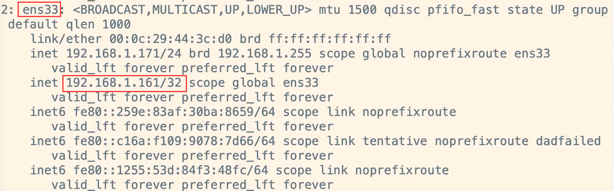
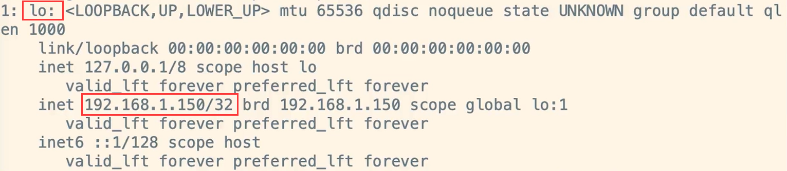
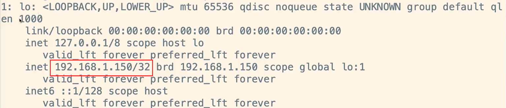

大多数人映像中的回环地址是 `127.0.0.1`，其实可以去 [lookip 127.0.0.11](https://links.jianshu.com/go?to=https%3A%2F%2Fwww.lookip.net%2Fip%2F127.0.0.11) 查询当前地址的类型，发现这个 ip 也是属于回环地址，那究竟什么是回环地址。

我们要参考协议 [rfc3330](https://links.jianshu.com/go?to=https%3A%2F%2Fwww.rfc-editor.org%2Frfc%2Frfc3330) 定义，发现  `127.0.0.0/8` 整个网段都属于回环网段，在 windows 操作系统上可以起动一个 nginx listen 80 端口，发现通过 127.0.0.1 ~ 127.255.255.254 都可以访问到此网页。mac 系统不能监听除 127.0.0.1 之外的回环地址。

而`127.0.0.1`是**众多**回环地址中的一个。之所以不是 `127.0.0.2` ，而是 `127.0.0.1`，是因为源码里就是这么定义的，也没什么道理。

```c
/* Address to loopback in software to local host.  */
#define    INADDR_LOOPBACK     0x7f000001  /* 127.0.0.1   */
```


## 回环 IP 与 虚拟 IP的区别？

### 虚拟IP

现在有一台虚拟机真实 IP（192.168.1.171），物理地址（00：0c：29：44：3c : d0）

如果向网卡 ens33 添加**虚拟 IP（192.168.1.161）**，那么就会向该网段广播 ARP数据包，告诉该网段的所有人（路由器和计算机），虚拟 IP（192.168.1.161）也是在物理地址（00：0c：29：44：3c : d0）



下边就是我电脑上的 arp 缓存的内容。这种情况下是**该网段所有人都知道该虚拟 IP（192.168.1.161）在171主机上**
```text
(192.168.1.171) at 00:0c:29:44:3c:d0 [ether] on bond0
(192.168.1.161) at 00:0c:29:44:3c:d0 [ether] on bond0
```

### 回环 IP

同样上面的一台虚拟机真实 IP（192.168.1.171），向网卡 lo 其添加**回环 IP（192.168.1.150）**

并不会向该网段广播 ARP数据包，告诉该网段的所有人（路由器和计算机），虚拟 IP（192.168.1.150）也是在物理地址（00：0c：29：44：3c : d0），因此**除了自己以外所有人并不知道该有虚拟 IP（192.168.1.150）这回事。**



下边就是我电脑上的 arp 缓存的内容依旧和上面一样

```text
(192.168.1.171) at 00:0c:29:44:3c:d0 [ether] on bond0
(192.168.1.161) at 00:0c:29:44:3c:d0 [ether] on bond0
```

**回环IP 与虚拟IP 最大的不同在于：该网段的所有人知不知道该虚拟IP在哪台主机上**


## 配置回环地址

进入网卡配置目录修改 **ifcfg -lo** 配置文件

```shell
[ root@nginx171 network-scripts]# cd /etc/sysconfig/network-scripts/
```


 **lo** 是look-back网络接口，将 ifcfg-lo 配置文件原来的**回环IP**（127.0.0.1）改成**（192.168.1.150）**

```shell
DEVICE=lo:1          # DEVICE=lo
IPADDR=192.168.1.150 # IPADDR=127.0.0.1
NETMASK=255.255.255.255    #NETMASK=255.0.0.0
NETWORK=127.0.0.0
# If you're having problems with gated making 127.0.0.0/8 a martian,
# you can change this to something else (255.255.255.255, for example)
BROADCAST=127.255.255.255
ONBOOT=yes
NAME=loopback
```
刷新再次查看 ip 信息，多了 192.168.1.150 虚拟的 IP
```shell
[ root@nginx171 network-scripts]# ifup lo
[ root@nginx171 network-scripts]# ip addr
```



## 总结

回环地址**也是虚拟IP地址的一种**，只不过该虚拟是对本机上的 lo虚拟（ lo 网卡是假网卡），跟对真实网卡上的虚拟（ens33是真实网卡）不一样，这个地址会被隐藏或被配置为本地网络，不能外泄出来。

而回环地址的**最大用途就是让计算机本身有一个IP地址进行通信**。回环地址一般是127.0.0.1，该地址使计算机能够将信息从一个地方发送到另一个地方，又可以将其发回原处，它也可以与其他回环地址相互连接。

**对于回环地址，如果作为目的地址，主机能接收外来的数据，而不能发送出去**。在 LVS的 TUN、DR模式就很好的利用了这点！
