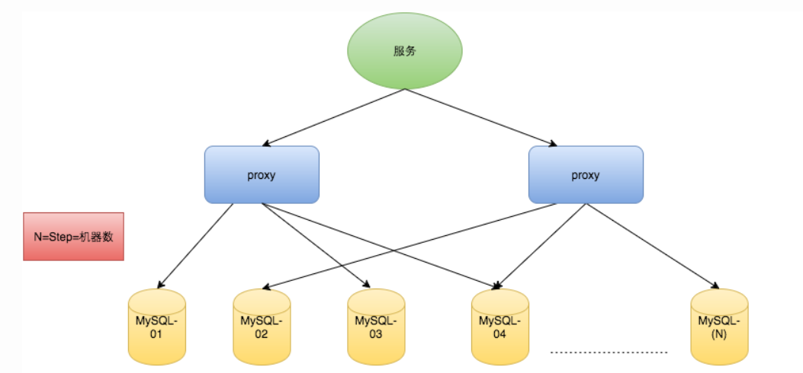

## 拒绝服务攻击的基本概念

**拒绝服务：**拒绝服务是指应用系统无法正常对外提供服务的状态，如网络阻塞、系统宕机、响应缓慢等都属于拒绝服务的表现。

**拒绝服务攻击（DOS）：**拒绝服务攻击（Denial of Service Attack）是一种通过各种技术手段导致目标系统进入拒绝服务状态的攻击，常见手段包括利用漏洞、消耗应用系统性能和消耗应用系统带宽。

**分布式拒绝服务攻击（DDOS）：**分布式拒绝服务攻击（Distributed Denial of Service Attack）是拒绝服务攻击的高级手段，利用分布全球的僵尸网络发动攻击，能够产生大规模的拒绝服务攻击。




## 简介

防御DDOS是一个系统工程，攻击花样多，防御的成本高瓶颈多，防御起来即被动又无奈。DDOS的特点是分布式，针对带宽和服务攻击，也就是四层流量攻击和七层应用攻击，相应的防御瓶颈四层在带宽，七层的多在架构的吞吐量。**对于七层的应用攻击，我们还是可以做一些配置来防御的，例如前端是 Nginx**，主要使用nginx的http_limit_conn和http_limit_req模块来防御。 ngx_http_limit_conn_module 可以限制单个IP的连接数，ngx_http_limit_req_module 可以限制单个IP每秒请求数，通过限制连接数和请求数能相对有效的防御CC攻击。

## 配置方法

### 一. 限制每秒请求数

ngx_http_limit_req_module模块通过漏桶原理来限制单位时间内的请求数，一旦单位时间内请求数超过限制，就会返回503错误。配置需要在两个地方设置：
1、nginx.conf的http段内定义触发条件，可以有多个条件；
2、在location内定义达到触发条件时nginx所要执行的动作；

```nginx
http {
  	limit_req_zone $binary_remote_addr zone=one:10m rate=10r/s;
	//触发条件，所有访问ip 限制每秒10个请求  ...
	server {
  		...
		location ~ \.php$ {
			//执行的动作,通过zone名字对应
    		limit_req zone=one burst=5 nodelay; 
 		}
 	}
}
```

参数说明：

- $binary_remote_addr: 二进制远程地址;
- zone=one:10m   定义zone名字叫one，并为这个zone分配10m内存，用来存储会话（二进制远程地址），1m内存可以保存16000会话;
- rate=10r/s; 限制频率为每秒10个请求
- burst=5 允许超过频率限制的请求数不多于5个，假设1、2、3、4秒请求为每秒9个，那么第5秒内请求15个是允许的，反之，如果第一秒内请求15个，会将5个请求放到第二秒，第二秒内超过10的请求直接503，类似多秒内平均速率限制;
- nodelay 超过的请求不被延迟处理，设置后15个请求在1秒内处理;

### 二. 限制IP连接数

ngx_http_limit_conn_module的配置方法和参数与http_limit_req模块很像，参数少，要简单很多

```ng
http {
  	limit_conn_zone $binary_remote_addr zone=addr:10m; //触发条件  ...  
	server { 
  		...   
		location /download/ { 
   			limit_conn addr 100; // 限制同一时间内100个连接，超出的连接返回503 
    	} 
   	}
}
```

### 三.白名单设置

http_limit_conn和http_limit_req模块限制了单ip单位时间内的并发和请求数，但是如果nginx前面有lvs或者haproxy之类的负载均衡或者反向代理，nginx获取的都是来自负载均衡的连接或请求，这时不应该限制负载均衡的连接和请求，就需要geo和map模块设置白名单：

```nginx
geo $whiteiplist {
	default 1; 10.11.15.161 0; 
} map $whiteiplist $limit {
	1 $binary_remote_addr; 0 ""; 
} 
limit_req_zone $limit zone=one:10m rate=10r/s;
limit_conn_zone $limit zone=addr:10m;
```

geo模块定义了一个默认值是1的变量whiteiplist，当在ip在白名单中，变量whiteiplist的值为0，反之为1

如果在白名单中–> whiteiplist=0 --> $limit=“” --> 不会存储到10m的会话状态（one或者addr）中 --> 不受限制

反之，不在白名单中 --> whiteiplist=1 --> $limit=二进制远程地址 -->存储进10m的会话状态中 --> 受到限制

### 四. 测试

使用ab命令来模拟cc攻击，http_limit_conn 和http_limit_req模块要分开测试，同时注意http_limit_conn模块只统计正在被处理的请求（这些请求的头信息已被完全读入）所 在的连接。如果请求已经处理完，连接没有被关闭时，是不会被统计的。这时用netstat看到连接数可以超过限定的数量，不会被阻止。

ab -n 请求数 -c 并发 `http://10.11.15.174/i.php`

如果被阻止前台会返回503，同时在nginx的error_log中会看到如下错误日志：

被限制连接数：
2023/01/28 14:20:26 [error] 4107#0: *65525 limiting connections by zone “addr”, client: 10.11.15.161, server: , request: “get /i.php?=phpe9568f35-d428-11d2-a769-00aa001acf42 http/1.1”, host: “10.11.15.174”, referrer: “`http://10.11.15.174/i.php`”

被限制请求数：
2023/01/28 14:18:59 [error] 4095#0: *65240 limiting requests, excess: 5.772 by zone “one”, client: 10.11.15.161, server: , request: “get /i.php?=phpe9568f34-d428-11d2-a769-00aa001acf42 http/1.1”, host: “10.11.15.174”, referrer: “”

### 五.其它一些防cc的方法

1、nginx模块 modsecurity、http_guard、ngx_lua_waf
modsecurity 应用层waf，功能强大，能防御的攻击多，配置复杂
ngx_lua_waf 基于ngx_lua的web应用防火墙，使用简单，高性能和轻量级http_guard 基于openresty

2、软件+iptables
fail2ban 通过分析日志来判断是否使用iptables拦截ddos deflate 通过netstat判断ip连接数，并使用iptables屏蔽开头说过抗ddos是一个系统工程，通过优化系统和软件配置，只能防御小规模的cc攻击，对于大规模攻击、四层流量攻击、混合攻击来说，基本上系统和应用软件没挂，带宽就打满了。下面是我在工作中使用过的防御ddos的方式：

1、高防服务器和带流量清洗的isp，通常是美韩的服务器，部分isp骨干供应商有流量清洗服务；
例如香港的pccw。通常可以防御10g左右的小型攻击

2、流量清洗服务
例如：akamai(prolexic),nexusguard 我们最大受到过80g流量的攻击，成功被清洗，但是费用非常贵；

3、cdn
例如：蓝讯 网宿 cloudflare等，cdn针对ddos的分布式特点，将流量引流分散，同时对网站又有加速作用，效果好，成本相对低。