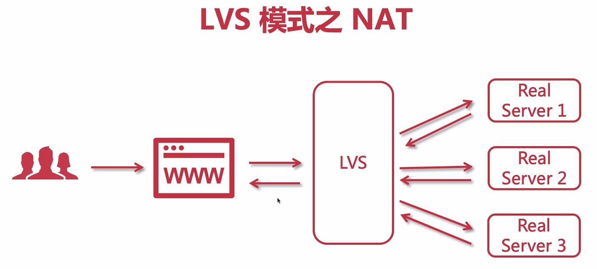
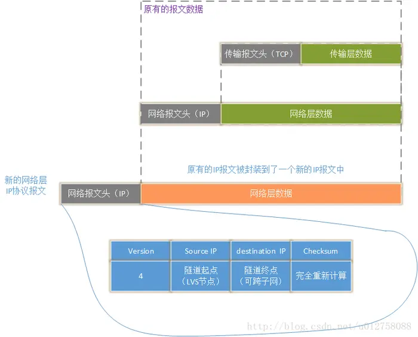
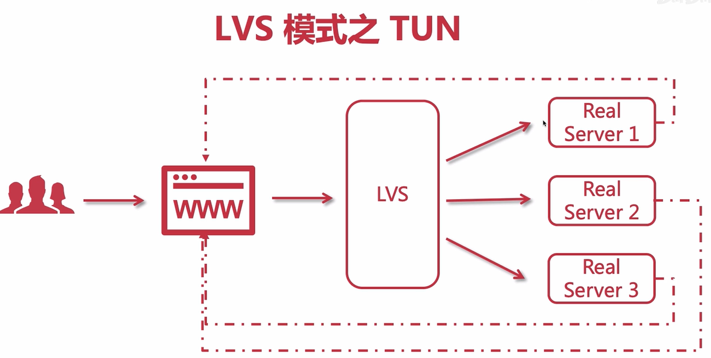
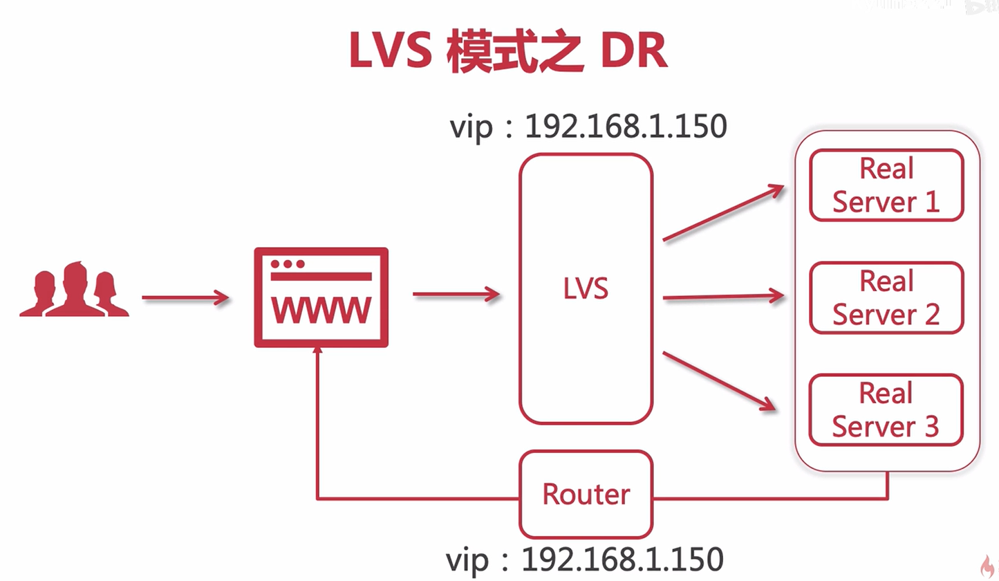

## LVS介绍

 LVS（Linux Virtual Server）即Linux虚拟服务器，是由章文嵩博士主导的开源负载均衡项目,目前LVS已经被集成到Linux内核模块中。该项目在Linux内核中实现了**基于IP的数据请求负载均衡调度**方案，Nginx 是运行在用户态，而LVS运行在操作系统**内核态**，是基于TCP/IP做的路由和转发，稳定性和效率极高。

### LVS 的组成

> LVS 由 2 部分程序组成，包括 ipvs 和 ipvsadm。

1. ipvs(ip virtual server)：一段代码工作在内核空间，叫 ipvs，是真正生效实现调度的代码。
2. ipvsadm：另外一段是工作在用户空间，叫 ipvsadm，负责为 ipvs 内核框架编写规则，定义谁是集群服务，而谁是后端真实的服务器 (Real Server)

### LVS基本原理

流程解释:

1. 当用户向负载均衡调度器（Director Server）发起请求，调度器将请求发往至内核空间
2. PREROUTING 链首先会接收到用户请求，判断目标 IP 确定是本机 IP，将数据包发往 INPUT 链
3. IPVS 是工作在 INPUT 链上的，当用户请求到达 INPUT 时，IPVS 会将用户请求和自己已定义好的集群服务进行比对，如果用户请求的就是定义的集群服务，那么此时 IPVS 会强行修改数据包里的目标 IP 地址及端口，并将新的数据包发往 POSTROUTING 链
4. POSTROUTING 链接收数据包后发现目标 IP 地址刚好是自己的后端服务器，那么此时通过选路，将数据包最终发送给后端的服务器

LVS提供了3种负载均衡模式，每种负载均衡模式适用的场景有差异，我们来讲解一下这三种负载均衡模式。

## LVS 的NAT模式

**原理：**就是把客户端发来的数据包的IP头的目的地址，在负载均衡器上换成其中一台RS的IP地址，并发至此RS来处理,RS处理完成后把数据交给经过负载均衡器,负载均衡器再把数据包的原IP地址改为自己的IP，将目的地址改为客户端IP地址即可。

## LVS 的TUN模式

### IP隧道技术

> IP隧道技术又称为IP封装技术，它可以将带有源和目标IP地址的数据报文使用新的源和目标IP进行二次封装，这样这个报文就可以发送到一个指定的目标主机上。

**简单来说，隧道模式就是修改请求报文的首部IP，再加一层ip报头。LVS的TUN模式也是用到了这 IP Tunnel技术**

### TUN模式的工作原理

1.数据流向如下：

数据包从客户端发送 DS 服务器，DS 服务器会根据调度策略确定要把请求给哪台 RS，会在数据包外面再加一层IP报头，此时

- 源IP从 CIP（192.168.43.69）变成了 VIP（DIP 192.168.43.100）
- 目的IP从 VIP（192.168.43.100）变为了RIP（192.168.43.11/12）

数据包的请求来源就是 DS调度器（192.168.43.100），请求目的地是RS（192.168.43.11/12）。

Real Server收到这个IP隧道报文后，会将这个报文进行解包。解包**外层IP报头** 后得到的数据报文就是原来发送给VIP的请求报文；再解包**里层IP报头**得到 源 IP （192.168.43.69）和目的 IP（192.168.43.100）

通过Real Server设置的回环IP（192.168.43.100），让Real Server认为原始的请求报文**是在本机运行的某一个应用程序通过回环IP发给自己的，所以这个包不能被丢弃，必须处理**。之后被处理后的生成的响应报文发送给客户端。

2.回顾整体数据流程：

Client - - > DS(调度器） - - > prerouting - - >INPUT - - > postrouting - - > RS(真正的服务器） - - > lo 回环接口 - - > 网卡eth0 - - > Client

3.**补充说明**

这里 Real Server 为什么会两次解包 IP 报头，原因是上图中外层IP报头某个字段 **Checksum被重新计算了**。

为什么 Real Server要设置的回环IP？如果不设置回环IP（192.168.43.100），原本的请求报文目的地址就不认识，Real Server就会丢弃（都不是我的干嘛要我处理）。

4.**优点：DS不再是性能瓶颈，并且DS和RS可以不用在同一网段，可以实现不同网络之间的访问**，支持跨子网间穿透。这样的敷在方案能够给我们架构师足够的系统设计场景

## LVS 的DR模式

### DR模式的工作原理

1.流程解释:

> 重点将请求报文的目标 MAC 地址设定为挑选出的 RS 的 MAC 地址,当RS接收到这个数据包之后,将源MAC替换成自己的MAC,目标MAC地址为客户端地址。

Director Server 的 ：

- DIP（192.168.1.217）、**VIP（192.168.1.219）**
- 物理地址 MAC（00:21:5A:DB:68:E8）

Real Server 的 DIP（192.168.1.218）、物理地址 MAC（**00:21:5A:DB:7F:C2**）

(1) 当用户请求到达 Director Server， 此时报文的源 IP 为 CIP（192.168.43.69），目标 IP 为 VIP（192.168.1.219），物理地址MAC（00:21:5A:DB:68:E8）

(2) Director Server 将目标 MAC 地址改为为 Real Server 的 MAC 地址（00:21:5A:DB:7F:C2）。由于 DS 和 RS 在同一个网络中，所以是通过二层来传输，那么此时数据包将会发至 Real Server。

- 目的 MAC 从 （00:21:5A:DB:68:E8）变为了（**00:21:5A:DB:7F:C2**）
- 目的 IP 还是没有改变：192.168.1.219

(3) RS 发现请求报文的 IP 地址是自己的 IP 地址（**RS 设置了回环IP 192.168.1.219** ），就接收此报文。处理完成之后，将响应报文通过 lo 接口传送给 eth0 网卡然后向外发出。 此时的源 IP 地址为 VIP（192.168.1.219），目标 IP 为 CIP（192.168.43.69）,并且将源MAC地址改为自己的MAC,目标MAC改为客户端MAC。

(4) 响应报文最终**通过路由器**送达至客户端

2.优缺点：与 TUN模式一样DS不再是性能瓶颈，**但DS和RS要求在同一网段中**

## 总结

#### NAT模式（LVS-NAT）

**优点**：集群中的物理服务器可以使用任何支持TCP/IP操作系统它只需要一个 IP 地址配置在调度器上，**服务器组可以用私有的 IP 地址**，只需要LVS有公网IP即可，所以比较节省公网IP资源。

**缺点**：扩展性有限。当服务器节点（普通PC服务器）增长过多时,**负载均衡器将成为整个系统的瓶颈**，因为所有的请求包和应答包的流向都经过负载均衡器。当服务器节点过多时，大量的数据包都交汇在负载均衡器那，速度就会变慢。

#### IP隧道模式（LVS-TUN）

**优点：**负载均衡器只负责将请求包分发给后端节点服务器，而RS将应答包直接发给用户。所以，减少了负载均衡器的大量数据流动，**负载均衡器不再是系统的瓶颈，就能处理很巨大的请求量**，这种方式，一台负载均衡器能够为很多RS进行分发。而且跑在公网上就能进行不同地域的分发。

缺点：隧道模式的RS节点需要合法IP，这种方式**需要所有的服务器支持”IP Tunneling”(IP Encapsulation)协议**，服务器可能只局限在部分Linux系统上。

#### DR模型--直接路由模式（LVS-DR）

**优点**：LVS/DR跟 LVS/TUN 方法相似，可见在处理过程中 LVS Route 只处理请求的直接路由转发，所有响应结果由各个应用服务器自行处理，并对用户进行回复，网络流量将集中在 LVS 调度器之上，**能够支撑规模更大的负载均衡场景**。

**缺点**：**唯一的缺陷在于它要求 LVS 调度器及所有应用服务器在同一个网段中**，因此不能实现集群的跨网段应用。
