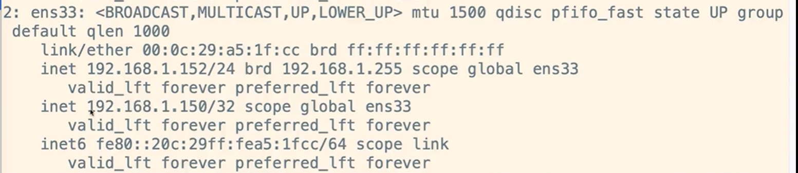

> 高并发站点不仅要考虑网站后端服务的稳定，还需要考虑服务能否接入巨大流量、承受巨大流量。对于单台 Nginx 对业务层做负载均衡，可抗几十万QPS（性能较好的），由于瓶颈在Nginx，因此无法通过两层的Nginx来实现多个Nginx的负载均衡。若要针对百万级QPS甚至千万级，还要 Nginx 再做一层负载均衡 LVS 部署 Nginx 集群。


## 为什么要使用LVS + Nginx

- LVS基于四层，工作效率高
- 单个Nginx承受不了压力，需要集群
- LVS 充当Nginx集群的调度者
- Nginx接受请求来回，LVS可以只接受不响应

<div align="center">

</div>


## LVS DR模式配置

DR模式性能效率比较高，安全性很高，因此一般公司都推荐使用DR模式。我们这里也配置DR模式实现Lvs+Nginx集群。

我们准备了3台机器：首先确保三台机器都安装了Nginx。

```shell
192.168.1.151	(DS)		对外提供服务
192.168.1.171	(RS)		真实服务处理业务流程 
192.168.1.172	(RS)		真实服务处理业务流程
192.168.1.150   (VIP)
```


<div align="center">

</div>

### VIP配置

关闭网络配置管理器(每台机器都要做)

```bash
systemctl stop NetworkManager
systemctl disable NetworkManager
```

配置虚拟IP(VIP **192.168.1.151**中配置)

在`/etc/sysconfig/network-scripts`创建文件`ifcfg-ens33:1`，内容如下：

```bash
BOOTPROTO=static
DEVICE=ens33:1
ONBOOT=yes
IPADDR=192.168.1.150
NETMASK=255.255.255.0
```

重启网络服务：

```bash
service network restart
```

我们可以看到在原来的网卡上面添加了一个虚拟IP 150。


同时需要对`192.168.1.171`、`192.168.1.172`构建虚拟机IP，但只是用于返回数据，而不能被用户访问到，这时候需要操作`ifcfg-lo`。

IPADDR=127.0.0.1，这里127.0.0.1属于本地回环地址，不属于任何一个有类别地址类。它代表设备的本地虚拟接口，所以默认被看作是永远不会宕掉的接口。

NETMASK=255.255.255.255

`192.168.1.171`：
将`ifcfg-lo`拷贝一份`ifcfg-lo:1`,并修改`ifcfg-lo:1`配置，内容如下：


刷新再次查看 ip 信息，多了 192.168.1.150 虚拟的 IP

```bash
[ root@nginx171 network-scripts]# ifup lo
[ root@nginx171 network-scripts]# ip addr
```


`192.168.1.172`知行和上面相同的操作。


### LVS集群管理工具安装

ipvsadm用于对lvs集群进行管理，需要手动安装。DS安装即可。

安装命令：

```bash
yum install ipvsad
```

版本查看：

```bash
ipvsadm -Ln
```


### 地址解析协议

在`192.168.1.171`和`192.168.1.172`中操作。

arp_ignore和arp_announce参数都和ARP协议相关，主要用于控制系统返回arp响应和发送arp请求时的动作。这两个参数很重要，特别是在LVS的DR场景下，它们的配置直接影响到DR转发是否正常。

arp-ignore：arp_ignore参数的作用是控制系统在收到外部的arp请求时，是否要返回arp响应（0~8，2-8用的很少）

配置文件：`/etc/sysctl.conf`，将如下文件拷贝进去：

```bash
net.ipv4.conf.all.arp_ignore = 1
net.ipv4.conf.default.arp_ignore = 1
net.ipv4.conf.lo.arp_ignore = 1
net.ipv4.conf.all.arp_announce = 2
net.ipv4.conf.default.arp_announce = 2
net.ipv4.conf.lo.arp_announce = 2
```

刷新配置：

```bash
sysctl -p
```

添加路由：此时如果无法识别route，需要安装相关工具`yum install net-tools`。

```shell
route add -host 192.168.1.150 dev lo:1
```

添加了一个host地址，目的是用于接收数据报文，接收到了数据报文后会交给lo:1处理。（防止关机失效，需要将上述命令添加到/etc/rc.local中）

添加完host后，可以查看一下：`route -n`,能明显看到效果。


上述配置我们同样要在`192.168.1.172`中配置。

### 集群配置

ipvsadm命令讲解：

- ipvsadm -A:用于创建集群
- ipvsadm -E:用于修改集群
- ipvsadm -D:用于删除集群
- ipvsadm -C:用于清除集群数据
- ipvsadm -R:用于重置集群配置规则
- ipvsadm -S:用于保存修改的集群规则
- ipvsadm -a:用于添加一个rs节点
- ipvsadm -e:用于修改一个rs节点
- ipvsadm -d:用于删除一个rs节点

添加集群TCP服务地址：（外部请求由该配置指定的VIP处理）

```bash
参数说明：-A：添加集群配置 -t：TCP请求地址(VIP) -s：负载均衡算法 rr为轮询算法
ipvsadm -A -t 192.168.1.150:80 -s rr
```

DS中配置rs(2个)节点：

```bash
参数说明：-a：给集群添加一个节点 -t：指定VIP地址 -r：指定real server地址 -g：表示LVS的模式为dr模式
ipvsadm -a -t 192.168.1.150:80 -r 192.168.1.171:80 -g
ipvsadm -a -t 192.168.1.150:80 -r 192.168.1.172:80 -g
```

添加了节点后，我们通过ipvsadm -Ln查看，可以看到多了2个节点。


此时集群列表中客户端请求数据和TCP通信数据会持久化保存，为了更好看到效果，我们可以把时间设置成2秒保存，如下命令：

```bash
ipvsadm --set 2 2 2
```


## Keepalived+LVS 高可用

如果只有一台LVS挂了那么整个负载均衡都会瘫痪，那么我们需要用 Keepalived搭建 LVS 主备来保证系统的高可用。

Keepalived起初也是为LVS设计的，专门用来监控集群系统中各个服务节点的状态

<div align="center">

</div>
### 配置Master

配置 192.168.1.150 的 keepalived.conf 文件：

```nginx
global_defs {
    router_id LVS_151
}

vrrp_instance VI_1 {
    state MASTER
    interface ens33
    virtual_router_id 41
    priority 100
    advert_int 1
    authentication {
        auth_type PASS
        auth_pass 1111
	}
    virtual_ipaddress {
        192.168.1.150
    }
}
#配置集群地址访问的IP+端口，端口和nginx保持一致，都是80
virtual_server 192.168.1.150 80 {
    #健康检查的时间,单位︰秒
    delay_loop 6
    #配置负载均衡的算法,默认是轮询
    lb_algo rr
    #设置LVS的模式 NAT |TUN | DR
    lb_kind DR
    #设置会话持久化的事件
    persistence_timeout 5
    # 协议 -t
    protocal TCP
    
    #负载均衡的真实服务器，也就是nginx节点的具体的真实ip地址
    real_server 192.168.1.171 80 {
	#轮询的默认权重配比设置为1
        weight 1
	#设置健康检查
        TCP_CHECK {
	    #检查的80端口
            connect_port 80
            #超时时间2s
            connect_timeout 2
            #重试次数2次
            nb_get_retry 2
            #间隔时间3s
	    delay_before_retry 3
        }
    }

    real_server 192.168.1.172 80 {
	#轮询的默认权重配比设置为1
        weight 1
	#设置健康检查
        TCP_CHECK {
		#检查的80端口
            connect_port 80
            #超时时间2s
	    connect_timeout 2
            #重试次数2次
            nb_get_retry 2
            #间隔时间3s
	    delay_before_retry 3
        }
    }
}
```

先清除集群数据，通过ipvsadm -Ln查看，目前没有集群信息

```bash
ipvsadm -C
ipvsadm -Ln
```


回顾以下：上面我们是通过指令来新建集群和添加节点的

```bash
参数说明：-A：添加集群配置 -t：TCP请求地址(VIP) -s：负载均衡算法 rr为轮询算法
ipvsadm -A -t 192.168.1.150:80 -s rr

参数说明：-a：给集群添加一个节点 -t：指定VIP地址 -r：指定real server地址 -g：表示LVS的模式为dr模式
ipvsadm -a -t 192.168.1.150:80 -r 192.168.1.171:80 -g
ipvsadm -a -t 192.168.1.150:80 -r 192.168.1.172:80 -g
```

那么向 keepalived.conf 配置文件添加的实际上就是帮我们做了这一步

开启 keepalived服务可以看到 keepalived帮我们设置了集群以及添加了节点


### 配置Backup

配置 192.168.1.152 的 keepalived.conf 文件：

```nginx
global_defs {
    router_id LVS_152
}

vrrp_instance VI_1 {
    state BACKUP
    interface ens33
    virtual_router_id 41
    priority 50
    advert_int 1
    authentication {
        auth_type PASS
        auth_pass 1111
	}
    virtual_ipaddress {
        192.168.1.150
    }
}
#配置集群地址访问的IP+端口，端口和nginx保持一致，都是80
virtual_server 192.168.1.150 80 {
    #健康检查的时间,单位︰秒
    delay_loop 6
    #配置负载均衡的算法,默认是轮询
    lb_algo rr
    #设置LVS的模式 NAT |TUN | DR
    lb_kind DR
    #设置会话持久化的事件
    persistence_timeout 5
    # 协议 -t
    protocal TCP
    
    #负载均衡的真实服务器，也就是nginx节点的具体的真实ip地址
    real_server 192.168.1.171 80 {
	#轮询的默认权重配比设置为1
        weight 1
	#设置健康检查
        TCP_CHECK {
	    #检查的80端口
            connect_port 80
            #超时时间2s
            connect_timeout 2
            #重试次数2次
            nb_get_retry 2
            #间隔时间3s
	    delay_before_retry 3
        }
    }

    real_server 192.168.1.172 80 {
	#轮询的默认权重配比设置为1
        weight 1
	#设置健康检查
        TCP_CHECK {
		#检查的80端口
            connect_port 80
            #超时时间2s
	    connect_timeout 2
            #重试次数2次
            nb_get_retry 2
            #间隔时间3s
	    delay_before_retry 3
        }
    }
}
```
同样先清除集群数据，通过ipvsadm -Ln查看，目前没有集群信息


开启 keepalived服务成功可以看到 keepalived帮我们设置了集群以及添加了节点


### 测试

**keepalived服务停掉**

将 192.168.1.151 主机  keepalived服务停掉，可以发现已经没有 VIP（192.168.1.150）

```bash
systemctl stop keepalived
ip addr
```


而 192.168.1.152 主机成为Master保证服务正常，可以发现新增 VIP（192.168.1.150），**完成 LSV的主备切换**



**nginx服务停掉**

将 192.168.1.171 主机 nginx服务停掉，不管怎么刷新请求，都会 192.168.1.172 的nginx 服务上

```bash
[root@nginx171 sbin]# ./ nginx -s stop
```


查看 LVS 对 Nginx的健康检测，192.168.1.171已被移除


