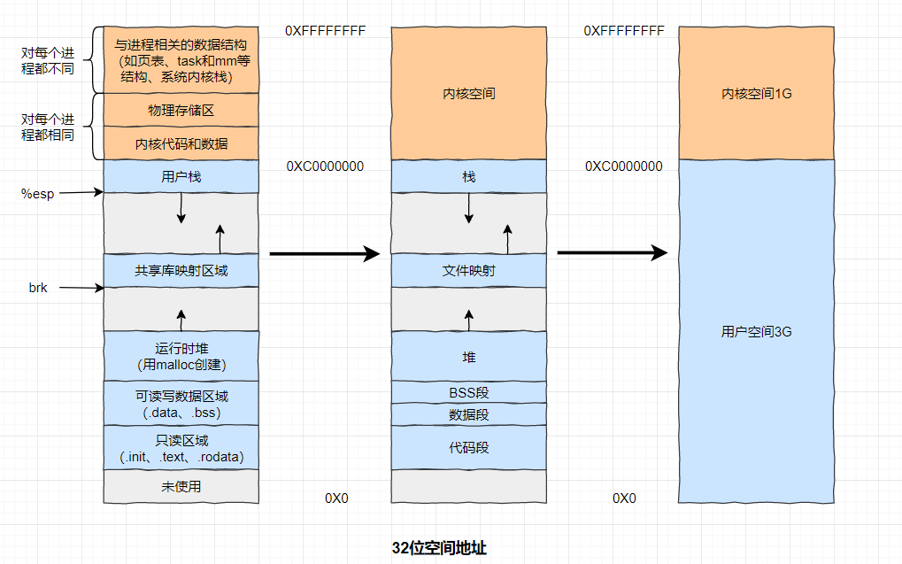
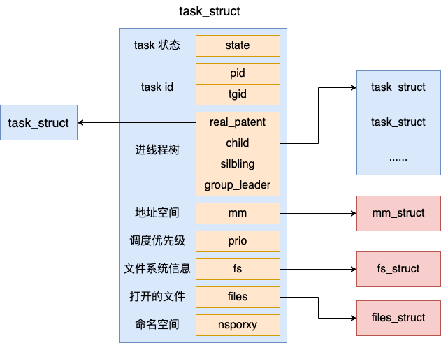
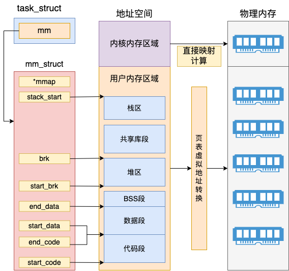
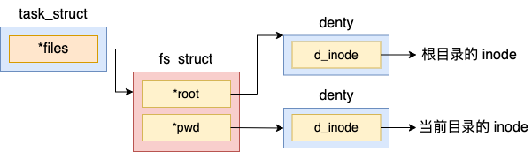
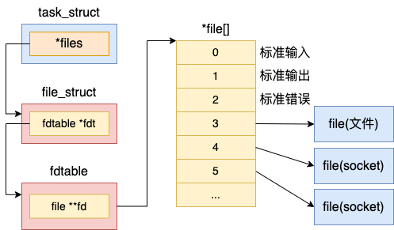
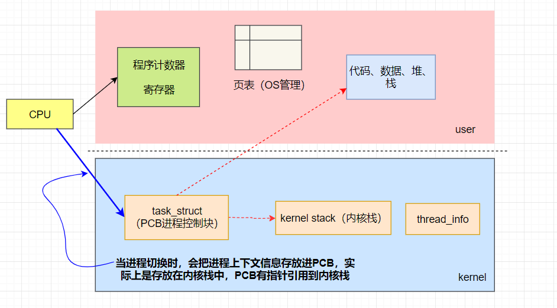
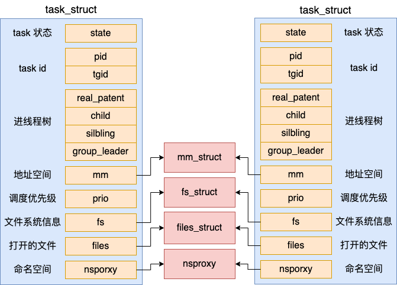
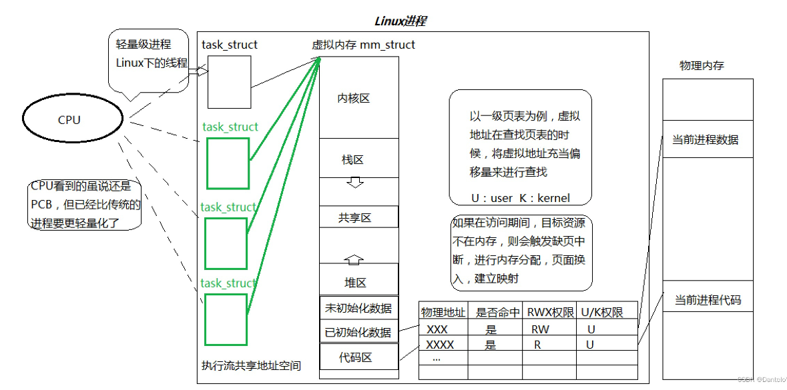
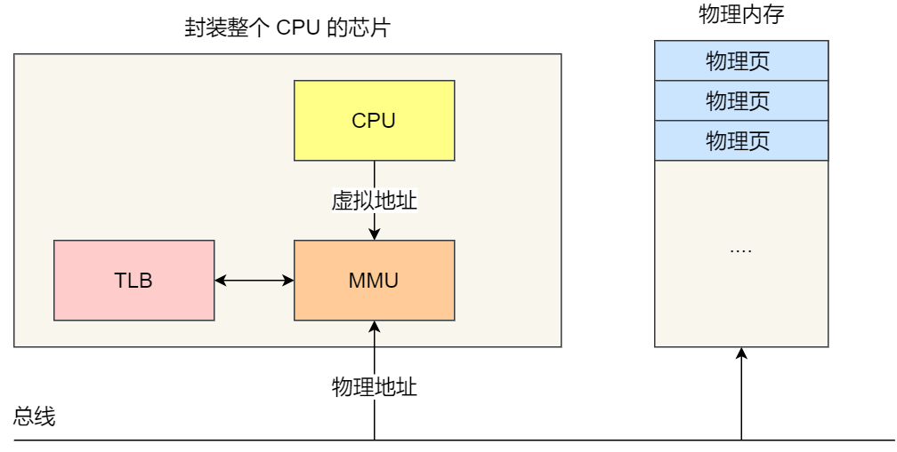
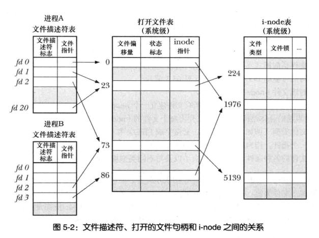

> 在面试中经常碰到关于进程的问题，可如今早已不是背八股文的时代了，面试官总是能层出不断问出一些没想过的问题，面试碰到想不到怎么去回答。在经过底层的梳理之后，其实那些问题并不难，自然在头脑中理清言顺地回答回来

<br>


## 进程的结构


<br>

### **进程的空间地址**

进程的虚拟空间分为内核空间和用户空间，在32位中分别为1G和3G。在内核空间中，每一个进程都有不同的页表（用于虚拟地址与物理地址的映射）、进程控制块（关联很多问题）、内存描述符、**内核栈**（进程切换的关键）。

<div align="center">

</div>
<br>

### **进程控制块PCB**

在 Linux 中，**是用一个 task_struct 来实现 Linux 进程的**，也就是我们常说的进程控制块PCB。进程线程都是有状态的，它的状态就保存在 state 字段中。常见的状态中 TASK_RUNNING 表示进程线程处于就绪状态或者是正在执行。TASK_INTERRUPTIBLE 表示进程线程进入了阻塞状态。

<div align="center">

</div>

<br>

### **内存描述符 mm_struct**

在进程控制块包括了 mm，它代表的是 memory descriptor，是非常核心的数据结构。整个进程的虚拟地址空间部分都是由它来表示的。
<div align="center">

</div>
在内核内存区域，可以通过直接计算得出物理内存地址，并不需要复杂的页表计算。而且最重要的是所有内核进程、以及用户进程的内核态，这部分内存都是共享的。

另外要注意的是，mm（mm_struct）表示的是虚拟地址空间。而对于内核线程来说，是没有用户态的虚拟地址空间的。所以内核线程的 mm 的值是 null。

<br>


### **进程文件系统信息**
<div align="center">

</div>

拿 pwd 来举例，该指针指向的是进程当前目录所处的 denty 目录项。假如我们在 shell 进程中执行 pwd，或者用户进程查找当前目录下的配置文件的时候，都是通过访问 pwd 这个对象，进而找到当前目录的 denty 的。


<br>

### **进程打开的文件信息FD**

每个进程PCB 内部用一个 files_struct 结构来记录文件描述符的使用情况， 这个 files_struct 结构称为**文件描述符表**。记录着当前进程所有可用的文件描述符，也即当前进程所有打开的文件。

```c++
//file:include/linux/fdtable.h
struct files_struct {
 ......
 //下一个要分配的文件句柄号
 int next_fd; 

 //fdtable
 struct fdtable __rcu *fdt;
}

struct fdtable {
 //当前的文件数组
 struct file __rcu **fd;
 ......
};
```

在 files_struct 中，最重要的是在 fdtable 中包含的 file **fd 这个数组。这个数组的下标就是文件描述符，其中 0、1、2 三个描述符总是默认分配给标准输入、标准输出和标准错误。这就是你在 shell 命令中经常看到的 2>&1 的由来。这几个字符的含义就是把标准错误也一并打到标准输出中来。

<div align="center">

</div>

在数组元素中记录了当前进程打开的每一个文件的指针。这个文件是 Linux 中抽象的文件，可能是真的磁盘上的文件，也可能是一个 socket。

**一个进程默认最多可以打开的1024个文件**，0 1 2 已经分别被标准输入 标准输出 标准出错占用。


<br>

### 命名空间namespaces

在 Linux 中，namespace 是用来隔离内核资源的方式。通过 namespace 可以让一些进程只能看到与自己相关的一部分资源，而另外一些进程也只能看到与它们自己相关的资源，这两个进程根本就感觉不到对方的存在。

命名空间包括PID命名空间、挂载点命名空间、网络命名空间等多个。**著名的Docker就是在这里做了文章从而实现进程隔离（容器化隔离）。**


<br>

<br>


## 进程与线程的上下文切换

<br>

### 进程的上下文切换具体是怎样的

操作系统需要事先帮 CPU 设置好 **CPU 寄存器和程序计数器**。

- 程序计数器则是用来存储 CPU 正在执行的指令位置、或者即将执行的下一条指令位置。

- CPU 寄存器和程序计数是 CPU 在运行任何任务前，所必须依赖的环境，这些环境就叫做 **CPU 上下文**。


进程是由内核管理和调度的，所以进程的切换只能发生在内核态。

1. 保存上下文：操作系统首先需要保存当前进程的上下文信息，包括CPU寄存器、程序计数器、内存指针等相关信息。这些信息保存在当前进程的**内核栈**中。

2. 切换内核栈：由于每个进程都有自己的内核栈，因此在切换进程时需要切换内核栈，以便能够正确地保存和恢复进程的上下文信息。

3. 更新进程控制块：操作系统需要更新当前进程的进程控制块（PCB）信息，包括进程状态、进程优先级、进程状态改变的时间等相关信息。同时，还需要从就绪队列中选择一个新的进程来执行。

4. 恢复上下文：操作系统将新的进程的上下文信息从其内核栈中恢复出来，包括CPU寄存器、程序计数器、内存指针等相关信息。同时，还需要将新的进程的用户栈切换到内存中，以便该进程能够继续执行。

5. 跳转到用户态：最后，操作系统将CPU控制权交给新的进程，将其切换到用户态，使其能够继续执行用户程序。

<div align="center">
   
   </div>


<br>

### 发生进程上下文切换有哪些场景？

- 为了保证所有进程可以得到公平调度，CPU 时间被划分为一段段的时间片，这些时间片再被轮流分配给各个进程。这样，当某个进程的时间片耗尽了，进程就从运行状态变为就绪状态，系统从就绪队列选择另外一个进程运行；

- 进程在系统资源不足（比如内存不足）时，要等到资源满足后才可以运行，这个时候进程也会被挂起，并由系统调度其他进程运行；

- 当进程通过睡眠函数 sleep 这样的方法将自己主动挂起时，自然也会重新调度；

- 当有优先级更高的进程运行时，为了保证高优先级进程的运行，当前进程会被挂起，由高优先级进程来运行；

- 发生硬件中断时，CPU 上的进程会被中断挂起，转而执行内核中的中断服务程序；


<br>

### 线程上下文切换的是什么

在Linux下，其实没有真正意义上的线程概念，是用进程来模拟的

Linux的进程叫做LWP，也就是轻量级进程`Light Weight Process`，实际上而**线程使用进程pcb描述实现**，操作系统在创建线程时给每个线程都创建一个pcb结构体，**并且同一个进程中的所有pcb共用同一个虚拟地址空间**。

<div align="center">

</div>
与进程相比，线程在CPU执行时可能更加轻量化：**pcb上下文肯定要切换，但是线程的地址空间、页表不用换**；在计算机角度是这么看来的，**一个进程的多线程实际上有多个task_struct指向相同的用户空间。**



线程上下文切换的是什么？这还得看线程是不是属于同一个进程：

- 当两个线程不是属于同一个进程，则切换的过程就跟进程上下文切换一样；

- **当两个线程是属于同一个进程，因为虚拟内存是共享的，所以在切换时，虚拟内存这些资源就保持不动，只需要切换线程的私有数据、寄存器等不共享的数据**；


<br>

### 为什么进程切换比线程切换得慢？

进程切换与线程切换的一个最主要区别就在于**进程切换涉及到虚拟地址空间的切换而线程切换则不会**。因为每个进程都有自己的虚拟地址空间，而线程是共享所在进程的虚拟地址空间的，因此同一个进程中的线程进行线程切换时不涉及虚拟地址空间的转换。

- **这个问题就变成了为什么虚拟地址切换很慢？**

  

  进程都有自己的虚拟地址空间，把虚拟地址转化为物理地址需要查找页表，页表查找是一个很慢的过程，因此**加入了一个专门存放程序最常访问的页表项的 Cache**，这个 Cache 就是 TLB，页表缓存。由于每个进程都有自己的虚拟地址空间，那么显然每个进程都有自己的页表，那么当进程切换后页表也要进行切换，**页表切换后TLB就失效了，cache失效导致命中率降低，那么虚拟地址转换为物理地址就会变慢，表现出来的就是程序运行会变慢，而线程切换不会导致TLB失效，因为线程无需切换地址空间，因此我们通常说线程切换比进程切换快**，原因就在这里。


<br>


## 不止文件描述符表，还有打开文件表

我们知道文件描述符是操作系统用于管理文件的一种机制。当打开文件时，操作系统会为该文件分配一个唯一的文件描述符，该文件描述符用于标识该文件，以及执行文件相关的操作，比如读写文件等。但这个文件文件描述符是 Linux 中**抽象的文件**，下面来看看Linux是怎么具体映射到文件的

1. **进程级的文件描述符表**（open file description），在进程的结构里**进程打开的文件信息FD**有看到。通过文件描述符，可以找到文件指针，从而进入打开文件表。
2. **系统级的打开文件表**（Open file table），这是内核对所有打开文件维护的一个描述表格，将表格中的每一项称为**打开文件句柄**。它存储了一个打开文件的所有相关信息，例如当前文件的偏移量，访问模式，状态等等。
3. **i-node 表**（i-node table），文件系统中的每个文件都有自己的i-node信息，它包含文件类型，访问权限，文件属性等等。

<div align="center">

</div>

总结：

1. **文件描述符只不过是一个指针，指向打开文件表中的打开文件句柄。**
2. 同一个进程两次调用open打开同一个文件或者两个进程打开同一个文件，它们的fd会指向不同的文件句柄，i-node指针会指向同一个i-node，因为它们打开的是同一个文件。它们不会共用文件偏移量等句柄信息。
3. 如果一个进程fork出另一个进程，两个进程的fd会指向相同的文件句柄，它们会共享文件偏移量等句柄信息。
4. 同一个进程中的两个不同的fd可能指向同一个句柄，有可能是使用dup()复制一个fd。


<br>

## linux不断地打开文件会发生什么

系统为每个文件分配**新的打开文件句柄和文件描述符**，这些将**占用**系统的资源，包括**打开文件表和文件描述符表**等等。

当**单个进程打开的文件描述符数量超过了系统定义的值1024**，将无法再打开新的文件，这时会抛出 "Too many open files" 的错误信息。查看用户级限制（文件描述符表的上限）：ulimit 

其实还有个是对系统的总限制（打开文件表的上限），查看系统总线制：cat /proc/sys/fs/file-max ，一般最大打开文件数会是系统内存的10%（以KB来计算），称之为系统级限制。

 另外，频繁打开和关闭文件会导致文件描述符的浪费和系统调用的开销。因此，在编写程序时应该合理使用文件描述符，确保及时关闭不再使用的文件，避免资源的浪费和系统的负担。


<br>


## 总结

透过进程的结构很容易将很多问题讲得通，也是把我的一些问题梳理个清楚。特别重要的就是理解**进程控制块PCB**之后，很容易想象得到Linux是怎么做的。